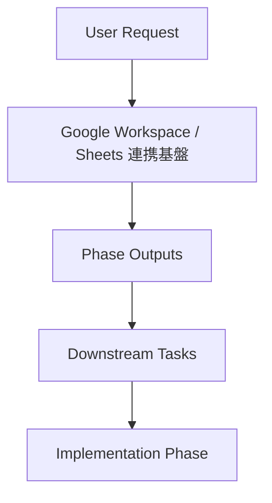

# Phase 2: 設計

## メタ情報

| 項目 | 値 |
| --- | --- |
| タスク名 | google-workspace-bootstrap |
| Phase 番号 | 2 / 13 |
| Phase 名称 | 設計 |
| 作成日 | 2026-04-23 |
| 前 Phase | 1 (要件定義) |
| 次 Phase | 3 (設計レビュー) |
| 状態 | pending |

## 目的

Google Workspace / Sheets 連携基盤 における Phase 2 の判断と成果物を固定し、下流 Phase の手戻りを防ぐ。

## 実行タスク

- input / output を確定する
- 正本仕様との整合を確認する
- 4条件と downstream 影響を確認する

## 参照資料

| 種別 | パス | 用途 |
| --- | --- | --- |
| 必須 | .claude/skills/aiworkflow-requirements/references/architecture-monorepo.md | integration package の責務 |
| 必須 | .claude/skills/aiworkflow-requirements/references/environment-variables.md | local canonical env |
| 必須 | .claude/skills/aiworkflow-requirements/references/deployment-secrets-management.md | secret placement |
| 参考 | Google Cloud Console | Project / OAuth / service account |
| 参考 | User request on 2026-04-23 | Google スプレッドシート入力 |

## 実行手順

### ステップ 1: input と前提の確認
- 上流 Phase と index.md を読む。
- 正本仕様との差分を先に洗い出す。

### ステップ 2: Phase 成果物の作成
- 本 Phase の主成果物を outputs/phase-02/main.md に作成・更新する。
- downstream task から参照される path を具体化する。

### ステップ 3: 4条件と handoff の確認
- 価値性 / 実現性 / 整合性 / 運用性を再確認する。
- 次 Phase に渡す blocker と open question を記録する。

## 統合テスト連携

| 連携先 Phase | 連携内容 |
| --- | --- |
| Phase 3 | 本 Phase の出力を入力として使用 |
| Phase 7 | AC トレースに使用 |
| Phase 10 | gate 判定の根拠 |
| Phase 12 | close-out と spec sync 判断 |

## 多角的チェック観点（AIが判断）

- 価値性: 誰のどのコストを下げるか明確か。
- 実現性: 初回無料運用スコープで成立するか。
- 整合性: branch / env / runtime / data / secret が一致するか。
- 運用性: rollback / handoff / same-wave sync が可能か。

## サブタスク管理

| # | サブタスク | 担当 Phase | 状態 | 備考 |
| --- | --- | --- | --- | --- |
| 1 | input 確認 | 2 | pending | upstream を読む |
| 2 | 成果物更新 | 2 | pending | outputs/phase-02/main.md |
| 3 | 4条件確認 | 2 | pending | next phase へ handoff |

## 成果物

| 種別 | パス | 説明 |
| --- | --- | --- |
| ドキュメント | outputs/phase-02/main.md | Phase 2 の主成果物 |
| メタ | artifacts.json | Phase 状態と outputs の記録 |

## 完了条件

- 主成果物が作成済み
- 正本仕様参照が残っている
- downstream handoff が明記されている

## タスク100%実行確認【必須】

- 全実行タスクが completed
- 全成果物が指定パスに配置済み
- 全完了条件にチェック
- 異常系（権限・無料枠・drift）も検証済み
- 次 Phase への引き継ぎ事項を記述
- artifacts.json の該当 phase を completed に更新

## 次 Phase

- 次: 3 (設計レビュー)
- 引き継ぎ事項: Google Workspace / Sheets 連携基盤 の判断を次 Phase で再利用する。
- ブロック条件: 本 Phase の主成果物が未作成なら次 Phase に進まない。

## 構成図 (Mermaid)

## 環境変数一覧
| 区分 | 代表値 | 置き場所 | 理由 |
| --- | --- | --- | --- |
| runtime secret | task-specific | Cloudflare Secrets | runtime が直接利用 |
| deploy secret | deploy auth | GitHub Secrets | CI/CD 専用 |
| local canonical | developer env | 1Password Environments | 平文 .env を正本にしない |
| public variable | project name / URL / IDs | GitHub Variables / docs | 非機密 |

## 設定値表
| 項目 | 方針 | 根拠 |
| --- | --- | --- |
| branch strategy | feature -> dev -> main | deployment-branch-strategy |
| runtime split | apps/web + apps/api | architecture-overview-core |
| source of truth | Sheets input / D1 canonical | user request + baseline |

## 依存マトリクス
| 種別 | 対象 | 理由 |
| --- | --- | --- |
| 上流 | ../00-serial-architecture-and-scope-baseline/ | この task 開始前に必要 |
| 下流 | 03-serial-data-source-and-storage-contract / 04-serial-cicd-secrets-and-environment-sync / 05b-parallel-smoke-readiness-and-handoff | この task の成果物を参照 |
| 並列 | 01a-parallel-github-and-branch-governance / 01b-parallel-cloudflare-base-bootstrap | 同 Wave で独立実行可能 |
