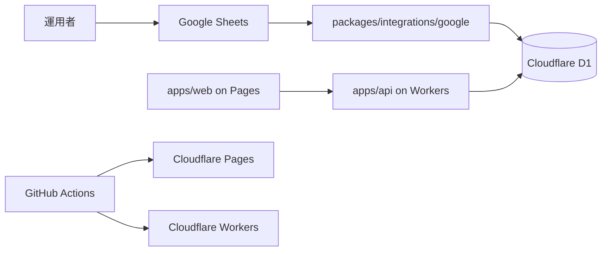

# UBM兵庫支部会 初期インフラ構築タスク仕様書（Canonical）

> 目的: 初期インフラを「無料運用・skill 準拠・後続実装が迷わない」の3条件で再構成する。
> 採用基準線: Cloudflare Pages + Cloudflare Workers + Cloudflare D1 + GitHub + Google Sheets input。
> 非採用基準線: OpenNext 一体構成、Google Sheets を app canonical DB にする構成、通知基盤の先行常設導入。
> legacy snapshot: 未作成。成果物削除ではなく、必要時のみ別 archive task で退避する。

## 一次結論

- Web は Cloudflare Pages、API は Cloudflare Workers、正本DB は Cloudflare D1 に分離する。
- Google Sheets は input source として扱い、app canonical store にはしない。
- branch strategy は feature -> dev -> main を採用する。
- local の環境変数は 1Password Environments を正本にする。
- 初回スコープは基盤・契約・runbook までとし、通知基盤や業務機能実装は handoff 後へ送る。

## 最初に読む順

1. `00-serial-architecture-and-scope-baseline/`: 責務境界と非採用構成を固定する。
2. `01a` / `01b` / `01c`: Wave 1 を並列に読み、GitHub・Cloudflare・Google Workspace の担当を分離する。
3. `02` -> `03` -> `04`: runtime、data contract、CI/CD・Secrets を直列で閉じる。
4. `05a` / `05b`: Wave 5 は並列着手し、Phase 10-12 で same-wave sync する。

## レビュー4条件の現時点判定

| 条件 | 判定 | 根拠 |
| --- | --- | --- |
| 矛盾なし | PASS | 旧パス表記、壊れた legacy 参照、Wave 5 依存矛盾を解消した |
| 漏れなし | PASS | 読み順、正本優先順位、Wave 5 同期ルール、secret/variable 境界を追加した |
| 整合性あり | PASS | `doc/01-infrastructure-setup/...` に表記統一し、legacy snapshot 不在も明示した |
| 依存関係整合 | PASS | Wave 0-4 は直列、Wave 1 と Wave 5 は並列着手 + same-wave sync と定義し直した |

## 正本優先順位

1. branch / environment 名は `deployment-branch-strategy.md` と本ディレクトリ配下の task index を優先する。`deployment-cloudflare.md` に残る `develop` 表記は同期対象であり、この package では正本にしない。
2. app 境界は `architecture-overview-core.md` と本ディレクトリ配下の task index を優先する。`architecture-monorepo.md` は dependency rule 参照として使い、衝突時は app 境界を上書きしない。
3. secrets / variables の置き場は `04-serial-cicd-secrets-and-environment-sync` を package 内正本とする。`GOOGLE_SHEET_ID` は non-secret identifier であり、secret として扱わない。

## Wave 一覧

| Wave | ディレクトリ | 種別 | 役割 |
| --- | --- | --- | --- |
| 0 | 00-serial-architecture-and-scope-baseline/ | serial | アーキテクチャ基準線とスコープ固定 |
| 1 | 01a-parallel-github-and-branch-governance/ | parallel | GitHub とブランチ統制 |
| 1 | 01b-parallel-cloudflare-base-bootstrap/ | parallel | Cloudflare 基盤ブートストラップ |
| 1 | 01c-parallel-google-workspace-bootstrap/ | parallel | Google Workspace / Sheets 連携基盤 |
| 2 | 02-serial-monorepo-runtime-foundation/ | serial | モノレポとランタイム基盤 |
| 3 | 03-serial-data-source-and-storage-contract/ | serial | データ入力源と保存契約 |
| 4 | 04-serial-cicd-secrets-and-environment-sync/ | serial | CI/CD・Secrets・環境同期 |
| 5 | 05a-parallel-observability-and-cost-guardrails/ | parallel | 観測性と無料枠ガードレール |
| 5 | 05b-parallel-smoke-readiness-and-handoff/ | parallel | smoke readiness / handoff。05a と並列着手し、Phase 10-12 で同期 |

## 実行順序

1. Wave 0 で source-of-truth、scope、非採用構成を固定する。
2. Wave 1 は `01a` / `01b` / `01c` を並列に進める。
3. Wave 2 -> 3 -> 4 は runtime、data、CI/CD を直列で閉じる。
4. Wave 5 は `05a` / `05b` を並列着手し、終盤で same-wave sync をかける。

## 推奨アーキテクチャ

## 30種の思考法で確認した改善点

| カテゴリ | 思考法 | 改善結果 |
| --- | --- | --- |
| 論理分析系 | 批判的思考、演繹思考、帰納的思考、アブダクション、垂直思考 | 旧パス、壊れた legacy 参照、Wave 5 依存矛盾を除去した |
| 構造分解系 | 要素分解、MECE、2軸思考、プロセス思考 | Wave ごとの並列/直列境界と読み順を再配置した |
| メタ・抽象系 | メタ思考、抽象化思考、ダブル・ループ思考 | 「skill 準拠の説明」より「何を読むか」を前に出した |
| 発想・拡張系 | ブレインストーミング、水平思考、逆説思考、類推思考、if思考、素人思考 | 新規読者が迷う点を基準に README を圧縮し、判定ルールを前段へ寄せた |
| システム系 | システム思考、因果関係分析、因果ループ | branch、app boundary、secret placement の優先順位を明示した |
| 戦略・価値系 | トレードオン思考、プラスサム思考、価値提案思考、戦略的思考 | 初回成功率を優先し、並列化は維持しつつ同期点だけ厳密化した |
| 問題解決系 | why思考、改善思考、仮説思考、論点思考、KJ法 | 真の論点を path、依存、正本優先順位、secret/variable 境界に絞って直した |

## 今回の改善結果

- `doc/01-infrastructure-setup/...` へ全表記を統一した。
- 実在しない legacy snapshot 参照を「未作成」と明示し、誤リンクを消した。
- Wave 5 は「並列着手 + Phase 10-12 same-wave sync」に定義し直した。
- secrets / variables / non-secret identifiers の境界を README で一意にした。

## Deferred / 未タスク候補

- 通知配信基盤の導入（Resend 等）は通知要件が固まってから別 task に分離する。
- Google Sheets sync の schedule 実装は D1 schema 確定後に別 task として formalize する。
- 実装コードの scaffold 作成は、この仕様 package を入力として別フェーズで扱う。

## 関連資料

- 00-serial-architecture-and-scope-baseline/index.md
- 04-serial-cicd-secrets-and-environment-sync/index.md
- 05a-parallel-observability-and-cost-guardrails/index.md
- 05b-parallel-smoke-readiness-and-handoff/index.md
