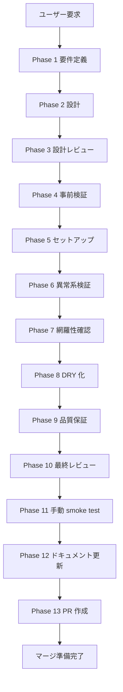

# 01a-parallel-github-and-branch-governance - タスク仕様書 index

## メタ情報

| 項目 | 値 |
| --- | --- |
| タスク名 | github-and-branch-governance |
| ディレクトリ | doc/01a-parallel-github-and-branch-governance |
| Wave | 1 |
| 実行種別 | parallel |
| 作成日 | 2026-04-23 |
| 担当 | governance |
| 状態 | pending |
| タスク種別 | spec_created |

## ユーザーからの元の指示

> 本ブランチの変更部分を、30種の思考法を駆使し、変更分のskill準拠検証とエレガントな解決策への改善を行う。SubAgentに切り分けて全フェーズをステップバイステップで実行し、並列可能な部分は並列実行する。
>
> 参考: `doc/01a-parallel-github-and-branch-governance/` / `doc/00-getting-started-manual/`

## タスク概要

### 目的

本ブランチの変更分が 2 つの skill 定義に漏れなく準拠していることを最優先で確認し、30種の思考法を通してエレガントな解決策へ再構成する。

### 背景

既存の実装や仕様書に skill 定義とのズレが残っている可能性があるため、単なる差分確認ではなく、必要に応じて再構成できる粒度で検証する。

### 最終ゴール

2 つの skill 定義に完全準拠し、30種の思考法による多角的検証を経た branch governance 仕様書セットを完成させる。

### 成果物一覧

| 種別 | 成果物 | 配置先 |
| --- | --- | --- |
| 仕様書 | `index.md` / `phase-01.md`〜`phase-13.md` | `doc/01a-parallel-github-and-branch-governance/` |
| 設計・実行成果物 | `outputs/phase-02/github-governance-map.md` / `outputs/phase-05/repository-settings-runbook.md` / `outputs/phase-05/pull-request-template.md` / `outputs/phase-05/codeowners.md` | `doc/01a-parallel-github-and-branch-governance/outputs/` |
| close-out 成果物 | `outputs/phase-12/*.md` / `outputs/phase-13/*.md` | `doc/01a-parallel-github-and-branch-governance/outputs/` |
| メタ | `artifacts.json` | `doc/01a-parallel-github-and-branch-governance/` |

## タスク分解サマリー

| Phase | 責務 | 主な出力 |
| --- | --- | --- |
| 1 | 要件定義 | `outputs/phase-01/main.md` |
| 2 | 設計 | `outputs/phase-02/github-governance-map.md` |
| 3 | 設計レビュー | `outputs/phase-03/main.md` |
| 4 | 事前検証手順 | `outputs/phase-04/main.md` |
| 5 | セットアップ実行 | `outputs/phase-05/repository-settings-runbook.md` / `outputs/phase-05/pull-request-template.md` / `outputs/phase-05/codeowners.md` |
| 6 | 異常系検証 | `outputs/phase-06/main.md` |
| 7 | 検証項目網羅性 | `outputs/phase-07/main.md` |
| 8 | 設定 DRY 化 | `outputs/phase-08/main.md` |
| 9 | 品質保証 | `outputs/phase-09/main.md` |
| 10 | 最終レビュー | `outputs/phase-10/main.md` |
| 11 | 手動 smoke test | `outputs/phase-11/main.md` / `outputs/phase-11/manual-smoke-log.md` |
| 12 | ドキュメント更新 | `outputs/phase-12/*.md` |
| 13 | PR 作成 | `outputs/phase-13/local-check-result.md` / `outputs/phase-13/change-summary.md` |

## 実行フロー図



## テストカバレッジ目標

| 観点 | 目標 |
| --- | --- |
| skill準拠率 | 100% |
| 30種の思考法適用 | 30/30 |
| 4条件充足 | 100% PASS |
| 機密情報漏洩 | 0 件 |

## Phase完了時の必須アクション

- [ ] 全 Phase の成果物を配置し、`artifacts.json` を更新する
- [ ] 依存関係と handoff を次 Phase に明記する
- [ ] 4条件の評価結果を各 Phase に記録する
- [ ] Phase 13 はユーザー承認後にのみ実行する

## 使用方法

1. `index.md` で全体方針と依存関係を確認する
2. Phase 1 から順番に実行し、各 Phase の `成果物` と `完了条件` を埋める
3. Phase 12 で close-out と skill sync を整理する
4. Phase 13 はユーザー承認がある場合のみ進める

## 出力ファイル構成

```
doc/01a-parallel-github-and-branch-governance/
├── index.md
├── artifacts.json
├── phase-01.md ... phase-13.md
└── outputs/
    ├── phase-01/
    ├── phase-02/
    ├── phase-03/
    ├── phase-04/
    ├── phase-05/
    ├── phase-06/
    ├── phase-07/
    ├── phase-08/
    ├── phase-09/
    ├── phase-10/
    ├── phase-11/
    ├── phase-12/
    └── phase-13/
```

## 目的

GitHub Repository と Environment 設定を、feature/* -> dev -> main の正本仕様に一致させる。review rule、branch protection、PR / Issue template、CODEOWNERS を一つの task で閉じる。

## スコープ

### 含む
- dev / main protection
- production / staging environment
- PR / Issue template
- CODEOWNERS と review rule

### 含まない
- Cloudflare deploy 実行
- secret 実値投入
- 実コード実装

## 依存関係

| 種別 | 対象 | 理由 |
| --- | --- | --- |
| 上流 | ../00-serial-architecture-and-scope-baseline/ | この task 開始前に必要 |
| 下流 | 02-serial-monorepo-runtime-foundation / 04-serial-cicd-secrets-and-environment-sync | この task の成果物を参照 |
| 並列 | 01b-parallel-cloudflare-base-bootstrap / 01c-parallel-google-workspace-bootstrap | 同 Wave で独立実行可能 |

## 主要な参照資料

| 種別 | パス | 用途 |
| --- | --- | --- |
| 必須 | .claude/skills/aiworkflow-requirements/references/deployment-branch-strategy.md | branch / reviewers / env mapping |
| 必須 | .claude/skills/aiworkflow-requirements/references/deployment-core.md | CI/CD 品質ゲート |
| 必須 | .claude/skills/task-specification-creator/SKILL.md | PR は承認後のみ |
| 参考 | GitHub Repository Settings | branch protection / environments |

## 受入条件 (AC)

- AC-1: main は reviewer 2 名、dev は reviewer 1 名である
- AC-2: production は main、staging は dev のみ受け付ける
- AC-3: PR template に true issue / dependency / 4条件の欄がある
- AC-4: CODEOWNERS と task 責務が衝突しない
- AC-5: local-check-result.md と change-summary.md の close-out path がある

## Phase 一覧

| Phase | 名称 | ファイル | 状態 | 主成果物 |
| --- | --- | --- | --- | --- |
| 1 | 要件定義 | phase-01.md | completed | outputs/phase-01 |
| 2 | 設計 | phase-02.md | completed | outputs/phase-02 |
| 3 | 設計レビュー | phase-03.md | completed | outputs/phase-03 |
| 4 | 事前検証手順 | phase-04.md | completed | outputs/phase-04 |
| 5 | セットアップ実行 | phase-05.md | completed | outputs/phase-05 |
| 6 | 異常系検証 | phase-06.md | completed | outputs/phase-06 |
| 7 | 検証項目網羅性 | phase-07.md | completed | outputs/phase-07 |
| 8 | 設定 DRY 化 | phase-08.md | completed | outputs/phase-08 |
| 9 | 品質保証 | phase-09.md | completed | outputs/phase-09 |
| 10 | 最終レビュー | phase-10.md | completed | outputs/phase-10 |
| 11 | 手動 smoke test | phase-11.md | completed | outputs/phase-11 |
| 12 | ドキュメント更新 | phase-12.md | completed | outputs/phase-12 |
| 13 | PR作成 | phase-13.md | pending（ユーザー承認待ち） | outputs/phase-13 |

## 主要成果物

| 種別 | パス | 説明 |
| --- | --- | --- |
| ドキュメント | outputs/phase-02/github-governance-map.md | branch / env / review map |
| ドキュメント | outputs/phase-05/repository-settings-runbook.md | GitHub 設定適用 runbook |
| ドキュメント | outputs/phase-05/pull-request-template.md | PR テンプレ案 |
| ドキュメント | outputs/phase-13/local-check-result.md | PR 前ローカル確認結果 |
| ドキュメント | outputs/phase-13/change-summary.md | 変更サマリー |
| メタ | artifacts.json | 機械可読サマリー |
| 仕様書 | phase-*.md x 13 | Phase 別仕様 |

## 関連サービス・ツール

| サービス/ツール | 用途 | 無料枠/コスト |
| --- | --- | --- |
| GitHub | repo governance | 無料 |
| GitHub Actions | CI | 無料枠 |

## Secrets 一覧（このタスクで定義し、04 Phase 5 で投入）

| 変数名 | 種別 | 配置先 | 確定 Phase |
| --- | --- | --- | --- |
| CLOUDFLARE_API_TOKEN | deploy auth | GitHub Secrets | 04 Phase 5 |
| CLOUDFLARE_ACCOUNT_ID | deploy metadata | GitHub Secrets | 04 Phase 5 |

- 実値は書かない。プレースホルダーのみ扱う。
- この task では secret 名と配置先だけを固定し、実投入は `04-serial-cicd-secrets-and-environment-sync` で扱う。

## 完了判定

- Phase 1〜13 の状態が artifacts.json と一致する
- AC が Phase 7 / 10 で完全トレースされる
- 4条件（価値性 / 実現性 / 整合性 / 運用性）が PASS
- Phase 12 の same-wave sync ルールが破られていない
- Phase 13 はユーザー承認なしでは実行しない

## 関連リンク

- 上位 README: ../README.md
- 共通テンプレ: ../_templates/phase-template-infra.md
- Legacy snapshot: 未作成（必要なら別 archive task で作成）
