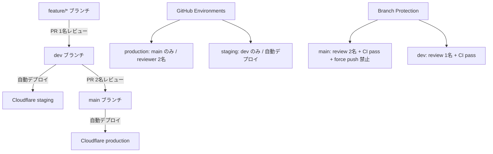

# Phase 2: 設計

## メタ情報

| 項目 | 値 |
| --- | --- |
| タスク名 | github-and-branch-governance |
| Phase 番号 | 2 / 13 |
| Phase 名称 | 設計 |
| 作成日 | 2026-04-23 |
| 前 Phase | 1 (要件定義) |
| 次 Phase | 3 (設計レビュー) |
| 状態 | pending |

## 目的

Phase 1 の要件定義を基に、GitHub branch protection / environment / PR template / CODEOWNERS の具体的な設計を確定し、Phase 5 で適用できる runbook の設計書を作成する。

## 実行タスク

### ステップ 1: input と前提の確認

- `outputs/phase-01/main.md`（要件定義書）を読む
- 正本仕様（`deployment-branch-strategy.md`）との差分リストを確認する

### ステップ 2: GitHub Governance Map の設計

`outputs/phase-02/github-governance-map.md` を作成する。

設計内容:

#### Branch Protection 設計

| ブランチ | 設定項目 | 値 |
| --- | --- | --- |
| `main` | Require PR reviews | 2 名 |
| `main` | Require status checks | `ci`, `Validate Build` |
| `main` | Require up-to-date branches | ON |
| `main` | Restrict pushers | admins only |
| `main` | Allow force pushes | OFF |
| `main` | Allow deletions | OFF |
| `dev` | Require PR reviews | 1 名 |
| `dev` | Require status checks | `ci`, `Validate Build` |
| `dev` | Allow force pushes | OFF |

#### GitHub Environments 設計

| 環境名 | Required reviewers | Deployment branches | 用途 |
| --- | --- | --- | --- |
| `production` | 2 名 | `main` のみ | Cloudflare production デプロイ |
| `staging` | 0 名（自動） | `dev` のみ | Cloudflare staging デプロイ |

#### PR Template 設計

```markdown
## 概要
<!-- 変更内容を簡潔に記述 -->

## 関連 Issue
<!-- Closes #xxx -->
- True Issue: #
- Dependency: #（依存タスクがあれば記載）

## 変更種別
- [ ] 機能追加
- [ ] バグ修正
- [ ] ドキュメント更新
- [ ] インフラ変更
- [ ] リファクタリング

## 4条件チェック
- [ ] 価値性: 誰のどのコストを下げるか定義されている
- [ ] 実現性: 初回スコープで成立する
- [ ] 整合性: branch/env/runtime/data/secret が矛盾しない
- [ ] 運用性: rollback・handoff が破綻しない

## テスト確認
- [ ] ローカルで動作確認済み
- [ ] CI が GREEN
- [ ] 影響範囲を確認済み
```

#### CODEOWNERS 設計

```
# Global fallback
*                   @daishiman

# Infrastructure docs (Wave 1 parallel tasks)
doc/01a-*/          @daishiman
doc/01b-*/          @daishiman
doc/01c-*/          @daishiman

# GitHub governance files
.github/            @daishiman
```

#### Secrets 設計（このタスクで名称を確定、実値投入は Phase 04-5）

| 変数名 | 種別 | 配置先 | Phase 投入 |
| --- | --- | --- | --- |
| `CLOUDFLARE_API_TOKEN` | deploy auth | GitHub Secrets | 04 Phase 5 |
| `CLOUDFLARE_ACCOUNT_ID` | deploy metadata | GitHub Secrets | 04 Phase 5 |

- runtime secrets（`GOOGLE_*` / `AUTH_*` / `RESEND_*`）の正本配置は `02-auth.md` / `08-free-database.md` / `10-notification-auth.md` に残す。
- この task では branch governance に必要な `CLOUDFLARE_*` のみを固定し、他の secret placement は変更しない。

### ステップ 3: 4条件と handoff の確認

- 設計が AC-1〜5 を全てカバーしているか確認
- Phase 3 レビューに渡す design risk を記録

## 構成図



## 参照資料

| 種別 | パス | 用途 |
| --- | --- | --- |
| 必須 | `.claude/skills/aiworkflow-requirements/references/deployment-branch-strategy.md` | branch / reviewers / env mapping |
| 必須 | `.claude/skills/aiworkflow-requirements/references/deployment-core.md` | CI/CD 品質ゲート（branch/env の命名は `deployment-branch-strategy.md` を正本とする） |
| 必須 | `outputs/phase-01/main.md` | 要件定義書（Phase 1 成果物） |

## 統合テスト連携

| 連携先 Phase | 連携内容 |
| --- | --- |
| Phase 3 | 本 Phase の設計書をレビュー対象として使用 |
| Phase 5 | `github-governance-map.md` を runbook の根拠として使用 |
| Phase 7 | AC トレースに使用 |
| Phase 10 | gate 判定の根拠 |
| Phase 12 | close-out と spec sync 判断 |

## 多角的チェック観点

- **価値性**: branch protection と environment 保護により、未レビューコードの production 流入を防ぐ
- **実現性**: GitHub Free/Pro で全設定項目が利用可能。追加コストなし
- **整合性**: `deployment-branch-strategy.md` の reviewer 数・force push 禁止ルールと完全一致
- **運用性**: 設定変更は管理者のみ可能。emergency hotfix は admin bypass で対応可

## サブタスク管理

| # | サブタスク | 担当 Phase | 状態 | 備考 |
| --- | --- | --- | --- | --- |
| 1 | Phase 1 output 読み込み | 2 | pending | `outputs/phase-01/main.md` |
| 2 | Branch protection 設計 | 2 | pending | main / dev の設定値 |
| 3 | Environment 設計 | 2 | pending | production / staging |
| 4 | PR template 設計 | 2 | pending | 4条件欄あり |
| 5 | CODEOWNERS 設計 | 2 | pending | task 責務境界の反映 |
| 6 | `github-governance-map.md` 作成 | 2 | pending | `outputs/phase-02/` |
| 7 | 4条件と handoff 確認 | 2 | pending | Phase 3 への blockers |

## 成果物

| 種別 | パス | 説明 |
| --- | --- | --- |
| ドキュメント | `outputs/phase-02/github-governance-map.md` | branch / env / review / CODEOWNERS 設計 map |
| メタ | `artifacts.json` | Phase 2 status を completed に更新 |

## 完了条件

- [ ] `outputs/phase-02/github-governance-map.md` が作成済み
- [ ] Branch protection (main/dev) の設計値が正本仕様と一致している
- [ ] Environment (production/staging) の branch mapping が正本仕様と一致している
- [ ] PR template に AC-3 の 4条件欄がある
- [ ] CODEOWNERS が AC-4 を満たす（task 責務と衝突なし）
- [ ] downstream handoff が明記されている

## タスク 100% 実行確認【必須】

- [ ] 全実行タスクが completed
- [ ] 全成果物が指定パスに配置済み
- [ ] 全完了条件にチェック済み
- [ ] 異常系（権限・無料枠・drift）も検証済み
- [ ] 次 Phase への引き継ぎ事項を記述済み
- [ ] `artifacts.json` の phase 2 を completed に更新済み

## 次Phase

- 次: 3 (設計レビュー)
- 引き継ぎ事項: `github-governance-map.md` の設計内容をレビュー対象として渡す
- ブロック条件: `outputs/phase-02/github-governance-map.md` が未作成なら Phase 3 に進まない

## 環境変数一覧

| 区分 | 代表値 | 置き場所 | 理由 |
| --- | --- | --- | --- |
| deploy secret | `CLOUDFLARE_API_TOKEN` | GitHub Secrets | CI/CD 専用 |
| deploy secret | `CLOUDFLARE_ACCOUNT_ID` | GitHub Secrets | CI/CD 専用 |
| runtime secret | `GOOGLE_SERVICE_ACCOUNT_EMAIL` | Cloudflare Secrets | runtime が直接利用 |
| runtime secret | `AUTH_SECRET` | Cloudflare Secrets | runtime が直接利用 |
| local canonical | 全シークレット | 1Password Environments | 平文 .env を正本にしない |
| public variable | プロジェクト名 / URL / IDs | GitHub Variables | 非機密 |

## 設定値表

| 項目 | 設定値 | 根拠 |
| --- | --- | --- |
| main branch reviewer | 2 名 | deployment-branch-strategy.md |
| dev branch reviewer | 1 名 | deployment-branch-strategy.md |
| main force push | OFF | deployment-branch-strategy.md |
| dev force push | OFF | deployment-branch-strategy.md |
| production env branch | main のみ | deployment-branch-strategy.md |
| staging env branch | dev のみ | deployment-branch-strategy.md |
| CI status checks | `ci`, `Validate Build` | deployment-core.md |

## 依存マトリクス

| 種別 | 対象 | 理由 |
| --- | --- | --- |
| 上流 | `../00-serial-architecture-and-scope-baseline/` | baseline が確定していること |
| 下流 | `02-serial-monorepo-runtime-foundation` | branch protection 前提で PR フロー設計 |
| 下流 | `04-serial-cicd-secrets-and-environment-sync` | environment 名と secrets placement を参照 |
| 並列 | `01b-parallel-cloudflare-base-bootstrap` | 独立実行可能 |
| 並列 | `01c-parallel-google-workspace-bootstrap` | 独立実行可能 |
