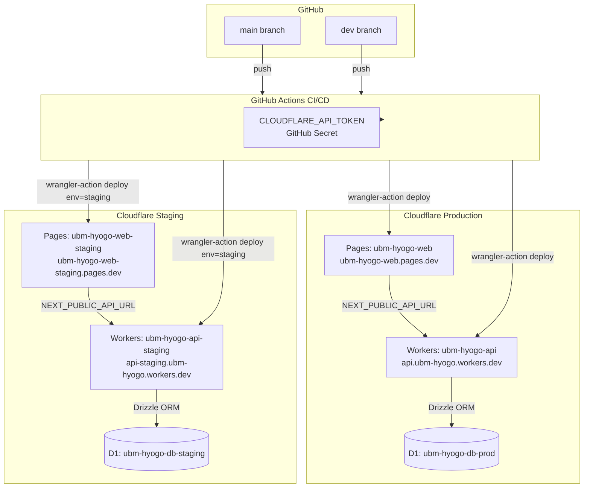

# Cloudflare サービストポロジー

> 参照元: Phase 2 設計成果物
> 作成日: 2026-04-23
> 対象タスク: 01b-parallel-cloudflare-base-bootstrap

## 1. サービス名と環境対応表

| リソース種別 | production | staging | ブランチ |
| --- | --- | --- | --- |
| Cloudflare Pages | `ubm-hyogo-web` | `ubm-hyogo-web-staging` | `main` / `dev` |
| Cloudflare Workers | `ubm-hyogo-api` | `ubm-hyogo-api-staging` | `main` / `dev` |
| Cloudflare D1 | `ubm-hyogo-db-prod` | `ubm-hyogo-db-staging` | — |

## 2. Mermaid トポロジー図

## 3. APIトークンスコープ定義

| スコープ | 権限 | 最小権限の根拠 |
| --- | --- | --- |
| Cloudflare Pages | Edit | Pages プロジェクト作成・デプロイに必要 |
| Workers Scripts | Edit | Workers デプロイに必要 |
| D1 | Edit | マイグレーション実行に必要 |

**付与しないスコープ**: Zone:Read / Cache Purge / DNS:Edit 等（CI/CDに不要）

## 4. URL / ドメイン対応表

| 環境 | アプリ | URL |
| --- | --- | --- |
| production | Web (Pages) | `https://ubm-hyogo-web.pages.dev` |
| production | API (Workers) | `https://api.ubm-hyogo.workers.dev` |
| staging | Web (Pages) | `https://ubm-hyogo-web-staging.pages.dev` |
| staging | API (Workers) | `https://api-staging.ubm-hyogo.workers.dev` |

注: カスタムドメインは初回スコープ外（UN-05 として記録）

## 5. 環境変数配置マトリクス

| 種別 | 変数名 | 置き場所 | 責務 |
| --- | --- | --- | --- |
| runtime secret | OPENAI_API_KEY | Cloudflare Workers Secrets | Workers が直接参照 |
| runtime secret | ANTHROPIC_API_KEY | Cloudflare Workers Secrets | Workers が直接参照 |
| deploy secret | CLOUDFLARE_API_TOKEN | GitHub Secrets | CI/CD パイプライン専用 |
| deploy variable | CLOUDFLARE_ACCOUNT_ID | GitHub Secrets | CI/CD パイプライン専用 |
| public variable | NEXT_PUBLIC_API_URL | Cloudflare Pages Env Vars | フロントエンドから参照（公開情報） |
| public variable | ENVIRONMENT | wrangler.toml [vars] | staging/production の分岐制御 |

## 6. データ責務分離

| データソース | 責務 | 読み書き |
| --- | --- | --- |
| Google Sheets | 入力データ（ユーザー入力・申請情報） | 入力のみ |
| Cloudflare D1 | 正本 DB（カノニカルデータ） | 読み書き両方 |

Sheets と D1 を混同しない。Sheets は入力チャネル、D1 はシステムの真実の源。

## 7. ロールバック手順

| サービス | 手順 | 独立性 |
| --- | --- | --- |
| Cloudflare Pages | Dashboard > Deployments > Rollback | ✅ Workers に依存しない |
| Cloudflare Workers | `wrangler rollback --name ubm-hyogo-api` | ✅ Pages に依存しない |
| D1 | マイグレーション逆順 + `wrangler d1 execute` | 手動確認が必要 |

## 下流タスク参照

このファイルは以下のタスクから参照される:
- `02-serial-monorepo-runtime-foundation`: wrangler.toml サービス名
- `03-serial-data-source-and-storage-contract`: D1 database 名
- `04-serial-cicd-secrets-and-environment-sync`: GitHub Secrets 名
