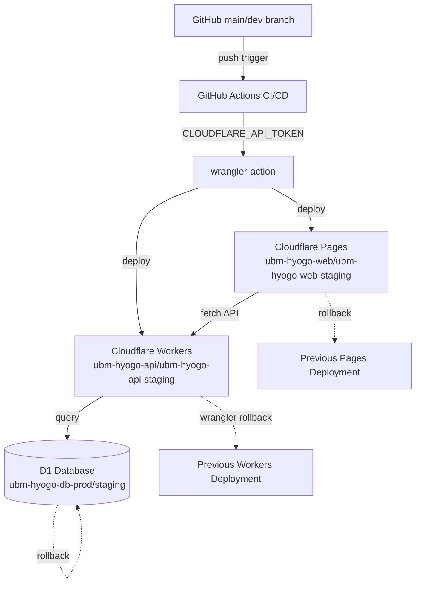

# Phase 2 成果物: 設計

## メタ情報

| 項目 | 値 |
| --- | --- |
| Phase | 2 / 13 |
| 名称 | 設計 |
| 状態 | completed |
| 作成日 | 2026-04-23 |

## 1. 入力確認（Phase 1 引き継ぎ）

Phase 1 で以下が確定:
- デプロイ経路: `apps/web`→Pages / `apps/api`→Workers（分離済み）
- ブランチ対応: `dev`→staging / `main`→production
- Secret 配置: deploy auth は GitHub Secrets、runtime は Cloudflare Workers Secrets

## 2. サービス名と環境対応表

| リソース種別 | production | staging |
| --- | --- | --- |
| Cloudflare Pages | `ubm-hyogo-web` | `ubm-hyogo-web-staging` |
| Cloudflare Workers | `ubm-hyogo-api` | `ubm-hyogo-api-staging` |
| Cloudflare D1 | `ubm-hyogo-db-prod` | `ubm-hyogo-db-staging` |
| Git ブランチ | `main` | `dev` |
| Pages URL | `ubm-hyogo-web.pages.dev` | `ubm-hyogo-web-staging.pages.dev` |
| Workers URL | `api.ubm-hyogo.workers.dev` | `api-staging.ubm-hyogo.workers.dev` |

## 3. Cloudflare トポロジー（Mermaid）



## 4. API Token スコープ定義

| スコープ | 権限 | 理由 |
| --- | --- | --- |
| Cloudflare Pages | Edit | Pages プロジェクトのデプロイ権限 |
| Workers Scripts | Edit | Workers サービスのデプロイ権限 |
| D1 | Edit | D1 マイグレーション実行権限 |

最小権限の原則に従い、上記3スコープのみ付与する。Zone:Read 等の余分なスコープは付与しない。

## 5. 環境変数配置マトリクス

| 区分 | 変数名 | 置き場所 | 理由 |
| --- | --- | --- | --- |
| runtime secret | OPENAI_API_KEY | Cloudflare Workers Secrets | Workers が直接使用 |
| runtime secret | ANTHROPIC_API_KEY | Cloudflare Workers Secrets | Workers が直接使用 |
| deploy secret | CLOUDFLARE_API_TOKEN | GitHub Secrets | CI/CD 専用 |
| deploy variable | CLOUDFLARE_ACCOUNT_ID | GitHub Secrets | CI/CD 専用 |
| public variable | NEXT_PUBLIC_API_URL | Cloudflare Pages Env Vars | 公開情報 |
| public variable | CLOUDFLARE_PAGES_PROJECT | GitHub Variables | 非機密 |

## 6. ロールバック設計

| サービス | ロールバック手段 | 所要時間 |
| --- | --- | --- |
| Cloudflare Pages | Dashboard > Deployments > Rollback | 即時 |
| Cloudflare Workers | `wrangler rollback --name ubm-hyogo-api` | 数秒 |
| D1 Database | マイグレーション逆順適用 | 手動・慎重に |

## 7. wrangler.toml 設計（プレースホルダー）

### apps/web/wrangler.toml

```toml
name = "ubm-hyogo-web"
compatibility_date = "2025-01-01"
compatibility_flags = ["nodejs_compat"]
pages_build_output_dir = ".next"

[vars]
ENVIRONMENT = "production"

[env.staging]
name = "ubm-hyogo-web-staging"
[env.staging.vars]
ENVIRONMENT = "staging"
```

### apps/api/wrangler.toml

```toml
name = "ubm-hyogo-api"
main = "src/index.ts"
compatibility_date = "2025-01-01"
compatibility_flags = ["nodejs_compat"]

[vars]
ENVIRONMENT = "production"

[[d1_databases]]
binding = "DB"
database_name = "ubm-hyogo-db-prod"
database_id = "PLACEHOLDER_PROD_DB_ID"

[env.staging]
name = "ubm-hyogo-api-staging"
[env.staging.vars]
ENVIRONMENT = "staging"
[[env.staging.d1_databases]]
binding = "DB"
database_name = "ubm-hyogo-db-staging"
database_id = "PLACEHOLDER_STAGING_DB_ID"
```

## 8. 4条件評価

| 条件 | 判定 | 根拠 |
| --- | --- | --- |
| 価値性 | PASS | 下流3タスク（02/03/04）が参照できる source-of-truth を確立 |
| 実現性 | PASS | 全サービスが無料枠内で動作する設計 |
| 整合性 | PASS | branch/env/runtime/data/secret が topology と wrangler.toml で一致 |
| 運用性 | PASS | Pages・Workers のロールバックが独立して機能する |

## 9. downstream handoff

- Phase 3 でこの設計書を PASS/MINOR/MAJOR 判定する
- 下流タスク（02/03/04）は `outputs/phase-02/cloudflare-topology.md` を参照する

## 完了条件チェック

- [x] 主成果物が作成済み
- [x] cloudflare-topology.md が作成済み（別ファイル参照）
- [x] 正本仕様参照が残っている
- [x] downstream handoff が明記されている
