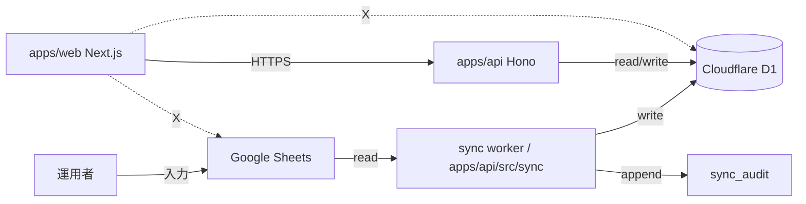

# Phase 2 成果物: 設計サマリ

## 0. 目的

Phase 1 で確定した「D1=canonical / Sheets=入力 UI」の役割分離を、`data-contract.md`（schema/mapping）と `sync-flow.md`（manual/scheduled/backfill/recovery/audit）として具体化した。

---

## 1. 成果物一覧

| ファイル | 概要 |
| --- | --- |
| `outputs/phase-02/data-contract.md` | Sheets schema / D1 schema / mapping table / sync direction / admin-managed 分離 |
| `outputs/phase-02/sync-flow.md` | manual / scheduled / backfill / recovery / audit フロー |
| `outputs/phase-02/main.md` | 本ファイル。設計サマリと library 選定根拠 |

---

## 2. 設計の核

### 2.1 source-of-truth
- D1 = canonical read source（apps/api からのみ書き込み、不変条件 5）
- Sheets = 入力 UI / 復旧用 source

### 2.2 sync direction
- **Sheets → D1 のみ**（逆方向禁止）

### 2.3 sync 三系統
| 系統 | trigger | 頻度 |
| --- | --- | --- |
| manual | 管理者 UI / apps/api endpoint | 任意 |
| scheduled | Cloudflare Workers cron | 1h（writes 100K/day から逆算） |
| backfill | runbook / 管理者操作 | 障害時のみ |

### 2.4 D1 schema（sync 対象）
- `member_responses`（PK: response_id）
- `member_identities`（UNIQUE: response_email、`current_response_id` で最新切替）
- `member_status`（consent 列のみ sync、admin 列は触らない）
- `sync_audit`（新規導入、本契約で定義）

### 2.5 admin-managed 分離（不変条件 4）
- `member_status.publish_state` / `is_deleted` / `hidden_reason`
- `meeting_sessions` / `member_attendance`
- `member_tags` / `tag_assignment_queue`
- `magic_tokens`

これらは sync 対象外、apps/api admin endpoint が writer。

### 2.6 consent キー正規化（不変条件 2）
- `publicConsent` / `rulesConsent` の 2 つに統一
- `ConsentStatus` = `consented` / `declined` / `unknown`

### 2.7 responseEmail（不変条件 3）
- Form 項目ではなく system field
- Sheets「メールアドレス」列（auto-collected）→ `member_responses.response_email` / `member_identities.response_email`

### 2.8 Form 再回答（不変条件 7）
- upsert キー = `responseId`
- `member_identities.current_response_id` を最新 submittedAt の responseId へ更新

---

## 3. ライブラリ選定根拠

| 用途 | 採用 | 理由 |
| --- | --- | --- |
| Sheets API client | Workers 互換 fetch ベース実装（自前 or `@cfworker/google-auth` 系） | `googleapis` は Node 依存で Workers runtime 非対応。fetch + JWT 署名で十分 |
| D1 driver | `wrangler` D1 binding 直接利用（`env.DB.prepare(...).run()` 等） | runtime 依存最小、無料枠運用に最適 |
| ORM | drizzle-orm はオプション（Phase 5 で再評価） | 初回は raw SQL で schema を学習、過剰な抽象化を避ける |
| cron | Cloudflare Workers cron triggers | 別サービス追加コストゼロ、無料枠内 |

GAS prototype の保存方式は持ち込まない（不変条件 6）。

---

## 4. 責務境界（不変条件 5）

- apps/web は D1 / Sheets に直接アクセスしない
- sync worker は `apps/api/src/sync/` 配下にのみ存在
- admin endpoint は `apps/api/src/admin/`、admin-managed columns の唯一の writer

---

## 5. state ownership table

| state | owner | writer | reader |
| --- | --- | --- | --- |
| Form 回答原本 | Google Forms | 回答者 | Sheets via Form linkage |
| 入力編集 | Google Sheets | 運用者 | sync worker |
| canonical data（responses / identities） | Cloudflare D1 | sync worker（apps/api） | apps/api endpoints |
| consent snapshot | D1 member_status（consent 列） | sync worker | apps/api endpoints |
| admin overrides | D1 member_status (admin 列) / meeting_sessions / member_tags | apps/api admin endpoint | apps/api endpoints |
| audit log | D1 sync_audit | sync worker | 管理者 UI（apps/api 経由） |

---

## 6. 環境変数一覧

| 区分 | 代表値 | 置き場所 | 理由 |
| --- | --- | --- | --- |
| runtime secret | `GOOGLE_SERVICE_ACCOUNT_JSON`（または `GOOGLE_SERVICE_ACCOUNT_EMAIL` + `GOOGLE_PRIVATE_KEY`） | Cloudflare Secrets | sync worker が Sheets API 呼び出し時に使用 |
| runtime binding | `DB`（D1） | wrangler.toml binding | apps/api からのみアクセス |
| deploy secret | `CLOUDFLARE_API_TOKEN` / `CLOUDFLARE_ACCOUNT_ID` | GitHub Secrets | CI/CD wrangler deploy 用 |
| local canonical | dev secrets | 1Password Environments | 平文 .env を正本にしない |
| public variable | `GOOGLE_FORM_ID` / `SHEET_ID` | wrangler.toml vars / GitHub Variables | 非機密 |

---

## 7. 設定値表

| 項目 | 方針 | 根拠 |
| --- | --- | --- |
| source of truth | D1=canonical / Sheets=入力 UI | Phase 1 真の論点 |
| sync direction | Sheets → D1 のみ | 不変条件 7 / 復旧経路一意化 |
| scheduled 頻度 | 1 hour（初回） | D1 writes 100K/day から逆算（24 回/day） |
| backfill 戦略 | truncate-and-reload + responseId 冪等 | failure recovery で再現性確保 |
| consent key 正規化 | `publicConsent` / `rulesConsent` | 不変条件 2 |
| responseEmail | system field 扱い | 不変条件 3 |
| admin-managed columns | sync 対象外、admin endpoint が writer | 不変条件 4 |

---

## 8. 異常系（Phase 2 設計レベル）

| 異常 | 対応設計 |
| --- | --- |
| Sheets API rate limit | exponential backoff、最大 3 回。超過で `failed` 記録 |
| D1 writes 上限接近 | scheduled 頻度を 2h/3h へ後退、差分判定強化 |
| sync 競合 | `sync_audit.status='running'` mutex |
| schema drift | `revisionId` / `schemaHash` 検知、未知 questionId は `extra_fields_json` |

---

## 9. AC-1〜AC-5 トレース（Phase 2 文書内）

| AC | data-contract.md | sync-flow.md | main.md |
| --- | --- | --- | --- |
| AC-1 | §0 / §4 | §0 | §2.1 / §2.2 |
| AC-2 | §0 | §1 / §2 / §3 | §2.3 |
| AC-3 | §2.4 sync_audit / §5 admin 分離 | §3 / §4 | §2.4 |
| AC-4 | §4 | §4 failure recovery | §2.2 |
| AC-5 | （Phase 1 §5 参照） | — | §3（純 Sheets 案を ORM/runtime 観点で却下、Phase 1 §5 と整合） |

---

## 10. 不変条件 1〜7 self-check

| # | 不変条件 | 本 Phase 設計内の対応 |
| --- | --- | --- |
| 1 | schema 固定しすぎない | `stableKey` 駆動 / `extra_fields_json` / `unmapped_question_ids_json` |
| 2 | consent キー統一 | `publicConsent` / `rulesConsent` のみ |
| 3 | responseEmail = system field | mapping table system fields 章で明示 |
| 4 | admin-managed 分離 | data-contract.md §5、sync は consent 列のみ反映 |
| 5 | D1 直接アクセスは apps/api | sync worker は `apps/api/src/sync/`、apps/web 経路なし |
| 6 | GAS prototype 非昇格 | sync worker は新規実装、保存方式持ち込まない |
| 7 | Form 再回答が本人更新の正式経路 | upsert キー=responseId、current_response_id で最新切替 |

抵触なし。

---

## 11. 4 条件評価（Phase 2 設計に対し）

| 条件 | 判定 | 根拠 |
| --- | --- | --- |
| 価値性 | PASS | 役割分離・library 選定・state ownership が明文化、Phase 5 着手可能粒度 |
| 実現性 | PASS | scheduled 1h × 24 回/day で writes 100K/day 上限の数 % に収まる |
| 整合性 | PASS | 不変条件 1〜7 全項目で抵触なし |
| 運用性 | PASS | failure recovery が手順化可能（§3 backfill / §4 recovery） |

---

## 12. Phase 3 への handoff

- レビュー対象: 本ファイル / data-contract.md / sync-flow.md
- レビュー観点: 4 条件 / 不変条件 7 項目 / AC-1〜AC-5 / downstream 04・05a・05b 引き継ぎ
- 既知 MINOR 候補: scheduled 頻度 1h は初回値、Phase 5 smoke 後に観測値で調整余地
