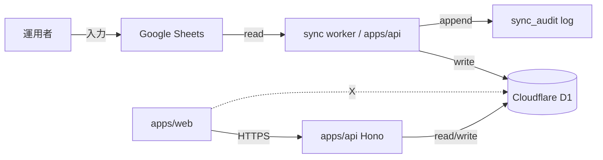

# Phase 2: 設計

## メタ情報

| 項目 | 値 |
| --- | --- |
| タスク名 | data-source-and-storage-contract |
| Phase 番号 | 2 / 13 |
| Phase 名称 | 設計 |
| 作成日 | 2026-04-23 |
| 前 Phase | 1 (要件定義) |
| 次 Phase | 3 (設計レビュー) |
| 状態 | completed |
| implementation_mode | new |

## 目的

Phase 1 で確定した「D1=canonical / Sheets=入力 UI」の役割分離を、`data-contract.md`（schema/mapping）と `sync-flow.md`（manual/scheduled/backfill/recovery）の二文書として具体化し、Phase 3 レビューで PASS 可能な精度に持ち上げる。

## 実行タスク

- data-contract.md 章立て確定（Sheets schema / D1 schema / mapping table / sync direction）
- sync-flow.md 章立て確定（trigger 別 flow / failure recovery / audit log）
- ライブラリ選定（Google Sheets API client / D1 driver）
- 責務境界（apps/api 内 sync worker 配置 / apps/web からの D1 直接アクセス禁止）
- state ownership table の確定

## 参照資料

| 種別 | パス | 用途 |
| --- | --- | --- |
| 必須 | .claude/skills/aiworkflow-requirements/references/architecture-overview-core.md | apps/api / D1 binding 配置 |
| 必須 | .claude/skills/aiworkflow-requirements/references/deployment-cloudflare.md | Workers cron triggers / wrangler.toml |
| 必須 | .claude/skills/aiworkflow-requirements/references/deployment-core.md | rollback 方針 |
| 必須 | doc/00-getting-started-manual/specs/01-api-schema.md | Form schema → D1 column mapping |
| 必須 | doc/00-getting-started-manual/specs/08-free-database.md | D1 無料枠（writes 100K/day） |
| 参考 | .claude/skills/aiworkflow-requirements/references/environment-variables.md | GOOGLE_SERVICE_ACCOUNT_JSON 配置 |

## 実行手順

### ステップ 1: data-contract.md 章立て
1. Sheets schema（Form 31問 / 6section の列順 / 列名規約）
2. D1 schema（member_responses / member_identities / member_status / sync_audit テーブル）
3. mapping table（Sheets 列 → D1 column / 型変換 / consent キー正規化 publicConsent, rulesConsent）
4. sync direction（Sheets → D1 のみ。逆方向は禁止）
5. admin-managed columns 分離（不変条件 4）

### ステップ 2: sync-flow.md 章立て
1. manual trigger（管理者 UI から API 経由で sync worker 起動）
2. scheduled trigger（Cloudflare Workers cron、頻度=1時間/初回。writes 上限から逆算）
3. backfill flow（全件 truncate-and-reload。冪等キー=responseId）
4. failure recovery（Sheets を真として再 backfill / sync_audit に失敗記録）
5. audit log（audit_id / trigger 種別 / 件数 / diff サマリ / failed_reason）

### ステップ 3: ライブラリ選定と責務境界
- Google Sheets API client: `googleapis` ではなく Workers 互換の軽量 fetch ベース実装（Node 依存回避）
- D1 driver: `wrangler` binding 直接利用（drizzle-orm はオプション、Phase 5 で再評価）
- sync worker 配置: `apps/api/src/sync/`（apps/web には置かない、不変条件 5）

## 統合テスト連携

| 連携先 Phase | 連携内容 |
| --- | --- |
| Phase 3 | data-contract.md / sync-flow.md をレビュー入力に提供 |
| Phase 5 | runbook 化（d1-bootstrap-runbook.md）の前提 |
| Phase 7 | AC-1〜AC-5 のトレース元 |
| Phase 10 | gate 判定の根拠 |

## 多角的チェック観点（AIが判断）

- 価値性: 設計が Phase 5 でそのまま実装着手できる粒度か
- 実現性: D1 writes 100K/day に scheduled 頻度が収まるか
- 整合性: 不変条件 1（schema 固定しすぎない）/ 2（consent キー統一）/ 3（responseEmail は system field）/ 4（admin-managed 分離）/ 5（D1 直接アクセス禁止）と矛盾しないか
- 運用性: failure recovery が手順化可能か

## サブタスク管理

| # | サブタスク | 担当 Phase | 状態 | 備考 |
| --- | --- | --- | --- | --- |
| 1 | data-contract.md 章立て | 2 | completed | Sheets/D1 schema, mapping |
| 2 | sync-flow.md 章立て | 2 | completed | trigger / recovery / audit |
| 3 | ライブラリ選定 | 2 | completed | Sheets client / D1 driver |
| 4 | 責務境界の図示 | 2 | completed | apps/api 配置 |
| 5 | state ownership table | 2 | completed | Sheets/worker/D1/audit |

## 成果物

| 種別 | パス | 説明 |
| --- | --- | --- |
| ドキュメント | outputs/phase-02/data-contract.md | Sheets/D1 schema, mapping, direction |
| ドキュメント | outputs/phase-02/sync-flow.md | manual/scheduled/backfill/recovery/audit |
| ドキュメント | outputs/phase-02/main.md | 設計サマリ・library 選定根拠 |
| メタ | artifacts.json | Phase 状態と outputs の記録 |

## 完了条件

- [ ] data-contract.md と sync-flow.md の章立てが固定済み
- [ ] ライブラリ選定根拠が main.md に記述済み
- [ ] 責務境界（apps/api 配置・apps/web 禁止）が図示済み
- [ ] 不変条件 1〜7 と矛盾しないことを self-check 済み

## タスク100%実行確認【必須】

- [x] 全実行タスクが completed
- [ ] 全成果物が指定パスに配置済み
- [ ] 全完了条件にチェック
- [ ] 異常系（Sheets API rate limit / D1 writes 上限 / sync 競合）の対応設計済み
- [ ] 次 Phase への引き継ぎ事項を記述
- [x] artifacts.json の該当 phase を completed に更新

## 次 Phase

- 次: 3 (設計レビュー)
- 引き継ぎ事項: data-contract.md / sync-flow.md / library 選定根拠を Phase 3 レビュー入力に
- ブロック条件: state ownership table が未確定なら次 Phase に進まない

## 構成図 (Mermaid)

## 環境変数一覧
| 区分 | 代表値 | 置き場所 | 理由 |
| --- | --- | --- | --- |
| runtime secret | GOOGLE_SERVICE_ACCOUNT_JSON | Cloudflare Secrets | sync worker が Sheets API 呼び出し時に使用 |
| runtime binding | DB (D1) | wrangler.toml binding | apps/api からのみアクセス |
| deploy secret | CLOUDFLARE_API_TOKEN | GitHub Secrets | CI/CD wrangler deploy 用 |
| local canonical | dev secrets | 1Password Environments | 平文 .env を正本にしない |
| public variable | SHEET_ID / FORM_ID | GitHub Variables / wrangler.toml vars | 非機密 |

## 設定値表
| 項目 | 方針 | 根拠 |
| --- | --- | --- |
| source of truth | D1=canonical / Sheets=入力 UI | Phase 1 真の論点 |
| sync direction | Sheets → D1 のみ | 不変条件 7 / 復旧経路一意化 |
| scheduled 頻度 | 1 hour（初回） | D1 writes 100K/day から逆算 |
| backfill 戦略 | truncate-and-reload + responseId 冪等 | failure recovery で再現性確保 |
| consent key 正規化 | publicConsent / rulesConsent | 不変条件 2 |
| responseEmail | system field 扱い | 不変条件 3 |
| admin-managed columns | member_status の admin-managed columns / 後続 admin tables に分離 | 不変条件 4 |

## state ownership table
| state | owner | writer | reader |
| --- | --- | --- | --- |
| Form 回答原本 | Google Forms | 回答者 | Sheets via Form linkage |
| 入力編集 | Google Sheets | 運用者 | sync worker |
| canonical data | Cloudflare D1 | sync worker（apps/api） | apps/api endpoints |
| admin overrides | Cloudflare D1 | apps/api admin endpoint | apps/api endpoints |
| audit log | D1 sync_audit table | sync worker | 管理者 UI |

## 依存マトリクス
| 種別 | 対象 | 理由 |
| --- | --- | --- |
| 上流 | 01b / 01c / 02 | D1 / Workspace / monorepo の前提 |
| 下流 | 04 / 05a / 05b | secret 同期 / 観測 / smoke が本契約に依存 |
| 並列 | なし | serial wave |
