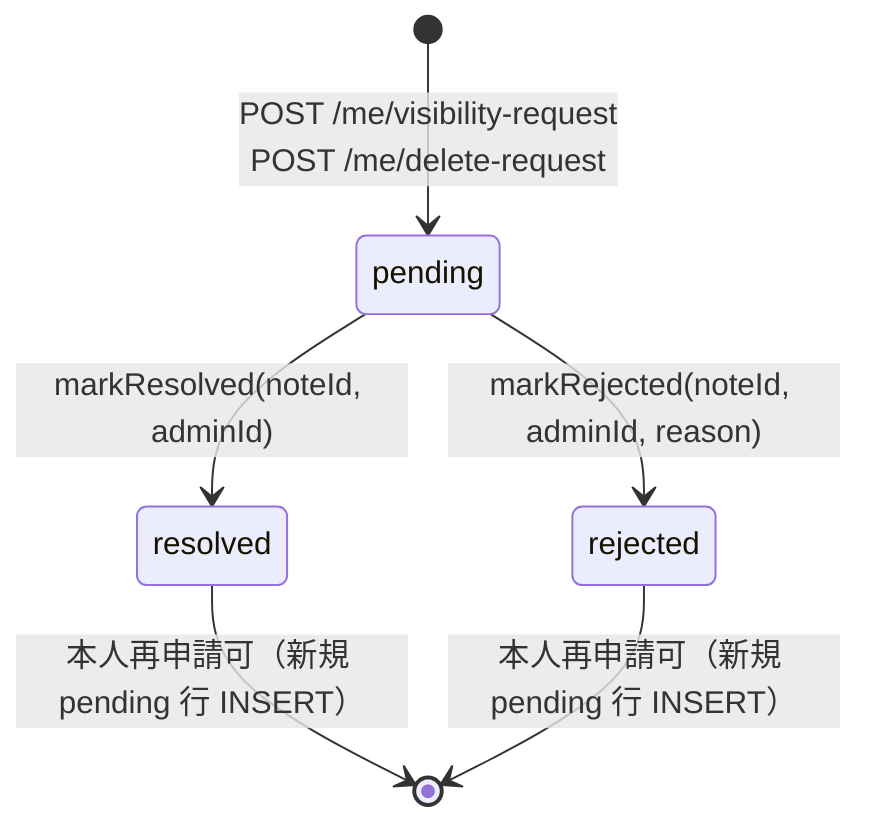

# 本人更新・公開状態・削除/復元の設計

## 設計方針

本人更新の正本は Google Form とする。

本人更新・公開状態・削除復元の制御は `apps/web` の導線と `apps/api` の操作 API を分離して扱う。

```text
プロフィール本文
  = Google Form current response

公開状態
  = current response の publicConsent
  + member_status.publish_state

削除状態
  = member_status.is_deleted
  + deleted_members
```

MVP では D1 `profile_overrides` 前提を採らない。

---

## 本人更新

### 正式フロー

```text
マイページ
  -> 更新モーダル or 更新 CTA
  -> Google Form responderUrl or editResponseUrl
  -> 回答送信
  -> sync
  -> current_response_id 更新
  -> マイページ再表示
```

### ルール

1. アプリ内で本文を直接 PATCH しない
2. 氏名、プロフィール文、SNS、consent を含む 31 項目は Google Form 側で更新する
3. 同じ `responseEmail` の最新回答を current response とする
4. 旧回答は履歴として保持する

---

## edit URL の扱い

- `editResponseUrl` を取得できる場合は最優先の更新導線にする
- 取得できない場合は responderUrl から再回答してもらう
- いずれの場合もアプリ内編集 UI は補助説明に留める

---

## 公開状態

公開判定は 2 段階に分ける。

1. フォーム回答由来
   - `publicConsent`
2. 管理運用由来
   - `member_status.publish_state`

公開される条件:

1. `publicConsent = "consented"`
2. `publishState = "public"`
3. `isDeleted = false`

これにより、本人の掲載同意と管理者の公開制御を両立できる。

---

## 管理者が変更できるもの

### 1. 公開状態

- `publish_state` の切り替え
- `hidden_reason` の記録

### 2. 削除/復元

- 物理削除はしない
- `member_status.is_deleted` を更新する
- `deleted_members` に履歴を残す

### 3. schema 外データ

- 開催日の追加
- 参加履歴の付与 / 解除
- タグ割当キューの処理

管理者は Google Form 本文を直接書き換えない。

---

## 削除依頼への対応

規約に合わせ、アプリから消しても Google 側元データは残る。

```text
member requests deletion
  -> /profile 本人申請パネル（RequestActionPanel）
  -> DeleteRequestDialog（reason ≤500 chars + 不可逆同意 checkbox 必須）
  -> POST /api/me/delete-request
  -> 202 Accepted で pending banner 表示・該当ボタン disabled
  -> admin queue（/admin/requests）で承認
  -> member_status.is_deleted = true
  -> deleted_members insert
  -> public/member views hide
```

- `reason` は client-side（≤500 chars）と server-side で二重検証する
- 不可逆同意 checkbox を必須化し、未チェック時は送信ボタンを disabled にする
- 409 `DUPLICATE_PENDING_REQUEST` は同一 session の pending banner と該当ボタン disabled に接続する
- network / 5xx はユーザー操作の再試行 CTA を出す

復元時は `is_deleted=false` に戻し、履歴は残す。

---

## 公開停止 / 再公開申請への対応

公開停止 / 再公開も削除と同型で、本人申請 → admin 承認の分離構造をとる。

```text
member requests visibility change
  -> /profile 本人申請パネル（RequestActionPanel）
  -> VisibilityRequestDialog（desiredState=hidden|public + reason ≤500 chars）
  -> POST /api/me/visibility-request
  -> 202 Accepted で pending banner 表示・該当ボタン disabled
  -> admin queue（/admin/requests）で承認
  -> member_status.publish_state 更新
```

- `desiredState` は現在の `publishState` と反対側のみ送信可能とする
- `reason` は削除申請と同じく client / server 二重検証
- 409 / network / 5xx の UX は削除申請と同一

---

## API の責務

| 操作 | API |
|------|-----|
| 本人プロフィール + 更新導線の取得 | `GET /me/profile` |
| 本人公開状態変更申請 | `POST /me/visibility-request` |
| 本人退会申請 | `POST /me/delete-request` |
| 公開状態変更 | `PATCH /api/admin/members/[id]/publish-state` |
| 削除 | `POST /api/admin/members/[id]/delete` |
| 復元 | `POST /api/admin/members/[id]/restore` |
| 参加履歴付与 / 解除 | `POST/DELETE /api/admin/members/[id]/attendance` |

本人の本文更新用 `PATCH /api/profile` は MVP 正式仕様にしない。
`/me/visibility-request` と `/me/delete-request` は本文を直接更新せず、`admin_member_notes.note_type`
に `visibility_request` / `delete_request` を保存して admin queue として扱う。`note_type='general'`
は既存 admin note の後方互換用で、member view model には `admin_member_notes` の本文・種別を混ぜない。

---

## 申請 queue の状態遷移（admin_member_notes）

`note_type IN ('visibility_request','delete_request')` の行は `request_status` 列で処理状態を保持する。
`note_type='general'` は `request_status` を常に NULL に保つ（不変条件 #11 と整合）。

| 列 | 型 | 値域 | 用途 |
| --- | --- | --- | --- |
| `request_status` | TEXT | `pending` / `resolved` / `rejected` / NULL | 申請行の処理状態。general 行は NULL |
| `resolved_at` | INTEGER | unix epoch ms / NULL | resolve / reject 確定時刻 |
| `resolved_by_admin_id` | TEXT | admin の userId / NULL | 処理した admin |



- `hasPendingRequest(memberId, noteType)` は `request_status='pending'` 行のみ true 判定。
  resolved / rejected 行が残っていても **再申請は許容**される（AC-7）。
- `pending → resolved` / `pending → rejected` のみ許容。`resolved → *` / `rejected → *` は
  `WHERE request_status='pending'` ガードで構造的に防ぐ（AC-6）。
- 不変条件 #4: `markResolved` / `markRejected` は `admin_member_notes` のみを更新し、
  `member_responses` には触れない。
- 不変条件 #11: 管理者は member 本文を直接編集できない。state transition は note 行の状態列のみを更新する。

### 管理者による申請確定（04b-followup-004）

`/admin/requests` は `visibility_request` / `delete_request` の pending 行を FIFO で表示する管理 queue である。管理者は各依頼を approve / reject できる。

- visibility approve: 依頼 payload の `desiredState` に従って `member_status.publish_state` を更新し、note を `resolved` にする。
- delete approve: `member_status.is_deleted=1` と `deleted_members` を更新し、note を `resolved` にする。
- reject: `member_status` は変更せず、note を `rejected` にする。
- approve 前に対象 `member_status` がない場合は 404 とし、note は pending のまま残す。
- 二重 resolve は `WHERE request_status='pending'` の楽観ロックで 409 にする。

---

## 事故防止ルール

1. current response を D1 差分で上書きしない
2. `publicConsent` と `publishState` を混同しない
3. 削除を物理削除にしない
4. GAS prototype のローカル編集挙動を本番仕様にしない
