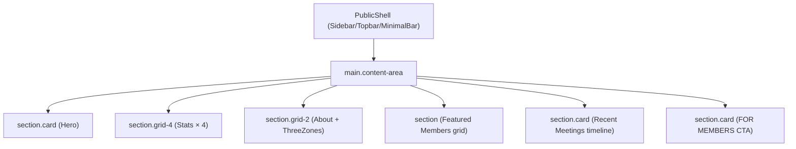
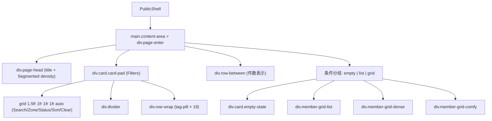
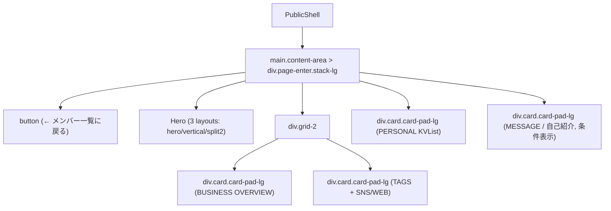

# 09e. 画面ブループリント — 公開層

> **目的**: `docs/00-getting-started-manual/claude-design-prototype/pages-public.jsx`（472行）を、Next.js App Router (`apps/web`) に 100% 再現可能な仕様として転記する。
> **正本対応**:
> - prototype: `docs/00-getting-started-manual/claude-design-prototype/pages-public.jsx`
> - shell: `docs/00-getting-started-manual/claude-design-prototype/app.jsx`
> - fixture: `docs/00-getting-started-manual/claude-design-prototype/data.jsx`
> - design tokens: `docs/00-getting-started-manual/specs/09-ui-ux.md`
> - schema 正本: `docs/00-getting-started-manual/specs/01-api-schema.md`
> **不変条件**:
> - hex/rgb 直書き禁止（全色・余白・shadow は token 名のみ）
> - 日本語コピーは prototype 原文を一字一句保持
> - `apps/web` は D1 へ直接アクセスせず `apps/api` 経由で取得（CLAUDE.md §重要な不変条件 #5）
> - consent キーは `publicConsent` / `rulesConsent` に統一（CLAUDE.md §重要な不変条件 #2）

---

## 0. 対象画面

| Route | 画面 | prototype 出典 | 状態 |
|-------|------|----------------|------|
| `/` | Landing | `pages-public.jsx` L3-L152 | 完全再現 |
| `/(public)/members` | 会員一覧 | `pages-public.jsx` L207-L336 | 完全再現 |
| `/(public)/members/[id]` | 会員詳細（公開） | `pages-public.jsx` L338-L470 | 完全再現 |
| `/(public)/register` | 入会登録（外部 Google Form 誘導） | prototype 未掲載 | 派生ルール |
| `/privacy` | プライバシーポリシー | prototype 未掲載 | 派生ルール |
| `/terms` | 利用規約 | prototype 未掲載 | 派生ルール |

認可方針: 全 6 画面とも **public**（未ログインで全フィールド閲覧可能・ただし `isPublic && !isDeleted` のメンバーのみ表示）。

### 共通 shell（`app.jsx` L97-L115 由来）

```
ToastProvider
└─ AvatarStoreProvider
   └─ div.app
      └─ div.app-grid.nav-{sidebar|topbar|minimal}
         ├─ Sidebar | Topbar | MinimalBar  (route.name !== "login" のとき表示)
         └─ div
            └─ div.content-area
               └─ <Page nav={nav} params={route.params} tweaks={tweaks}/>
```

App Router 配置（推奨）:

```
apps/web/app/
├── (public)/
│   ├── layout.tsx        # PublicShell (sidebar/topbar/minimal を tweaks で切替)
│   ├── page.tsx          # → LandingPage
│   ├── members/
│   │   ├── page.tsx      # → MemberListPage
│   │   └── [id]/page.tsx # → MemberDetailPage
│   ├── register/page.tsx # 派生：Google Form 誘導
│   ├── privacy/page.tsx  # 派生：法務
│   └── terms/page.tsx    # 派生：法務
```

---

## 1. Landing (`/`)

### 1.1 ルート / メタ
- path: `/`
- title: `UBM兵庫支部会 メンバーサイト`
- description: `UBM兵庫支部会メンバーサイトは、Googleフォームから集めた支部会メンバーの自己紹介情報を、公開情報と会員限定情報に分けて整理・公開するサイトです。`
- 認可: public
- prototype `nav("landing")` ↔ App Router `/`

### 1.2 レイアウト構造



ルートラッパは `div.page-enter.stack-lg`。

### 1.3 セクション分解

| # | セクション | 用途 | 主要 primitives | 主要 token | コピー（日本語原文） |
|---|------------|------|-----------------|------------|----------------------|
| 1 | Hero | サイト主旨と一次導線 | `Button`(primary,lg / ghost,lg) | `--accent` (radial gradient), `--font-en` (eyebrow), `--font-serif` (h1) | eyebrow: `UBM HYOGO · CHAPTER SITE` / h1: `兵庫で、事業を育てる人の<br />つながりを可視化する。` / body: `UBM兵庫支部会メンバーサイトは、Googleフォームから集めた支部会メンバーの自己紹介情報を、公開情報と会員限定情報に分けて整理・公開するサイトです。` / btn1: `メンバー一覧を見る` / btn2: `会員ログイン` |
| 2 | Stats | 4 KPI | `.card.stat` × 4, `.badge-sync` | `--text`, `--text-2`, `--accent` | `Members` / `公開中のメンバー` / `Zones` / `0→1 / 1→10 / 10→100` / `Meetings / yr` / `毎月の支部会` / `Last sync` / `数分前` / `Forms 同期中` |
| 3 | About | UBM 概念とゾーン説明 | `Chip`(zoneTone, dot) | `--border`, `--text-2`, zone tones | eyebrow1: `ABOUT` / h2-1: `事業支援コミュニティ「UBM」` / 段落1: `UBM（Unlimited Business Members）は、事業フェーズに応じた3つの区画——0→1（立ち上げ）・1→10（拡大）・10→100（組織化）——に分かれて、メンバー同士が学び合うコミュニティです。` / 段落2: `兵庫支部会は、地域に根ざした事業者が月一で集まる場。本サイトでは、その「どんな人がいるのか」を可視化しています。` / eyebrow2: `THREE ZONES` / h2-2: `UBM区画` / 行: `0→1 / 立ち上げフェーズ / 着想と初期検証`, `1→10 / 拡大フェーズ / 仕組み化と再現性`, `10→100 / 組織化フェーズ / 組織と事業の複線化` |
| 4 | Featured | 公開メンバー先頭 6 件 | `MemberCardPublic`, `Button`(icon=users, iconRight=arrowRight) | `--panel`, `--shadow-card` | eyebrow: `FEATURED MEMBERS` / h2: `参加している事業者たち` / btn: `全員見る` |
| 5 | Meetings | 直近 4 件のミーティング | `.timeline`, `Chip`(accent,dot) | `--text-2`, `--accent-soft` | eyebrow: `RECENT MEETINGS` / h2: `最近の支部会` / chip: `毎月第2木曜開催` / 件数表記: `{n}名参加` |
| 6 | FOR MEMBERS CTA | 回答フォーム誘導 | `Button`(accent,lg,iconRight=external) | `--text` (bg反転), `--panel` (text), `--accent` | eyebrow: `FOR MEMBERS` / h2: `メンバー情報の掲載をお願いします` / body: `最新のGoogleフォームから回答するだけで、このページに自動で反映されます。表記の修正は管理者が編集できます。` / btn: `回答フォームを開く` |

### 1.4 完全 JSX 例（prototype `pages-public.jsx` L3-L152 inline）

```jsx
const LandingPage = ({ nav, tweaks }) => {
  const { MEMBERS, MEETINGS } = window.UBM;
  const visibleMembers = MEMBERS.filter((m) => m.isPublic && !m.isDeleted);
  const featured = visibleMembers.slice(0, 6);

  return (
    <div className="page-enter stack-lg">
      {/* Hero */}
      <section className="card" style={{ padding: "56px 48px", borderRadius: 28, position: "relative", overflow: "hidden" }}>
        <div style={{
          position: "absolute", top: -40, right: -40, width: 320, height: 320,
          background: "radial-gradient(circle, color-mix(in oklch, var(--accent) 14%, transparent), transparent 70%)",
          pointerEvents: "none"
        }} />
        <div style={{ maxWidth: 720, position: "relative" }}>
          <div className="eyebrow" style={{ marginBottom: 14 }}>UBM HYOGO · CHAPTER SITE</div>
          <h1 className="serif" style={{ fontSize: 54, lineHeight: 1.1, letterSpacing: "-0.03em", fontWeight: 600, margin: 0 }}>
            兵庫で、事業を育てる人の<br />つながりを可視化する。
          </h1>
          <p className="body" style={{ fontSize: 16, marginTop: 22, maxWidth: 560 }}>
            UBM兵庫支部会メンバーサイトは、Googleフォームから集めた支部会メンバーの自己紹介情報を、公開情報と会員限定情報に分けて整理・公開するサイトです。
          </p>
          <div className="btn-row" style={{ marginTop: 28 }}>
            <Button variant="primary" size="lg" iconRight="arrowRight" onClick={() => nav("members")}>
              メンバー一覧を見る
            </Button>
            <Button variant="ghost" size="lg" icon="key" onClick={() => nav("login")}>
              会員ログイン
            </Button>
          </div>
        </div>
      </section>

      {/* Stats */}
      <section className="grid-4">
        <div className="card stat">
          <div className="stat-label">Members</div>
          <div className="stat-value">{visibleMembers.length}</div>
          <div className="stat-sub">公開中のメンバー</div>
        </div>
        <div className="card stat">
          <div className="stat-label">Zones</div>
          <div className="stat-value">3</div>
          <div className="stat-sub">0→1 / 1→10 / 10→100</div>
        </div>
        <div className="card stat">
          <div className="stat-label">Meetings / yr</div>
          <div className="stat-value">12</div>
          <div className="stat-sub">毎月の支部会</div>
        </div>
        <div className="card stat">
          <div className="stat-label">Last sync</div>
          <div className="stat-value" style={{ fontSize: 22 }}>数分前</div>
          <div className="stat-sub"><span className="badge-sync"><span className="dot"/>Forms 同期中</span></div>
        </div>
      </section>

      {/* About */}
      <section className="grid-2">
        <div className="card card-pad-lg">
          <div className="eyebrow">ABOUT</div>
          <h2 className="h-section" style={{ marginTop: 10 }}>事業支援コミュニティ「UBM」</h2>
          <p className="body" style={{ marginTop: 10 }}>
            UBM（Unlimited Business Members）は、事業フェーズに応じた3つの区画——<b>0→1</b>（立ち上げ）・<b>1→10</b>（拡大）・<b>10→100</b>（組織化）——に分かれて、メンバー同士が学び合うコミュニティです。
          </p>
          <p className="body" style={{ marginTop: 10 }}>
            兵庫支部会は、地域に根ざした事業者が月一で集まる場。本サイトでは、その「どんな人がいるのか」を可視化しています。
          </p>
        </div>
        <div className="card card-pad-lg">
          <div className="eyebrow">THREE ZONES</div>
          <h2 className="h-section" style={{ marginTop: 10 }}>UBM区画</h2>
          <div className="stack-sm" style={{ marginTop: 14 }}>
            {[
              { z: "0→1", label: "立ち上げフェーズ", desc: "着想と初期検証" },
              { z: "1→10", label: "拡大フェーズ", desc: "仕組み化と再現性" },
              { z: "10→100", label: "組織化フェーズ", desc: "組織と事業の複線化" },
            ].map((z) => (
              <div key={z.z} className="row" style={{ padding: "10px 0", borderTop: "1px solid var(--border)" }}>
                <Chip tone={zoneTone(z.z)} dot>{z.z}</Chip>
                <div style={{ flex: 1 }}>
                  <div style={{ fontSize: 14, fontWeight: 600 }}>{z.label}</div>
                  <div className="small">{z.desc}</div>
                </div>
              </div>
            ))}
          </div>
        </div>
      </section>

      {/* Featured members */}
      <section>
        <div className="row-between" style={{ marginBottom: 16 }}>
          <div>
            <div className="eyebrow">FEATURED MEMBERS</div>
            <h2 className="h-section" style={{ marginTop: 8 }}>参加している事業者たち</h2>
          </div>
          <Button icon="users" onClick={() => nav("members")} iconRight="arrowRight">全員見る</Button>
        </div>
        <div className="member-grid-comfy">
          {featured.map((m) => (
            <MemberCardPublic key={m.id} m={m} density={tweaks.density} onOpen={() => nav("member", { id: m.id })} />
          ))}
        </div>
      </section>

      {/* Meetings */}
      <section className="card card-pad-lg">
        <div className="row-between">
          <div>
            <div className="eyebrow">RECENT MEETINGS</div>
            <h2 className="h-section" style={{ marginTop: 8 }}>最近の支部会</h2>
          </div>
          <Chip tone="accent" dot>毎月第2木曜開催</Chip>
        </div>
        <div className="timeline" style={{ marginTop: 14 }}>
          {MEETINGS.slice(0, 4).map((mt) => (
            <div key={mt.id} className="tl-row">
              <div className="tl-date">
                <div className="tl-y">{mt.date.slice(0, 7)}</div>
                <div>{mt.date.slice(8)}</div>
              </div>
              <div>
                <div style={{ fontWeight: 600, fontSize: 14 }}>{mt.label}</div>
                <div className="small">{mt.note}</div>
              </div>
              <div className="small">{mt.attendees}名参加</div>
            </div>
          ))}
        </div>
      </section>

      <section className="card card-pad-lg" style={{ background: "var(--text)", color: "var(--panel)", borderColor: "var(--text)" }}>
        <div className="row-between" style={{ gap: 32 }}>
          <div style={{ maxWidth: 520 }}>
            <div className="eyebrow" style={{ color: "color-mix(in oklch, white 60%, transparent)" }}>FOR MEMBERS</div>
            <h2 className="h-section" style={{ marginTop: 10, color: "inherit" }}>メンバー情報の掲載をお願いします</h2>
            <p className="body" style={{ marginTop: 10, color: "color-mix(in oklch, white 70%, transparent)" }}>
              最新のGoogleフォームから回答するだけで、このページに自動で反映されます。表記の修正は管理者が編集できます。
            </p>
          </div>
          <Button variant="accent" size="lg" iconRight="external" onClick={() => nav("member-form")}>
            回答フォームを開く
          </Button>
        </div>
      </section>
    </div>
  );
};
```

### 1.5 状態
- **loading**: shell は即時表示。Stats の `Members` / Featured grid / Meetings timeline は `Skeleton`（`.card.stat` と `.mcard-comfy` の同寸 placeholder）。`Last sync` 値は `—` で fallback。
- **error**: Featured grid と Meetings 区画それぞれに `.empty-state` 風カード `データを取得できませんでした`、`再読み込み` Button(ghost)。Hero / About / CTA は静的なので影響しない。
- **empty**: `visibleMembers.length === 0` のとき Featured セクションの grid を `.empty-state` に差し替え `掲載中のメンバーがまだいません`、Meetings 0 件のときは timeline 行を `.empty-state` `直近の支部会記録はまだありません`。
- **data**: 上記 1.4 の通り。`featured` は先頭 6 件、`MEETINGS.slice(0,4)` 固定。

### 1.6 データ contract（API 接続）

| データ | endpoint | 入力 | 出力 schema (zod) | fallback |
|--------|----------|------|-------------------|----------|
| `visibleMembers`, `featured` | `GET /v1/public/members?limit=6&sort=recent` | query: `{ limit?: number; sort?: "recent"\|"name" }` | `z.object({ items: z.array(MemberPublicSchema), total: z.number() })` | `{ items: [], total: 0 }` |
| `MEETINGS` | `GET /v1/public/meetings?limit=4` | query: `{ limit?: number }` | `z.array(MeetingSchema)` | `[]` |
| `lastSyncAt` | `GET /v1/public/system/last-sync` | なし | `z.object({ syncedAt: z.string().datetime().nullable() })` | `{ syncedAt: null }`（表示は `数分前` を `—` に置換） |

`MemberPublicSchema` は `01-api-schema.md` の `visibility: "public"` 列のみで構成（`birthDate` / `challenges` / `ubmJoinDate` は除外）。`isPublic && !isDeleted` は API 側でフィルタ済み。

### 1.7 インタラクション
- `nav("members")` → `/(public)/members` へ Next.js `<Link>` 遷移（`useRouter().push("/members")`）。
- `nav("login")` → `/login`（bare shell）へ。
- `nav("member-form")` → 派生ルール: 外部 Google Form responderUrl `https://docs.google.com/forms/d/e/1FAIpQLSeWfv-R8nblYVqqcCTwcvVsFyVVHFeKYxn96NEm1zNXeydtVQ/viewform` を `target="_blank" rel="noopener noreferrer"` で開く。
- アニメ: ルート要素 `.page-enter` で fade-in + slide-up（200ms / `cubic-bezier(.2,.7,.3,1)`、`09-ui-ux.md` 参照）。Hero の radial gradient は静的（reduced motion でも動作変化なし）。

### 1.8 a11y
- landmark: `<header>` (PublicShell), `<main>` (`.content-area`), `<nav>` (Sidebar/Topbar), `<footer>` （shell 既定）。
- heading 階層: `h1` (Hero) → 各 section `h2.h-section`。`h3` 以降は使用しない。`eyebrow` は `<div role="presentation">`（見出しではない）。
- focus 順序: Hero CTA(2 個) → Stats（非リンク・skip）→ About → 「全員見る」→ Featured cards（カード自体が `<button role="link">`、`Enter` で `nav("member", {id})`）→ Meetings（非リンク）→ FOR MEMBERS CTA。
- `<br />` は装飾改行のみ。SR には `兵庫で、事業を育てる人のつながりを可視化する。` と読み上げさせる。

### 1.9 prototype 出典
- `pages-public.jsx` L3-L152（LandingPage 全体）

---

## 2. Member List (`/(public)/members`)

### 2.1 ルート / メタ
- path: `/members`
- title: `メンバー一覧 | UBM兵庫支部会`
- description: `兵庫支部会に参加する事業者たち。掲載に同意いただいた方のみ公開しています。`
- 認可: public
- prototype `nav("members")` ↔ `/members`

### 2.2 レイアウト構造



### 2.3 セクション分解

| # | セクション | 用途 | primitives | token | コピー |
|---|-----------|------|-----------|-------|--------|
| 1 | page-head | タイトル + density トグル | `Segmented` | `--text`, `--text-2` | eyebrow: `MEMBERS` / h1: `メンバー一覧` / muted: `兵庫支部会に参加する事業者たち。掲載に同意いただいた方のみ公開しています。` / Segmented: `ゆったり` / `密` / `リスト` |
| 2 | Filters | 検索・絞り込み | `Field`, `Search`, `Select`, `Button`(ghost,icon=undo) | `--border`, `--surface`, `--text-2` | label: `キーワード検索` / placeholder: `名前・職業・事業内容...` / label: `UBM区画` (option: `すべて`, `0→1 立ち上げ`, `1→10 拡大`, `10→100 組織化`) / label: `参加ステータス` (option: `すべて`, `会員`, `非会員`, `アカデミー生`) / label: `並び替え` (option: `最近の更新順`, `名前順`) / btn: `クリア` / `タグで絞り込み` |
| 3 | 件数表示 | 結果件数 | — | `--text-2` | `{n} 件 / 全 {N} 件`（フィルタ有のとき後半表示） |
| 4 | カード grid | 一覧本体 | `MemberCardPublic` × 3 density | `--panel`, `--shadow-card` | empty: `条件に合うメンバーが見つかりません` / `絞り込みをクリア` |

### 2.4 完全 JSX 例（pages-public.jsx L155-L336 inline）

```jsx
// MemberCardPublic
const MemberCardPublic = ({ m, density = "comfy", onOpen }) => {
  if (density === "list") {
    return (
      <div className="mrow" onClick={onOpen}>
        <Avatar name={m.fullName} hue={m.hue} id={m.id}/>
        <div>
          <div style={{ fontWeight: 600, fontSize: 14 }}>{m.fullName}</div>
          <div className="small">{m.occupation}</div>
        </div>
        <div className="chip-row">
          <Chip tone={zoneTone(m.ubmZone)} dot>{m.ubmZone}</Chip>
          <Chip tone={statusTone(m.ubmMembershipType)}>{m.ubmMembershipType}</Chip>
        </div>
        <div className="small">
          <Icon name="mapPin" size={11} style={{ verticalAlign: -1 }}/> {m.location}
        </div>
        <Icon name="chevronRight" size={16} style={{ color: "var(--text-3)" }}/>
      </div>
    );
  }
  const cls = "mcard " + (density === "dense" ? "mcard-dense" : "mcard-comfy");
  return (
    <div className={cls} onClick={onOpen}>
      <div className="row" style={{ gap: 14, alignItems: "flex-start" }}>
        <Avatar name={m.fullName} size={density === "dense" ? "md" : "lg"} hue={m.hue} id={m.id}/>
        <div style={{ flex: 1, minWidth: 0 }}>
          <div className="row-between" style={{ gap: 8, alignItems: "flex-start" }}>
            <div style={{ minWidth: 0 }}>
              <div className="h-card">{m.fullName}</div>
              {m.nickname && <div className="small" style={{ marginTop: 1 }}>{m.nickname}</div>}
            </div>
            <Chip tone={zoneTone(m.ubmZone)} dot>{m.ubmZone}</Chip>
          </div>
          <div className="small" style={{ marginTop: density === "dense" ? 6 : 10, display: "flex", flexDirection: "column", gap: 3 }}>
            <span><Icon name="briefcase" size={11} style={{ verticalAlign: -1, marginRight: 6 }}/>{m.occupation}</span>
            <span><Icon name="mapPin" size={11} style={{ verticalAlign: -1, marginRight: 6 }}/>{m.location}</span>
          </div>
        </div>
      </div>
      {density !== "dense" && m.businessOverview && (
        <p className="small" style={{ color: "var(--text-2)", lineHeight: 1.7, display: "-webkit-box", WebkitBoxOrient: "vertical", WebkitLineClamp: 2, overflow: "hidden" }}>
          {m.businessOverview}
        </p>
      )}
      <div className="chip-row">
        <Chip tone={statusTone(m.ubmMembershipType)}>{m.ubmMembershipType}</Chip>
        {(m.tags || []).slice(0, density === "dense" ? 2 : 3).map((t) => <Chip key={t}>{t}</Chip>)}
      </div>
    </div>
  );
};

// MemberListPage
const MemberListPage = ({ nav, tweaks }) => {
  const { MEMBERS, TAG_CATALOG, ALL_TAGS } = window.UBM;
  const [q, setQ] = useState("");
  const [zoneF, setZoneF] = useState("all");
  const [statusF, setStatusF] = useState("all");
  const [tagF, setTagF] = useState([]);
  const [sort, setSort] = useState("recent");
  const [density, setDensity] = useState(tweaks.density);

  useEffect(() => setDensity(tweaks.density), [tweaks.density]);

  const filtered = useMemo(() => {
    return MEMBERS.filter((m) => m.isPublic && !m.isDeleted)
      .filter((m) => {
        if (q) {
          const hay = [m.fullName, m.nickname, m.occupation, m.location, m.businessOverview, ...(m.tags||[])].join(" ").toLowerCase();
          if (!hay.includes(q.toLowerCase())) return false;
        }
        if (zoneF !== "all" && m.ubmZone !== zoneF) return false;
        if (statusF !== "all" && m.ubmMembershipType !== statusF) return false;
        if (tagF.length && !tagF.every((t) => (m.tags || []).includes(t))) return false;
        return true;
      })
      .sort((a, b) => {
        if (sort === "name") return a.fullName.localeCompare(b.fullName, "ja");
        if (sort === "recent") return b.updatedAt.localeCompare(a.updatedAt);
        return 0;
      });
  }, [q, zoneF, statusF, tagF, sort]);

  const toggleTag = (t) => setTagF((x) => x.includes(t) ? x.filter((y) => y !== t) : [...x, t]);
  const clear = () => { setQ(""); setZoneF("all"); setStatusF("all"); setTagF([]); };
  const hasFilters = Boolean(q || zoneF !== "all" || statusF !== "all" || tagF.length > 0);

  return (
    <div className="page-enter">
      <div className="page-head">
        <div>
          <div className="eyebrow">MEMBERS</div>
          <h1 className="h-page">メンバー一覧</h1>
          <p className="muted">兵庫支部会に参加する事業者たち。掲載に同意いただいた方のみ公開しています。</p>
        </div>
        <Segmented
          value={density}
          onChange={setDensity}
          options={[{ value: "comfy", label: "ゆったり" }, { value: "dense", label: "密" }, { value: "list", label: "リスト" }]}
        />
      </div>

      {/* Filters */}
      <div className="card card-pad" style={{ marginBottom: 20 }}>
        <div style={{ display: "grid", gridTemplateColumns: "1.5fr 1fr 1fr 1fr auto", gap: 12, alignItems: "end" }}>
          <Field label={<><Icon name="search" size={12}/> キーワード検索</>}>
            <Search value={q} onChange={setQ} placeholder="名前・職業・事業内容..." />
          </Field>
          <Field label="UBM区画">
            <Select value={zoneF} onChange={(e) => setZoneF(e.target.value)}>
              <option value="all">すべて</option>
              <option value="0→1">0→1 立ち上げ</option>
              <option value="1→10">1→10 拡大</option>
              <option value="10→100">10→100 組織化</option>
            </Select>
          </Field>
          <Field label="参加ステータス">
            <Select value={statusF} onChange={(e) => setStatusF(e.target.value)}>
              <option value="all">すべて</option>
              <option>会員</option>
              <option>非会員</option>
              <option>アカデミー生</option>
            </Select>
          </Field>
          <Field label="並び替え">
            <Select value={sort} onChange={(e) => setSort(e.target.value)}>
              <option value="recent">最近の更新順</option>
              <option value="name">名前順</option>
            </Select>
          </Field>
          <Button variant="ghost" icon="undo" onClick={clear} disabled={!hasFilters}>クリア</Button>
        </div>
        <div className="divider" style={{ margin: "16px 0" }} />
        <div className="stack-sm">
          <div className="small" style={{ fontWeight: 500, color: "var(--text-2)" }}>
            <Icon name="tag" size={12} style={{ verticalAlign: -1 }}/> タグで絞り込み
          </div>
          <div className="row-wrap">
            {ALL_TAGS.slice(0, 18).map((t) => (
              <button key={t} className={"tag-pill" + (tagF.includes(t) ? " selected" : "")} onClick={() => toggleTag(t)}>
                {tagF.includes(t) && <Icon name="check" size={11} />} {t}
              </button>
            ))}
          </div>
        </div>
      </div>

      <div className="row-between" style={{ marginBottom: 14 }}>
        <div className="small">
          <b style={{ color: "var(--text)", fontSize: 14 }}>{filtered.length}</b> 件 {hasFilters && <>/ 全 {MEMBERS.filter((m)=>m.isPublic&&!m.isDeleted).length} 件</>}
        </div>
      </div>

      {filtered.length === 0 ? (
        <div className="card empty-state">
          <Icon name="search" size={28} style={{ color: "var(--text-3)" }} />
          <div style={{ marginTop: 10, fontSize: 14, color: "var(--text-2)" }}>条件に合うメンバーが見つかりません</div>
          <Button variant="ghost" size="sm" onClick={clear} style={{ marginTop: 12 }}>絞り込みをクリア</Button>
        </div>
      ) : density === "list" ? (
        <div className="member-grid-list">
          <div className="mrow mrow-h">
            <div />
            <div>氏名 / 職業</div>
            <div>区画 / ステータス</div>
            <div>所在地</div>
            <div />
          </div>
          {filtered.map((m) => (
            <MemberCardPublic key={m.id} m={m} density="list" onOpen={() => nav("member", { id: m.id })} />
          ))}
        </div>
      ) : (
        <div className={density === "dense" ? "member-grid-dense" : "member-grid-comfy"}>
          {filtered.map((m) => (
            <MemberCardPublic key={m.id} m={m} density={density} onOpen={() => nav("member", { id: m.id })} />
          ))}
        </div>
      )}
    </div>
  );
};
```

### 2.5 状態
- **loading**: page-head と Filters は即時表示。grid は density に応じた `Skeleton` カード 12 枚（comfy/dense）または 12 行（list）。
- **error**: grid 領域を `.card.empty-state` で `データを取得できませんでした` + `再読み込み` Button(ghost) に置換。Filters は操作可能のまま。
- **empty (no filter)**: API が `total: 0` を返した場合は `掲載に同意いただいたメンバーがまだいません`。
- **empty (with filter)**: prototype L308-L313 のとおり `条件に合うメンバーが見つかりません` + `絞り込みをクリア` Button(ghost,sm)。
- **data**: `filtered.length` を件数表示、`hasFilters` のとき `/ 全 N 件` を併記。

### 2.6 データ contract（API 接続）

| データ | endpoint | 入力 query | 出力 schema | fallback |
|--------|----------|-----------|-------------|----------|
| 一覧 | `GET /v1/public/members` | `{ q?: string; zone?: "0→1"\|"1→10"\|"10→100"; status?: "会員"\|"非会員"\|"アカデミー生"; tags?: string[]; sort?: "recent"\|"name"; page?: number; perPage?: number }` | `z.object({ items: z.array(MemberPublicSchema), total: z.number(), page: z.number(), perPage: z.number() })` | `{ items: [], total: 0, page: 1, perPage: 20 }` |
| タグ候補 | `GET /v1/public/tags` | なし | `z.object({ catalog: z.array(z.object({ category: z.string(), tags: z.array(z.string()) })), all: z.array(z.string()) })` | `{ catalog: [], all: [] }` |

URL query に状態を映す（Next.js `useSearchParams` / `router.replace`）:

| 状態 | query key | 値例 |
|------|-----------|------|
| `q` | `q` | `生成AI` |
| `zoneF` | `zone` | `1→10`（`all` のとき省略） |
| `statusF` | `status` | `会員`（`all` のとき省略） |
| `tagF` | `tags` | `AI・データ,DX推進`（カンマ区切り） |
| `sort` | `sort` | `recent` / `name` |
| `density` | `density` | `comfy` / `dense` / `list`（既定 `tweaks.density`） |
| ページ | `page` | `1`〜（既定 1） |

### 2.7 インタラクション
- フィルタ更新は **client-side フィルタ + server-side fetch ハイブリッド**: 初期描画時に query から復元 → API 再取得 → state 更新 → URL `router.replace` で sync。
- ページネーション（派生）: 1 ページ 20 件、ページャは grid 直下に `[< 前へ] 1/N [次へ >]`（`Button` ghost）を配置。`page` query 駆動。
- 並び替え: `recent` は `updatedAt desc`、`name` は `fullName.localeCompare(_, "ja")` 昇順。
- density 切替: Segmented で即時切替 + `density` query を更新。
- card 押下: `nav("member", { id })` → `/members/${id}` へ遷移（`<Link>` ベースで右クリック新規タブも可能にする）。
- アニメ: ルート `.page-enter`、card hover で `transform: translateY(-2px)` + `--shadow-hover`（`09-ui-ux.md`）。

### 2.8 a11y
- landmark: shell の `<main>` 配下、Filters は `<form role="search" aria-label="メンバー絞り込み">`。
- heading: `h1.h-page` 1 個のみ。
- focus 順序: Search → Zone → Status → Sort → Clear → tag-pill 群（Tab/Enter で toggle）→ density Segmented → cards（`role="link"` + `tabindex=0` + `Enter`/`Space` で `onOpen`）。
- empty 状態の `絞り込みをクリア` は Filters の `Clear` と同一動作（aria-controls で結合）。
- list density のヘッダ行 `.mrow.mrow-h` は `role="row"`、各列は `role="columnheader"`。

### 2.9 prototype 出典
- `pages-public.jsx` L155-L205（MemberCardPublic）
- `pages-public.jsx` L207-L336（MemberListPage）

---

## 3. Member Detail (`/(public)/members/[id]`)

### 3.1 ルート / メタ
- path: `/members/[id]`
- title: `{m.fullName} | UBM兵庫支部会`
- description: `{m.businessOverview}` の先頭 120 文字（無ければ `UBM兵庫支部会のメンバー紹介ページ`）
- 認可: public（ただし `m.isPublic && !m.isDeleted` でないと 404）
- prototype `nav("member", { id })` ↔ `/members/${id}`

### 3.2 レイアウト構造



### 3.3 セクション分解

| # | セクション | 用途 | primitives | token | コピー |
|---|-----------|------|-----------|-------|--------|
| 0 | back | 一覧へ戻る | `Icon`(arrowLeft) | `--text-3` | `メンバー一覧に戻る` |
| 1a | Hero (`layout="hero"` 既定) | 横並びプロフィール | `Avatar`(xl), `Chip` × 4 | `--accent`, zone/status tone, `--text-3` | eyebrow: `MEMBER PROFILE` / `出身 {hometown}` |
| 1b | Hero (`vertical`) | 中央寄せ | `Avatar`(xl), `Chip` × 3 | 同上 | （同上、構造のみ変更） |
| 1c | Hero (`split2`) | 2 カラム + Provide サマリ | `Avatar`(xl), Chip, `.card-flat` | `--surface` (card-flat), `--text-2` | eyebrow: `MEMBER PROFILE` / 右カラム eyebrow: `PROVIDE` / icon `mapPin` + 住所 / icon `sparkle` + `出身地` |
| 2 | BUSINESS OVERVIEW | 事業説明 | — | `--text` | eyebrow: `BUSINESS OVERVIEW` / h2: `ビジネス概要` / 補助見出し: `得意分野・スキル`, `提供できること` |
| 3 | TAGS + SNS/WEB | タグとリンク | `Chip`(accent), `LinkPills` | `--accent-soft` | eyebrow: `TAGS` / h2: `タグ` / `タグ未設定` (空時) / eyebrow: `SNS / WEB` / h2: `リンク` |
| 4 | PERSONAL | KVList 4 行 | `KVList` | `--text-2` | eyebrow: `PERSONAL` / h2: `パーソナル` / 行ラベル: `趣味・好きなこと`, `最近ハマっていること`, `座右の銘`, `仕事以外の活動` |
| 5 | MESSAGE | 自己紹介引用 | — | `--accent-soft` (bg), `--accent-ink` (text), `--font-serif` | eyebrow: `MESSAGE` / 本文: `「{m.selfIntroduction}」` |

### 3.4 完全 JSX 例（pages-public.jsx L338-L470 inline）

```jsx
const MemberDetailPage = ({ nav, params, tweaks }) => {
  const { MEMBERS } = window.UBM;
  const m = MEMBERS.find((x) => x.id === params?.id) || MEMBERS[0];
  const layout = tweaks.detailLayout;

  const Hero = () => {
    if (layout === "vertical") {
      return (
        <div className="card hero-center">
          <Avatar name={m.fullName} size="xl" hue={m.hue} id={m.id}/>
          <div style={{ fontSize: 11, letterSpacing: "0.14em", color: "var(--text-3)", textTransform: "uppercase", fontFamily: "var(--font-en)" }}>{m.nickname || "　"}</div>
          <h1 className="h-page" style={{ fontSize: 32, marginTop: 6 }}>{m.fullName}</h1>
          <div style={{ marginTop: 8, color: "var(--text-2)", fontSize: 15 }}>{m.occupation}</div>
          <div className="chip-row" style={{ marginTop: 16 }}>
            <Chip tone={zoneTone(m.ubmZone)} dot>{m.ubmZone}</Chip>
            <Chip tone={statusTone(m.ubmMembershipType)}>{m.ubmMembershipType}</Chip>
            <Chip><Icon name="mapPin" size={11}/>{m.location}</Chip>
          </div>
        </div>
      );
    }
    if (layout === "split2") {
      return (
        <div className="card card-pad-lg hero-2col">
          <div>
            <div className="eyebrow">MEMBER PROFILE</div>
            <div className="row" style={{ gap: 18, marginTop: 14, alignItems: "flex-start" }}>
              <Avatar name={m.fullName} size="xl" hue={m.hue} id={m.id}/>
              <div>
                <h1 className="h-page" style={{ fontSize: 32 }}>{m.fullName}</h1>
                {m.nickname && <div style={{ color: "var(--text-3)", fontSize: 13, marginTop: 4 }}>{m.nickname}</div>}
                <div style={{ marginTop: 10, color: "var(--text-2)", fontSize: 15 }}>{m.occupation}</div>
                <div className="chip-row" style={{ marginTop: 14 }}>
                  <Chip tone={zoneTone(m.ubmZone)} dot>{m.ubmZone}</Chip>
                  <Chip tone={statusTone(m.ubmMembershipType)}>{m.ubmMembershipType}</Chip>
                </div>
              </div>
            </div>
          </div>
          <div className="card-flat" style={{ padding: 18 }}>
            <div className="eyebrow">PROVIDE</div>
            <p className="body" style={{ marginTop: 8, color: "var(--text)" }}>
              {m.canProvide || "—"}
            </p>
            <div className="divider" style={{ margin: "14px 0" }}/>
            <div className="small">
              <Icon name="mapPin" size={12} style={{ verticalAlign: -2 }}/> {m.location}<br/>
              <Icon name="sparkle" size={12} style={{ verticalAlign: -2 }}/> {m.hometown || "—"}
            </div>
          </div>
        </div>
      );
    }
    return (
      <div className="card card-pad-lg hero-split">
        <Avatar name={m.fullName} size="xl" hue={m.hue} id={m.id}/>
        <div>
          <div className="eyebrow">MEMBER PROFILE</div>
          <h1 className="h-page" style={{ marginTop: 8, fontSize: 34 }}>{m.fullName}</h1>
          {m.nickname && <div style={{ color: "var(--text-3)", fontSize: 13, marginTop: 4 }}>{m.nickname}</div>}
          <div className="body" style={{ marginTop: 12, fontSize: 15 }}>{m.occupation}</div>
          <div className="chip-row" style={{ marginTop: 16 }}>
            <Chip tone={zoneTone(m.ubmZone)} dot>{m.ubmZone}</Chip>
            <Chip tone={statusTone(m.ubmMembershipType)}>{m.ubmMembershipType}</Chip>
            <Chip><Icon name="mapPin" size={11}/>{m.location}</Chip>
            {m.hometown && <Chip outline>出身 {m.hometown}</Chip>}
          </div>
        </div>
      </div>
    );
  };

  return (
    <div className="page-enter stack-lg">
      <button className="row" style={{ color: "var(--text-3)", fontSize: 12.5, gap: 6 }} onClick={() => nav("members")}>
        <Icon name="arrowLeft" size={13}/> メンバー一覧に戻る
      </button>

      <Hero />

      <div className="grid-2">
        <div className="card card-pad-lg">
          <div className="eyebrow">BUSINESS OVERVIEW</div>
          <h2 className="h-section" style={{ marginTop: 8 }}>ビジネス概要</h2>
          <p className="body" style={{ marginTop: 10 }}>{m.businessOverview || "—"}</p>
          {m.skills && <><div className="divider" style={{ margin: "16px 0" }}/>
            <div className="small" style={{ color: "var(--text-2)", fontWeight: 500, marginBottom: 6 }}>得意分野・スキル</div>
            <div className="body">{m.skills}</div></>}
          {m.canProvide && <><div className="divider" style={{ margin: "16px 0" }}/>
            <div className="small" style={{ color: "var(--text-2)", fontWeight: 500, marginBottom: 6 }}>提供できること</div>
            <div className="body">{m.canProvide}</div></>}
        </div>
        <div className="card card-pad-lg">
          <div className="eyebrow">TAGS</div>
          <h2 className="h-section" style={{ marginTop: 8 }}>タグ</h2>
          <div className="chip-row" style={{ marginTop: 12 }}>
            {(m.tags || []).map((t) => <Chip key={t} tone="accent">{t}</Chip>)}
            {!(m.tags && m.tags.length) && <span className="small">タグ未設定</span>}
          </div>
          <div className="divider" style={{ margin: "20px 0" }}/>
          <div className="eyebrow">SNS / WEB</div>
          <h2 className="h-section" style={{ marginTop: 8 }}>リンク</h2>
          <div style={{ marginTop: 12 }}>
            <LinkPills member={m} />
          </div>
        </div>
      </div>

      <div className="card card-pad-lg">
        <div className="eyebrow">PERSONAL</div>
        <h2 className="h-section" style={{ marginTop: 8 }}>パーソナル</h2>
        <div style={{ marginTop: 16 }}>
          <KVList rows={[
            { k: "趣味・好きなこと", v: m.hobbies },
            { k: "最近ハマっていること", v: m.recentInterest },
            { k: "座右の銘", v: m.motto },
            { k: "仕事以外の活動", v: m.otherActivities },
          ]}/>
        </div>
      </div>

      {m.selfIntroduction && (
        <div className="card card-pad-lg" style={{ background: "var(--accent-soft)", borderColor: "color-mix(in oklch, var(--accent) 20%, transparent)" }}>
          <div className="eyebrow" style={{ color: "var(--accent-ink)" }}>MESSAGE</div>
          <p className="serif" style={{ fontSize: 20, lineHeight: 1.7, marginTop: 10, color: "var(--accent-ink)", fontWeight: 500, textWrap: "pretty" }}>
            「{m.selfIntroduction}」
          </p>
        </div>
      )}
    </div>
  );
};
```

### 3.5 状態
- **loading**: back ボタン即時、Hero / grid-2 / personal / message を Skeleton カードで埋める。Hero は layout に応じた 3 形状の同寸 placeholder。
- **error**: shell + back のみ表示、`<main>` に `.card.empty-state` で `メンバー情報を取得できませんでした` + `再読み込み` Button(ghost)。
- **empty (空フィールド)**: 各フィールドは prototype 仕様のとおり：
  - `businessOverview` 空 → `—`
  - `tags` 空 → `タグ未設定`
  - `nickname` 空 → vertical layout のみ全角空白で行送り維持（L349 の `m.nickname || "　"`）、他 layout は行非表示
  - `selfIntroduction` 空 → MESSAGE セクション自体を非表示（L460 条件分岐）
  - `skills` / `canProvide` / `hometown` 空 → 当該 divider+ブロックを非表示
- **404 (m.isPublic=false / isDeleted=true / id 未存在)**: Next.js `notFound()` → `app/not-found.tsx` に委譲 `指定のメンバーは公開されていません`（派生コピー）。

### 3.6 データ contract（API 接続）

| データ | endpoint | 入力 | 出力 schema | fallback |
|--------|----------|------|-------------|----------|
| 詳細 | `GET /v1/public/members/{id}` | path: `{ id: string }` | `MemberPublicDetailSchema = MemberPublicSchema.extend({ links: z.object({ website?: z.string().url(), x?: ..., instagram?: ..., facebook?: ..., linkedin?: ..., note?: ..., youtube?: ..., threads?: ..., tiktok?: ... }) })` | 404 → `notFound()` |

`MemberPublicDetailSchema` は `01-api-schema.md` の `visibility: "public"` 列フル + `id`/`updatedAt`/`hue`。`birthDate`/`challenges`/`ubmJoinDate`/`email`/`responseId`/`submittedAt`/`publicConsent`/`rulesConsent` は出力に含めない。

### 3.7 インタラクション
- back: `router.back()` か `router.push("/members")`（直接 URL 流入対策のため `push` 推奨）。
- Hero layout 切替: `tweaks.detailLayout` (`hero` / `vertical` / `split2`)。プロト同等の Tweaks panel 経由のみで、URL 反映は行わない。
- `LinkPills` 押下: 対応 SNS URL を `target="_blank" rel="noopener noreferrer"` で開く。空フィールドの pill は非表示。
- アニメ: `.page-enter`、Hero の Avatar はマウントから 80ms 遅延の fade-in（`09-ui-ux.md`）。

### 3.8 a11y
- landmark: shell の `<main>` 配下。back ボタンは `<button aria-label="メンバー一覧に戻る">`。
- heading: Hero `h1.h-page`、各 card `h2.h-section`。MESSAGE の引用本文は `<blockquote>` 推奨（実装時に `<p>` から昇格）。
- focus 順序: back → Hero 内 Chip リンク（無し）→ TAGS の Chip → LinkPills（外部リンク順）→ PERSONAL（非インタラクティブ）→ MESSAGE（非インタラクティブ）。
- nickname の全角空白プレースホルダ（L349）はスクリーンリーダ向け `aria-hidden="true"` 推奨（読み上げない）。

### 3.9 prototype 出典
- `pages-public.jsx` L338-L470（MemberDetailPage 全体）

---

## 4. Register (`/(public)/register`) — 派生ルール

### 4.1 ルート / メタ
- path: `/register`
- title: `入会・回答フォームのご案内 | UBM兵庫支部会`
- description: `UBM兵庫支部会への参加とプロフィール掲載は、Google フォームへの回答で完了します。`
- 認可: public
- 由来: prototype 未掲載（CLAUDE.md §フォーム固定値 / Landing CTA `回答フォームを開く`）

### 4.2 レイアウト構造

```
PublicShell
└─ main.content-area > div.page-enter.stack-lg (max-width 720, 単段組)
   ├─ header (eyebrow + h1.h-page + muted)
   ├─ section.card.card-pad-lg (FORM OVERVIEW: section/質問数/所要時間)
   ├─ section.card.card-pad-lg (RULES: 利用規約・プライバシーへの内部リンク)
   ├─ section.card.card-pad-lg (CTA: 外部 Google Form Button)
   └─ section.card.card-pad-lg (FAQ アコーディオン: 派生)
```

typography: 段落本文は token `--ubm-text-prose-body`（`09-ui-ux.md` 派生 token）、見出しは `--ubm-text-prose-h1` / `--ubm-text-prose-h2`。

### 4.3 セクション分解

| # | セクション | コピー（派生・確定原文） |
|---|-----------|--------------------------|
| 1 | header | eyebrow: `REGISTER` / h1: `入会・回答フォームのご案内` / muted: `UBM兵庫支部会への参加とプロフィール掲載は、Google フォームへの回答で完了します。` |
| 2 | FORM OVERVIEW | eyebrow: `FORM OVERVIEW` / h2: `フォーム構成` / KV: `セクション数: 6 / 質問数: 31 / 所要時間: 約10分` |
| 3 | RULES | eyebrow: `RULES` / h2: `回答前のお願い` / 本文: `回答前に「利用規約」「プライバシーポリシー」をご確認ください。フォーム内で公開可否（HP掲載同意）と勧誘ルールへの同意を選択いただきます。` / 内部リンク: `利用規約` (`/terms`), `プライバシーポリシー` (`/privacy`) |
| 4 | CTA | Button(variant=accent, size=lg, iconRight=external): `回答フォームを開く` → `https://docs.google.com/forms/d/e/1FAIpQLSeWfv-R8nblYVqqcCTwcvVsFyVVHFeKYxn96NEm1zNXeydtVQ/viewform` を `target="_blank" rel="noopener noreferrer"` で開く |
| 5 | FAQ（派生） | eyebrow: `FAQ` / h2: `よくあるご質問` / Q: `回答後、いつ公開されますか？` / A: `回答内容は管理者が確認のうえ、通常24時間以内にメンバー一覧へ反映されます。` / Q: `内容を修正したいときは？` / A: `同じフォームから再度回答していただければ、最新の内容に上書き反映されます。` |

### 4.4 完全 JSX 例（派生・サンプル）

```jsx
const RegisterPage = () => (
  <div className="page-enter stack-lg" style={{ maxWidth: 720 }}>
    <div>
      <div className="eyebrow">REGISTER</div>
      <h1 className="h-page">入会・回答フォームのご案内</h1>
      <p className="muted">UBM兵庫支部会への参加とプロフィール掲載は、Google フォームへの回答で完了します。</p>
    </div>

    <section className="card card-pad-lg">
      <div className="eyebrow">FORM OVERVIEW</div>
      <h2 className="h-section" style={{ marginTop: 8 }}>フォーム構成</h2>
      <KVList rows={[
        { k: "セクション数", v: "6" },
        { k: "質問数", v: "31" },
        { k: "所要時間", v: "約10分" },
      ]}/>
    </section>

    <section className="card card-pad-lg">
      <div className="eyebrow">RULES</div>
      <h2 className="h-section" style={{ marginTop: 8 }}>回答前のお願い</h2>
      <p className="body" style={{ marginTop: 10 }}>
        回答前に<a href="/terms">利用規約</a>と<a href="/privacy">プライバシーポリシー</a>をご確認ください。フォーム内で公開可否（HP掲載同意）と勧誘ルールへの同意を選択いただきます。
      </p>
    </section>

    <section className="card card-pad-lg">
      <Button
        variant="accent" size="lg" iconRight="external"
        onClick={() => window.open(
          "https://docs.google.com/forms/d/e/1FAIpQLSeWfv-R8nblYVqqcCTwcvVsFyVVHFeKYxn96NEm1zNXeydtVQ/viewform",
          "_blank", "noopener,noreferrer"
        )}
      >
        回答フォームを開く
      </Button>
    </section>

    <section className="card card-pad-lg">
      <div className="eyebrow">FAQ</div>
      <h2 className="h-section" style={{ marginTop: 8 }}>よくあるご質問</h2>
      <KVList rows={[
        { k: "回答後、いつ公開されますか？", v: "回答内容は管理者が確認のうえ、通常24時間以内にメンバー一覧へ反映されます。" },
        { k: "内容を修正したいときは？",     v: "同じフォームから再度回答していただければ、最新の内容に上書き反映されます。" },
      ]}/>
    </section>
  </div>
);
```

### 4.5 状態
- loading/error/empty なし（純静的）。CTA 外部遷移時のポップアップブロックは想定せず、外部タブが開けない場合のみ `Toast` で `フォームを開けませんでした。URL を直接開いてください。` を表示。

### 4.6 データ contract
- API 接続なし。`formId` / `responderUrl` / `sectionCount` / `questionCount` は CLAUDE.md §フォーム固定値を直接転記。

### 4.7 インタラクション
- CTA: 外部タブ。`onClick` 内で `window.open(..., "_blank", "noopener,noreferrer")`。
- 内部リンク: `/terms`, `/privacy` は `<Link>` で内部遷移。

### 4.8 a11y
- landmark: shell の `<main>`、CTA は `<a role="button">` でなく `<button>` + `aria-label="Google フォームを新しいタブで開く"`。
- heading: `h1` 1 個 + `h2` 4 個。

### 4.9 prototype 出典
- なし（派生）。固定値の出典: `CLAUDE.md` §フォーム固定値 / `Landing` の `回答フォームを開く` CTA (`pages-public.jsx` L145-L147)。

---

## 5. Privacy (`/privacy`) / Terms (`/terms`) — 派生ルール

### 5.1 ルート / メタ
| ルート | path | title | description |
|--------|------|-------|-------------|
| Privacy | `/privacy` | `プライバシーポリシー \| UBM兵庫支部会` | `UBM兵庫支部会メンバーサイトにおける個人情報の取り扱いについて記載しています。` |
| Terms   | `/terms`   | `利用規約 \| UBM兵庫支部会`           | `UBM兵庫支部会メンバーサイトのご利用にあたっての規約を記載しています。` |

認可: public。

### 5.2 レイアウト構造（共通）

```
PublicShell
└─ main.content-area > article.page-enter.stack-lg (max-width 720, 単段組)
   ├─ header (eyebrow + h1.h-page + muted: 最終更新日)
   ├─ <nav aria-label="目次"> ToC（h2 の id を anchor）
   └─ section[] × N (各条文ごとに h2.h-section + 段落)
```

typography token は派生規定:
- 本文段落: `var(--ubm-text-prose-body)` (16px / line-height 1.85 / `--text`)
- 段落間: `--ubm-text-prose-spacing` (上下 12px)
- h2: `var(--ubm-text-prose-h2)`（`h-section` と同等）
- h3: `var(--ubm-text-prose-h3)`（14px / 600 / `--text`）
- リスト: `var(--ubm-text-prose-list)`（`--text-2` ・ left-padding 1.2em）

`color-mix` / `var(--*)` 以外の色は使用しない。

### 5.3 セクション分解

#### Privacy（派生・最低限の構成）
1. `はじめに` / 2. `収集する情報`（フォーム回答・Cookie）/ 3. `利用目的` / 4. `第三者提供`（しない原則）/ 5. `保管と削除` / 6. `本人開示請求` / 7. `お問い合わせ`

#### Terms（派生・最低限の構成）
1. `総則` / 2. `会員資格と参加手続き` / 3. `禁止事項`（勧誘ルール含む）/ 4. `公開情報の取り扱い` / 5. `免責事項` / 6. `規約の変更` / 7. `準拠法・管轄`

具体本文は本ブループリントの責務外（運営側が起票）。本ファイルは「レイアウト・token・heading 構造」のみ規定する。

### 5.4 完全 JSX 例（派生・スケルトン）

```jsx
const LegalPage = ({ kind }) => {
  const meta = kind === "privacy"
    ? { eyebrow: "PRIVACY POLICY", h1: "プライバシーポリシー" }
    : { eyebrow: "TERMS OF SERVICE", h1: "利用規約" };

  return (
    <article className="page-enter stack-lg" style={{ maxWidth: 720 }}>
      <header>
        <div className="eyebrow">{meta.eyebrow}</div>
        <h1 className="h-page">{meta.h1}</h1>
        <p className="muted">最終更新日: 2026-04-01</p>
      </header>

      <nav aria-label="目次" className="card card-pad">
        <ol className="stack-sm small">{/* h2 アンカーリスト */}</ol>
      </nav>

      <section>
        <h2 className="h-section" id="section-1">{/* 章タイトル */}</h2>
        <p className="body" style={{ font: "var(--ubm-text-prose-body)" }}>
          {/* 本文（運営側で起票） */}
        </p>
      </section>
      {/* … 章を繰り返し */}
    </article>
  );
};
```

### 5.5 状態
- 純静的。loading/error/empty なし。

### 5.6 データ contract
- API 接続なし。本文は MDX/Markdown ソースから読み込み（`apps/web/content/legal/{privacy,terms}.mdx` 派生案）。

### 5.7 インタラクション
- ToC からのスムーズスクロール（`scroll-behavior: smooth` / `scroll-margin-top: 80px`）。
- prefers-reduced-motion 時は jump scroll。

### 5.8 a11y
- landmark: `<main>` 配下に `<article>`、目次は `<nav aria-label="目次">`。
- heading: `h1` 1 + `h2` × 章数。`h3` は条文の節分けでのみ使用。
- skip link: 「本文へスキップ」を shell から提供（`09-ui-ux.md` 派生規定）。

### 5.9 prototype 出典
- なし（派生）。準拠: `09-ui-ux.md` typography token、`CLAUDE.md` §重要な不変条件 #2 (`publicConsent` / `rulesConsent`)、`google-form/` 利用規約。

---

## 付録 A. token クロスリファレンス

本ブループリントで参照する CSS カスタムプロパティ（`09-ui-ux.md` を正本とする）:

| token | 用途 |
|-------|------|
| `--text` / `--text-2` / `--text-3` | 本文 / 補助 / 弱化テキスト |
| `--panel` / `--surface` | カード地 / 控えめな地（card-flat） |
| `--border` | hairline 区切り |
| `--accent` / `--accent-soft` / `--accent-ink` | アクセント色（hero gradient / chip / message bg） |
| `--shadow-card` / `--shadow-hover` | カード影 |
| `--font-en` / `--font-serif` | eyebrow / h1 (Landing) |
| `--ubm-text-prose-body` / `--ubm-text-prose-h1` / `--ubm-text-prose-h2` / `--ubm-text-prose-h3` / `--ubm-text-prose-list` / `--ubm-text-prose-spacing` | 法務・register 派生 typography |
| `zoneTone(zone)` | `0→1` / `1→10` / `10→100` の chip tone マッピング |
| `statusTone(type)` | `会員` / `非会員` / `アカデミー生` の chip tone マッピング |

`color-mix(in oklch, var(--accent) 14%, transparent)` 等の `color-mix` 表現は token と組み合わせる場合に限り許容（hex 直書きは禁止）。

## 付録 B. CLAUDE.md 不変条件との対応

| 不変条件 | 本ブループリントでの担保 |
|---------|------------------------|
| #1 schema を固定しすぎない | API 経由のフィールド追加に対し、未知 key は無視（zod `.passthrough()` 推奨） |
| #2 `publicConsent` / `rulesConsent` 統一 | 公開層は consent を表示しない。register §4 の本文で名称統一 |
| #3 `responseEmail` は system field | 公開層では `email` を一切表示しない（detail schema からも除外） |
| #4 admin-managed data 分離 | `tags` は admin 管理だが公開可。本ブループリントは公開エンドポイント `/v1/public/*` 経由のみで取得 |
| #5 D1 直アクセス禁止 | `apps/web` は `apps/api` の `/v1/public/*` を fetch（SSR/RSC）するのみ |
| #6 GAS prototype 非昇格 | 本ブループリントは `claude-design-prototype` のみを参照 |
| #7 Google Form 再回答が更新経路 | register §4 が外部 Form responderUrl に誘導 |
