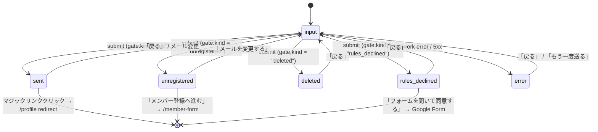
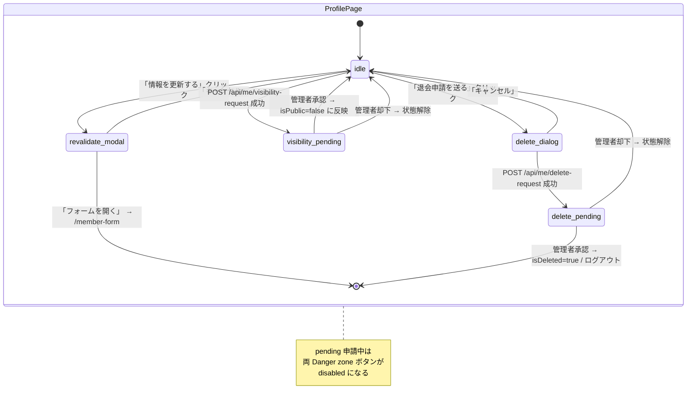

# 09f. 画面ブループリント — 会員層

> 出典: `docs/00-getting-started-manual/claude-design-prototype/pages-member.jsx`（373 行）と `app.jsx`（shell）/ `data.jsx`（fixture）。
> token は `09e` 系の design token に従い、hex 直書きは行わない（`var(--accent)` / `var(--ok)` / `var(--ok-soft)` / `var(--danger)` / `var(--text)` / `var(--text-2)` / `var(--text-3)` / `var(--border)` / `var(--panel)` / `var(--accent-soft)` / `var(--accent-ink)` 等）。
> prototype は UI 叩き台でありバックエンド契約は本仕様書（および `02-auth.md` / `06-member-auth.md` / `07-edit-delete.md` / `13-mvp-auth.md`）が正本。

## 対象画面

- `/login` — ログイン（**5+1 状態**: `input` / `sent` / `unregistered` / `deleted` / `rules_declined` / `error`）
- `/profile` — マイプロフィール（**4 領域**: PublicVisibilityBanner / StatusSummary / RequestActionPanel / DeleteRequestDialog）

prototype 上の `MemberFormPage`（メンバー登録ランディング）は 09f の対象外（`09c` 公開層の Google Form 導線として扱う）。本書は **ログイン ↔ マイプロフィール** の MVP 認証 + 自己情報管理導線を一次情報とする。

shell 側のルーティングは `app.jsx` の `ROUTES` で `login`（`hidden: true`, group: `public`）/ `my`（label: マイページ, group: `member`）として定義され、`isBare = route.name === "login"` のとき `Sidebar` / `Topbar` / `MinimalBar` を抑止して `auth-shell` で全画面表示する仕様。

---

## 1. /login ログイン

### 1.1 ルート / メタ

| 項目 | 値 |
|------|-----|
| route.name | `login` |
| パス | `/login` |
| group | `public`（`hidden: true`、ナビには出さない） |
| icon | `key` |
| shell | `isBare = true`（Sidebar / Topbar / MinimalBar を描画しない） |
| ガード | 未ログイン専用。ログイン済みは `/profile` に redirect |
| 主要状態 | `input` / `sent` / `unregistered` / `deleted` / `rules_declined` / `error` |
| 認証フロー | Magic Link（Auth.js）+ Google OAuth |
| 仕様連携 | `02-auth.md` / `13-mvp-auth.md` / `06-member-auth.md` |

### 1.2 レイアウト構造

```
<div className="auth-shell">           // 全画面センタリング
  <div className="auth-card">          // 460px 程度の単一カード
    <BrandHeader/>                     // 「兵」マーク + UBM兵庫支部会 / Member Portal
    <StateView state={state}/>         // input | sent | unregistered | deleted | rules_declined | error
  </div>
</div>
```

ナビ・サイドバー・トースト以外の chrome は一切なし。`auth-shell` は viewport 中央寄せ、`auth-card` は `var(--panel)` 背景・`var(--border)` 罫線・`border-radius` xl の単一カラム。

### 1.3 セクション分解

| セクション | 状態 | 役割 |
|-----------|------|------|
| BrandHeader | 全状態共通 | 「兵」マーク + 日本語タイトル + 英語タイトル |
| InputForm | `input` | メール入力 / Magic Link 送信 / Google OAuth / メンバー登録動線 |
| SentNotice | `sent` | メール送信完了の確認画面（受信箱誘導） |
| UnregisteredNotice | `unregistered` | 未登録メールへのリカバリ（メンバー登録誘導） |
| DeletedNotice | `deleted` | 退会済みアカウント（再申請の動線は MVP 対象外） |
| RulesDeclinedNotice | `rules_declined` | 規約・勧誘ルール非同意（再回答誘導） |
| ErrorNotice | `error` | 一時障害・トークン期限切れ（再送ボタン） |

### 1.4 完全 JSX 例（state 毎に分けて全パターン）

prototype の `LoginPage` は `input` / `sent` の 2 状態のみを再現している。以下では **5+1 状態すべて** を inline で完全展開する（prototype の `BrandHeader` は全状態で再利用）。

```jsx
const LoginPage = ({ nav }) => {
  const toast = useToast();
  const [email, setEmail] = useState("");
  const [state, setState] = useState("input");
  // state: "input" | "sent" | "unregistered" | "deleted" | "rules_declined" | "error"
  const [pending, setPending] = useState(false);

  const onSubmit = async (e) => {
    e.preventDefault();
    setPending(true);
    try {
      const res = await fetch("/api/auth/magic-link", {
        method: "POST",
        headers: { "Content-Type": "application/json" },
        body: JSON.stringify({ email }),
      });
      const gate = await fetch("/api/auth/gate-state?email=" + encodeURIComponent(email)).then(r => r.json());
      // gate is LoginGateState (discriminated union)
      switch (gate.kind) {
        case "ok":            setState("sent"); toast("マジックリンクを送信しました", "ok"); break;
        case "unregistered":  setState("unregistered"); break;
        case "deleted":       setState("deleted"); break;
        case "rules_declined":setState("rules_declined"); break;
        default:              setState("error");
      }
    } catch { setState("error"); }
    finally { setPending(false); }
  };

  return (
    <div className="auth-shell">
      <div className="auth-card">
        {/* === BrandHeader（全状態共通） === */}
        <div className="brand" style={{ borderBottom: 0, padding: 0, marginBottom: 24 }}>
          <div className="brand-mark">兵</div>
          <div className="brand-title">
            <span className="jp">UBM兵庫支部会</span>
            <span className="en">Member Portal</span>
          </div>
        </div>

        {/* === state: "input" === */}
        {state === "input" && (
          <form onSubmit={onSubmit} aria-busy={pending}>
            <h1 className="h-page" style={{ fontSize: 24, marginBottom: 6 }}>会員ログイン</h1>
            <p className="body" style={{ marginBottom: 20, fontSize: 13.5 }}>
              Googleフォームにご登録のメールアドレス宛に、ログイン用のマジックリンクをお送りします。
            </p>
            <div className="stack">
              <Field label="メールアドレス" required>
                <Input type="email" value={email}
                  onChange={(e) => setEmail(e.target.value)}
                  placeholder="you@example.com" lg
                  aria-label="ログイン用メールアドレス" required/>
              </Field>
              <Button variant="primary" size="lg" block icon="send"
                type="submit" disabled={pending || !email}>
                {pending ? "送信中…" : "マジックリンクを送る"}
              </Button>
              <div className="row" style={{ gap: 10, margin: "6px 0",
                color: "var(--text-3)", fontSize: 11, letterSpacing: "0.12em",
                textTransform: "uppercase", fontFamily: "var(--font-en)" }}>
                <div style={{ flex: 1, height: 1, background: "var(--border)" }}/>
                OR
                <div style={{ flex: 1, height: 1, background: "var(--border)" }}/>
              </div>
              <Button variant="ghost" size="lg" block icon="google"
                onClick={() => { toast("Googleログインに成功しました", "ok"); nav("my"); }}>
                Googleでログイン
              </Button>
            </div>
            <div className="small" style={{ marginTop: 20, textAlign: "center" }}>
              会員でない方は{" "}
              <a style={{ color: "var(--accent)", fontWeight: 500, cursor: "pointer" }}
                 onClick={() => nav("member-form")}>メンバー登録</a>{" "}
              から
            </div>
          </form>
        )}

        {/* === state: "sent" === */}
        {state === "sent" && (
          <div style={{ textAlign: "center", padding: "20px 0" }} role="status" aria-live="polite">
            <div style={{ width: 56, height: 56, borderRadius: 16,
              background: "var(--ok-soft)", color: "var(--ok)",
              display: "grid", placeItems: "center", margin: "0 auto 16px" }}>
              <Icon name="inbox" size={28}/>
            </div>
            <h2 className="h-section" style={{ fontSize: 20 }}>メールをご確認ください</h2>
            <p className="body" style={{ marginTop: 8, fontSize: 13 }}>
              <b style={{ color: "var(--text)" }}>{email}</b> 宛にログイン用のリンクをお送りしました。<br/>
              数分以内に届かない場合は迷惑メールをご確認ください。
            </p>
            <Button variant="ghost" size="sm" icon="arrowLeft"
              onClick={() => setState("input")} style={{ marginTop: 20 }}>
              戻る
            </Button>
            <div style={{ marginTop: 14 }}>
              <Button variant="primary" size="sm" onClick={() => nav("my")}>
                （デモ用）ログイン完了
              </Button>
            </div>
          </div>
        )}

        {/* === state: "unregistered" === */}
        {state === "unregistered" && (
          <div style={{ textAlign: "center", padding: "20px 0" }} role="status" aria-live="polite">
            <div style={{ width: 56, height: 56, borderRadius: 16,
              background: "var(--accent-soft)", color: "var(--accent-ink)",
              display: "grid", placeItems: "center", margin: "0 auto 16px" }}>
              <Icon name="userPlus" size={28}/>
            </div>
            <h2 className="h-section" style={{ fontSize: 20 }}>このメールアドレスは未登録です</h2>
            <p className="body" style={{ marginTop: 8, fontSize: 13 }}>
              <b style={{ color: "var(--text)" }}>{email}</b> はメンバー登録が確認できませんでした。<br/>
              Googleフォームからのメンバー登録が必要です。
            </p>
            <div className="btn-row" style={{ justifyContent: "center", marginTop: 20 }}>
              <Button variant="ghost" size="sm" icon="arrowLeft" onClick={() => setState("input")}>
                メールを変更する
              </Button>
              <Button variant="primary" size="sm" icon="external"
                onClick={() => nav("member-form")}>
                メンバー登録へ進む
              </Button>
            </div>
          </div>
        )}

        {/* === state: "deleted" === */}
        {state === "deleted" && (
          <div style={{ textAlign: "center", padding: "20px 0" }} role="alert" aria-live="assertive">
            <div style={{ width: 56, height: 56, borderRadius: 16,
              background: "color-mix(in oklch, var(--danger) 14%, transparent)",
              color: "var(--danger)",
              display: "grid", placeItems: "center", margin: "0 auto 16px" }}>
              <Icon name="userX" size={28}/>
            </div>
            <h2 className="h-section" style={{ fontSize: 20 }}>このアカウントは退会済みです</h2>
            <p className="body" style={{ marginTop: 8, fontSize: 13 }}>
              <b style={{ color: "var(--text)" }}>{email}</b> は退会申請が承認され、論理削除されています。<br/>
              再度ご参加を希望される場合は、運営事務局までお問い合わせください。
            </p>
            <Button variant="ghost" size="sm" icon="arrowLeft"
              onClick={() => setState("input")} style={{ marginTop: 20 }}>
              戻る
            </Button>
          </div>
        )}

        {/* === state: "rules_declined" === */}
        {state === "rules_declined" && (
          <div style={{ textAlign: "center", padding: "20px 0" }} role="alert" aria-live="assertive">
            <div style={{ width: 56, height: 56, borderRadius: 16,
              background: "color-mix(in oklch, var(--warn) 18%, transparent)",
              color: "var(--warn)",
              display: "grid", placeItems: "center", margin: "0 auto 16px" }}>
              <Icon name="shieldAlert" size={28}/>
            </div>
            <h2 className="h-section" style={{ fontSize: 20 }}>規約への同意が確認できませんでした</h2>
            <p className="body" style={{ marginTop: 8, fontSize: 13 }}>
              フォーム回答時に<b style={{ color: "var(--text)" }}>「勧誘ルール・免責事項」</b>へ同意いただけていないため、本サイトをご利用いただけません。<br/>
              お手数ですが、同意の上で再度Googleフォームから回答をお願いします。
            </p>
            <div className="btn-row" style={{ justifyContent: "center", marginTop: 20 }}>
              <Button variant="ghost" size="sm" icon="arrowLeft" onClick={() => setState("input")}>
                戻る
              </Button>
              <Button variant="primary" size="sm" icon="external"
                onClick={() => nav("member-form")}>
                フォームを開いて同意する
              </Button>
            </div>
          </div>
        )}

        {/* === state: "error" === */}
        {state === "error" && (
          <div style={{ textAlign: "center", padding: "20px 0" }} role="alert" aria-live="assertive">
            <div style={{ width: 56, height: 56, borderRadius: 16,
              background: "color-mix(in oklch, var(--danger) 14%, transparent)",
              color: "var(--danger)",
              display: "grid", placeItems: "center", margin: "0 auto 16px" }}>
              <Icon name="alertTriangle" size={28}/>
            </div>
            <h2 className="h-section" style={{ fontSize: 20 }}>送信に失敗しました</h2>
            <p className="body" style={{ marginTop: 8, fontSize: 13 }}>
              一時的な通信エラーが発生したか、リンクの有効期限が切れた可能性があります。<br/>
              恐れ入りますが、もう一度お試しください。
            </p>
            <div className="btn-row" style={{ justifyContent: "center", marginTop: 20 }}>
              <Button variant="ghost" size="sm" icon="arrowLeft" onClick={() => setState("input")}>
                戻る
              </Button>
              <Button variant="primary" size="sm" icon="refresh"
                onClick={() => { setState("input"); }}>
                もう一度送る
              </Button>
            </div>
          </div>
        )}
      </div>
    </div>
  );
};
```

### 1.5 状態遷移



### 1.6 データ contract（API 接続：既存 endpoint）

| API | method | request | response | 用途 |
|-----|--------|---------|----------|------|
| `/api/auth/magic-link` | POST | `{ email: string }` | `{ state: "sent" \| "unregistered" \| "rules_declined" \| "deleted" }` | apps/web BFF 経由の Magic Link 送信トリガ |
| `/api/auth/gate-state` | GET | query: `email` | `LoginGateState`（discriminated union, 下記） | 入力メールに対するゲート判定 |

```ts
// LoginGateState: tag は "kind" で判別する discriminated union（02-auth.md / 13-mvp-auth.md と整合）
type LoginGateState =
  | { kind: "ok" }                                    // Magic Link 送信成功 / 受信誘導
  | { kind: "unregistered" }                          // フォーム未回答 / 該当 email なし
  | { kind: "deleted"; deletedAt: string }            // 論理削除済み（is_deleted=true）
  | { kind: "rules_declined"; missing: ("publicConsent" | "rulesConsent")[] }
  | { kind: "error"; reason?: string };               // 5xx / token 期限切れ等
```

prototype 上は `gate-state` 呼び出し相当のロジックがなく `setStep("sent")` を即時行うが、本仕様では gate 結果に基づいて 5+1 状態を分岐する。

### 1.7 インタラクション

- form submit: メール未入力時は submit 不可（`disabled={pending || !email}`）。HTML5 `required` でブラウザ側でも検証。
- pending disable: `setPending(true)` の間、Primary ボタンは「送信中…」表示で非活性。`aria-busy="true"` を form に付与。
- `Enter` キー: input 内で押下 → form submit。
- 「戻る」「メールを変更する」「もう一度送る」 → `setState("input")` で初期画面へ。フィールド値は維持（再入力負担を避ける）。
- 「Googleでログイン」 → OAuth flow（prototype は toast 経由で `/profile` に nav するモック）。
- 「メンバー登録」リンク / 「メンバー登録へ進む」/「フォームを開いて同意する」 → `nav("member-form")`（Google Form 導線）。
- toast: 成功時 `tone="ok"`、画面遷移を伴うエラーは画面内で alert 表示（toast は使わない）。

### 1.8 a11y

- form: `<form onSubmit>` ＋ submit ボタン `type="submit"`。Enter キーで送信可能。
- label: `Field label="メールアドレス" required` で `<label>` と input を関連付け。`aria-label` を併記。
- error: `state === "error" | "deleted" | "rules_declined"` 系では `role="alert" aria-live="assertive"` で SR に即時通知。
- status: `sent` / `unregistered` は `role="status" aria-live="polite"`（緊急性が低い情報）。
- pending: form に `aria-busy={pending}` を付与し、ボタンに「送信中…」を文字でも表示。
- フォーカス: 状態遷移時、新セクションの先頭 `<h2>` に `tabIndex={-1}` を付け `ref.focus()` で SR 読み上げ。
- contrast: `var(--text-3)` のセパレータラベル `OR` は装飾用（セマンティクスは持たない）。
- キーボード操作: 全 Button / リンクは `<button>` / `<a>` で構成し、Tab 順序は上→下。

### 1.9 コピー（日本語原文・全状態）

| 要素 | コピー |
|------|--------|
| ブランド（jp） | UBM兵庫支部会 |
| ブランド（en） | Member Portal |
| input: 見出し | 会員ログイン |
| input: 説明 | Googleフォームにご登録のメールアドレス宛に、ログイン用のマジックリンクをお送りします。 |
| input: ラベル | メールアドレス |
| input: placeholder | you@example.com |
| input: primary CTA | マジックリンクを送る |
| input: pending CTA | 送信中… |
| input: divider | OR |
| input: secondary CTA | Googleでログイン |
| input: footer | 会員でない方は メンバー登録 から |
| input: toast (Google 成功) | Googleログインに成功しました |
| input: toast (Magic Link 送信) | マジックリンクを送信しました |
| sent: 見出し | メールをご確認ください |
| sent: 本文 | <b>{email}</b> 宛にログイン用のリンクをお送りしました。<br/>数分以内に届かない場合は迷惑メールをご確認ください。 |
| sent: 戻る | 戻る |
| sent: デモ CTA | （デモ用）ログイン完了 |
| unregistered: 見出し | このメールアドレスは未登録です |
| unregistered: 本文 | <b>{email}</b> はメンバー登録が確認できませんでした。<br/>Googleフォームからのメンバー登録が必要です。 |
| unregistered: 戻る | メールを変更する |
| unregistered: CTA | メンバー登録へ進む |
| deleted: 見出し | このアカウントは退会済みです |
| deleted: 本文 | <b>{email}</b> は退会申請が承認され、論理削除されています。<br/>再度ご参加を希望される場合は、運営事務局までお問い合わせください。 |
| deleted: 戻る | 戻る |
| rules_declined: 見出し | 規約への同意が確認できませんでした |
| rules_declined: 本文 | フォーム回答時に<b>「勧誘ルール・免責事項」</b>へ同意いただけていないため、本サイトをご利用いただけません。<br/>お手数ですが、同意の上で再度Googleフォームから回答をお願いします。 |
| rules_declined: 戻る | 戻る |
| rules_declined: CTA | フォームを開いて同意する |
| error: 見出し | 送信に失敗しました |
| error: 本文 | 一時的な通信エラーが発生したか、リンクの有効期限が切れた可能性があります。<br/>恐れ入りますが、もう一度お試しください。 |
| error: 戻る | 戻る |
| error: CTA | もう一度送る |

### 1.10 prototype 出典

- `pages-member.jsx:3-65`（`LoginPage`、`input` / `sent`）
- `app.jsx:11-22`（`ROUTES.login` 定義 / `hidden: true`）
- `app.jsx:84-95`（`isBare = "login"` shell 抑止）
- 本仕様で追加した `unregistered` / `deleted` / `rules_declined` / `error` は prototype 未実装。`13-mvp-auth.md` のゲート定義に基づく拡張。

---

## 2. /profile マイプロフィール

### 2.1 ルート / メタ

| 項目 | 値 |
|------|-----|
| route.name | `my` |
| パス | `/profile`（prototype 上は `nav("my")`） |
| label | マイページ |
| icon | `user` |
| group | `member` |
| ガード | 認証済みかつ `isDeleted=false` のみアクセス可 |
| データソース | `GET /api/me/profile`（apps/web BFF 経由の自分の Member resource）／同意系 / 申請系 |
| 主要領域 | PublicVisibilityBanner / StatusSummary / RequestActionPanel / DeleteRequestDialog |
| 仕様連携 | `06-member-auth.md` / `07-edit-delete.md` / `13-mvp-auth.md` |

### 2.2 レイアウト構造

```
<div className="page-enter stack-lg">
  <PageHead/>                                // 見出し + 「公開ページを見る」「情報を更新する」CTA
  <PublicVisibilityBanner/>                  // 公開状態 + 申請ステータス
  <StatusSummary/>                           // 公開 / 会員 / 管理用 の 3 カラム カウンタ
  <ProfilePreview/>                          // hero-split: アバター + 氏名 + chip 行
  <FieldsOverview/>                          // 基本 / UBM / パーソナル / SNS / メッセージ / 同意
  <RequestActionPanel/>                      // 公開停止申請 / 退会申請（Danger zone）
  <RevalidateModal/>                         // 「情報を更新する」モーダル → Google Form 誘導
  <DeleteRequestDialog/>                     // 退会申請ダイアログ（確認 + 理由入力）
</div>
```

### 2.3 セクション分解

| セクション | 役割 | 主要 token |
|-----------|------|----------|
| PageHead | 見出し / 公開ページ・情報更新 CTA | `--text` / `--accent` |
| PublicVisibilityBanner | 「公開中 / 公開停止中 / 申請審査中」を 1 行で示す。pending 申請時は trailing chip で「審査中」 | `--ok` / `--ok-soft` / `--warn` / `--danger` |
| StatusSummary | 公開 18 / 会員 5 / 管理用 2 の項目数（fixture: `MEMBERS[0]` から派生） | `--accent` / `--text-2` |
| ProfilePreview | hero-split。Avatar（`size="xl"`, `editable`）+ 氏名 + 職業 + chip 行（zone / status / location） | `--text` / chip token |
| FieldsOverview | KVList × 6 ブロック（基本 / UBM / パーソナル / SNS / メッセージ / 同意） | `--text-2` / `--border` |
| RequestActionPanel | Danger zone。`公開を停止する` / `退会申請を送る`。**pending 申請があるボタンは disabled** | `--danger` / `--border` |
| RevalidateModal | 情報更新モーダル。Googleフォーム再回答誘導 | `--accent-soft` / `--accent-ink` |
| DeleteRequestDialog | 退会申請ダイアログ。理由入力 + 確認 | `--danger` |

### 2.4 完全 JSX 例（4 領域すべて）

```jsx
const MyProfilePage = ({ nav }) => {
  const { MEMBERS } = window.UBM;
  const m = MEMBERS[0]; // 自分のレコード（実際は apps/web BFF 経由で GET /me/profile）

  // 申請ステータス（GET /api/me/profile から取得・MVP は visibility / delete の 2 種）
  const [requests, setRequests] = useState({
    visibility: null,  // null | { state: "pending", requestedAt } | { state: "rejected", reason }
    delete:     null,  // null | { state: "pending", requestedAt } | ...
  });
  const hasPendingVisibility = requests.visibility?.state === "pending";
  const hasPendingDelete     = requests.delete?.state     === "pending";

  const [showRevalidate, setShowRevalidate] = useState(false);
  const [showDeleteDialog, setShowDeleteDialog] = useState(false);

  const submitVisibility = async () => {
    const r = await fetch("/api/me/visibility-request", { method: "POST" });
    if (r.ok) setRequests((s) => ({ ...s, visibility: { state: "pending", requestedAt: new Date().toISOString() } }));
  };
  const submitDelete = async (reason) => {
    const r = await fetch("/api/me/delete-request", {
      method: "POST", headers: { "Content-Type": "application/json" },
      body: JSON.stringify({ reason }),
    });
    if (r.ok) setRequests((s) => ({ ...s, delete: { state: "pending", requestedAt: new Date().toISOString() } }));
    setShowDeleteDialog(false);
  };

  return (
    <div className="page-enter stack-lg">
      {/* === PageHead === */}
      <div className="page-head">
        <div>
          <div className="eyebrow">MY PROFILE</div>
          <h1 className="h-page">マイページ</h1>
          <p className="muted">公開情報と会員限定情報を確認・編集できます。</p>
        </div>
        <div className="btn-row">
          <Button variant="ghost" icon="eye" onClick={() => nav("member", { id: m.id })}>
            公開ページを見る
          </Button>
          <Button variant="primary" icon="edit" onClick={() => setShowRevalidate(true)}>
            情報を更新する
          </Button>
        </div>
      </div>

      {/* === 領域 1: PublicVisibilityBanner === */}
      <div className="card card-pad" style={{
        background: m.isPublic ? "var(--ok-soft)" : "color-mix(in oklch, var(--warn) 14%, transparent)",
        borderColor: m.isPublic
          ? "color-mix(in oklch, var(--ok) 20%, transparent)"
          : "color-mix(in oklch, var(--warn) 28%, transparent)",
      }} role="status" aria-live="polite">
        <div className="row-between">
          <div className="row" style={{ gap: 12 }}>
            <div style={{
              width: 36, height: 36, borderRadius: 10,
              background: m.isPublic ? "var(--ok)" : "var(--warn)",
              color: "var(--panel)", display: "grid", placeItems: "center" }}>
              <Icon name={m.isPublic ? "checkCircle" : "eyeOff"} size={18}/>
            </div>
            <div>
              <div style={{ fontWeight: 600, fontSize: 14,
                color: m.isPublic ? "var(--ok)" : "var(--warn)" }}>
                {m.isPublic ? "プロフィールは公開されています" : "プロフィールは現在、公開停止中です"}
              </div>
              <div className="small" style={{
                color: m.isPublic ? "var(--ok)" : "var(--warn)" }}>
                最終更新: {m.updatedAt} · 回答ID: {m.responseId}
              </div>
            </div>
          </div>
          <div className="row" style={{ gap: 8 }}>
            {hasPendingVisibility && (
              <Chip tone="warn" dot>公開停止申請：審査中</Chip>
            )}
            {hasPendingDelete && (
              <Chip tone="danger" dot>退会申請：審査中</Chip>
            )}
            <Button variant="ghost" size="sm" icon="refresh">再検証する</Button>
          </div>
        </div>
      </div>

      {/* === 領域 2: StatusSummary === */}
      <div className="grid-3">
        <div className="card card-pad">
          <div className="eyebrow" style={{ display: "flex", alignItems: "center", gap: 6 }}>
            <Icon name="eye" size={11}/>PUBLIC
          </div>
          <div style={{ fontSize: 32, fontWeight: 600, marginTop: 8,
            fontFamily: "var(--font-en)", letterSpacing: "-0.03em" }}>18</div>
          <div className="small">公開中の項目</div>
        </div>
        <div className="card card-pad">
          <div className="eyebrow" style={{ display: "flex", alignItems: "center", gap: 6 }}>
            <Icon name="users" size={11}/>MEMBERS
          </div>
          <div style={{ fontSize: 32, fontWeight: 600, marginTop: 8,
            fontFamily: "var(--font-en)", letterSpacing: "-0.03em" }}>5</div>
          <div className="small">会員のみに公開</div>
        </div>
        <div className="card card-pad">
          <div className="eyebrow" style={{ display: "flex", alignItems: "center", gap: 6 }}>
            <Icon name="shield" size={11}/>PRIVATE
          </div>
          <div style={{ fontSize: 32, fontWeight: 600, marginTop: 8,
            fontFamily: "var(--font-en)", letterSpacing: "-0.03em" }}>2</div>
          <div className="small">管理者のみ閲覧</div>
        </div>
      </div>

      {/* === ProfilePreview === */}
      <div className="card card-pad-lg hero-split">
        <Avatar name={m.fullName} size="xl" hue={m.hue} id={m.id} editable/>
        <div>
          <div className="eyebrow">PREVIEW</div>
          <h2 className="h-page" style={{ marginTop: 8, fontSize: 28 }}>{m.fullName}</h2>
          <div style={{ color: "var(--text-2)", fontSize: 14, marginTop: 6 }}>{m.occupation}</div>
          <div className="chip-row" style={{ marginTop: 14 }}>
            <Chip tone={zoneTone(m.ubmZone)} dot>{m.ubmZone}</Chip>
            <Chip tone={statusTone(m.ubmMembershipType)}>{m.ubmMembershipType}</Chip>
            <Chip><Icon name="mapPin" size={11}/>{m.location}</Chip>
          </div>
        </div>
      </div>

      {/* === FieldsOverview === */}
      <div className="card card-pad-lg">
        <div className="row-between" style={{ marginBottom: 14 }}>
          <h2 className="h-section">回答内容</h2>
          <Button variant="ghost" size="sm" icon="external"
            onClick={() => nav("member-form")}>フォームを開いて更新</Button>
        </div>
        <div className="eyebrow" style={{ marginBottom: 8 }}>基本プロフィール</div>
        <KVList rows={[
          { k: "お名前",       v: m.fullName },
          { k: "ニックネーム", v: m.nickname },
          { k: "お住まい",     v: m.location },
          { k: "出身地",       v: m.hometown },
          { k: "生年月日",     v: m.birthDate },
          { k: "職業・仕事内容", v: m.occupation },
        ]}/>
        <div className="eyebrow" style={{ marginTop: 20, marginBottom: 8 }}>UBM情報</div>
        <KVList rows={[
          { k: "UBM区画",       v: m.ubmZone },
          { k: "参加ステータス", v: m.ubmMembershipType },
          { k: "UBM参加時期",   v: m.ubmJoinDate },
          { k: "ビジネス概要",   v: m.businessOverview },
          { k: "得意分野・スキル", v: m.skills },
          { k: "現在の課題",     v: m.challenges },
          { k: "提供できること", v: m.canProvide },
        ]}/>
        <div className="eyebrow" style={{ marginTop: 20, marginBottom: 8 }}>パーソナル</div>
        <KVList rows={[
          { k: "趣味・好きなこと",       v: m.hobbies },
          { k: "最近ハマっていること",   v: m.recentInterest },
          { k: "座右の銘",               v: m.motto },
          { k: "仕事以外の活動",         v: m.otherActivities },
        ]}/>
        <div className="eyebrow" style={{ marginTop: 20, marginBottom: 8 }}>SNS・Web</div>
        <KVList rows={Object.keys(LINK_LABELS).map((k) => ({
          k: LINK_LABELS[k],
          v: m[k]
            ? <a href={m[k]} target="_blank" rel="noreferrer"
                 style={{ color: "var(--accent)", wordBreak: "break-all" }}>{m[k]}</a>
            : null,
        }))}/>
        <div className="eyebrow" style={{ marginTop: 20, marginBottom: 8 }}>メッセージ</div>
        <KVList rows={[{ k: "自己紹介", v: m.selfIntroduction }]}/>
        <div className="eyebrow" style={{ marginTop: 20, marginBottom: 8 }}>同意</div>
        <KVList rows={[
          { k: "ホームページ掲載",       v: m.publicConsent },
          { k: "勧誘ルール・免責事項",   v: m.rulesConsent },
        ]}/>
      </div>

      {/* === 領域 3: RequestActionPanel（Danger zone） === */}
      <div className="card card-pad-lg" style={{
        borderColor: "color-mix(in oklch, var(--danger) 18%, var(--border))" }}>
        <div className="eyebrow" style={{ color: "var(--danger)" }}>DANGER ZONE</div>
        <h2 className="h-section" style={{ marginTop: 8 }}>公開の停止・退会</h2>
        <p className="body" style={{ marginTop: 10 }}>
          公開を停止するとメンバー一覧から非表示になります。退会すると回答データは管理者により論理削除されます。
        </p>
        {(hasPendingVisibility || hasPendingDelete) && (
          <div className="card-flat" style={{
            padding: 12, marginTop: 14,
            background: "color-mix(in oklch, var(--warn) 10%, transparent)",
            borderColor: "color-mix(in oklch, var(--warn) 24%, transparent)",
          }} role="status" aria-live="polite">
            <div className="small" style={{
              color: "var(--warn)", display: "flex",
              alignItems: "flex-start", gap: 8 }}>
              <Icon name="clock" size={13} style={{ marginTop: 2 }}/>
              <div>
                {hasPendingVisibility && <div>公開停止申請を受け付けました。管理者の確認後に反映されます。</div>}
                {hasPendingDelete     && <div>退会申請を受け付けました。管理者の確認後に論理削除されます。</div>}
              </div>
            </div>
          </div>
        )}
        <div className="btn-row" style={{ marginTop: 16 }}>
          <Button variant="soft" icon="eyeOff"
            disabled={hasPendingVisibility || hasPendingDelete}
            onClick={submitVisibility}
            aria-disabled={hasPendingVisibility || hasPendingDelete}>
            {hasPendingVisibility ? "公開停止申請：審査中" : "公開を停止する"}
          </Button>
          <Button variant="danger" icon="trash"
            disabled={hasPendingDelete}
            onClick={() => setShowDeleteDialog(true)}
            aria-disabled={hasPendingDelete}>
            {hasPendingDelete ? "退会申請：審査中" : "退会申請を送る"}
          </Button>
        </div>
      </div>

      {/* === RevalidateModal === */}
      <Modal open={showRevalidate} onClose={() => setShowRevalidate(false)}>
        <div className="modal-body">
          <div style={{
            width: 48, height: 48, borderRadius: 14,
            background: "var(--accent-soft)", color: "var(--accent-ink)",
            display: "grid", placeItems: "center", marginBottom: 14 }}>
            <Icon name="refresh" size={22}/>
          </div>
          <h3 className="h-section">情報を最新化しますか？</h3>
          <p className="body" style={{ marginTop: 10 }}>
            情報の更新は、Googleフォームから再回答する形で行います。新しい回答があった場合、古い回答はアーカイブされ、自動的に新しい回答に置き換わります。
          </p>
          <div className="card-flat" style={{ padding: 12, marginTop: 14 }}>
            <div className="small" style={{
              color: "var(--text-2)", display: "flex",
              alignItems: "flex-start", gap: 8 }}>
              <Icon name="info" size={13} style={{ marginTop: 2, flexShrink: 0 }}/>
              <div>フォームの設問が変更されている場合、過去の回答内容は項目ごとに引き継がれます（stableKey による紐付け）。</div>
            </div>
          </div>
        </div>
        <div className="modal-foot">
          <Button variant="ghost" onClick={() => setShowRevalidate(false)}>キャンセル</Button>
          <Button variant="primary" icon="external"
            onClick={() => { setShowRevalidate(false); nav("member-form"); }}>
            フォームを開く
          </Button>
        </div>
      </Modal>

      {/* === 領域 4: DeleteRequestDialog === */}
      <Modal open={showDeleteDialog} onClose={() => setShowDeleteDialog(false)}>
        <div className="modal-body">
          <div style={{
            width: 48, height: 48, borderRadius: 14,
            background: "color-mix(in oklch, var(--danger) 14%, transparent)",
            color: "var(--danger)",
            display: "grid", placeItems: "center", marginBottom: 14 }}>
            <Icon name="trash" size={22}/>
          </div>
          <h3 className="h-section">退会申請を送りますか？</h3>
          <p className="body" style={{ marginTop: 10 }}>
            退会が承認されると、プロフィールはメンバー一覧・詳細から非表示になり、回答データは管理者により論理削除されます。承認には数日かかる場合があります。
          </p>
          <div className="stack-sm" style={{ marginTop: 14 }}>
            <Field label="退会理由（任意）">
              <Textarea name="deleteReason" rows={3}
                placeholder="差し支えなければ理由をお聞かせください。"/>
            </Field>
          </div>
          <div className="card-flat" style={{
            padding: 12, marginTop: 14,
            background: "color-mix(in oklch, var(--danger) 10%, transparent)",
            borderColor: "color-mix(in oklch, var(--danger) 24%, transparent)" }}>
            <div className="small" style={{
              color: "var(--danger)", display: "flex",
              alignItems: "flex-start", gap: 8 }}>
              <Icon name="alertTriangle" size={13} style={{ marginTop: 2, flexShrink: 0 }}/>
              <div>申請後はキャンセルできません。再参加の際は運営までお問い合わせください。</div>
            </div>
          </div>
        </div>
        <div className="modal-foot">
          <Button variant="ghost" onClick={() => setShowDeleteDialog(false)}>キャンセル</Button>
          <Button variant="danger" icon="trash"
            onClick={(e) => {
              const reason = e.currentTarget
                .closest(".modal").querySelector("textarea[name=deleteReason]").value;
              submitDelete(reason);
            }}>
            退会申請を送る
          </Button>
        </div>
      </Modal>
    </div>
  );
};
```

### 2.5 状態遷移



### 2.6 データ contract（API 接続：既存 endpoint）

| API | method | request | response | 用途 |
|-----|--------|---------|----------|------|
| `GET /api/me/profile` | GET | Cookie / Authorization 転送 | upstream `GET /me/profile` の `MeProfileResponse` | 自分の情報 + status summary + pendingRequests |
| `POST /api/me/visibility-request` | POST | `{ desiredState: "hidden" \| "public", reason?: string }` | upstream `POST /me/visibility-request` の `MeQueueAcceptedResponse` | 公開範囲申請 |
| `POST /api/me/delete-request` | POST | `{ reason?: string }` | upstream `POST /me/delete-request` の `MeQueueAcceptedResponse` | 退会申請 |
| `/api/auth/[...nextauth]` | GET / POST | Auth.js | session / signout | ログアウト・OAuth |
| `POST /api/auth/magic-link` | POST | — | — | （ログインで使用、ここでは参照のみ） |
| `GET /api/auth/gate-state` | GET | — | `LoginGateState` | （ログインで使用、ここでは参照のみ） |

```ts
type RequestState =
  | null
  | { state: "pending";  requestedAt: string }
  | { state: "approved"; approvedAt: string }
  | { state: "rejected"; rejectedAt: string; reason: string };

type MeResponse = Member & {
  requests: {
    visibility: RequestState;
    delete:     RequestState;
  };
};
```

`07-edit-delete.md` の「公開停止 / 退会の申請ライフサイクル」と整合。MVP では申請は管理者承認制で、本人によるキャンセルは不可（仕様連携: `13-mvp-auth.md`）。

### 2.7 インタラクション

- 「情報を更新する」 → `RevalidateModal` open → `nav("member-form")` で Google Form 動線。
- 「公開ページを見る」 → `nav("member", { id: m.id })`。
- 「フォームを開いて更新」 → `nav("member-form")`（FieldsOverview ヘッダ右の secondary CTA）。
- 「再検証する」 → `GET /api/me/profile` を再フェッチして banner / pendingRequests を更新。
- 「公開を停止する」 → `POST /api/me/visibility-request` 即時送信 → `pendingRequests.visibility = pending`。
- 「退会申請を送る」 → `DeleteRequestDialog` open → 理由入力（任意）→ `POST /api/me/delete-request` → `pendingRequests.delete = pending`。
- **pending 申請中は対応ボタンが disabled になる連動ロジック**:
  - `hasPendingVisibility = requests.visibility?.state === "pending"`
  - `hasPendingDelete     = requests.delete?.state     === "pending"`
  - 「公開を停止する」ボタンは `disabled={hasPendingVisibility || hasPendingDelete}`。退会申請中は公開停止申請も新規受付しない（二重申請の競合・退会承認後の無意味化を防ぐため）。
  - 「退会申請を送る」ボタンは `disabled={hasPendingDelete}`（公開停止申請中でも退会は受け付ける：退会の方が上位の意思表明であるため）。
  - disabled ボタンのラベルは「公開停止申請：審査中」/「退会申請：審査中」に差し替え、利用者が状態を把握できるようにする。
  - 申請中は banner にも `Chip tone="warn" dot` で「公開停止申請：審査中」/「退会申請：審査中」を表示する。
  - 申請中の説明バナーが Danger zone 内に表示される（`role="status" aria-live="polite"`）。
- modal: ESC キー / overlay クリック / 「キャンセル」で close。`Enter` での誤送信は primary ボタンに focus が無い限り発生しない。

### 2.8 a11y

- banner: `role="status" aria-live="polite"`（公開状態が更新されたら SR に通知）。
- pending 注意バナー: `role="status" aria-live="polite"`（申請受付の通知）。
- danger zone 見出し: `eyebrow` に `--danger` 色を当てるが、テキスト「DANGER ZONE」自体で意味を担保（色のみに依存しない）。
- 申請中ボタン: `disabled` + `aria-disabled="true"` を併記。ラベルが「審査中」に変わるため SR も状態把握可能。
- modal: `role="dialog" aria-modal="true"` を `<Modal>` 側で付与。`aria-labelledby` を `<h3>` に紐付け。
- form label: `Field label` で textarea を関連付け。退会理由は任意のため `required` は付けない。
- KVList: `<dl>` 構造（`<dt>` キー / `<dd>` 値）を実装側で採用し SR に意味を伝える。
- Avatar `editable`: アップロード trigger は `<button aria-label="プロフィール画像を変更">`。
- リンク `target="_blank"` には `rel="noreferrer"` 必須（prototype 準拠）。
- フォーカストラップ: modal open 中は背後のフォーカスを trap し、close 後は trigger ボタンに戻す。

### 2.9 コピー（日本語原文・全領域）

| 要素 | コピー |
|------|--------|
| eyebrow | MY PROFILE |
| 見出し | マイページ |
| 説明 | 公開情報と会員限定情報を確認・編集できます。 |
| CTA: 公開ページを見る | 公開ページを見る |
| CTA: 情報を更新する | 情報を更新する |
| Banner: 公開中 タイトル | プロフィールは公開されています |
| Banner: 公開停止中 タイトル | プロフィールは現在、公開停止中です |
| Banner: メタ | 最終更新: {updatedAt} · 回答ID: {responseId} |
| Banner: chip 公開停止申請中 | 公開停止申請：審査中 |
| Banner: chip 退会申請中 | 退会申請：審査中 |
| Banner: 再検証 | 再検証する |
| StatusSummary: PUBLIC eyebrow | PUBLIC |
| StatusSummary: PUBLIC 補足 | 公開中の項目 |
| StatusSummary: MEMBERS eyebrow | MEMBERS |
| StatusSummary: MEMBERS 補足 | 会員のみに公開 |
| StatusSummary: PRIVATE eyebrow | PRIVATE |
| StatusSummary: PRIVATE 補足 | 管理者のみ閲覧 |
| ProfilePreview: eyebrow | PREVIEW |
| FieldsOverview: 見出し | 回答内容 |
| FieldsOverview: secondary CTA | フォームを開いて更新 |
| FieldsOverview: 基本セクション | 基本プロフィール |
| FieldsOverview: UBM セクション | UBM情報 |
| FieldsOverview: パーソナル | パーソナル |
| FieldsOverview: SNS | SNS・Web |
| FieldsOverview: メッセージ | メッセージ |
| FieldsOverview: 同意 | 同意 |
| KV: お名前 / ニックネーム / お住まい / 出身地 / 生年月日 / 職業・仕事内容 | （prototype 準拠） |
| KV: UBM区画 / 参加ステータス / UBM参加時期 / ビジネス概要 / 得意分野・スキル / 現在の課題 / 提供できること | （prototype 準拠） |
| KV: 趣味・好きなこと / 最近ハマっていること / 座右の銘 / 仕事以外の活動 | （prototype 準拠） |
| KV: 自己紹介 | 自己紹介 |
| KV: ホームページ掲載 / 勧誘ルール・免責事項 | （prototype 準拠、`publicConsent` / `rulesConsent` を表示） |
| Danger: eyebrow | DANGER ZONE |
| Danger: 見出し | 公開の停止・退会 |
| Danger: 本文 | 公開を停止するとメンバー一覧から非表示になります。退会すると回答データは管理者により論理削除されます。 |
| Danger: pending 注意（公開停止） | 公開停止申請を受け付けました。管理者の確認後に反映されます。 |
| Danger: pending 注意（退会） | 退会申請を受け付けました。管理者の確認後に論理削除されます。 |
| Danger: ボタン（公開停止・通常） | 公開を停止する |
| Danger: ボタン（公開停止・申請中） | 公開停止申請：審査中 |
| Danger: ボタン（退会・通常） | 退会申請を送る |
| Danger: ボタン（退会・申請中） | 退会申請：審査中 |
| RevalidateModal: 見出し | 情報を最新化しますか？ |
| RevalidateModal: 本文 | 情報の更新は、Googleフォームから再回答する形で行います。新しい回答があった場合、古い回答はアーカイブされ、自動的に新しい回答に置き換わります。 |
| RevalidateModal: 補足 | フォームの設問が変更されている場合、過去の回答内容は項目ごとに引き継がれます（stableKey による紐付け）。 |
| RevalidateModal: cancel | キャンセル |
| RevalidateModal: primary | フォームを開く |
| DeleteDialog: 見出し | 退会申請を送りますか？ |
| DeleteDialog: 本文 | 退会が承認されると、プロフィールはメンバー一覧・詳細から非表示になり、回答データは管理者により論理削除されます。承認には数日かかる場合があります。 |
| DeleteDialog: 理由ラベル | 退会理由（任意） |
| DeleteDialog: 理由 placeholder | 差し支えなければ理由をお聞かせください。 |
| DeleteDialog: 警告 | 申請後はキャンセルできません。再参加の際は運営までお問い合わせください。 |
| DeleteDialog: cancel | キャンセル |
| DeleteDialog: primary | 退会申請を送る |

### 2.10 prototype 出典

- `pages-member.jsx:220-371`（`MyProfilePage` 全体）
  - `220-237` PageHead
  - `240-253` Status banner（本仕様で PublicVisibilityBanner に拡張）
  - `256-272` Visibility summary（StatusSummary）
  - `275-287` Profile preview（hero-split）
  - `290-333` Fields overview（KVList × 6）
  - `336-346` Danger zone（本仕様で RequestActionPanel + pending 連動を追加）
  - `348-368` RevalidateModal（情報を最新化）
- `data.jsx:96-115`（`MEMBERS[0]` fixture: 山田 太郎）
- `data.jsx:3-75`（`SURVEY_SECTIONS`: KVList の元データ構造）
- prototype 未実装で本仕様で追加: pending 申請の連動 disable / 退会申請ダイアログ / `DeleteRequestDialog` / banner の申請中 chip / `GET /api/me/profile` の `pendingRequests` フィールド。`07-edit-delete.md` のライフサイクル定義に準拠。

---

## 付録 A. token / 共通参照

## 99. 不採用要素

| 要素 | 理由 |
|------|------|
| AvatarStoreProvider#localStorage | 本番は `/me/profile` と申請 API を正本とし、localStorage を正本化しない |
| theme switcher | MVP は単一テーマ。token 値は 09b owner |
| GAS prototype 由来の直接挙動 | 本番仕様の正本は `claude-design-prototype` と 09 series |

| 用途 | token |
|------|-------|
| 主背景 / カード | `var(--panel)` |
| 罫線 | `var(--border)` |
| 主要テキスト | `var(--text)` |
| 補助テキスト | `var(--text-2)` |
| 微弱テキスト | `var(--text-3)` |
| アクセント | `var(--accent)` / `var(--accent-soft)` / `var(--accent-ink)` |
| 成功 | `var(--ok)` / `var(--ok-soft)` |
| 警告 | `var(--warn)` |
| 危険 | `var(--danger)` |
| 英字フォント | `var(--font-en)` |

color-mix は token 同士の合成のみで使用（hex 直書き禁止）。

## 付録 B. 仕様連携リファレンス

| ファイル | 関連箇所 |
|---------|----------|
| `02-auth.md` | Magic Link / Google OAuth / セッション |
| `06-member-auth.md` | 会員ゲート判定（rules_declined / unregistered / deleted の根拠） |
| `07-edit-delete.md` | 公開停止 / 退会の申請ライフサイクル・管理者承認 |
| `13-mvp-auth.md` | MVP 認証方針（gate-state の discriminated union） |
| `09b-design-tokens.md` | token 一覧の正本 |
| `claude-design-prototype/pages-member.jsx` | 本仕様の出典（373 行） |
| `claude-design-prototype/app.jsx` | shell / ROUTES / isBare 判定 |
| `claude-design-prototype/data.jsx` | fixture（`MEMBERS[0]` / `SURVEY_SECTIONS`） |
