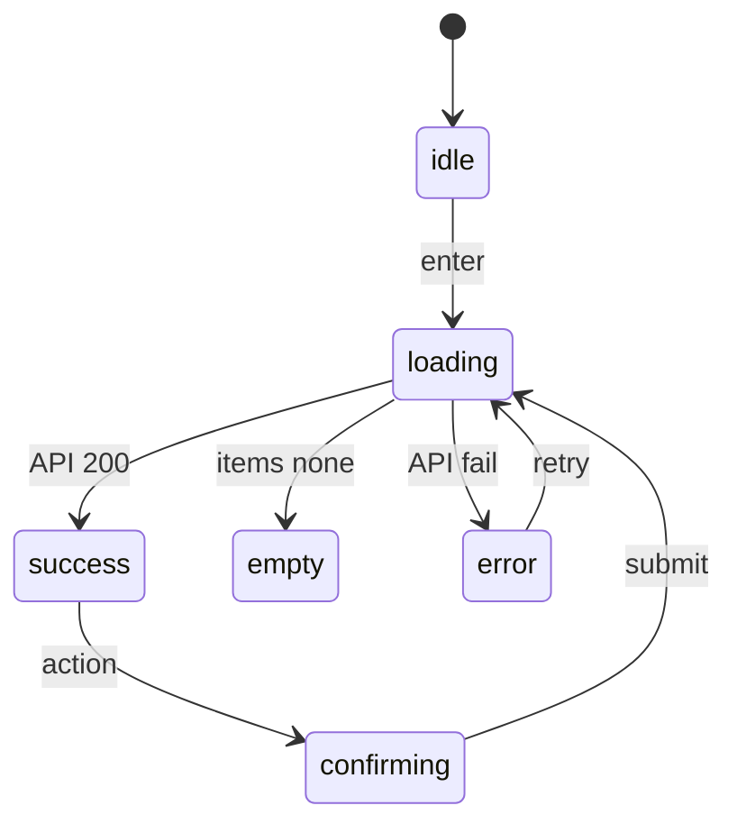
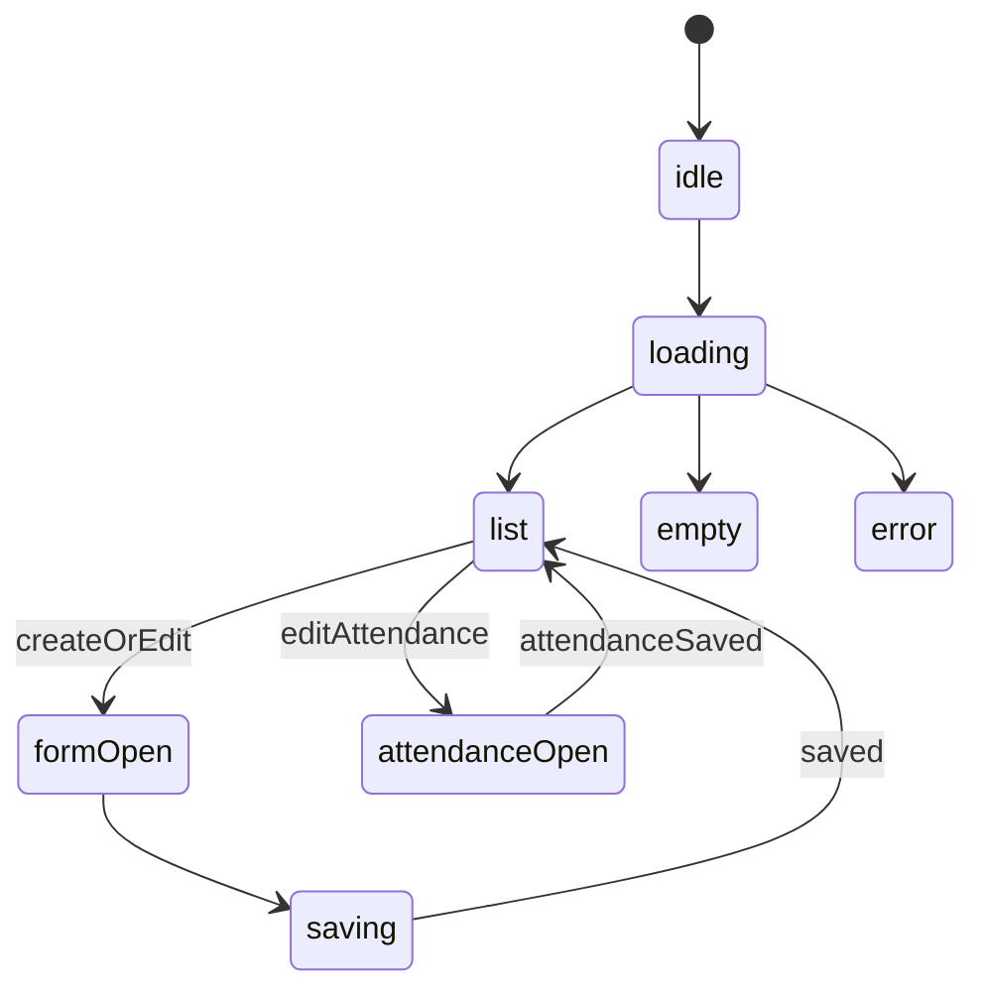
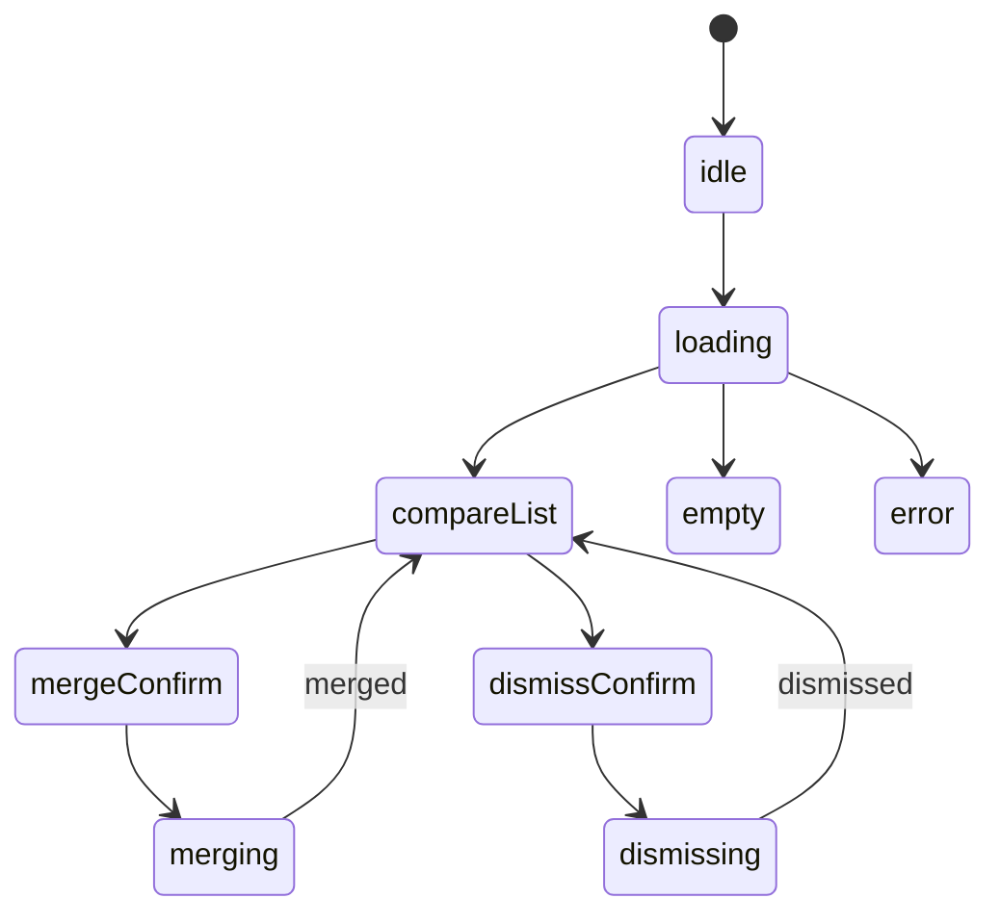
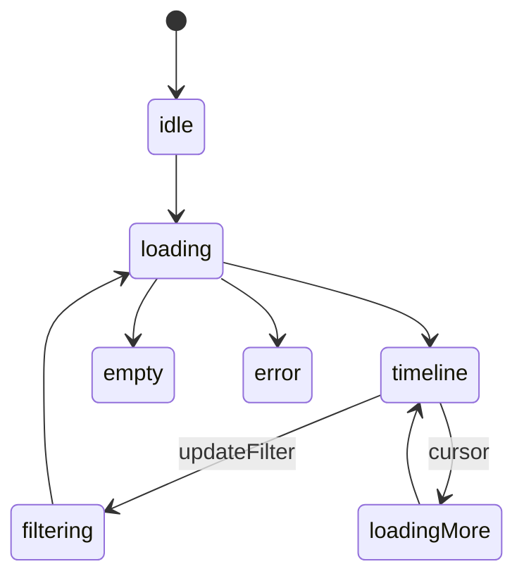

# 09g. Screen Blueprints - Admin

本書は管理層 8 routes と AdminSidebar 共通部品の画面ブループリント正本である。
実装コードは task-15 / task-16 / task-17 が担当し、本書は画面構造、コピー、状態、API 接続、a11y、参照先だけを固定する。
apps/web は `/api/admin/...` proxy と `fetchAdmin` 経由で apps/api を呼び、D1 を直接参照しない。

不変条件:

1. AdminSidebar は §1 に集約し、各画面では再定義しない。
2. prototype 掲載画面は `pages-admin.jsx` のコピー語彙を維持する。ただし視覚リテラルは token 名へ正規化する。
3. 視覚値の直接記述は禁止する。色・余白・影・角丸は 09b / 09c の token 名で参照する。
4. API は `.claude/skills/aiworkflow-requirements/references/api-endpoints.md` の current admin contract を正本とする。
5. `PATCH /admin/members/:memberId/profile` と `PATCH /admin/members/:memberId/tags` は作らない。
6. tag 確定は `/admin/tags/queue/:queueId/resolve` に集約する。
7. schema apply は `/admin/schema/aliases` と dry-run 経路に集約する。
8. request approve / reject は `/admin/requests/:noteId/resolve` に集約する。
9. identity conflict は `merge` / `dismiss` の二経路を明示する。
10. Modal は `role="dialog"`、`aria-modal="true"`、focus trap、Esc close を満たす。

対象 route:

| # | route | 画面 | 出典 | 実装担当 |
| --- | --- | --- | --- | --- |
| 1 | `/admin` | 管理ダッシュボード | prototype dashboard + current `/admin/dashboard` API | task-15 |
| 2 | `/admin/members` | 会員管理 | prototype members + current member APIs | task-15 |
| 3 | `/admin/tags` | タグキュー | prototype tags + current queue APIs | task-16 |
| 4 | `/admin/meetings` | 開催日 | phase-3 admin CRUD 派生 | task-16 |
| 5 | `/admin/schema` | スキーマ差分 | prototype schema + current alias APIs | task-17 |
| 6 | `/admin/requests` | 依頼キュー | phase-3 admin queue 派生 | task-16 |
| 7 | `/admin/identity-conflicts` | Identity 重複 | phase-3 admin compare 派生 | task-17 |
| 8 | `/admin/audit` | 監査ログ | phase-3 admin timeline 派生 | task-17 |

## 1. AdminSidebar

### 1.1 prototype 由来

`pages-admin.jsx` の sidebar / navigation 語彙を admin layout に集約する。
本書では JSX 全量ではなく、実装が守るべき nav contract を固定する。

```tsx
type AdminNavItem = {
  href: string;
  label: string;
  icon: string;
  badgeKey?: "untagged" | "requestsPending" | "schemaUnresolved" | "identityConflicts";
};
# 09g. 画面ブループリント — 管理層

本書は管理層 8 routes と AdminSidebar を、後続 task-15 / task-16 / task-17 が迷わず実装できる粒度で固定する screen blueprint 正本である。
視覚値の直書きは置かず、token 名、primitive 名、API contract、状態遷移、a11y、操作手順だけを扱う。

| route | section | owner task |
| --- | --- | --- |
| `/(admin)/admin` | §2 | task-15 |
| `/(admin)/admin/members` | §3 | task-15 |
| `/(admin)/admin/tags` | §4 | task-16 |
| `/(admin)/admin/meetings` | §5 | task-16 |
| `/(admin)/admin/schema` | §6 | task-17 |
| `/(admin)/admin/requests` | §7 | task-16 |
| `/(admin)/admin/identity-conflicts` | §8 | task-17 |
| `/(admin)/admin/audit` | §9 | task-17 |

既存実装には補助 route `/(admin)/admin/dashboard/attendance`（出席分析）が存在する。これは UT-02A attendance dashboard analytics の既存成果物であり、本書の admin 8 routes blueprint には含めない。ただし AdminSidebar の実装順序では dashboard 直後に保持し、task-21 / task-15 / task-16 / task-17 は削除・上書きしない。

## 1. AdminSidebar

AdminSidebar は全 admin 画面の共通入口であり、各画面は Sidebar を再定義せず §1 を参照する。

### 1.1 prototype 由来

- 出典は `docs/00-getting-started-manual/claude-design-prototype/pages-admin.jsx` の sidebar 相当箇所。
- 本書では JSX の視覚値を転記せず、nav item、active 判定、badge 入力、logout 導線の構造だけを固定する。
- 実装時は task-15 の `(admin)/layout.tsx` が唯一の配置 owner となる。
- `apps/web` は admin API または web server helper を通じて取得し、D1 へ直接触れない。

### 1.2 nav 項目

| order | label | route | icon key | badge source |
| --- | --- | --- | --- | --- |
| 1 | ダッシュボード | `/(admin)/admin` | `barChart` | none |
| 2 | 出席分析 | `/(admin)/admin/dashboard/attendance` | `barChart` | none |
| 3 | 会員管理 | `/(admin)/admin/members` | `users` | none |
| 4 | タグキュー | `/(admin)/admin/tags` | `tag` | untagged count |
| 5 | schema | `/(admin)/admin/schema` | `gitCompare` | unresolved count |
| 6 | 開催日 | `/(admin)/admin/meetings` | `calendar` | none |
| 7 | 依頼キュー | `/(admin)/admin/requests` | `inbox` | pending count |
| 8 | Identity 重複 | `/(admin)/admin/identity-conflicts` | `userCheck` | conflict count |
| 9 | 監査ログ | `/(admin)/admin/audit` | `fileText` | none |

### 1.3 active state

- active 判定は route key の完全一致で行う。
- active item には `aria-current="page"` を付ける。
- badge が 0 件のときは描画しない。
- keyboard focus は nav item の DOM 順序に従う。
- collapsed / drawer 表現は 09h shell 正本に委譲し、本書では nav contract だけを固定する。

### 1.4 token / primitive 参照

- 色、余白、影、角丸、文字サイズは `--ubm-*` token と 09b / 09c の primitive 名で参照する。
- 本書には具体値を置かない。
- button は 09c Button、badge は 09c Badge、icon は 09d icon registry を使う。
- layout shell の breakpoint と drawer 動作は 09h を参照する。

## 2. /(admin)/admin — 管理ダッシュボード

Sidebar は §1 を参照し、本画面内で AdminSidebar を再定義しない。

### 2.1 prototype 由来 / 派生ルール

- source: prototype AdminDashboardPage
- owner: task-15
- layout pattern: KPI Grid + status summary + recent action
- prototype 掲載画面は構造、見出し、ボタン、空状態、エラー状態の意味を維持する。
- 派生画面は phase-3 の pattern 名と admin API table を正本とし、新規 primitive を作らない。
- page root は admin shell の content slot に入る単一 screen とする。
- loading / empty / error / success を必ず別 state として扱う。
- optimistic update は行わず、成功応答後に一覧を再取得する。
- 管理者向け説明文は短く、操作対象と結果を先に示す。
- destructive action は confirm step を通す。

### 2.2 コピー原文

- page title: 管理ダッシュボード
- route label: /(admin)/admin
- primary action は画面の主目的に合わせて 1 つだけ置く。
- secondary action は refresh / export / filter reset の順で置く。
- empty copy は「対象がありません」で終わらせず、次に取る操作を示す。
- error copy は retry と support handoff を含める。
- toast success は操作対象名と結果を含める。
- toast failure は API error code と再試行可否を含める。
- button label は動詞で始める。
- filter placeholder は検索対象の列名を含める。
- drawer / modal title は対象 record の識別名を含める。
- confirm copy は不可逆性と戻し方を明示する。

### 2.3 状態遷移



### 1.2 nav 項目
### 2.4 API 表

| 用途 | API | method | response 期待 shape |
| --- | --- | --- | --- |
| ダッシュボード集約 | `/admin/dashboard` | GET | kpi / distribution / recent actions |

### 2.5 props / state

| name | type | scope |
| --- | --- | --- |
| `items` | array | screen data |
| `filters` | object | URL query mirror |
| `selectedId` | string nullable | drawer or detail selection |
| `pendingAction` | object nullable | confirm target |
| `error` | object nullable | recoverable failure |
| `isLoading` | boolean | request state |
| `canMutate` | boolean | admin role guard result |
| `lastSyncedAt` | string nullable | freshness display |

### 2.6 a11y

- page title は h1 として 1 つだけ置く。
- data table は header cell と row action の keyboard 操作を保証する。
- status change は live region で読み上げ可能にする。
- confirm Modal を使わない画面でも、主要 action の focus order を記録する。
- destructive action は submit button と cancel button を隣接させる。
- disabled reason は tooltip ではなく visible helper text で示す。
- toast だけに重要情報を閉じ込めない。
- route change 後は h1 へ focus を戻す。

### 2.7 操作手順

1. 画面入場時に filters を URL query から復元する。
2. API を呼び出し、loading から success / empty / error のいずれかへ遷移する。
3. 行選択時は detail drawer または compare pane を開く。
4. mutate action は confirm state を経由する。
5. confirm submit 後は API response を検証する。
6. 成功時は一覧再取得、toast、selection clear を同順で実行する。
7. 失敗時は selection を保持し、retry 可能な状態で止める。
8. audit に残る操作は actor / target / before / after の説明を UI copy に含める。
9. bulk action は対象件数と action name を confirm copy に含める。
10. export action は server response の完了を待ってから download affordance を出す。

### 2.8 参照

- primitive: 09c screen primitive catalog
- token: 09b design token catalog
- icon: 09d icon registry
- shell: 09h admin shell and fixtures
- API mapping: ui-prototype-alignment-mvp-recovery phase-3 §2.3
- scope: ui-prototype-alignment-mvp-recovery SCOPE.md
- downstream implementation task: task-15

## 3. /(admin)/admin/members — 会員管理

Sidebar は §1 を参照し、本画面内で AdminSidebar を再定義しない。

### 3.1 prototype 由来 / 派生ルール

- source: prototype AdminMembersPage
- owner: task-15
- layout pattern: FilterBar + Table + Drawer + bulk action
- prototype 掲載画面は構造、見出し、ボタン、空状態、エラー状態の意味を維持する。
- 派生画面は phase-3 の pattern 名と admin API table を正本とし、新規 primitive を作らない。
- page root は admin shell の content slot に入る単一 screen とする。
- loading / empty / error / success を必ず別 state として扱う。
- optimistic update は行わず、成功応答後に一覧を再取得する。
- 管理者向け説明文は短く、操作対象と結果を先に示す。
- destructive action は confirm step を通す。

### 3.2 コピー原文

- page title: 会員管理
- route label: /(admin)/admin/members
- primary action は画面の主目的に合わせて 1 つだけ置く。
- secondary action は refresh / export / filter reset の順で置く。
- empty copy は「対象がありません」で終わらせず、次に取る操作を示す。
- error copy は retry と support handoff を含める。
- toast success は操作対象名と結果を含める。
- toast failure は API error code と再試行可否を含める。
- button label は動詞で始める。
- filter placeholder は検索対象の列名を含める。
- drawer / modal title は対象 record の識別名を含める。
- confirm copy は不可逆性と戻し方を明示する。

### 3.3 状態遷移


`/admin/dashboard/attendance` は既存の出席分析画面への導線であり、本 task-21 の 8 route blueprint 対象には含めない。Sidebar contract では既存到達性だけを固定し、画面本体の blueprint は既存 attendance dashboard workflow の正本に従う。

| order | label | href | icon | badge |
| --- | --- | --- | --- | --- |
| 1 | ダッシュボード | `/admin` | `barChart` | none |
| 2 | 出席分析 | `/admin/dashboard/attendance` | `activity` | none |
| 3 | 会員管理 | `/admin/members` | `users` | none |
| 4 | タグキュー | `/admin/tags` | `tag` | `untagged` |
| 5 | schema | `/admin/schema` | `gitCompare` | `schemaUnresolved` |
| 6 | 開催日 | `/admin/meetings` | `calendar` | none |
| 7 | 依頼キュー | `/admin/requests` | `inbox` | `requestsPending` |
| 8 | Identity重複 | `/admin/identity-conflicts` | `userCheck` | `identityConflicts` |
| 9 | 監査ログ | `/admin/audit` | `fileText` | none |

### 1.3 active state

- 現在 route と一致する item に `aria-current="page"` を付ける。
- active 表現は 09b token と 09c Navigation primitive に委譲する。
- keyboard focus は focus-visible ring で表示する。
- collapsed / drawer 表現は shell 側の責務であり、本書では nav item contract だけを固定する。

### 1.4 API / data

Sidebar は主データ取得を行わない。
badge が必要な場合は各 page の primary fetch 結果から shell に渡す。
badge fetch を Sidebar 内で追加して waterfall を作らない。

### 1.5 state
### 3.4 API 表

| 用途 | API | method | response 期待 shape |
| --- | --- | --- | --- |
| 一覧 | `/admin/members?...` | GET | items / total |
| status 変更 | `/admin/member-status` | POST | ok |
| 削除 | `/admin/member-delete` | POST | ok |
| 詳細 / notes | `/admin/member-notes/:id` | GET | notes |

### 3.5 props / state

| name | type | scope |
| --- | --- | --- |
| `items` | array | screen data |
| `filters` | object | URL query mirror |
| `selectedId` | string nullable | drawer or detail selection |
| `pendingAction` | object nullable | confirm target |
| `error` | object nullable | recoverable failure |
| `isLoading` | boolean | request state |
| `canMutate` | boolean | admin role guard result |
| `lastSyncedAt` | string nullable | freshness display |

### 3.6 a11y

- page title は h1 として 1 つだけ置く。
- data table は header cell と row action の keyboard 操作を保証する。
- status change は live region で読み上げ可能にする。
- confirm Modal は `role="dialog"` を持つ。
- confirm Modal は `aria-modal="true"` を持つ。
- confirm Modal は focus trap を持つ。
- confirm Modal は Esc close を持つ。
- destructive action は submit button と cancel button を隣接させる。
- disabled reason は tooltip ではなく visible helper text で示す。
- toast だけに重要情報を閉じ込めない。
- route change 後は h1 へ focus を戻す。

### 3.7 操作手順

1. 画面入場時に filters を URL query から復元する。
2. API を呼び出し、loading から success / empty / error のいずれかへ遷移する。
3. 行選択時は detail drawer または compare pane を開く。
4. mutate action は confirm state を経由する。
5. confirm submit 後は API response を検証する。
6. 成功時は一覧再取得、toast、selection clear を同順で実行する。
7. 失敗時は selection を保持し、retry 可能な状態で止める。
8. audit に残る操作は actor / target / before / after の説明を UI copy に含める。
9. bulk action は対象件数と action name を confirm copy に含める。
10. export action は server response の完了を待ってから download affordance を出す。

### 3.8 参照

- primitive: 09c screen primitive catalog
- token: 09b design token catalog
- icon: 09d icon registry
- shell: 09h admin shell and fixtures
- API mapping: ui-prototype-alignment-mvp-recovery phase-3 §2.3
- scope: ui-prototype-alignment-mvp-recovery SCOPE.md
- downstream implementation task: task-15

## 4. /(admin)/admin/tags — タグ割当キュー

Sidebar は §1 を参照し、本画面内で AdminSidebar を再定義しない。

### 4.1 prototype 由来 / 派生ルール

- source: prototype AdminTagsPage
- owner: task-16
- layout pattern: Queue list + detail editor + approve reject
- prototype 掲載画面は構造、見出し、ボタン、空状態、エラー状態の意味を維持する。
- 派生画面は phase-3 の pattern 名と admin API table を正本とし、新規 primitive を作らない。
- page root は admin shell の content slot に入る単一 screen とする。
- loading / empty / error / success を必ず別 state として扱う。
- optimistic update は行わず、成功応答後に一覧を再取得する。
- 管理者向け説明文は短く、操作対象と結果を先に示す。
- destructive action は confirm step を通す。

### 4.2 コピー原文

- page title: タグ割当キュー
- route label: /(admin)/admin/tags
- primary action は画面の主目的に合わせて 1 つだけ置く。
- secondary action は refresh / export / filter reset の順で置く。
- empty copy は「対象がありません」で終わらせず、次に取る操作を示す。
- error copy は retry と support handoff を含める。
- toast success は操作対象名と結果を含める。
- toast failure は API error code と再試行可否を含める。
- button label は動詞で始める。
- filter placeholder は検索対象の列名を含める。
- drawer / modal title は対象 record の識別名を含める。
- confirm copy は不可逆性と戻し方を明示する。

### 4.3 状態遷移


| state | 表示 | 備考 |
| --- | --- | --- |
| idle | nav item 一覧 | 初期 |
| active | current item | `aria-current` |
| pending badge | badge 表示 | 値が正の時のみ |
| collapsed | icon only | label は accessible name に残す |
| error | badge 非表示 | nav 自体は維持 |

### 1.6 a11y

- `<nav aria-label="管理メニュー">` を使う。
- item は link を優先し、button navigation を乱用しない。
- badge は数値だけでなく `aria-label` で意味を補う。
- Esc close は mobile drawer のみ対象。

### 1.7 操作手順

1. ユーザーが nav item を選択する。
2. route 遷移後、該当 item が active になる。
3. badge 更新は遷移先 page の fetch 結果に追従する。
4. mobile drawer は遷移後に閉じる。

### 1.8 参照

- layout mapping: 09a admin navigation
- token: 09b navigation / panel / focus token
- primitive: 09c Navigation / Badge / Shell
- icon: 09d admin icon catalog

## 2. Dashboard `/admin`

### 2.1 prototype 由来

`pages-admin.jsx` `AdminDashboardPage` を管理ダッシュボードの構造語彙として採用する。
実 API は旧 KPI 分割 endpoint ではなく current `/admin/dashboard` を使う。

### 2.2 コピー原文

- eyebrow: `ADMIN`
- title: `管理ダッシュボード`
- description: `フォーム回答・スキーマ・メンバーの健全性を一画面で把握できます。`
- sync badge: `Google Forms と同期中`
- action: `今すぐ同期`
- alert title: `フォームスキーマに未解決の変更があります`
- alert action: `差分をレビュー`
- KPI labels: `Total members`, `Public on site`, `Untagged`, `Schema issues`

### 2.3 状態遷移

```mermaid
stateDiagram-v2
  [*] --> idle
  idle --> loading
  loading --> success
  loading --> empty
  loading --> error
  success --> schemaWarning: unresolvedSchema
  schemaWarning --> success: openSchemaLink
  error --> loading: retry
### 4.4 API 表

| 用途 | API | method | response 期待 shape |
| --- | --- | --- | --- |
| キュー | `/admin/tags/queue` | GET | items |
| 採否 | `/admin/tags/queue/:queueId/resolve` | POST | ok |

### 4.5 props / state

| name | type | scope |
| --- | --- | --- |
| `items` | array | screen data |
| `filters` | object | URL query mirror |
| `selectedId` | string nullable | drawer or detail selection |
| `pendingAction` | object nullable | confirm target |
| `error` | object nullable | recoverable failure |
| `isLoading` | boolean | request state |
| `canMutate` | boolean | admin role guard result |
| `lastSyncedAt` | string nullable | freshness display |

### 4.6 a11y

- page title は h1 として 1 つだけ置く。
- data table は header cell と row action の keyboard 操作を保証する。
- status change は live region で読み上げ可能にする。
- confirm Modal は `role="dialog"` を持つ。
- confirm Modal は `aria-modal="true"` を持つ。
- confirm Modal は focus trap を持つ。
- confirm Modal は Esc close を持つ。
- destructive action は submit button と cancel button を隣接させる。
- disabled reason は tooltip ではなく visible helper text で示す。
- toast だけに重要情報を閉じ込めない。
- route change 後は h1 へ focus を戻す。

### 4.7 操作手順

1. 画面入場時に filters を URL query から復元する。
2. API を呼び出し、loading から success / empty / error のいずれかへ遷移する。
3. 行選択時は detail drawer または compare pane を開く。
4. mutate action は confirm state を経由する。
5. confirm submit 後は API response を検証する。
6. 成功時は一覧再取得、toast、selection clear を同順で実行する。
7. 失敗時は selection を保持し、retry 可能な状態で止める。
8. audit に残る操作は actor / target / before / after の説明を UI copy に含める。
9. bulk action は対象件数と action name を confirm copy に含める。
10. export action は server response の完了を待ってから download affordance を出す。

### 4.8 参照

- primitive: 09c screen primitive catalog
- token: 09b design token catalog
- icon: 09d icon registry
- shell: 09h admin shell and fixtures
- API mapping: ui-prototype-alignment-mvp-recovery phase-3 §2.3
- scope: ui-prototype-alignment-mvp-recovery SCOPE.md
- downstream implementation task: task-16

## 5. /(admin)/admin/meetings — 開催日

> 派生元: phase-3 §3 §5.4
Sidebar は §1 を参照し、本画面内で AdminSidebar を再定義しない。

### 5.1 prototype 由来 / 派生ルール

- source: phase-3 §3 §5.4 admin CRUD 派生
- owner: task-16
- layout pattern: Table + Modal Form + attendance reference
- prototype 掲載画面は構造、見出し、ボタン、空状態、エラー状態の意味を維持する。
- 派生画面は phase-3 の pattern 名と admin API table を正本とし、新規 primitive を作らない。
- page root は admin shell の content slot に入る単一 screen とする。
- loading / empty / error / success を必ず別 state として扱う。
- optimistic update は行わず、成功応答後に一覧を再取得する。
- 管理者向け説明文は短く、操作対象と結果を先に示す。
- destructive action は confirm step を通す。

### 5.2 コピー原文

- page title: 開催日
- route label: /(admin)/admin/meetings
- primary action は画面の主目的に合わせて 1 つだけ置く。
- secondary action は refresh / export / filter reset の順で置く。
- empty copy は「対象がありません」で終わらせず、次に取る操作を示す。
- error copy は retry と support handoff を含める。
- toast success は操作対象名と結果を含める。
- toast failure は API error code と再試行可否を含める。
- button label は動詞で始める。
- filter placeholder は検索対象の列名を含める。
- drawer / modal title は対象 record の識別名を含める。
- confirm copy は不可逆性と戻し方を明示する。

### 5.3 状態遷移

```mermaid
stateDiagram-v2
  [*] --> idle
  idle --> loading: enter
  loading --> success: API 200
  loading --> empty: items none
  loading --> error: API fail
  success --> confirming: action
  confirming --> loading: submit
  error --> loading: retry
```

### 2.4 API 表

| method | endpoint | trigger | 状態反映 |
| --- | --- | --- | --- |
| GET | `/admin/dashboard` | page load | KPI、recentActions、schema warning |
| GET | `/admin/dashboard/attendance/overview` | attendance panel | attendance summary |
| GET | `/admin/dashboard/attendance/by-session` | attendance panel | session ranking |
| GET | `/admin/dashboard/attendance/ranking` | attendance panel | member ranking |

### 2.5 props / state

| name | type | scope |
| --- | --- | --- |
| `kpis` | `AdminDashboardView["kpis"]` | server |
| `recentActions` | `AdminDashboardView["recentActions"]` | server |
| `schemaUnresolvedCount` | `number` | derived |
| `attendanceOverview` | `AttendanceOverview` | optional |
| `error` | `AdminFetchError` | page |

### 2.6 a11y

- KPI cards are grouped in a labelled region.
- alert uses `role="status"` when non-blocking.
- retry control is reachable by keyboard.
- chart alternatives use text summary before chart visuals.

### 2.7 操作手順

1. Page load で `/admin/dashboard` を 1 回呼ぶ。
2. schema warning がある場合は `/admin/schema` へ誘導する。
3. attendance panel は attendance endpoints を分離 fetch する。
4. fetch error 時は retry を表示し、partial data を成功扱いしない。

### 2.8 参照

- mapping: 09a dashboard route
- token: 09b status / panel / chart token
- primitive: 09c KPI / Alert / ChartSummary
- icon: 09d dashboard / alert / refresh

## 3. Members `/admin/members`

### 3.1 prototype 由来

`pages-admin.jsx` `AdminMembersPage` の FilterBar、Table、Drawer 語彙を採用する。
管理者によるプロフィール本文直接編集とタグ直接編集は採用しない。

### 3.2 コピー原文

- eyebrow: `ADMIN / MEMBERS`
- title: `メンバー管理`
- search placeholder: `名前・メール・会社で検索`
- filter labels: `公開`, `非公開`, `削除済み`
- drawer title: `メンバー詳細`
- tag action: `タグキューで確認`
- status action: `公開状態を更新`
- note action: `管理メモを追加`

### 3.3 状態遷移

```mermaid
stateDiagram-v2
  [*] --> idle
  idle --> loading
  loading --> list
  loading --> empty
  loading --> error
  list --> drawerOpen: selectMember
  drawerOpen --> statusConfirm: updateStatus
  statusConfirm --> list: PATCHStatusOk
  drawerOpen --> noteSaving: addNote
  noteSaving --> drawerOpen: noteOk
### 5.4 API 表

| 用途 | API | method | response 期待 shape |
| --- | --- | --- | --- |
| 一覧 | `/admin/meetings` | GET | items |
| 作成 | `/admin/meetings` | POST | id |
| 更新 | `/admin/meetings/:id` | PATCH | ok |
| 出欠（参考） | `/admin/attendance` | GET | items |

### 5.5 props / state

| name | type | scope |
| --- | --- | --- |
| `items` | array | screen data |
| `filters` | object | URL query mirror |
| `selectedId` | string nullable | drawer or detail selection |
| `pendingAction` | object nullable | confirm target |
| `error` | object nullable | recoverable failure |
| `isLoading` | boolean | request state |
| `canMutate` | boolean | admin role guard result |
| `lastSyncedAt` | string nullable | freshness display |

### 5.6 a11y

- page title は h1 として 1 つだけ置く。
- data table は header cell と row action の keyboard 操作を保証する。
- status change は live region で読み上げ可能にする。
- confirm Modal は `role="dialog"` を持つ。
- confirm Modal は `aria-modal="true"` を持つ。
- confirm Modal は focus trap を持つ。
- confirm Modal は Esc close を持つ。
- destructive action は submit button と cancel button を隣接させる。
- disabled reason は tooltip ではなく visible helper text で示す。
- toast だけに重要情報を閉じ込めない。
- route change 後は h1 へ focus を戻す。

### 5.7 操作手順

1. 画面入場時に filters を URL query から復元する。
2. API を呼び出し、loading から success / empty / error のいずれかへ遷移する。
3. 行選択時は detail drawer または compare pane を開く。
4. mutate action は confirm state を経由する。
5. confirm submit 後は API response を検証する。
6. 成功時は一覧再取得、toast、selection clear を同順で実行する。
7. 失敗時は selection を保持し、retry 可能な状態で止める。
8. audit に残る操作は actor / target / before / after の説明を UI copy に含める。
9. bulk action は対象件数と action name を confirm copy に含める。
10. export action は server response の完了を待ってから download affordance を出す。

### 5.8 参照

- primitive: 09c screen primitive catalog
- token: 09b design token catalog
- icon: 09d icon registry
- shell: 09h admin shell and fixtures
- API mapping: ui-prototype-alignment-mvp-recovery phase-3 §2.3
- scope: ui-prototype-alignment-mvp-recovery SCOPE.md
- downstream implementation task: task-16

## 6. /(admin)/admin/schema — スキーマ差分レビュー

Sidebar は §1 を参照し、本画面内で AdminSidebar を再定義しない。

### 6.1 prototype 由来 / 派生ルール

- source: prototype SchemaDiffPage
- owner: task-17
- layout pattern: Diff list + alias form + two step apply
- prototype 掲載画面は構造、見出し、ボタン、空状態、エラー状態の意味を維持する。
- 派生画面は phase-3 の pattern 名と admin API table を正本とし、新規 primitive を作らない。
- page root は admin shell の content slot に入る単一 screen とする。
- loading / empty / error / success を必ず別 state として扱う。
- optimistic update は行わず、成功応答後に一覧を再取得する。
- 管理者向け説明文は短く、操作対象と結果を先に示す。
- destructive action は confirm step を通す。

### 6.2 コピー原文

- page title: スキーマ差分レビュー
- route label: /(admin)/admin/schema
- primary action は画面の主目的に合わせて 1 つだけ置く。
- secondary action は refresh / export / filter reset の順で置く。
- empty copy は「対象がありません」で終わらせず、次に取る操作を示す。
- error copy は retry と support handoff を含める。
- toast success は操作対象名と結果を含める。
- toast failure は API error code と再試行可否を含める。
- button label は動詞で始める。
- filter placeholder は検索対象の列名を含める。
- drawer / modal title は対象 record の識別名を含める。
- confirm copy は不可逆性と戻し方を明示する。

### 6.3 状態遷移

```mermaid
stateDiagram-v2
  [*] --> idle
  idle --> loading: enter
  loading --> success: API 200
  loading --> empty: items none
  loading --> error: API fail
  success --> confirming: action
  confirming --> loading: submit
  success --> diff: review diff
  diff --> confirming: apply requested
  confirming --> applied: apply success
  applied --> loading: refresh
  error --> loading: retry
```

### 3.4 API 表

| method | endpoint | trigger | 状態反映 |
| --- | --- | --- | --- |
| GET | `/admin/members` | page load / filter change | list, total, pagination |
| GET | `/admin/members/:memberId` | drawer open | member detail |
| GET | `/admin/members/:memberId/attendance` | drawer attendance more | attendance pagination |
| PATCH | `/admin/members/:memberId/status` | status confirm | publish / hidden state |
| POST | `/admin/members/:memberId/notes` | note submit | note list append |
| PATCH | `/admin/members/:memberId/notes/:noteId` | note edit | note update |
| POST | `/admin/members/:memberId/delete` | delete confirm | soft delete |
| POST | `/admin/members/:memberId/restore` | restore confirm | restore |

### 3.5 props / state

| name | type | scope |
| --- | --- | --- |
| `members` | `AdminMemberListView["members"]` | server |
| `filter` | `published | hidden | deleted` | query |
| `q` | `string` | query |
| `selectedMemberId` | `MemberId | null` | client |
| `drawer` | `open | loading | error | ready` | client |
| `attendanceCursor` | `string | null` | drawer |

### 3.6 a11y

- Table rows are keyboard selectable.
- Drawer traps focus while open and returns focus to the source row.
- destructive delete uses confirm Modal with dialog semantics, focus trap, and Esc close.
- status update announces completion through live region.

### 3.7 操作手順

1. FilterBar updates query string and reloads list.
2. Row selection opens Drawer and fetches member detail.
3. Status change opens confirm Modal before PATCH.
4. Tag editing navigates to `/admin/tags?memberId=...`; inline tag form is forbidden.
5. Profile body edit is not rendered.

### 3.8 参照

- mapping: 09a members route
- token: 09b table / drawer / form token
- primitive: 09c DataTable / Drawer / ConfirmModal
- icon: 09d users / search / note

## 4. Tags `/admin/tags`

### 4.1 prototype 由来

`pages-admin.jsx` `AdminTagsPage` の left queue + right detail 構成を採用する。
current API は tag dictionary 直接編集ではなく queue resolve を正本にする。

### 4.2 コピー原文

- eyebrow: `ADMIN / TAGS`
- title: `タグ割当キュー`
- list label: `確認待ち`
- detail label: `候補タグ`
- approve action: `承認`
- reject action: `却下`
- DLQ filter: `DLQ`
- empty: `確認待ちのタグ候補はありません`

### 4.3 状態遷移

```mermaid
stateDiagram-v2
  [*] --> idle
  idle --> loading
  loading --> queue
  loading --> empty
  loading --> error
  queue --> detail: selectQueueItem
  detail --> confirming: approveOrReject
  confirming --> resolving
  resolving --> queue: resolved
  resolving --> error: failed
### 6.4 API 表

| 用途 | API | method | response 期待 shape |
| --- | --- | --- | --- |
| 現状と最新の差分 | `/admin/schema` | GET | current / latest / diff |
| 適用 | `/admin/sync-schema` | POST | ok |
| Form / Sheets sync | `/admin/sync` / `/admin/responses-sync` | POST | ok / syncedAt |

### 6.5 props / state

| name | type | scope |
| --- | --- | --- |
| `items` | array | screen data |
| `filters` | object | URL query mirror |
| `selectedId` | string nullable | drawer or detail selection |
| `pendingAction` | object nullable | confirm target |
| `error` | object nullable | recoverable failure |
| `isLoading` | boolean | request state |
| `canMutate` | boolean | admin role guard result |
| `lastSyncedAt` | string nullable | freshness display |

### 6.6 a11y

- page title は h1 として 1 つだけ置く。
- data table は header cell と row action の keyboard 操作を保証する。
- status change は live region で読み上げ可能にする。
- confirm Modal は `role="dialog"` を持つ。
- confirm Modal は `aria-modal="true"` を持つ。
- confirm Modal は focus trap を持つ。
- confirm Modal は Esc close を持つ。
- destructive action は submit button と cancel button を隣接させる。
- disabled reason は tooltip ではなく visible helper text で示す。
- toast だけに重要情報を閉じ込めない。
- route change 後は h1 へ focus を戻す。

### 6.7 操作手順

1. 画面入場時に filters を URL query から復元する。
2. API を呼び出し、loading から success / empty / error のいずれかへ遷移する。
3. 行選択時は detail drawer または compare pane を開く。
4. mutate action は confirm state を経由する。
5. confirm submit 後は API response を検証する。
6. 成功時は一覧再取得、toast、selection clear を同順で実行する。
7. 失敗時は selection を保持し、retry 可能な状態で止める。
8. audit に残る操作は actor / target / before / after の説明を UI copy に含める。
9. bulk action は対象件数と action name を confirm copy に含める。
10. export action は server response の完了を待ってから download affordance を出す。

### 6.8 参照

- primitive: 09c screen primitive catalog
- token: 09b design token catalog
- icon: 09d icon registry
- shell: 09h admin shell and fixtures
- API mapping: ui-prototype-alignment-mvp-recovery phase-3 §2.3
- scope: ui-prototype-alignment-mvp-recovery SCOPE.md
- downstream implementation task: task-17

## 7. /(admin)/admin/requests — 依頼キュー

> 派生元: phase-3 §3 §5.3
Sidebar は §1 を参照し、本画面内で AdminSidebar を再定義しない。

### 7.1 prototype 由来 / 派生ルール

- source: phase-3 §3 §5.3 admin queue 派生
- owner: task-16
- layout pattern: Queue table + detail drawer + approve reject
- prototype 掲載画面は構造、見出し、ボタン、空状態、エラー状態の意味を維持する。
- 派生画面は phase-3 の pattern 名と admin API table を正本とし、新規 primitive を作らない。
- page root は admin shell の content slot に入る単一 screen とする。
- loading / empty / error / success を必ず別 state として扱う。
- optimistic update は行わず、成功応答後に一覧を再取得する。
- 管理者向け説明文は短く、操作対象と結果を先に示す。
- destructive action は confirm step を通す。

### 7.2 コピー原文

- page title: 依頼キュー
- route label: /(admin)/admin/requests
- primary action は画面の主目的に合わせて 1 つだけ置く。
- secondary action は refresh / export / filter reset の順で置く。
- empty copy は「対象がありません」で終わらせず、次に取る操作を示す。
- error copy は retry と support handoff を含める。
- toast success は操作対象名と結果を含める。
- toast failure は API error code と再試行可否を含める。
- button label は動詞で始める。
- filter placeholder は検索対象の列名を含める。
- drawer / modal title は対象 record の識別名を含める。
- confirm copy は不可逆性と戻し方を明示する。

### 7.3 状態遷移

```mermaid
stateDiagram-v2
  [*] --> idle
  idle --> loading: enter
  loading --> success: API 200
  loading --> empty: items none
  loading --> error: API fail
  success --> confirming: action
  confirming --> loading: submit
  error --> loading: retry
```

### 4.4 API 表

| method | endpoint | trigger | 状態反映 |
| --- | --- | --- | --- |
| GET | `/admin/tags/queue` | page load | queued items |
| GET | `/admin/tags/queue?status=dlq` | DLQ filter | DLQ items |
| POST | `/admin/tags/queue/:queueId/resolve` | approve / reject confirm | resolved / rejected |

### 4.5 props / state

| name | type | scope |
| --- | --- | --- |
| `items` | `TagQueueItem[]` | server |
| `status` | `queued | dlq` | query |
| `memberId` | `MemberId | undefined` | query focus |
| `selectedQueueId` | `string | null` | client |
| `resolution` | `confirmed | rejected` | modal |

### 4.6 a11y

- Queue list is a labelled listbox or table with current item indicated.
- Confirm Modal uses `role="dialog"` and `aria-modal="true"`.
- Focus moves to confirm action when Modal opens.
- Esc closes Modal without mutating queue state.

### 4.7 操作手順

1. Load queue with optional status / member focus.
2. Select a queue item and inspect candidate details.
3. Choose approve or reject.
4. Confirm Modal submits `/admin/tags/queue/:queueId/resolve`.
5. On success remove item from visible queue and announce result.

### 4.8 参照

- mapping: 09a tags route
- token: 09b queue / status token
- primitive: 09c QueuePanel / ConfirmModal / Badge
- icon: 09d tag / check / x

## 5. Meetings `/admin/meetings`

### 5.1 prototype 由来 / 派生ルール

> 派生元: phase-3 §3 §5.4

Meetings is an admin CRUD derivation.
It uses DataTable + Form Modal + attendance action panel.
No new primitive is created; the page composes 09c table, modal, form, and action primitives.

### 5.2 コピー原文

- eyebrow: `ADMIN / MEETINGS`
- title: `開催日`
- create action: `開催日を追加`
- edit action: `編集`
- attendance action: `出席を更新`
- export action: `CSV export`
- empty: `開催日はまだ登録されていません`

### 5.3 状態遷移



### 5.4 API 表

| method | endpoint | trigger | 状態反映 |
| --- | --- | --- | --- |
| GET | `/admin/meetings` | page load | meeting list + summary |
| POST | `/admin/meetings` | create confirm | create session |
| PATCH | `/admin/meetings/:sessionId` | edit confirm | update / soft delete |
| POST | `/admin/meetings/:sessionId/attendances` | attendance toggle | add / remove alias |
| GET | `/admin/meetings/:sessionId/attendance/candidates` | add attendance | candidate list |
| POST | `/admin/meetings/:sessionId/attendances` | attendance toggle | add / remove row |

### 5.5 props / state

| name | type | scope |
| --- | --- | --- |
| `meetings` | `MeetingSessionView[]` | server |
| `members` | `AdminMemberListView` | server |
| `editingSessionId` | `string | null` | client |
| `attendanceSessionId` | `string | null` | client |
| `formMode` | `create | edit` | client |

### 5.6 a11y

- Form Modal labels every field.
- Destructive soft delete requires confirm Modal with focus trap and Esc close.
- Attendance toggles expose checked state.
- CSV export is a link with explicit file purpose.

### 5.7 操作手順

1. Load meeting sessions and member candidates.
2. Create / edit opens Form Modal.
3. Save validates required title and heldOn.
4. Attendance action opens candidate panel.
5. Export uses API route and does not expose D1 directly.

### 5.8 参照

- mapping: 09a meetings route
- token: 09b form / table token
- primitive: 09c DataTable / FormModal / Toggle
- icon: 09d calendar / download

## 6. Schema `/admin/schema`

### 6.1 prototype 由来

`pages-admin.jsx` `SchemaDiffPage` の diff review 語彙を採用する。
current apply API は旧 apply endpoint ではなく `/admin/schema/aliases` である。

### 6.2 コピー原文

- eyebrow: `ADMIN / SCHEMA`
- title: `スキーマ差分レビュー`
- diff label: `未解決の変更`
- candidate label: `推奨 stableKey`
- dry-run action: `影響を確認`
- apply action: `alias を適用`
- backfill label: `back-fill 状態`

### 6.3 状態遷移

```mermaid
stateDiagram-v2
  [*] --> idle
  idle --> loading
  loading --> diffList
  loading --> empty
  loading --> error
  diffList --> dryRunConfirm: chooseAlias
  dryRunConfirm --> dryRunResult
  dryRunResult --> applyConfirm
  applyConfirm --> applying
  applying --> diffList: accepted
  applying --> error: rejected
### 7.4 API 表

| 用途 | API | method | response 期待 shape |
| --- | --- | --- | --- |
| キュー | `/admin/requests?status=&type=&limit=&cursor=` | GET | items / nextCursor |
| 採否 | `/admin/requests/:noteId/resolve` | POST | ok |

### 7.5 props / state

| name | type | scope |
| --- | --- | --- |
| `items` | array | screen data |
| `filters` | object | URL query mirror |
| `selectedId` | string nullable | drawer or detail selection |
| `pendingAction` | object nullable | confirm target |
| `error` | object nullable | recoverable failure |
| `isLoading` | boolean | request state |
| `canMutate` | boolean | admin role guard result |
| `lastSyncedAt` | string nullable | freshness display |

### 7.6 a11y

- page title は h1 として 1 つだけ置く。
- data table は header cell と row action の keyboard 操作を保証する。
- status change は live region で読み上げ可能にする。
- confirm Modal は `role="dialog"` を持つ。
- confirm Modal は `aria-modal="true"` を持つ。
- confirm Modal は focus trap を持つ。
- confirm Modal は Esc close を持つ。
- destructive action は submit button と cancel button を隣接させる。
- disabled reason は tooltip ではなく visible helper text で示す。
- toast だけに重要情報を閉じ込めない。
- route change 後は h1 へ focus を戻す。

### 7.7 操作手順

1. 画面入場時に filters を URL query から復元する。
2. API を呼び出し、loading から success / empty / error のいずれかへ遷移する。
3. 行選択時は detail drawer または compare pane を開く。
4. mutate action は confirm state を経由する。
5. confirm submit 後は API response を検証する。
6. 成功時は一覧再取得、toast、selection clear を同順で実行する。
7. 失敗時は selection を保持し、retry 可能な状態で止める。
8. audit に残る操作は actor / target / before / after の説明を UI copy に含める。
9. bulk action は対象件数と action name を confirm copy に含める。
10. export action は server response の完了を待ってから download affordance を出す。

### 7.8 参照

- primitive: 09c screen primitive catalog
- token: 09b design token catalog
- icon: 09d icon registry
- shell: 09h admin shell and fixtures
- API mapping: ui-prototype-alignment-mvp-recovery phase-3 §2.3
- scope: ui-prototype-alignment-mvp-recovery SCOPE.md
- downstream implementation task: task-16

## 8. /(admin)/admin/identity-conflicts — 同一人物コンフリクト

> 派生元: phase-3 §3 §5.6
Sidebar は §1 を参照し、本画面内で AdminSidebar を再定義しない。

### 8.1 prototype 由来 / 派生ルール

- source: phase-3 §3 §5.6 admin compare 派生
- owner: task-17
- layout pattern: Two column compare + resolve action
- prototype 掲載画面は構造、見出し、ボタン、空状態、エラー状態の意味を維持する。
- 派生画面は phase-3 の pattern 名と admin API table を正本とし、新規 primitive を作らない。
- page root は admin shell の content slot に入る単一 screen とする。
- loading / empty / error / success を必ず別 state として扱う。
- optimistic update は行わず、成功応答後に一覧を再取得する。
- 管理者向け説明文は短く、操作対象と結果を先に示す。
- destructive action は confirm step を通す。

### 8.2 コピー原文

- page title: 同一人物コンフリクト
- route label: /(admin)/admin/identity-conflicts
- primary action は画面の主目的に合わせて 1 つだけ置く。
- secondary action は refresh / export / filter reset の順で置く。
- empty copy は「対象がありません」で終わらせず、次に取る操作を示す。
- error copy は retry と support handoff を含める。
- toast success は操作対象名と結果を含める。
- toast failure は API error code と再試行可否を含める。
- button label は動詞で始める。
- filter placeholder は検索対象の列名を含める。
- drawer / modal title は対象 record の識別名を含める。
- confirm copy は不可逆性と戻し方を明示する。

### 8.3 状態遷移

```mermaid
stateDiagram-v2
  [*] --> idle
  idle --> loading: enter
  loading --> success: API 200
  loading --> empty: items none
  loading --> error: API fail
  success --> confirming: action
  confirming --> loading: submit
  error --> loading: retry
```

### 6.4 API 表

| method | endpoint | trigger | 状態反映 |
| --- | --- | --- | --- |
| GET | `/admin/schema/diff` | page load | diff queue + recommendedStableKeys |
| POST | `/admin/schema/aliases?dryRun=true` | dry-run confirm | affected counts / conflicts |
| POST | `/admin/schema/aliases` | apply confirm | alias insert + queue resolve |
| GET | `/admin/schema/aliases/:diffId/backfill` | backfill status panel | backfill state |

### 6.5 props / state

| name | type | scope |
| --- | --- | --- |
| `items` | `SchemaDiffItem[]` | server |
| `selectedDiffId` | `string | null` | client |
| `aliasBody` | `SchemaAliasApplyBody` | form |
| `dryRunResult` | `SchemaAliasDryRunResult | null` | client |
| `backfill` | `BackfillStatus | null` | client |

### 6.6 a11y

- Diff list exposes added / changed / unresolved state as text.
- Dry-run and apply are separate dialogs.
- Confirm Modal uses `role="dialog"` and `aria-modal="true"`.
- Focus trap remains active through two-step confirmation.

### 6.7 操作手順

1. Load `/admin/schema/diff`.
2. Select a diff row and choose candidate stableKey.
3. Run `/admin/schema/aliases?dryRun=true`.
4. Show affected counts and collision status.
5. Apply via `/admin/schema/aliases` only after explicit confirmation.

### 6.8 参照

- mapping: 09a schema route
- token: 09b diff / warning token
- primitive: 09c DiffList / ConfirmModal / StatusPanel
- icon: 09d gitCompare / alert

## 7. Requests `/admin/requests`

### 7.1 prototype 由来 / 派生ルール

> 派生元: phase-3 §3 §5.3

Requests is an admin queue derivation.
It reuses FilterBar + QueuePanel + DetailDrawer.
Request resolution is note based and uses current `/admin/requests/:noteId/resolve`.

### 7.2 コピー原文

- eyebrow: `ADMIN / REQUESTS`
- title: `依頼キュー`
- filter: `公開依頼`
- filter: `削除依頼`
- approve action: `承認`
- reject action: `却下`
- note label: `対応メモ`
- empty: `対応待ちの依頼はありません`

### 7.3 状態遷移

```mermaid
stateDiagram-v2
  [*] --> idle
  idle --> loading
  loading --> queue
  loading --> empty
  loading --> error
  queue --> detail: selectRequest
  detail --> confirming: approveOrReject
  confirming --> resolving
  resolving --> queue: resolved
  resolving --> error: failed
### 8.4 API 表

| 用途 | API | method | response 期待 shape |
| --- | --- | --- | --- |
| ペア一覧 | `/admin/identity-conflicts` | GET | items |
| 統合 | `/admin/identity-conflicts/:id/merge` | POST | merge result |
| 棄却 | `/admin/identity-conflicts/:id/dismiss` | POST | dismissedAt |

### 8.5 props / state

| name | type | scope |
| --- | --- | --- |
| `items` | array | screen data |
| `filters` | object | URL query mirror |
| `selectedId` | string nullable | drawer or detail selection |
| `pendingAction` | object nullable | confirm target |
| `error` | object nullable | recoverable failure |
| `isLoading` | boolean | request state |
| `canMutate` | boolean | admin role guard result |
| `lastSyncedAt` | string nullable | freshness display |

### 8.6 a11y

- page title は h1 として 1 つだけ置く。
- data table は header cell と row action の keyboard 操作を保証する。
- status change は live region で読み上げ可能にする。
- confirm Modal は `role="dialog"` を持つ。
- confirm Modal は `aria-modal="true"` を持つ。
- confirm Modal は focus trap を持つ。
- confirm Modal は Esc close を持つ。
- destructive action は submit button と cancel button を隣接させる。
- disabled reason は tooltip ではなく visible helper text で示す。
- toast だけに重要情報を閉じ込めない。
- route change 後は h1 へ focus を戻す。

### 8.7 操作手順

1. 画面入場時に filters を URL query から復元する。
2. API を呼び出し、loading から success / empty / error のいずれかへ遷移する。
3. 行選択時は detail drawer または compare pane を開く。
4. mutate action は confirm state を経由する。
5. confirm submit 後は API response を検証する。
6. 成功時は一覧再取得、toast、selection clear を同順で実行する。
7. 失敗時は selection を保持し、retry 可能な状態で止める。
8. audit に残る操作は actor / target / before / after の説明を UI copy に含める。
9. bulk action は対象件数と action name を confirm copy に含める。
10. export action は server response の完了を待ってから download affordance を出す。

### 8.8 参照

- primitive: 09c screen primitive catalog
- token: 09b design token catalog
- icon: 09d icon registry
- shell: 09h admin shell and fixtures
- API mapping: ui-prototype-alignment-mvp-recovery phase-3 §2.3
- scope: ui-prototype-alignment-mvp-recovery SCOPE.md
- downstream implementation task: task-17

## 9. /(admin)/admin/audit — 監査ログ

> 派生元: phase-3 §3 §5.7
Sidebar は §1 を参照し、本画面内で AdminSidebar を再定義しない。

### 9.1 prototype 由来 / 派生ルール

- source: phase-3 §3 §5.7 admin timeline 派生
- owner: task-17
- layout pattern: FilterBar + Timeline + disclosure
- prototype 掲載画面は構造、見出し、ボタン、空状態、エラー状態の意味を維持する。
- 派生画面は phase-3 の pattern 名と admin API table を正本とし、新規 primitive を作らない。
- page root は admin shell の content slot に入る単一 screen とする。
- loading / empty / error / success を必ず別 state として扱う。
- optimistic update は行わず、成功応答後に一覧を再取得する。
- 管理者向け説明文は短く、操作対象と結果を先に示す。
- destructive action は confirm step を通す。

### 9.2 コピー原文

- page title: 監査ログ
- route label: /(admin)/admin/audit
- primary action は画面の主目的に合わせて 1 つだけ置く。
- secondary action は refresh / export / filter reset の順で置く。
- empty copy は「対象がありません」で終わらせず、次に取る操作を示す。
- error copy は retry と support handoff を含める。
- toast success は操作対象名と結果を含める。
- toast failure は API error code と再試行可否を含める。
- button label は動詞で始める。
- filter placeholder は検索対象の列名を含める。
- drawer / modal title は対象 record の識別名を含める。
- confirm copy は不可逆性と戻し方を明示する。

### 9.3 状態遷移

```mermaid
stateDiagram-v2
  [*] --> idle
  idle --> loading: enter
  loading --> success: API 200
  loading --> empty: items none
  loading --> error: API fail
  success --> confirming: action
  confirming --> loading: submit
  error --> loading: retry
```

### 7.4 API 表

| method | endpoint | trigger | 状態反映 |
| --- | --- | --- | --- |
| GET | `/admin/requests` | page load / filter | pending queue |
| POST | `/admin/requests/:noteId/resolve` | approve / reject confirm | request resolved |

### 7.5 props / state

| name | type | scope |
| --- | --- | --- |
| `items` | `AdminRequestItem[]` | server |
| `type` | `visibility_request | delete_request` | query |
| `selectedNoteId` | `string | null` | client |
| `resolution` | `approve | reject` | modal |
| `resolutionNote` | `string` | modal |

### 7.6 a11y

- Queue item selection is keyboard reachable.
- Detail region has a labelled heading.
- Confirm Modal uses `role="dialog"` and `aria-modal="true"`.
- Confirm Modal keeps focus trap and Esc close behavior.
- Result is announced after resolve.

### 7.7 操作手順

1. Load pending queue by request type.
2. Select request and inspect member / note detail.
3. Choose approve or reject.
4. Confirm with optional resolution note.
5. Resolve API updates status and best-effort notification outbox.

### 7.8 参照

- mapping: 09a requests route
- token: 09b queue / danger token
- primitive: 09c QueuePanel / DetailDrawer / ConfirmModal
- icon: 09d inbox / check / x

## 8. Identity Conflicts `/admin/identity-conflicts`

### 8.1 prototype 由来 / 派生ルール

> 派生元: phase-3 §3 §5.6

Identity conflicts use admin compare derivation.
The page compares source and target identities, then merges or dismisses a conflict.

### 8.2 コピー原文

- eyebrow: `ADMIN / IDENTITY`
- title: `Identity重複`
- source label: `新しい回答`
- target label: `既存 identity`
- merge action: `既存と統合`
- dismiss action: `別人として扱う`
- reason label: `判断理由`
- empty: `未解決の重複候補はありません`

### 8.3 状態遷移



### 8.4 API 表

| method | endpoint | trigger | 状態反映 |
| --- | --- | --- | --- |
| GET | `/admin/identity-conflicts` | page load / cursor | conflict candidates |
| POST | `/admin/identity-conflicts/:id/merge` | merge confirm | identity_aliases + audit |
| POST | `/admin/identity-conflicts/:id/dismiss` | dismiss confirm | dismissal stored |

### 8.5 props / state

| name | type | scope |
| --- | --- | --- |
| `items` | `IdentityConflictItem[]` | server |
| `cursor` | `string | null` | query |
| `selectedConflictId` | `string | null` | client |
| `targetMemberId` | `MemberId` | modal |
| `reason` | `string` | modal |

### 8.6 a11y

- Compare columns have explicit source / target labels.
- Merge and dismiss are separate controls.
- Confirm Modal states the irreversible effect.
- Confirm Modal keeps focus trap and Esc close behavior.
- Focus returns to the next unresolved row after action.

### 8.7 操作手順

1. Load conflict list.
2. Review source and target side by side.
3. Choose merge or dismiss.
4. Enter reason and confirm.
5. Remove resolved conflict from current list.

### 8.8 参照

- mapping: 09a identity route
- token: 09b compare / warning token
- primitive: 09c ComparePanel / ConfirmModal
- icon: 09d userCheck / merge

## 9. Audit `/admin/audit`

### 9.1 prototype 由来 / 派生ルール

> 派生元: phase-3 §3 §5.7

Audit is an admin timeline derivation.
It is read-only and must show masked audit view, not raw JSON.

### 9.2 コピー原文

- eyebrow: `ADMIN / AUDIT`
- title: `監査ログ`
- filter action: `絞り込み`
- reset action: `リセット`
- timeline label: `操作履歴`
- empty: `該当する監査ログはありません`
- cursor action: `さらに読み込む`

### 9.3 状態遷移



### 9.4 API 表

| method | endpoint | trigger | 状態反映 |
| --- | --- | --- | --- |
| GET | `/admin/audit` | page load / filter / cursor | masked timeline |

### 9.5 props / state

| name | type | scope |
| --- | --- | --- |
| `items` | `AuditLogItem[]` | server |
| `action` | `string | undefined` | query |
| `actorEmail` | `string | undefined` | query |
| `targetType` | `string | undefined` | query |
| `targetId` | `string | undefined` | query |
| `from` | `string | undefined` | query |
| `to` | `string | undefined` | query |
| `cursor` | `string | null` | pagination |

### 9.6 a11y

- Timeline entries are ordered list items.
- Filter fields have labels.
- Loading more preserves scroll context.
- Masked values are presented as text, not hidden tooltip-only content.

### 9.7 操作手順

1. Load latest audit log with default limit.
2. User applies filters through GET query.
3. Cursor loads next page.
4. Reset clears query and returns to default list.
5. No mutation controls are rendered.

### 9.8 参照

- mapping: 09a audit route
- token: 09b timeline / filter token
- primitive: 09c TimelineList / FilterBar
- icon: 09d fileText / filter

## 99. 不採用要素

### 99.1 prototype-only controls

| 要素 | 判断 | 理由 |
| --- | --- | --- |
| TweaksPanel | 不採用 | design prototype edit mode 専用 |
| theme switcher | 不採用 | MVP は single token theme |
| data-theme variants | 不採用 | 09b token 正本へ集約 |
| direct D1 reader | 不採用 | apps/api boundary 違反 |
| inline profile editor | 不採用 | Google Form 再回答が本人更新正本 |
| inline tag editor | 不採用 | tag queue resolve が正本 |

### 99.2 cross-screen trace checklist

| check | Dashboard | Members | Tags | Meetings | Schema | Requests | Identity | Audit |
| --- | --- | --- | --- | --- | --- | --- | --- | --- |
| route exists in SCOPE | yes | yes | yes | yes | yes | yes | yes | yes |
| API uses current contract | yes | yes | yes | yes | yes | yes | yes | yes |
| D1 direct access forbidden | yes | yes | yes | yes | yes | yes | yes | yes |
| token literal avoided | yes | yes | yes | yes | yes | yes | yes | yes |
| primitive reference present | yes | yes | yes | yes | yes | yes | yes | yes |
| icon reference present | yes | yes | yes | yes | yes | yes | yes | yes |
| mapping reference present | yes | yes | yes | yes | yes | yes | yes | yes |
| a11y section present | yes | yes | yes | yes | yes | yes | yes | yes |
| error state present | yes | yes | yes | yes | yes | yes | yes | yes |
| empty state present | yes | yes | yes | yes | yes | yes | yes | yes |
| confirm path where needed | n/a | yes | yes | yes | yes | yes | yes | n/a |
| read-only where required | n/a | n/a | n/a | n/a | n/a | n/a | n/a | yes |

### 99.3 implementation handoff

task-15 consumes §2 and §3.
task-16 consumes §4, §5, and §7.
task-17 consumes §6, §8, and §9.
`/admin/dashboard/attendance` is an existing sidebar destination and is not a task-15/16/17 implementation input from 09g.
task-22 verifies 09a / 09b / 09c / 09d anchors after all W2 spec files settle.

### 99.4 validation commands

```bash
F=docs/00-getting-started-manual/specs/09g-screen-blueprints-admin.md
wc -l "$F"
grep -cE '^## ([1-9]|99)\\. ' "$F"
grep -c '^```mermaid$' "$F"
grep -nE '#[0-9a-fA-F]{3,8}\\b|oklch\\(|\\b[0-9]+px\\b|\\bbg-\\[' "$F"
```

Expected:

- line count is intentionally compact and must stay below the previous overlong draft.
- numbered section count is 10: §1..§9 plus §99.
- mermaid block count is 8.
- derived marker count is 4.
- visual literal grep returns no rows.
### 9.4 API 表

| 用途 | API | method | response 期待 shape |
| --- | --- | --- | --- |
| 監査ログ | `/admin/audit?actor=&action=&from=&to=&page=` | GET | items / total |

### 9.5 props / state

| name | type | scope |
| --- | --- | --- |
| `items` | array | screen data |
| `filters` | object | URL query mirror |
| `selectedId` | string nullable | drawer or detail selection |
| `pendingAction` | object nullable | confirm target |
| `error` | object nullable | recoverable failure |
| `isLoading` | boolean | request state |
| `canMutate` | boolean | admin role guard result |
| `lastSyncedAt` | string nullable | freshness display |

### 9.6 a11y

- page title は h1 として 1 つだけ置く。
- data table は header cell と row action の keyboard 操作を保証する。
- status change は live region で読み上げ可能にする。
- confirm Modal は `role="dialog"` を持つ。
- confirm Modal は `aria-modal="true"` を持つ。
- confirm Modal は focus trap を持つ。
- confirm Modal は Esc close を持つ。
- destructive action は submit button と cancel button を隣接させる。
- disabled reason は tooltip ではなく visible helper text で示す。
- toast だけに重要情報を閉じ込めない。
- route change 後は h1 へ focus を戻す。

### 9.7 操作手順

1. 画面入場時に filters を URL query から復元する。
2. API を呼び出し、loading から success / empty / error のいずれかへ遷移する。
3. 行選択時は detail drawer または compare pane を開く。
4. mutate action は confirm state を経由する。
5. confirm submit 後は API response を検証する。
6. 成功時は一覧再取得、toast、selection clear を同順で実行する。
7. 失敗時は selection を保持し、retry 可能な状態で止める。
8. audit に残る操作は actor / target / before / after の説明を UI copy に含める。
9. bulk action は対象件数と action name を confirm copy に含める。
10. export action は server response の完了を待ってから download affordance を出す。

### 9.8 参照

- primitive: 09c screen primitive catalog
- token: 09b design token catalog
- icon: 09d icon registry
- shell: 09h admin shell and fixtures
- API mapping: ui-prototype-alignment-mvp-recovery phase-3 §2.3
- scope: ui-prototype-alignment-mvp-recovery SCOPE.md
- downstream implementation task: task-17

## 99. 不採用要素

- TweaksPanel は admin production UI に持ち込まない。
- theme switcher は admin production UI に持ち込まない。
- data-theme は admin production UI に持ち込まない。
- prototype 専用の mock control は fixture task に閉じる。
- visual token の具体値は 09b に閉じ、本書には置かない。
- shell breakpoint の具体挙動は 09h に閉じ、本書には重複しない。
- 新規 primitive 名は 09c を更新するまでは本書に追加しない。

### 99.1 検証メモ

- §1 は AdminSidebar の唯一正本。
- §2〜§9 は各 8 サブセクションで統一。
- §5 / §7 / §8 / §9 は phase-3 派生元を明記。
- API 表は phase-3 §2.3 の method + endpoint と一致させる。
- a11y strings は confirm を持つ 6 画面に明記。
- schema apply は diff → confirming → applied の二段確認を §6.3 に含める。
