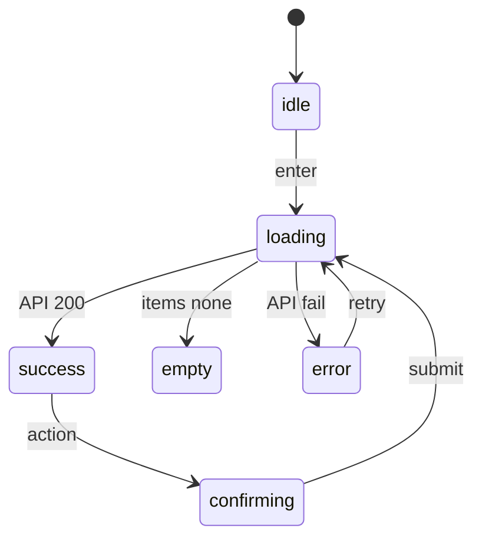
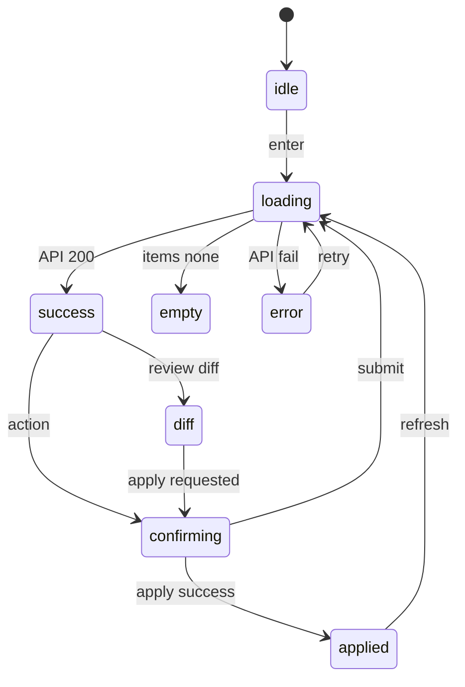

# 09g. 画面ブループリント — 管理層

本書は管理層 8 routes と AdminSidebar を、後続 task-15 / task-16 / task-17 が迷わず実装できる粒度で固定する screen blueprint 正本である。
視覚値の直書きは置かず、token 名、primitive 名、API contract、状態遷移、a11y、操作手順だけを扱う。

| route | section | owner task |
| --- | --- | --- |
| `/(admin)/admin` | §2 | task-15 |
| `/(admin)/admin/members` | §3 | task-15 |
| `/(admin)/admin/tags` | §4 | task-16 |
| `/(admin)/admin/meetings` | §5 | task-16 |
| `/(admin)/admin/schema` | §6 | task-17 |
| `/(admin)/admin/requests` | §7 | task-16 |
| `/(admin)/admin/identity-conflicts` | §8 | task-17 |
| `/(admin)/admin/audit` | §9 | task-17 |

既存実装には補助 route `/(admin)/admin/dashboard/attendance`（出席分析）が存在する。これは UT-02A attendance dashboard analytics の既存成果物であり、本書の admin 8 routes blueprint には含めない。ただし AdminSidebar の実装順序では dashboard 直後に保持し、task-21 / task-15 / task-16 / task-17 は削除・上書きしない。

## 1. AdminSidebar

AdminSidebar は全 admin 画面の共通入口であり、各画面は Sidebar を再定義せず §1 を参照する。

### 1.1 prototype 由来

- 出典は `docs/00-getting-started-manual/claude-design-prototype/pages-admin.jsx` の sidebar 相当箇所。
- 本書では JSX の視覚値を転記せず、nav item、active 判定、badge 入力、logout 導線の構造だけを固定する。
- 実装時は task-15 の `(admin)/layout.tsx` が唯一の配置 owner となる。
- `apps/web` は admin API または web server helper を通じて取得し、D1 へ直接触れない。

### 1.2 nav 項目

| order | label | route | icon key | badge source |
| --- | --- | --- | --- | --- |
| 1 | ダッシュボード | `/(admin)/admin` | `barChart` | none |
| 2 | 出席分析 | `/(admin)/admin/dashboard/attendance` | `barChart` | none |
| 3 | 会員管理 | `/(admin)/admin/members` | `users` | none |
| 4 | タグキュー | `/(admin)/admin/tags` | `tag` | untagged count |
| 5 | schema | `/(admin)/admin/schema` | `gitCompare` | unresolved count |
| 6 | 開催日 | `/(admin)/admin/meetings` | `calendar` | none |
| 7 | 依頼キュー | `/(admin)/admin/requests` | `inbox` | pending count |
| 8 | Identity 重複 | `/(admin)/admin/identity-conflicts` | `userCheck` | conflict count |
| 9 | 監査ログ | `/(admin)/admin/audit` | `fileText` | none |

### 1.3 active state

- active 判定は route key の完全一致で行う。
- active item には `aria-current="page"` を付ける。
- badge が 0 件のときは描画しない。
- keyboard focus は nav item の DOM 順序に従う。
- collapsed / drawer 表現は 09h shell 正本に委譲し、本書では nav contract だけを固定する。

### 1.4 token / primitive 参照

- 色、余白、影、角丸、文字サイズは `--ubm-*` token と 09b / 09c の primitive 名で参照する。
- 本書には具体値を置かない。
- button は 09c Button、badge は 09c Badge、icon は 09d icon registry を使う。
- layout shell の breakpoint と drawer 動作は 09h を参照する。

## 2. /(admin)/admin — 管理ダッシュボード

Sidebar は §1 を参照し、本画面内で AdminSidebar を再定義しない。

### 2.1 prototype 由来 / 派生ルール

- source: prototype AdminDashboardPage
- owner: task-15
- layout pattern: KPI Grid + status summary + recent action
- prototype 掲載画面は構造、見出し、ボタン、空状態、エラー状態の意味を維持する。
- 派生画面は phase-3 の pattern 名と admin API table を正本とし、新規 primitive を作らない。
- page root は admin shell の content slot に入る単一 screen とする。
- loading / empty / error / success を必ず別 state として扱う。
- optimistic update は行わず、成功応答後に一覧を再取得する。
- 管理者向け説明文は短く、操作対象と結果を先に示す。
- destructive action は confirm step を通す。

### 2.2 コピー原文

- page title: 管理ダッシュボード
- route label: /(admin)/admin
- primary action は画面の主目的に合わせて 1 つだけ置く。
- secondary action は refresh / export / filter reset の順で置く。
- empty copy は「対象がありません」で終わらせず、次に取る操作を示す。
- error copy は retry と support handoff を含める。
- toast success は操作対象名と結果を含める。
- toast failure は API error code と再試行可否を含める。
- button label は動詞で始める。
- filter placeholder は検索対象の列名を含める。
- drawer / modal title は対象 record の識別名を含める。
- confirm copy は不可逆性と戻し方を明示する。

### 2.3 状態遷移

### 2.4 API 表

| 用途 | API | method | response 期待 shape |
| --- | --- | --- | --- |
| ダッシュボード集約 | `/admin/dashboard` | GET | kpi / distribution / recent actions |

### 2.5 props / state

| name | type | scope |
| --- | --- | --- |
| `items` | array | screen data |
| `filters` | object | URL query mirror |
| `selectedId` | string nullable | drawer or detail selection |
| `pendingAction` | object nullable | confirm target |
| `error` | object nullable | recoverable failure |
| `isLoading` | boolean | request state |
| `canMutate` | boolean | admin role guard result |
| `lastSyncedAt` | string nullable | freshness display |

### 2.6 a11y

- page title は h1 として 1 つだけ置く。
- data table は header cell と row action の keyboard 操作を保証する。
- status change は live region で読み上げ可能にする。
- confirm Modal を使わない画面でも、主要 action の focus order を記録する。
- destructive action は submit button と cancel button を隣接させる。
- disabled reason は tooltip ではなく visible helper text で示す。
- toast だけに重要情報を閉じ込めない。
- route change 後は h1 へ focus を戻す。

### 2.7 操作手順

1. 画面入場時に filters を URL query から復元する。
2. API を呼び出し、loading から success / empty / error のいずれかへ遷移する。
3. 行選択時は detail drawer または compare pane を開く。
4. mutate action は confirm state を経由する。
5. confirm submit 後は API response を検証する。
6. 成功時は一覧再取得、toast、selection clear を同順で実行する。
7. 失敗時は selection を保持し、retry 可能な状態で止める。
8. audit に残る操作は actor / target / before / after の説明を UI copy に含める。
9. bulk action は対象件数と action name を confirm copy に含める。
10. export action は server response の完了を待ってから download affordance を出す。

### 2.8 参照

- primitive: 09c screen primitive catalog
- token: 09b design token catalog
- icon: 09d icon registry
- shell: 09h admin shell and fixtures
- API mapping: ui-prototype-alignment-mvp-recovery phase-3 §2.3
- scope: ui-prototype-alignment-mvp-recovery SCOPE.md
- downstream implementation task: task-15

## 3. /(admin)/admin/members — 会員管理

Sidebar は §1 を参照し、本画面内で AdminSidebar を再定義しない。

### 3.1 prototype 由来 / 派生ルール

- source: prototype AdminMembersPage
- owner: task-15
- layout pattern: FilterBar + Table + Drawer + bulk action
- prototype 掲載画面は構造、見出し、ボタン、空状態、エラー状態の意味を維持する。
- 派生画面は phase-3 の pattern 名と admin API table を正本とし、新規 primitive を作らない。
- page root は admin shell の content slot に入る単一 screen とする。
- loading / empty / error / success を必ず別 state として扱う。
- optimistic update は行わず、成功応答後に一覧を再取得する。
- 管理者向け説明文は短く、操作対象と結果を先に示す。
- destructive action は confirm step を通す。

### 3.2 コピー原文

- page title: 会員管理
- route label: /(admin)/admin/members
- primary action は画面の主目的に合わせて 1 つだけ置く。
- secondary action は refresh / export / filter reset の順で置く。
- empty copy は「対象がありません」で終わらせず、次に取る操作を示す。
- error copy は retry と support handoff を含める。
- toast success は操作対象名と結果を含める。
- toast failure は API error code と再試行可否を含める。
- button label は動詞で始める。
- filter placeholder は検索対象の列名を含める。
- drawer / modal title は対象 record の識別名を含める。
- confirm copy は不可逆性と戻し方を明示する。

### 3.3 状態遷移

### 3.4 API 表

| 用途 | API | method | response 期待 shape |
| --- | --- | --- | --- |
| 一覧 | `/admin/members?...` | GET | items / total |
| status 変更 | `/admin/member-status` | POST | ok |
| 削除 | `/admin/member-delete` | POST | ok |
| 詳細 / notes | `/admin/member-notes/:id` | GET | notes |

### 3.5 props / state

| name | type | scope |
| --- | --- | --- |
| `items` | array | screen data |
| `filters` | object | URL query mirror |
| `selectedId` | string nullable | drawer or detail selection |
| `pendingAction` | object nullable | confirm target |
| `error` | object nullable | recoverable failure |
| `isLoading` | boolean | request state |
| `canMutate` | boolean | admin role guard result |
| `lastSyncedAt` | string nullable | freshness display |

### 3.6 a11y

- page title は h1 として 1 つだけ置く。
- data table は header cell と row action の keyboard 操作を保証する。
- status change は live region で読み上げ可能にする。
- confirm Modal は `role="dialog"` を持つ。
- confirm Modal は `aria-modal="true"` を持つ。
- confirm Modal は focus trap を持つ。
- confirm Modal は Esc close を持つ。
- destructive action は submit button と cancel button を隣接させる。
- disabled reason は tooltip ではなく visible helper text で示す。
- toast だけに重要情報を閉じ込めない。
- route change 後は h1 へ focus を戻す。

### 3.7 操作手順

1. 画面入場時に filters を URL query から復元する。
2. API を呼び出し、loading から success / empty / error のいずれかへ遷移する。
3. 行選択時は detail drawer または compare pane を開く。
4. mutate action は confirm state を経由する。
5. confirm submit 後は API response を検証する。
6. 成功時は一覧再取得、toast、selection clear を同順で実行する。
7. 失敗時は selection を保持し、retry 可能な状態で止める。
8. audit に残る操作は actor / target / before / after の説明を UI copy に含める。
9. bulk action は対象件数と action name を confirm copy に含める。
10. export action は server response の完了を待ってから download affordance を出す。

### 3.8 参照

- primitive: 09c screen primitive catalog
- token: 09b design token catalog
- icon: 09d icon registry
- shell: 09h admin shell and fixtures
- API mapping: ui-prototype-alignment-mvp-recovery phase-3 §2.3
- scope: ui-prototype-alignment-mvp-recovery SCOPE.md
- downstream implementation task: task-15

## 4. /(admin)/admin/tags — タグ割当キュー

Sidebar は §1 を参照し、本画面内で AdminSidebar を再定義しない。

### 4.1 prototype 由来 / 派生ルール

- source: prototype AdminTagsPage
- owner: task-16
- layout pattern: Queue list + detail editor + approve reject
- prototype 掲載画面は構造、見出し、ボタン、空状態、エラー状態の意味を維持する。
- 派生画面は phase-3 の pattern 名と admin API table を正本とし、新規 primitive を作らない。
- page root は admin shell の content slot に入る単一 screen とする。
- loading / empty / error / success を必ず別 state として扱う。
- optimistic update は行わず、成功応答後に一覧を再取得する。
- 管理者向け説明文は短く、操作対象と結果を先に示す。
- destructive action は confirm step を通す。

### 4.2 コピー原文

- page title: タグ割当キュー
- route label: /(admin)/admin/tags
- primary action は画面の主目的に合わせて 1 つだけ置く。
- secondary action は refresh / export / filter reset の順で置く。
- empty copy は「対象がありません」で終わらせず、次に取る操作を示す。
- error copy は retry と support handoff を含める。
- toast success は操作対象名と結果を含める。
- toast failure は API error code と再試行可否を含める。
- button label は動詞で始める。
- filter placeholder は検索対象の列名を含める。
- drawer / modal title は対象 record の識別名を含める。
- confirm copy は不可逆性と戻し方を明示する。

### 4.3 状態遷移

### 4.4 API 表

| 用途 | API | method | response 期待 shape |
| --- | --- | --- | --- |
| キュー | `/admin/tags-queue` | GET | items |
| 採否 | `/admin/tags-queue/:id/decision` | POST | ok |

### 4.5 props / state

| name | type | scope |
| --- | --- | --- |
| `items` | array | screen data |
| `filters` | object | URL query mirror |
| `selectedId` | string nullable | drawer or detail selection |
| `pendingAction` | object nullable | confirm target |
| `error` | object nullable | recoverable failure |
| `isLoading` | boolean | request state |
| `canMutate` | boolean | admin role guard result |
| `lastSyncedAt` | string nullable | freshness display |

### 4.6 a11y

- page title は h1 として 1 つだけ置く。
- data table は header cell と row action の keyboard 操作を保証する。
- status change は live region で読み上げ可能にする。
- confirm Modal は `role="dialog"` を持つ。
- confirm Modal は `aria-modal="true"` を持つ。
- confirm Modal は focus trap を持つ。
- confirm Modal は Esc close を持つ。
- destructive action は submit button と cancel button を隣接させる。
- disabled reason は tooltip ではなく visible helper text で示す。
- toast だけに重要情報を閉じ込めない。
- route change 後は h1 へ focus を戻す。

### 4.7 操作手順

1. 画面入場時に filters を URL query から復元する。
2. API を呼び出し、loading から success / empty / error のいずれかへ遷移する。
3. 行選択時は detail drawer または compare pane を開く。
4. mutate action は confirm state を経由する。
5. confirm submit 後は API response を検証する。
6. 成功時は一覧再取得、toast、selection clear を同順で実行する。
7. 失敗時は selection を保持し、retry 可能な状態で止める。
8. audit に残る操作は actor / target / before / after の説明を UI copy に含める。
9. bulk action は対象件数と action name を confirm copy に含める。
10. export action は server response の完了を待ってから download affordance を出す。

### 4.8 参照

- primitive: 09c screen primitive catalog
- token: 09b design token catalog
- icon: 09d icon registry
- shell: 09h admin shell and fixtures
- API mapping: ui-prototype-alignment-mvp-recovery phase-3 §2.3
- scope: ui-prototype-alignment-mvp-recovery SCOPE.md
- downstream implementation task: task-16

## 5. /(admin)/admin/meetings — 開催日

> 派生元: phase-3 §3 §5.4
Sidebar は §1 を参照し、本画面内で AdminSidebar を再定義しない。

### 5.1 prototype 由来 / 派生ルール

- source: phase-3 §3 §5.4 admin CRUD 派生
- owner: task-16
- layout pattern: Table + Modal Form + attendance reference
- prototype 掲載画面は構造、見出し、ボタン、空状態、エラー状態の意味を維持する。
- 派生画面は phase-3 の pattern 名と admin API table を正本とし、新規 primitive を作らない。
- page root は admin shell の content slot に入る単一 screen とする。
- loading / empty / error / success を必ず別 state として扱う。
- optimistic update は行わず、成功応答後に一覧を再取得する。
- 管理者向け説明文は短く、操作対象と結果を先に示す。
- destructive action は confirm step を通す。

### 5.2 コピー原文

- page title: 開催日
- route label: /(admin)/admin/meetings
- primary action は画面の主目的に合わせて 1 つだけ置く。
- secondary action は refresh / export / filter reset の順で置く。
- empty copy は「対象がありません」で終わらせず、次に取る操作を示す。
- error copy は retry と support handoff を含める。
- toast success は操作対象名と結果を含める。
- toast failure は API error code と再試行可否を含める。
- button label は動詞で始める。
- filter placeholder は検索対象の列名を含める。
- drawer / modal title は対象 record の識別名を含める。
- confirm copy は不可逆性と戻し方を明示する。

### 5.3 状態遷移

### 5.4 API 表

| 用途 | API | method | response 期待 shape |
| --- | --- | --- | --- |
| 一覧 | `/admin/meetings` | GET | items |
| 作成 | `/admin/meetings` | POST | id |
| 更新 | `/admin/meetings/:id` | PATCH | ok |
| 出欠（参考） | `/admin/attendance` | GET | items |

### 5.5 props / state

| name | type | scope |
| --- | --- | --- |
| `items` | array | screen data |
| `filters` | object | URL query mirror |
| `selectedId` | string nullable | drawer or detail selection |
| `pendingAction` | object nullable | confirm target |
| `error` | object nullable | recoverable failure |
| `isLoading` | boolean | request state |
| `canMutate` | boolean | admin role guard result |
| `lastSyncedAt` | string nullable | freshness display |

### 5.6 a11y

- page title は h1 として 1 つだけ置く。
- data table は header cell と row action の keyboard 操作を保証する。
- status change は live region で読み上げ可能にする。
- confirm Modal は `role="dialog"` を持つ。
- confirm Modal は `aria-modal="true"` を持つ。
- confirm Modal は focus trap を持つ。
- confirm Modal は Esc close を持つ。
- destructive action は submit button と cancel button を隣接させる。
- disabled reason は tooltip ではなく visible helper text で示す。
- toast だけに重要情報を閉じ込めない。
- route change 後は h1 へ focus を戻す。

### 5.7 操作手順

1. 画面入場時に filters を URL query から復元する。
2. API を呼び出し、loading から success / empty / error のいずれかへ遷移する。
3. 行選択時は detail drawer または compare pane を開く。
4. mutate action は confirm state を経由する。
5. confirm submit 後は API response を検証する。
6. 成功時は一覧再取得、toast、selection clear を同順で実行する。
7. 失敗時は selection を保持し、retry 可能な状態で止める。
8. audit に残る操作は actor / target / before / after の説明を UI copy に含める。
9. bulk action は対象件数と action name を confirm copy に含める。
10. export action は server response の完了を待ってから download affordance を出す。

### 5.8 参照

- primitive: 09c screen primitive catalog
- token: 09b design token catalog
- icon: 09d icon registry
- shell: 09h admin shell and fixtures
- API mapping: ui-prototype-alignment-mvp-recovery phase-3 §2.3
- scope: ui-prototype-alignment-mvp-recovery SCOPE.md
- downstream implementation task: task-16

## 6. /(admin)/admin/schema — スキーマ差分レビュー

Sidebar は §1 を参照し、本画面内で AdminSidebar を再定義しない。

### 6.1 prototype 由来 / 派生ルール

- source: prototype SchemaDiffPage
- owner: task-17
- layout pattern: Diff list + alias form + two step apply
- prototype 掲載画面は構造、見出し、ボタン、空状態、エラー状態の意味を維持する。
- 派生画面は phase-3 の pattern 名と admin API table を正本とし、新規 primitive を作らない。
- page root は admin shell の content slot に入る単一 screen とする。
- loading / empty / error / success を必ず別 state として扱う。
- optimistic update は行わず、成功応答後に一覧を再取得する。
- 管理者向け説明文は短く、操作対象と結果を先に示す。
- destructive action は confirm step を通す。

### 6.2 コピー原文

- page title: スキーマ差分レビュー
- route label: /(admin)/admin/schema
- primary action は画面の主目的に合わせて 1 つだけ置く。
- secondary action は refresh / export / filter reset の順で置く。
- empty copy は「対象がありません」で終わらせず、次に取る操作を示す。
- error copy は retry と support handoff を含める。
- toast success は操作対象名と結果を含める。
- toast failure は API error code と再試行可否を含める。
- button label は動詞で始める。
- filter placeholder は検索対象の列名を含める。
- drawer / modal title は対象 record の識別名を含める。
- confirm copy は不可逆性と戻し方を明示する。

### 6.3 状態遷移

### 6.4 API 表

| 用途 | API | method | response 期待 shape |
| --- | --- | --- | --- |
| 現状と最新の差分 | `/admin/schema` | GET | current / latest / diff |
| 適用 | `/admin/sync-schema` | POST | ok |
| Form / Sheets sync | `/admin/sync` / `/admin/responses-sync` | POST | ok / syncedAt |

### 6.5 props / state

| name | type | scope |
| --- | --- | --- |
| `items` | array | screen data |
| `filters` | object | URL query mirror |
| `selectedId` | string nullable | drawer or detail selection |
| `pendingAction` | object nullable | confirm target |
| `error` | object nullable | recoverable failure |
| `isLoading` | boolean | request state |
| `canMutate` | boolean | admin role guard result |
| `lastSyncedAt` | string nullable | freshness display |

### 6.6 a11y

- page title は h1 として 1 つだけ置く。
- data table は header cell と row action の keyboard 操作を保証する。
- status change は live region で読み上げ可能にする。
- confirm Modal は `role="dialog"` を持つ。
- confirm Modal は `aria-modal="true"` を持つ。
- confirm Modal は focus trap を持つ。
- confirm Modal は Esc close を持つ。
- destructive action は submit button と cancel button を隣接させる。
- disabled reason は tooltip ではなく visible helper text で示す。
- toast だけに重要情報を閉じ込めない。
- route change 後は h1 へ focus を戻す。

### 6.7 操作手順

1. 画面入場時に filters を URL query から復元する。
2. API を呼び出し、loading から success / empty / error のいずれかへ遷移する。
3. 行選択時は detail drawer または compare pane を開く。
4. mutate action は confirm state を経由する。
5. confirm submit 後は API response を検証する。
6. 成功時は一覧再取得、toast、selection clear を同順で実行する。
7. 失敗時は selection を保持し、retry 可能な状態で止める。
8. audit に残る操作は actor / target / before / after の説明を UI copy に含める。
9. bulk action は対象件数と action name を confirm copy に含める。
10. export action は server response の完了を待ってから download affordance を出す。

### 6.8 参照

- primitive: 09c screen primitive catalog
- token: 09b design token catalog
- icon: 09d icon registry
- shell: 09h admin shell and fixtures
- API mapping: ui-prototype-alignment-mvp-recovery phase-3 §2.3
- scope: ui-prototype-alignment-mvp-recovery SCOPE.md
- downstream implementation task: task-17

## 7. /(admin)/admin/requests — 依頼キュー

> 派生元: phase-3 §3 §5.3
Sidebar は §1 を参照し、本画面内で AdminSidebar を再定義しない。

### 7.1 prototype 由来 / 派生ルール

- source: phase-3 §3 §5.3 admin queue 派生
- owner: task-16
- layout pattern: Queue table + detail drawer + approve reject
- prototype 掲載画面は構造、見出し、ボタン、空状態、エラー状態の意味を維持する。
- 派生画面は phase-3 の pattern 名と admin API table を正本とし、新規 primitive を作らない。
- page root は admin shell の content slot に入る単一 screen とする。
- loading / empty / error / success を必ず別 state として扱う。
- optimistic update は行わず、成功応答後に一覧を再取得する。
- 管理者向け説明文は短く、操作対象と結果を先に示す。
- destructive action は confirm step を通す。

### 7.2 コピー原文

- page title: 依頼キュー
- route label: /(admin)/admin/requests
- primary action は画面の主目的に合わせて 1 つだけ置く。
- secondary action は refresh / export / filter reset の順で置く。
- empty copy は「対象がありません」で終わらせず、次に取る操作を示す。
- error copy は retry と support handoff を含める。
- toast success は操作対象名と結果を含める。
- toast failure は API error code と再試行可否を含める。
- button label は動詞で始める。
- filter placeholder は検索対象の列名を含める。
- drawer / modal title は対象 record の識別名を含める。
- confirm copy は不可逆性と戻し方を明示する。

### 7.3 状態遷移

### 7.4 API 表

| 用途 | API | method | response 期待 shape |
| --- | --- | --- | --- |
| キュー | `/admin/requests?status=&type=&limit=&cursor=` | GET | items / nextCursor |
| 採否 | `/admin/requests/:noteId/resolve` | POST | ok |

### 7.5 props / state

| name | type | scope |
| --- | --- | --- |
| `items` | array | screen data |
| `filters` | object | URL query mirror |
| `selectedId` | string nullable | drawer or detail selection |
| `pendingAction` | object nullable | confirm target |
| `error` | object nullable | recoverable failure |
| `isLoading` | boolean | request state |
| `canMutate` | boolean | admin role guard result |
| `lastSyncedAt` | string nullable | freshness display |

### 7.6 a11y

- page title は h1 として 1 つだけ置く。
- data table は header cell と row action の keyboard 操作を保証する。
- status change は live region で読み上げ可能にする。
- confirm Modal は `role="dialog"` を持つ。
- confirm Modal は `aria-modal="true"` を持つ。
- confirm Modal は focus trap を持つ。
- confirm Modal は Esc close を持つ。
- destructive action は submit button と cancel button を隣接させる。
- disabled reason は tooltip ではなく visible helper text で示す。
- toast だけに重要情報を閉じ込めない。
- route change 後は h1 へ focus を戻す。

### 7.7 操作手順

1. 画面入場時に filters を URL query から復元する。
2. API を呼び出し、loading から success / empty / error のいずれかへ遷移する。
3. 行選択時は detail drawer または compare pane を開く。
4. mutate action は confirm state を経由する。
5. confirm submit 後は API response を検証する。
6. 成功時は一覧再取得、toast、selection clear を同順で実行する。
7. 失敗時は selection を保持し、retry 可能な状態で止める。
8. audit に残る操作は actor / target / before / after の説明を UI copy に含める。
9. bulk action は対象件数と action name を confirm copy に含める。
10. export action は server response の完了を待ってから download affordance を出す。

### 7.8 参照

- primitive: 09c screen primitive catalog
- token: 09b design token catalog
- icon: 09d icon registry
- shell: 09h admin shell and fixtures
- API mapping: ui-prototype-alignment-mvp-recovery phase-3 §2.3
- scope: ui-prototype-alignment-mvp-recovery SCOPE.md
- downstream implementation task: task-16

## 8. /(admin)/admin/identity-conflicts — 同一人物コンフリクト

> 派生元: phase-3 §3 §5.6
Sidebar は §1 を参照し、本画面内で AdminSidebar を再定義しない。

### 8.1 prototype 由来 / 派生ルール

- source: phase-3 §3 §5.6 admin compare 派生
- owner: task-17
- layout pattern: Two column compare + resolve action
- prototype 掲載画面は構造、見出し、ボタン、空状態、エラー状態の意味を維持する。
- 派生画面は phase-3 の pattern 名と admin API table を正本とし、新規 primitive を作らない。
- page root は admin shell の content slot に入る単一 screen とする。
- loading / empty / error / success を必ず別 state として扱う。
- optimistic update は行わず、成功応答後に一覧を再取得する。
- 管理者向け説明文は短く、操作対象と結果を先に示す。
- destructive action は confirm step を通す。

### 8.2 コピー原文

- page title: 同一人物コンフリクト
- route label: /(admin)/admin/identity-conflicts
- primary action は画面の主目的に合わせて 1 つだけ置く。
- secondary action は refresh / export / filter reset の順で置く。
- empty copy は「対象がありません」で終わらせず、次に取る操作を示す。
- error copy は retry と support handoff を含める。
- toast success は操作対象名と結果を含める。
- toast failure は API error code と再試行可否を含める。
- button label は動詞で始める。
- filter placeholder は検索対象の列名を含める。
- drawer / modal title は対象 record の識別名を含める。
- confirm copy は不可逆性と戻し方を明示する。

### 8.3 状態遷移

### 8.4 API 表

| 用途 | API | method | response 期待 shape |
| --- | --- | --- | --- |
| ペア一覧 | `/admin/identity-conflicts` | GET | items |
| 統合 | `/admin/identity-conflicts/:id/merge` | POST | merge result |
| 棄却 | `/admin/identity-conflicts/:id/dismiss` | POST | dismissedAt |

### 8.5 props / state

| name | type | scope |
| --- | --- | --- |
| `items` | array | screen data |
| `filters` | object | URL query mirror |
| `selectedId` | string nullable | drawer or detail selection |
| `pendingAction` | object nullable | confirm target |
| `error` | object nullable | recoverable failure |
| `isLoading` | boolean | request state |
| `canMutate` | boolean | admin role guard result |
| `lastSyncedAt` | string nullable | freshness display |

### 8.6 a11y

- page title は h1 として 1 つだけ置く。
- data table は header cell と row action の keyboard 操作を保証する。
- status change は live region で読み上げ可能にする。
- confirm Modal は `role="dialog"` を持つ。
- confirm Modal は `aria-modal="true"` を持つ。
- confirm Modal は focus trap を持つ。
- confirm Modal は Esc close を持つ。
- destructive action は submit button と cancel button を隣接させる。
- disabled reason は tooltip ではなく visible helper text で示す。
- toast だけに重要情報を閉じ込めない。
- route change 後は h1 へ focus を戻す。

### 8.7 操作手順

1. 画面入場時に filters を URL query から復元する。
2. API を呼び出し、loading から success / empty / error のいずれかへ遷移する。
3. 行選択時は detail drawer または compare pane を開く。
4. mutate action は confirm state を経由する。
5. confirm submit 後は API response を検証する。
6. 成功時は一覧再取得、toast、selection clear を同順で実行する。
7. 失敗時は selection を保持し、retry 可能な状態で止める。
8. audit に残る操作は actor / target / before / after の説明を UI copy に含める。
9. bulk action は対象件数と action name を confirm copy に含める。
10. export action は server response の完了を待ってから download affordance を出す。

### 8.8 参照

- primitive: 09c screen primitive catalog
- token: 09b design token catalog
- icon: 09d icon registry
- shell: 09h admin shell and fixtures
- API mapping: ui-prototype-alignment-mvp-recovery phase-3 §2.3
- scope: ui-prototype-alignment-mvp-recovery SCOPE.md
- downstream implementation task: task-17

## 9. /(admin)/admin/audit — 監査ログ

> 派生元: phase-3 §3 §5.7
Sidebar は §1 を参照し、本画面内で AdminSidebar を再定義しない。

### 9.1 prototype 由来 / 派生ルール

- source: phase-3 §3 §5.7 admin timeline 派生
- owner: task-17
- layout pattern: FilterBar + Timeline + disclosure
- prototype 掲載画面は構造、見出し、ボタン、空状態、エラー状態の意味を維持する。
- 派生画面は phase-3 の pattern 名と admin API table を正本とし、新規 primitive を作らない。
- page root は admin shell の content slot に入る単一 screen とする。
- loading / empty / error / success を必ず別 state として扱う。
- optimistic update は行わず、成功応答後に一覧を再取得する。
- 管理者向け説明文は短く、操作対象と結果を先に示す。
- destructive action は confirm step を通す。

### 9.2 コピー原文

- page title: 監査ログ
- route label: /(admin)/admin/audit
- primary action は画面の主目的に合わせて 1 つだけ置く。
- secondary action は refresh / export / filter reset の順で置く。
- empty copy は「対象がありません」で終わらせず、次に取る操作を示す。
- error copy は retry と support handoff を含める。
- toast success は操作対象名と結果を含める。
- toast failure は API error code と再試行可否を含める。
- button label は動詞で始める。
- filter placeholder は検索対象の列名を含める。
- drawer / modal title は対象 record の識別名を含める。
- confirm copy は不可逆性と戻し方を明示する。

### 9.3 状態遷移

### 9.4 API 表

| 用途 | API | method | response 期待 shape |
| --- | --- | --- | --- |
| 監査ログ | `/admin/audit?actor=&action=&from=&to=&page=` | GET | items / total |

### 9.5 props / state

| name | type | scope |
| --- | --- | --- |
| `items` | array | screen data |
| `filters` | object | URL query mirror |
| `selectedId` | string nullable | drawer or detail selection |
| `pendingAction` | object nullable | confirm target |
| `error` | object nullable | recoverable failure |
| `isLoading` | boolean | request state |
| `canMutate` | boolean | admin role guard result |
| `lastSyncedAt` | string nullable | freshness display |

### 9.6 a11y

- page title は h1 として 1 つだけ置く。
- data table は header cell と row action の keyboard 操作を保証する。
- status change は live region で読み上げ可能にする。
- confirm Modal は `role="dialog"` を持つ。
- confirm Modal は `aria-modal="true"` を持つ。
- confirm Modal は focus trap を持つ。
- confirm Modal は Esc close を持つ。
- destructive action は submit button と cancel button を隣接させる。
- disabled reason は tooltip ではなく visible helper text で示す。
- toast だけに重要情報を閉じ込めない。
- route change 後は h1 へ focus を戻す。

### 9.7 操作手順

1. 画面入場時に filters を URL query から復元する。
2. API を呼び出し、loading から success / empty / error のいずれかへ遷移する。
3. 行選択時は detail drawer または compare pane を開く。
4. mutate action は confirm state を経由する。
5. confirm submit 後は API response を検証する。
6. 成功時は一覧再取得、toast、selection clear を同順で実行する。
7. 失敗時は selection を保持し、retry 可能な状態で止める。
8. audit に残る操作は actor / target / before / after の説明を UI copy に含める。
9. bulk action は対象件数と action name を confirm copy に含める。
10. export action は server response の完了を待ってから download affordance を出す。

### 9.8 参照

- primitive: 09c screen primitive catalog
- token: 09b design token catalog
- icon: 09d icon registry
- shell: 09h admin shell and fixtures
- API mapping: ui-prototype-alignment-mvp-recovery phase-3 §2.3
- scope: ui-prototype-alignment-mvp-recovery SCOPE.md
- downstream implementation task: task-17

## 99. 不採用要素

- TweaksPanel は admin production UI に持ち込まない。
- theme switcher は admin production UI に持ち込まない。
- data-theme は admin production UI に持ち込まない。
- prototype 専用の mock control は fixture task に閉じる。
- visual token の具体値は 09b に閉じ、本書には置かない。
- shell breakpoint の具体挙動は 09h に閉じ、本書には重複しない。
- 新規 primitive 名は 09c を更新するまでは本書に追加しない。

### 99.1 検証メモ

- §1 は AdminSidebar の唯一正本。
- §2〜§9 は各 8 サブセクションで統一。
- §5 / §7 / §8 / §9 は phase-3 派生元を明記。
- API 表は phase-3 §2.3 の method + endpoint と一致させる。
- a11y strings は confirm を持つ 6 画面に明記。
- schema apply は diff → confirming → applied の二段確認を §6.3 に含める。
