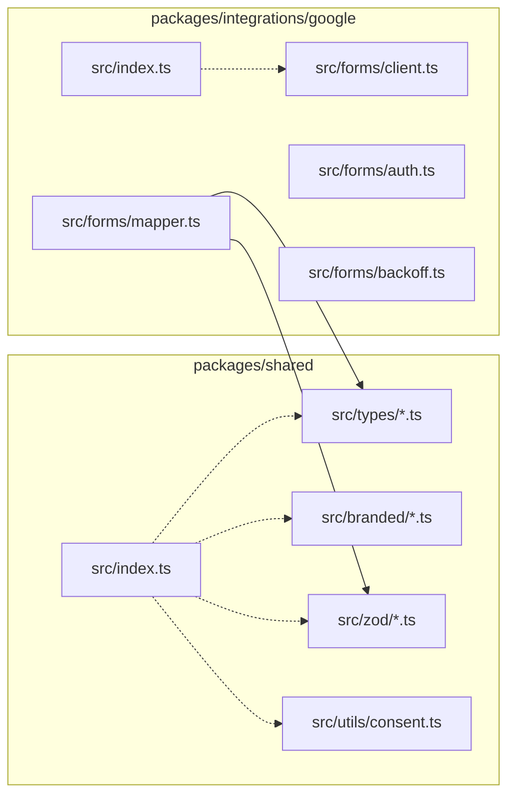
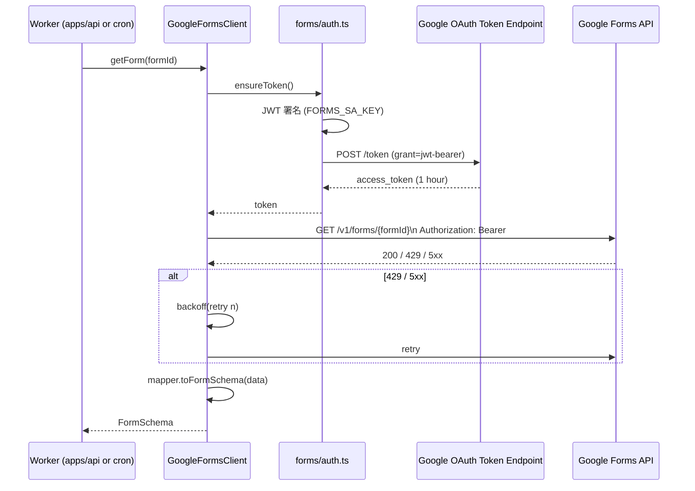

# Phase 2: 設計

## メタ情報

| 項目 | 値 |
| --- | --- |
| タスク名 | zod-view-models-and-google-forms-api-client |
| Wave | 1 |
| 実行種別 | parallel |
| Phase 番号 | 2 / 13 |
| 作成日 | 2026-04-26 |
| 上流 Phase | 1 (要件定義) |
| 下流 Phase | 3 (設計レビュー) |
| 状態 | pending |

## 目的

package 構造 / module 分割 / Forms 認証 flow / zod schema レイアウト / 依存矢印を確定し、Phase 5 の実装ランブックの設計図を完成させる。

## 実行タスク

1. package 構造（`packages/shared`, `packages/integrations/google`）の構造図化
2. module 分割（types / branded / zod / utils / forms）と export barrel の決定
3. dependency matrix（package 間の許容/禁止）
4. Forms 認証 flow（Mermaid sequence diagram）
5. zod schema レイアウト（field schema 31 種 + viewmodel parser 10 種）
6. ESLint rule（`@ubm/integrations/google` を `apps/web` から import 禁止）の rule 設計
7. outputs/phase-02/main.md + module-design.md 生成

## 参照資料

| 種別 | パス | 用途 |
| --- | --- | --- |
| 必須 | outputs/phase-01/main.md | 4 層型 / Forms I/F |
| 必須 | doc/00-getting-started-manual/specs/04-types.md | 型詳細 |
| 必須 | doc/00-getting-started-manual/specs/02-auth.md | サービスアカウント flow |
| 必須 | doc/00-getting-started-manual/specs/03-data-fetching.md | Forms API fetch contract |

## 統合テスト連携

| Phase | 内容 |
| --- | --- |
| 4 | テスト戦略（型 / zod / Forms mock） |
| 5 | 実装ランブック（package init → 型 → zod → Forms） |

## 多角的チェック観点（不変条件参照）

- **#1**: schema 層は generic 構造、question 固有名を hardcode しない
- **#5**: dependency matrix で `apps/web → integrations/google` を 禁止
- **#7**: branded type 定義で `MemberId !== ResponseId` を型レベル保証

## サブタスク管理

| # | サブタスク | 担当 Phase | 状態 |
| --- | --- | --- | --- |
| 1 | package 構造 | 2 | pending |
| 2 | module 分割 | 2 | pending |
| 3 | dependency matrix | 2 | pending |
| 4 | Forms 認証 flow | 2 | pending |
| 5 | zod レイアウト | 2 | pending |
| 6 | ESLint rule | 2 | pending |
| 7 | outputs | 2 | pending |

## 成果物

| 種別 | パス |
| --- | --- |
| ドキュメント | outputs/phase-02/main.md |
| ドキュメント | outputs/phase-02/module-design.md |
| ドキュメント | outputs/phase-02/eslint-boundary-rule.md |
| メタ | artifacts.json |

## 完了条件

- [ ] package 構造 Mermaid 完成
- [ ] dependency matrix 完成
- [ ] Forms 認証 sequence diagram 完成
- [ ] zod レイアウト一覧表完成

## タスク 100% 実行確認【必須】

- [ ] 全 7 サブタスク completed
- [ ] outputs/phase-02/ 3 ファイル
- [ ] artifacts.json 更新
- [ ] 不変条件 #1/#5/#7 設計反映確認

## 次 Phase

- 次: Phase 3
- 引き継ぎ事項: 設計図 + dependency matrix
- ブロック条件: design レビュー否決

## package 構造

## module 分割

### packages/shared

| ファイル | 内容 |
| --- | --- |
| `src/branded/index.ts` | 7 branded type（MemberId / ResponseId / ResponseEmail / StableKey / SessionId / TagId / AdminId） |
| `src/types/schema.ts` | FormSchema / FormSection / FormQuestion |
| `src/types/response.ts` | FormResponse / FormResponseAnswer |
| `src/types/identity.ts` | MemberIdentity / MemberStatus |
| `src/types/viewmodels.ts` | 10 viewmodel |
| `src/zod/field.ts` | 31 項目 zod field schema |
| `src/zod/response.ts` | FormResponseSchema |
| `src/zod/identity.ts` | MemberIdentitySchema / MemberStatusSchema |
| `src/zod/viewmodels.ts` | 10 viewmodel parser |
| `src/utils/consent.ts` | consent normalizer |
| `src/index.ts` | barrel export |

### packages/integrations/google

| ファイル | 内容 |
| --- | --- |
| `src/forms/auth.ts` | service account JWT → access token |
| `src/forms/client.ts` | getForm / listResponses 実装 |
| `src/forms/backoff.ts` | 429 / 5xx exponential backoff |
| `src/forms/mapper.ts` | Google API response → FormSchema / FormResponse 変換 |
| `src/index.ts` | barrel export |

## dependency matrix

| from \ to | shared | integrations/google | apps/api | apps/web |
| --- | :---: | :---: | :---: | :---: |
| shared | self | NO | NO | NO |
| integrations/google | OK | self | NO | NO |
| apps/api | OK | OK | self | NO |
| apps/web | OK | **NO**（不変条件 #5） | OK | self |

## Forms 認証 flow

## zod レイアウト

| schema 名 | 用途 | 適用境界 |
| --- | --- | --- |
| `FormSchemaZ` | Forms API → schema 層 | mapper |
| `FormResponseZ` | Forms API → response 層 | mapper |
| `MemberIdentityZ` | DB row → identity 層 | repository |
| `MemberStatusZ` | DB row → identity 層 | repository |
| `PublicStatsViewZ` 〜 10 種 | API endpoint response | Hono ハンドラ |
| `*RequestZ` | API request body | Hono ハンドラ |

## ESLint rule（boundary 保護）

| rule | 内容 |
| --- | --- |
| `import/no-restricted-paths` | `apps/web/**` から `packages/integrations/google/**` を import 禁止 |
| `import/no-restricted-paths` | `apps/web/**` から `apps/api/**` を import 禁止（不変条件 #5 補強） |
| `@typescript-eslint/no-explicit-any` | viewmodel に any 禁止 |
