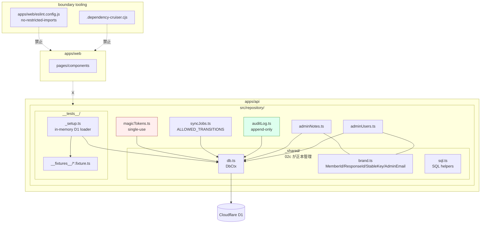

# Phase 2: 設計

## メタ情報

| 項目 | 値 |
| --- | --- |
| タスク名 | admin-notes-audit-sync-jobs-and-data-access-boundary |
| Phase 番号 | 2 / 13 |
| Phase 名称 | 設計 |
| Wave | 2 |
| 実行種別 | parallel |
| 作成日 | 2026-04-26 |
| 上流 | Phase 1 (要件定義) |
| 下流 | Phase 3 (設計レビュー) |
| 状態 | pending |

## 目的

Phase 1 で文章化した責務を、**module 構造 / 型 signature / call graph / dependency matrix / boundary tooling 設定** として確定する。03a/b / 04c / 05a/b / 07c / 08a が「これさえ守れば import できる」状態を作る。

## モジュール構造（Mermaid）



## 公開 interface（型 signature）

### `_shared/brand.ts`（02a/02b と共有、02c が正本）

```ts
declare const MemberIdBrand: unique symbol;
declare const ResponseIdBrand: unique symbol;
declare const StableKeyBrand: unique symbol;
declare const AdminEmailBrand: unique symbol;
declare const MagicTokenBrand: unique symbol;

export type MemberId = string & { readonly [MemberIdBrand]: true };
export type ResponseId = string & { readonly [ResponseIdBrand]: true };
export type StableKey = string & { readonly [StableKeyBrand]: true };
export type AdminEmail = string & { readonly [AdminEmailBrand]: true };
export type MagicTokenValue = string & { readonly [MagicTokenBrand]: true };

export const memberId = (s: string): MemberId => s as MemberId;
export const responseId = (s: string): ResponseId => s as ResponseId;
export const stableKey = (s: string): StableKey => s as StableKey;
export const adminEmail = (s: string): AdminEmail => s as AdminEmail;
export const magicTokenValue = (s: string): MagicTokenValue => s as MagicTokenValue;
```

### `_shared/db.ts`

```ts
export interface DbCtx {
  readonly db: D1Database;
}
export const ctx = (env: { DB: D1Database }): DbCtx => ({ db: env.DB });
```

### `adminUsers.ts`

```ts
export type AdminRole = "owner" | "manager" | "viewer";

export interface AdminUserRow {
  email: AdminEmail;
  role: AdminRole;
  createdAt: string;
  lastSeenAt: string | null;
}

export const findByEmail = (c: DbCtx, e: AdminEmail) => Promise<AdminUserRow | null>;
export const listAll = (c: DbCtx) => Promise<AdminUserRow[]>;
export const touchLastSeen = (c: DbCtx, e: AdminEmail, at: string) => Promise<void>;
// upsert は 01a seed か wrangler 手動投入のみ。本タスクでは write API を提供しない
```

### `adminNotes.ts`

```ts
export interface AdminMemberNoteRow {
  id: string;
  memberId: MemberId; // 対象 member（02a の members.id を参照）
  body: string;
  createdBy: AdminEmail;
  createdAt: string;
  updatedAt: string;
}

export const listByMemberId = (c: DbCtx, mid: MemberId) => Promise<AdminMemberNoteRow[]>;
export const create = (c: DbCtx, input: NewAdminMemberNote) => Promise<AdminMemberNoteRow>;
export const update = (c: DbCtx, id: string, body: string, by: AdminEmail) => Promise<AdminMemberNoteRow>;
export const remove = (c: DbCtx, id: string, by: AdminEmail) => Promise<void>;
// 重要: builder 経路には絶対に呼ばれない。04c admin route のみが呼ぶ
```

### `auditLog.ts`（append-only）

```ts
export interface AuditLogEntry {
  id: string;
  actor: AdminEmail;
  action: string; // 'member.publish_state_changed' / 'member.deleted' / 'tag.queue.resolved' 等
  targetType: "member" | "tag_queue" | "schema_diff" | "meeting" | "system";
  targetId: string | null;
  metadata: Record<string, unknown>;
  occurredAt: string;
}

export const append = (c: DbCtx, e: NewAuditLogEntry) => Promise<AuditLogEntry>;
export const listRecent = (c: DbCtx, limit: number) => Promise<AuditLogEntry[]>;
export const listByActor = (c: DbCtx, actor: AdminEmail, limit: number) => Promise<AuditLogEntry[]>;
export const listByTarget = (c: DbCtx, t: string, id: string, limit: number) => Promise<AuditLogEntry[]>;
// UPDATE / DELETE API は提供しない（append-only を構造で守る）
```

### `syncJobs.ts`

```ts
export type SyncJobKind = "forms_schema" | "forms_response";
export type SyncJobStatus = "running" | "succeeded" | "failed";

const ALLOWED_TRANSITIONS: Record<SyncJobStatus, SyncJobStatus[]> = {
  running: ["succeeded", "failed"],
  succeeded: [],
  failed: [],
};

export interface SyncJobRow {
  id: string;
  kind: SyncJobKind;
  status: SyncJobStatus;
  startedAt: string;
  finishedAt: string | null;
  result: Record<string, unknown> | null;
  errorMessage: string | null;
}

export const start = (c: DbCtx, kind: SyncJobKind) => Promise<SyncJobRow>;
export const succeed = (c: DbCtx, id: string, result: Record<string, unknown>) => Promise<SyncJobRow>;
export const fail = (c: DbCtx, id: string, msg: string) => Promise<SyncJobRow>;
export const findLatest = (c: DbCtx, kind: SyncJobKind) => Promise<SyncJobRow | null>;
export const listRecent = (c: DbCtx, limit: number) => Promise<SyncJobRow[]>;
// status 一方向遷移、逆方向は throw IllegalStateTransition
```

### `magicTokens.ts`（single-use）

```ts
export interface MagicTokenRow {
  token: MagicTokenValue;
  email: string; // member email or admin email
  purpose: "login" | "admin_login";
  expiresAt: string;
  usedAt: string | null;
  createdAt: string;
}

export const issue = (c: DbCtx, input: IssueMagicTokenInput) => Promise<MagicTokenRow>;
export const verify = (c: DbCtx, t: MagicTokenValue) => Promise<MagicTokenRow | null>; // expired or used → null
export const consume = (c: DbCtx, t: MagicTokenValue, at: string) => Promise<{ ok: true; row: MagicTokenRow } | { ok: false; reason: "expired" | "already_used" | "not_found" }>;
// consume は usedAt 設定で single-use を強制
```

### `__tests__/_setup.ts`（02a / 02b 共通利用）

```ts
export interface InMemoryD1 {
  ctx: DbCtx;
  loadFixtures: (paths: string[]) => Promise<void>;
  reset: () => Promise<void>;
}

export const setupD1 = async (): Promise<InMemoryD1> => { /* miniflare D1 */ };
```

## env / 依存マトリクス

| 区分 | キー | 値 / 配置 | 担当 task |
| --- | --- | --- | --- |
| binding | `DB` | D1 binding (wrangler.toml) | 01a |
| boundary | `apps/web` → `apps/api/src/repository/*` 禁止 | `.dependency-cruiser.cjs` | 02c |
| boundary | `apps/web` → `D1Database` import 禁止 | `apps/web/eslint.config.js` no-restricted-imports | 02c |
| 共有 | `_shared/db.ts` / `brand.ts` / `sql.ts` の正本 | apps/api/src/repository/_shared/ | 02c（02a/02b は import） |
| 共有 | `__tests__/_setup.ts` | apps/api/src/repository/__tests__/ | 02c（02a/02b は import） |

## dependency matrix

| from \\ to | adminUsers | adminNotes | auditLog | syncJobs | magicTokens | brand | db | _setup |
| --- | --- | --- | --- | --- | --- | --- | --- | --- |
| adminUsers | — | | | | | ✓ | ✓ | |
| adminNotes | | — | | | | ✓ | ✓ | |
| auditLog | | | — | | | ✓ | ✓ | |
| syncJobs | | | | — | | | ✓ | |
| magicTokens | | | | | — | ✓ | ✓ | |
| _setup | | | | | | | ✓ | — |
| 02a/* | | | | | | ✓ | ✓ | ✓ |
| 02b/* | | | | | | ✓ | ✓ | ✓ |
| apps/web/* | X | X | X | X | X | X | X | X |

`apps/web/*` 行は全列 X。dep-cruiser + ESLint で構造で禁止。

## boundary tooling 設計

### 1. dependency-cruiser config 案

```js
// .dependency-cruiser.cjs（抜粋）
module.exports = {
  forbidden: [
    {
      name: "no-web-to-d1-repository",
      severity: "error",
      from: { path: "^apps/web/" },
      to: { path: "^apps/api/src/repository/" },
    },
    {
      name: "no-web-to-d1-binding",
      severity: "error",
      from: { path: "^apps/web/" },
      to: { path: "(^|/)D1Database(/|$)" },
    },
    {
      name: "no-cross-2a-2b-2c",
      severity: "error",
      from: { path: "^apps/api/src/repository/(members|identities|status|responses|responseSections|responseFields|fieldVisibility|memberTags)\\.ts$" },
      to:   { path: "^apps/api/src/repository/(meetings|attendance|tagDefinitions|tagQueue|schemaVersions|schemaQuestions|schemaDiffQueue|adminUsers|adminNotes|auditLog|syncJobs|magicTokens)\\.ts$" },
    },
    // 同様の rule を 02b → 02a/02c、02c → 02a/02b にも展開（_shared/ は除外）
  ],
  options: { tsConfig: { fileName: "tsconfig.json" } },
};
```

### 2. ESLint config 案（apps/web）

```js
// apps/web/eslint.config.js（抜粋）
export default [
  {
    rules: {
      "no-restricted-imports": ["error", {
        patterns: [
          { group: ["**/apps/api/src/repository/**"], message: "apps/web は repository を直接 import できません。apps/api のエンドポイント経由で取得してください（不変条件 #5）。" },
          { group: ["@cloudflare/workers-types"], importNames: ["D1Database"], message: "D1Database を apps/web で直接扱わないでください。" },
        ],
      }],
    },
  },
];
```

## 実行タスク

1. Mermaid 図を `outputs/phase-02/main.md` に貼る
2. 公開 interface 表を `outputs/phase-02/module-map.md` に貼る
3. dependency matrix を `outputs/phase-02/dependency-matrix.md` に貼る
4. boundary tooling（dep-cruiser config / ESLint rule）案を main.md に追加
5. 02a/02b との `_shared/` 共有合意を main.md に明示

## 参照資料

| 種別 | パス | 用途 |
| --- | --- | --- |
| 必須 | Phase 1 outputs/phase-01/main.md | 責務一覧 |
| 必須 | doc/00-getting-started-manual/specs/02-auth.md | 認証 |
| 必須 | doc/00-getting-started-manual/specs/08-free-database.md | DDL / index |
| 必須 | doc/00-getting-started-manual/specs/11-admin-management.md | admin 機能 |
| 参考 | doc/02-application-implementation/02a-... / 02b-... | 共有 _shared 整合 |

## 統合テスト連携

| 連携先 Phase | 連携内容 |
| --- | --- |
| Phase 3 | alternative 案でこの module 構造の妥当性を検証 |
| Phase 4 | 公開 interface 表から verify suite を起こす |
| Phase 5 | module map と boundary tooling 案を runbook に展開 |

## 多角的チェック観点

| 観点 | 不変条件 # | 確認内容 |
| --- | --- | --- |
| D1 boundary | #5 | dep-cruiser + ESLint の二重防御 module 設計 |
| GAS prototype 昇格防止 | #6 | seed/fixture が dev 範囲のみ、prod 配備対象から除外 |
| admin 本文編集禁止 | #11 | adminNotes / auditLog ともに `member_responses` には触れない |
| view model 分離 | #12 | builder 経路に adminNotes 不在（02a builder の引数受取設計と整合） |
| append-only | — | auditLog に UPDATE/DELETE 不在 |
| single-use | — | magicTokens.consume が usedAt set |
| 状態遷移 | — | syncJobs ALLOWED_TRANSITIONS（02b と統一） |
| 02a/02b 共有 | — | `_shared/` 正本が 02c、相互 import 一方向 |

## サブタスク管理

| # | サブタスク | 担当 Phase | 状態 | 備考 |
| --- | --- | --- | --- | --- |
| 1 | Mermaid 図作成 | 2 | pending | module + boundary |
| 2 | 公開 interface 表 | 2 | pending | 5 repo + brand + db |
| 3 | dependency matrix | 2 | pending | 8x8 + apps/web 行 |
| 4 | boundary tooling 案 | 2 | pending | dep-cruiser + ESLint |
| 5 | _shared 共有合意 | 2 | pending | 02a/02b と同期 |

## 成果物

| 種別 | パス | 説明 |
| --- | --- | --- |
| ドキュメント | outputs/phase-02/main.md | Mermaid + boundary tooling 案 + _shared 合意 |
| ドキュメント | outputs/phase-02/module-map.md | 公開 interface 表 |
| ドキュメント | outputs/phase-02/dependency-matrix.md | 8x8 マトリクス + apps/web |

## 完了条件

- [ ] Mermaid と公開 interface 表が完成
- [ ] dependency matrix に `apps/web → repository` が全 X
- [ ] dep-cruiser + ESLint config 案がレビュー可能形式
- [ ] 02a/02b との `_shared/` 正本合意が記述済み

## タスク100%実行確認【必須】

- [ ] サブタスク 1〜5 が completed
- [ ] outputs/phase-02/{main,module-map,dependency-matrix}.md が配置済み
- [ ] 不変条件 #5 / #6 / #11 / #12 への対応が module 構造で表現
- [ ] artifacts.json の Phase 2 を completed に更新

## 次 Phase

- 次: Phase 3 (設計レビュー)
- 引き継ぎ事項: module 構造 / 公開 interface / dependency matrix / boundary tooling 案
- ブロック条件: `apps/web` 経路に X が抜けている、または auditLog に UPDATE/DELETE が含まれている場合は再設計
