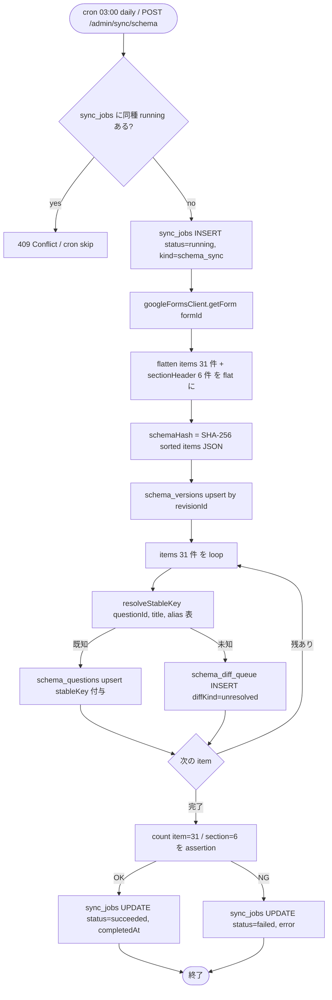

# Phase 2: 設計

## メタ情報

| 項目 | 値 |
| --- | --- |
| タスク名 | 03a-parallel-forms-schema-sync-and-stablekey-alias-queue |
| Phase 番号 | 2 / 13 |
| Phase 名称 | 設計 |
| Wave | 3 |
| Mode | parallel |
| 作成日 | 2026-04-26 |
| 前 Phase | 1（要件定義） |
| 次 Phase | 3（設計レビュー） |
| 状態 | pending |

## 目的

schema sync の module 配置・同期 flow・依存マトリクス・env 一覧を確定する。コード placeholder（関数シグネチャ・SQL・Forms API 呼び出し）を具体に固める。

## 実行タスク

1. apps/api 内の sync module ファイル配置を決める。
2. forms.get → flatten → resolve → upsert → diff queue 投入の flow を Mermaid で書く。
3. `schema_versions` / `schema_questions` / `schema_diff_queue` / `sync_jobs` への SQL を擬似化して outputs/phase-02/main.md に貼る。
4. env / secret を Phase 1 と一致させる（GOOGLE_SERVICE_ACCOUNT_EMAIL / GOOGLE_PRIVATE_KEY / GOOGLE_FORM_ID）。
5. dependency matrix を表化（02a / 02b / 01b → 本タスク → 04c / 07b）。

## 参照資料

| 種別 | パス | 用途 |
| --- | --- | --- |
| 必須 | doc/00-getting-started-manual/specs/01-api-schema.md | items[].questionItem.question.questionId / stableKey |
| 必須 | doc/00-getting-started-manual/specs/03-data-fetching.md | schema sync flow |
| 必須 | doc/00-getting-started-manual/specs/15-infrastructure-runbook.md | cron schedule / sync_jobs ledger |
| 必須 | outputs/phase-01/main.md | scope と AC |
| 参考 | doc/00-getting-started-manual/specs/08-free-database.md | schema_versions / schema_questions / schema_diff_queue 構造 |

## 実行手順

### ステップ 1: module 配置決定
- `apps/api/src/sync/schema/` 配下に以下を置く
  - `forms-schema-sync.ts`（job 関数 entry）
  - `flatten.ts`（forms.get → flat question list）
  - `resolve-stable-key.ts`（既知 stableKey マップ + alias テーブル参照）
  - `diff-queue-writer.ts`（schema_diff_queue への投入）
- `apps/api/src/routes/admin.ts` に `POST /admin/sync/schema` を追加（job 関数を呼ぶだけ）。
- `apps/api/src/cron/index.ts` の cron 1 日 1 回スロットに本 job を登録。

### ステップ 2: 同期 flow
- 後述「構成図 (Mermaid)」を参照。
- 重要点: `revisionId` をキーに upsert（既存なら no-op）。`schemaHash`（items のソート済み JSON の SHA-256）を fingerprint として保存。

### ステップ 3: SQL 擬似化
- 後述「SQL 擬似コード」を参照。

### ステップ 4: env / secret 確認
- 既出の Cloudflare Secrets に追加なし（01-infra で導入済み）。
- 本タスクでは secret に新規 key を作らない。

### ステップ 5: dependency matrix
- 後述「依存マトリクス」を参照。

## 統合テスト連携

| 連携先 Phase | 連携内容 |
| --- | --- |
| Phase 3 | 設計レビュー入力 |
| Phase 4 | module ファイル単位で test 設計 |
| Phase 5 | runbook の手順をモジュールに対応付け |
| Phase 7 | AC matrix の実装側 column を埋める |
| 並列 03b | sync_jobs 排他のロック方式を共通化 |
| 下流 04c | `POST /admin/sync/schema` の handler 内で本 job を呼ぶ約束 |

## 多角的チェック観点

| 観点 | 不変条件番号 | 適用理由 |
| --- | --- | --- |
| stableKey 直書き禁止 | #1 | resolve-stable-key.ts は alias テーブル経由解決 |
| apps/api 限定 | #5 | sync module は apps/api 配下のみ |
| schema 集約 | #14 | diff queue 経由で `/admin/schema` に集約される |
| 無料枠 | #10 | revisionId no-op + 同種 job 排他で過剰実行を抑制 |
| GAS 排除 | #6 | `apps/api/src/sync/` 以下に GAS 由来コードを置かない |

## サブタスク管理

| # | サブタスク | 担当 Phase | 状態 | 備考 |
| --- | --- | --- | --- | --- |
| 1 | module 配置決定 | 2 | pending | apps/api/src/sync/schema/ |
| 2 | Mermaid flow 作成 | 2 | pending | outputs/phase-02/sync-flow.mermaid |
| 3 | SQL 擬似化 | 2 | pending | upsert + diff queue |
| 4 | env 整合確認 | 2 | pending | 新規 secret なし |
| 5 | dependency matrix | 2 | pending | 上流 / 下流 / 並列 |

## 成果物

| 種別 | パス | 説明 |
| --- | --- | --- |
| ドキュメント | outputs/phase-02/main.md | 設計サマリ |
| ドキュメント | outputs/phase-02/sync-flow.mermaid | Mermaid 図のソース |
| メタ | artifacts.json | phase 2 を `completed` に更新 |

## 完了条件

- [ ] module 配置 / flow / SQL 擬似 / env / dependency matrix が outputs/phase-02/main.md に揃っている
- [ ] Mermaid 図が outputs/phase-02/sync-flow.mermaid に独立保存
- [ ] 不変条件 #1 #5 #6 #10 #14 が触れられている
- [ ] artifacts.json の phase 2 が `completed`

## タスク100%実行確認【必須】

- [ ] サブタスク 5 件すべて completed
- [ ] Mermaid 図が 1 図以上ある
- [ ] SQL 擬似コードに upsert / diff queue 投入が両方含まれている
- [ ] dependency matrix に 02a / 02b / 01b / 04c / 07b / 03b が登場
- [ ] 次 Phase 3 の alternative 検討に必要な前提が main.md に揃っている

## 次 Phase

- 次: 3（設計レビュー）
- 引き継ぎ事項: 採用設計 / 代替案候補 / リスク
- ブロック条件: Mermaid・SQL 擬似・dependency matrix のいずれか欠落

## 構成図 (Mermaid)



## 環境変数一覧

| 区分 | 変数名 | 配置 | 担当 |
| --- | --- | --- | --- |
| Forms 認証 | GOOGLE_SERVICE_ACCOUNT_EMAIL | Cloudflare Secrets (apps/api) | 既出（infra 04） |
| Forms 認証 | GOOGLE_PRIVATE_KEY | Cloudflare Secrets (apps/api) | 既出（infra 04） |
| 識別子 | GOOGLE_FORM_ID | Cloudflare Secrets (apps/api) | 既出（infra 04） |

本タスクは新規 secret を導入しない。

## 依存マトリクス

| 種別 | 対象 | 引き渡し物 |
| --- | --- | --- |
| 上流 | 01b | `googleFormsClient.getForm(formId)` の戻り型 |
| 上流 | 02b | `schemaVersionsRepository.upsertByRevisionId()`、`schemaQuestionsRepository.upsertByQuestionId()`、`schemaDiffQueueRepository.enqueue()` |
| 上流 | 02a（弱） | repository 共通 fixture（test 用） |
| 下流 | 04c | `POST /admin/sync/schema` handler から `runSchemaSync()` を呼ぶ |
| 下流 | 07b | `schemaDiffQueueRepository.listUnresolved()` で resolve 対象を読む |
| 並列 | 03b | `sync_jobs` 排他制御（kind 別ロック） |

## module 設計

```
apps/api/src/sync/schema/
├── index.ts                # runSchemaSync() export
├── forms-schema-sync.ts    # job 関数 entry（lock + try/catch + ledger）
├── flatten.ts              # forms.get → flat question list[]
├── resolve-stable-key.ts   # known stableKey map + alias 引き
├── diff-queue-writer.ts    # schema_diff_queue 投入
└── schema-hash.ts          # SHA-256 fingerprint

apps/api/src/routes/admin.ts
└── app.post('/admin/sync/schema', adminGate, async (c) => runSchemaSync(c.env))

apps/api/src/cron/index.ts
└── if (cron === '0 3 * * *') await runSchemaSync(env)
```

## SQL 擬似コード

```sql
-- ledger
INSERT INTO sync_jobs (id, kind, status, started_at)
VALUES (?, 'schema_sync', 'running', strftime('%s','now'));

-- schema_versions upsert by revisionId
INSERT INTO schema_versions (revision_id, form_id, schema_hash, fetched_at, raw_json)
VALUES (?, ?, ?, strftime('%s','now'), ?)
ON CONFLICT(revision_id) DO UPDATE SET fetched_at = excluded.fetched_at;

-- schema_questions upsert by questionId
INSERT INTO schema_questions (question_id, revision_id, section_index, title, kind, options, stable_key, visibility, required)
VALUES (?, ?, ?, ?, ?, ?, ?, ?, ?)
ON CONFLICT(question_id) DO UPDATE SET
  revision_id = excluded.revision_id,
  title       = excluded.title,
  kind        = excluded.kind,
  options     = excluded.options,
  stable_key  = COALESCE(excluded.stable_key, schema_questions.stable_key),
  visibility  = excluded.visibility,
  required    = excluded.required;

-- diff queue 投入
INSERT INTO schema_diff_queue (id, question_id, diff_kind, detected_at, status)
VALUES (?, ?, 'unresolved', strftime('%s','now'), 'open')
ON CONFLICT(question_id) WHERE status = 'open' DO NOTHING;

-- ledger close
UPDATE sync_jobs SET status = 'succeeded', completed_at = strftime('%s','now')
WHERE id = ?;
```

## Forms API call placeholder

```ts
const form = await googleFormsClient.getForm(env.GOOGLE_FORM_ID)
// form.revisionId: string
// form.items[]: Array<{ itemId, title, description, questionItem?, sectionHeaderItem?, pageBreakItem? }>
```
