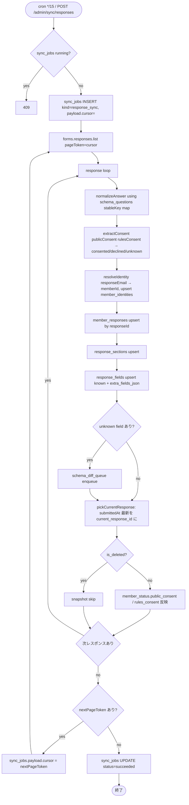

# Phase 2: 設計

## メタ情報

| 項目 | 値 |
| --- | --- |
| タスク名 | 03b-parallel-forms-response-sync-and-current-response-resolver |
| Phase 番号 | 2 / 13 |
| Phase 名称 | 設計 |
| Wave | 3 |
| Mode | parallel |
| 作成日 | 2026-04-26 |
| 前 Phase | 1（要件定義） |
| 次 Phase | 3（設計レビュー） |
| 状態 | pending |

## 目的

response 同期の module 配置 / sync_jobs lock / cursor pagination / current_response 切替 / consent snapshot / unknown field 二重 write の設計を確定する。

## 実行タスク

1. apps/api 内 module 配置決定。
2. 同期 flow を Mermaid 化。
3. SQL 擬似化（upsert / current_response / consent snapshot）。
4. env / secret（新規なし）を Phase 1 と一致。
5. dependency matrix。

## 参照資料

| 種別 | パス | 用途 |
| --- | --- | --- |
| 必須 | doc/00-getting-started-manual/specs/03-data-fetching.md | sync flow |
| 必須 | doc/00-getting-started-manual/specs/01-api-schema.md | system fields |
| 必須 | outputs/phase-01/main.md | scope |
| 必須 | doc/00-getting-started-manual/specs/15-infrastructure-runbook.md | cron / sync_jobs |
| 参考 | doc/00-getting-started-manual/specs/08-free-database.md | DDL |

## 実行手順

### ステップ 1: module 配置
```
apps/api/src/sync/responses/
├── index.ts                   # runResponseSync export
├── forms-response-sync.ts     # job entry
├── normalize-answer.ts        # rawAnswers + answersByStableKey
├── extract-consent.ts         # publicConsent / rulesConsent → consented/declined/unknown
├── resolve-identity.ts        # responseEmail → memberId
├── pick-current-response.ts   # submittedAt 最新
├── snapshot-consent.ts        # member_status 反映
└── cursor-store.ts            # nextPageToken 永続化（sync_jobs.payload）

apps/api/src/routes/admin.ts
└── app.post('/admin/sync/responses', adminGate, handler)

apps/api/src/cron/index.ts
└── if (cron === '*/15 * * * *') await runResponseSync(env)
```

### ステップ 2: Mermaid
- 後述参照。

### ステップ 3: SQL 擬似化
- 後述参照。

### ステップ 4: env
- 新規 secret なし（03a と同じ）。

### ステップ 5: dependency matrix
- 後述参照。

## 統合テスト連携

| 連携先 Phase | 連携内容 |
| --- | --- |
| Phase 3 | 設計レビュー入力 |
| Phase 4 | module 単位 test 設計 |
| Phase 5 | runbook を module に対応付け |
| Phase 7 | AC matrix の実装 column |
| 並列 03a | sync_jobs lock 共通化 |
| 下流 04* | view model contract |

## 多角的チェック観点

| 観点 | 不変条件番号 | 適用理由 |
| --- | --- | --- |
| schema 固定禁止 | #1 | normalize-answer は schema_questions 経由 |
| consent キー統一 | #2 | extract-consent 内で `ruleConsent` も `rulesConsent` に正規化 |
| responseEmail = system | #3 | response_fields に保存しない（resolve-identity で member_responses.response_email 列へ） |
| profile 本文編集禁止 | #4 | 既存 response の upsert は data 上書きでなく履歴追加 |
| apps/api | #5 | 全 module は apps/api 配下 |
| GAS 排除 | #6 | 全 module は Workers |
| ID 混同禁止 | #7 | resolve-identity の戻り値は `MemberId & ResponseId` の brand 型 |
| 無料枠 | #10 | cursor で差分 sync、full sync は手動のみ |
| schema 集約 | #14 | unknown は schema_diff_queue へ |

## サブタスク管理

| # | サブタスク | 担当 Phase | 状態 | 備考 |
| --- | --- | --- | --- | --- |
| 1 | module 配置 | 2 | pending | apps/api/src/sync/responses/ |
| 2 | Mermaid | 2 | pending | sync-flow.mermaid |
| 3 | SQL 擬似 | 2 | pending | upsert / current / consent |
| 4 | env 整合 | 2 | pending | 新規なし |
| 5 | dependency matrix | 2 | pending | 表 |

## 成果物

| 種別 | パス | 説明 |
| --- | --- | --- |
| ドキュメント | outputs/phase-02/main.md | 設計サマリ |
| ドキュメント | outputs/phase-02/sync-flow.mermaid | 図 |
| メタ | artifacts.json | phase 2 を `completed` |

## 完了条件

- [ ] module 配置 / Mermaid / SQL / dependency matrix が main.md にある
- [ ] 不変条件 #1〜#7, #10, #14 が触れられている

## タスク100%実行確認【必須】

- [ ] サブタスク 5 件すべて completed
- [ ] Mermaid 1 図以上
- [ ] SQL に upsert / current 切替 / consent snapshot の 3 種が含まれる
- [ ] dependency matrix に 02a/02b/01b/03a/04a/04b/04c/07a が登場
- [ ] artifacts.json の phase 2 が `completed`

## 次 Phase

- 次: 3（設計レビュー）
- 引き継ぎ事項: 採用設計、共通モジュール候補
- ブロック条件: SQL or Mermaid 欠落

## 構成図 (Mermaid)



## 環境変数一覧

| 区分 | 変数名 | 配置 | 担当 |
| --- | --- | --- | --- |
| Forms 認証 | GOOGLE_SERVICE_ACCOUNT_EMAIL | Cloudflare Secrets | 既出 |
| Forms 認証 | GOOGLE_PRIVATE_KEY | Cloudflare Secrets | 既出 |
| 識別子 | GOOGLE_FORM_ID | Cloudflare Secrets | 既出 |

新規 secret なし。

## 依存マトリクス

| 種別 | 対象 | 引き渡し物 |
| --- | --- | --- |
| 上流 | 01b | `googleFormsClient.listResponses(formId, { pageToken? })` 戻り型 |
| 上流 | 02a | memberResponsesRepository / responseSectionsRepository / responseFieldsRepository / memberIdentitiesRepository / memberStatusRepository |
| 上流 | 02b | schemaQuestionsRepository.findStableKeyByQuestionId / schemaDiffQueueRepository.enqueue |
| 並列 | 03a | sync_jobs ledger / lock を共通モジュール化 |
| 下流 | 04a | current_response + member_status を view model 化 |
| 下流 | 04b | `/me/profile` で current_response を読む |
| 下流 | 04c | `POST /admin/sync/responses` を expose |
| 下流 | 07a | response 更新通知（option として後追い） |
| 下流 | 07c | is_deleted の確認源として member_status を共有 |

## module 設計

```
apps/api/src/sync/responses/
├── forms-response-sync.ts   # runResponseSync(env, opts?: { fullSync?: boolean })
├── normalize-answer.ts      # answersByStableKey + rawAnswersByQuestionId
├── extract-consent.ts       # publicConsent/rulesConsent 正規化、ruleConsent 旧名 → rulesConsent
├── resolve-identity.ts      # responseEmail → memberId, upsert member_identities
├── pick-current-response.ts # submittedAt desc, responseId tiebreak
├── snapshot-consent.ts      # member_status の public_consent / rules_consent のみ更新
├── cursor-store.ts          # sync_jobs.payload.cursor 読み書き
└── shared 経由
    ├── _shared/ledger.ts    # 03a と共通の sync_jobs lock / status 遷移
    └── _shared/sync-error.ts # SyncError class
```

## SQL 擬似コード

```sql
-- ledger
INSERT INTO sync_jobs (id, kind, status, started_at, payload)
VALUES (?, 'response_sync', 'running', strftime('%s','now'), json_object('cursor', ?));

-- member_identities upsert by response_email
INSERT INTO member_identities (member_id, response_email, current_response_id, first_response_id, last_submitted_at)
VALUES (?, ?, ?, ?, ?)
ON CONFLICT(response_email) DO UPDATE SET
  current_response_id = CASE WHEN excluded.last_submitted_at > member_identities.last_submitted_at
                              THEN excluded.current_response_id
                              ELSE member_identities.current_response_id END,
  last_submitted_at = MAX(member_identities.last_submitted_at, excluded.last_submitted_at);

-- member_responses upsert by response_id
INSERT INTO member_responses (response_id, member_id, response_email, submitted_at, schema_revision_id, raw_json)
VALUES (?, ?, ?, ?, ?, ?)
ON CONFLICT(response_id) DO UPDATE SET
  submitted_at = excluded.submitted_at,
  schema_revision_id = excluded.schema_revision_id,
  raw_json = excluded.raw_json;
-- ※ 本文の上書きは履歴保持の都合で「同 responseId の再取得」のみ許す
-- ※ 旧 responseId の row は触らない（不変条件 #4）

-- response_fields upsert（known stableKey）
INSERT INTO response_fields (response_id, stable_key, value_text, value_json, raw_question_id)
VALUES (?, ?, ?, ?, ?)
ON CONFLICT(response_id, stable_key) DO UPDATE SET value_text = excluded.value_text;

-- response_fields extra（unknown）
INSERT INTO response_fields (response_id, stable_key, value_text, value_json, raw_question_id, extra_fields_json)
VALUES (?, NULL, ?, ?, ?, ?)
ON CONFLICT(response_id, raw_question_id) DO NOTHING;

-- schema_diff_queue（unknown を投入）
INSERT INTO schema_diff_queue (id, question_id, diff_kind, detected_at, status)
VALUES (?, ?, 'unresolved', strftime('%s','now'), 'open')
ON CONFLICT(question_id) WHERE status = 'open' DO NOTHING;

-- member_status consent snapshot（is_deleted=false のときのみ）
UPDATE member_status
SET public_consent = ?, rules_consent = ?
WHERE member_id = ? AND is_deleted = 0;

-- ledger close
UPDATE sync_jobs SET status='succeeded', completed_at=strftime('%s','now'), payload=json_set(payload, '$.cursor', ?) WHERE id=?;
```

## Forms API call placeholder

```ts
const page = await googleFormsClient.listResponses(env.GOOGLE_FORM_ID, { pageToken: cursor })
// page.responses: Array<{ responseId, respondentEmail, createTime, lastSubmittedTime, answers: Record<questionId, Answer> }>
// page.nextPageToken?: string
```
