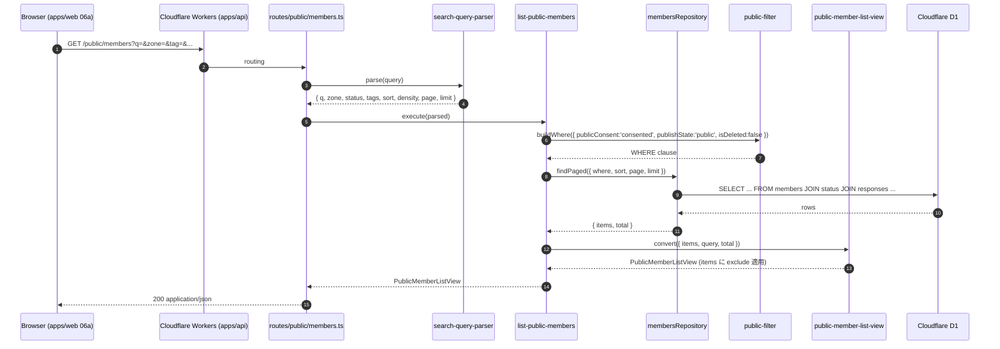

# Phase 2: 設計

## メタ情報

| 項目 | 値 |
| --- | --- |
| タスク名 | 04a-parallel-public-directory-api-endpoints |
| Phase 番号 | 2 / 13 |
| Phase 名称 | 設計 |
| Wave | 4 |
| Mode | parallel |
| 作成日 | 2026-04-26 |
| 前 Phase | 1（要件定義） |
| 次 Phase | 3（設計レビュー） |
| 状態 | pending |

## 目的

router / handler / use-case / view-model converter / public filter helper の module 設計を確定し、各 endpoint の入出力 / SQL where / 不変条件適合を Mermaid + 表で固定する。

## 実行タスク

1. Mermaid シーケンス（GET /public/members request → handler → use-case → repository → converter → response）。
2. module / file 配置設計。
3. 各 endpoint の SQL where 雛形と join。
4. view model converter（`PublicMemberProfile` 組み立て、leak フィルタを converter で二重チェック）。
5. dependency matrix（02a/02b/03b/01b 関数）。

## 参照資料

| 種別 | パス | 用途 |
| --- | --- | --- |
| 必須 | outputs/phase-01/main.md | scope / AC |
| 必須 | doc/00-getting-started-manual/specs/03-data-fetching.md | flow |
| 必須 | doc/00-getting-started-manual/specs/04-types.md | view model 型 |
| 必須 | doc/00-getting-started-manual/specs/12-search-tags.md | query parser |
| 参考 | doc/02-application-implementation/03b-parallel-forms-response-sync-and-current-response-resolver/phase-02.md | upstream 整合 |

## 実行手順

### ステップ 1: Mermaid（outputs/phase-02/api-flow.mermaid）
- 後述参照。

### ステップ 2: module 配置
```
apps/api/src/
├── routes/public/
│   ├── stats.ts                # GET /public/stats
│   ├── members.ts              # GET /public/members
│   ├── member-profile.ts       # GET /public/members/:memberId
│   └── form-preview.ts         # GET /public/form-preview
├── use-cases/public/
│   ├── get-public-stats.ts
│   ├── list-public-members.ts
│   ├── get-public-member-profile.ts
│   └── get-form-preview.ts
├── view-models/public/
│   ├── public-stats-view.ts
│   ├── public-member-list-view.ts
│   ├── public-member-profile-view.ts
│   └── form-preview-view.ts
└── _shared/
    ├── public-filter.ts        # publicConsent + publishState + isDeleted
    ├── search-query-parser.ts  # q / zone / status / tag / sort / density
    ├── pagination.ts           # PaginationMeta 計算
    └── visibility-filter.ts    # FieldVisibility=public のみ残す helper
```

### ステップ 3: SQL where 雛形
- 後述「SQL 雛形」。

### ステップ 4: view model converter
- 後述「converter」。

### ステップ 5: dependency matrix
- 後述「dependency matrix」。

## 統合テスト連携

| 連携先 Phase | 連携内容 |
| --- | --- |
| Phase 4 | unit / contract / leak test の対象 module |
| Phase 5 | 擬似コードの module 配置 |
| Phase 8 | DRY 化（公開フィルタ helper を 04b/04c 流用検討） |

## 多角的チェック観点

| 観点 | 不変条件番号 | 適用理由 |
| --- | --- | --- |
| consent キー | #2 | 公開フィルタで `publicConsent='consented'` 1 箇所 |
| responseEmail | #3 | converter で `delete payload.responseEmail` |
| 上書き禁止 | #4 | read のみ |
| apps/api 限定 | #5 | router / handler / use-case 全て apps/api |
| 無料枠 | #10 | write 0、read 件数を Phase 9 で見積もり |
| admin 分離 | #11 | converter で `delete payload.adminNotes` |
| schema 集約 | #14 | form-preview は schema_questions から動的構築 |
| visibility 流出 | #1 | converter で `field.visibility !== 'public'` を必ず除外 |

## サブタスク管理

| # | サブタスク | 担当 Phase | 状態 | 備考 |
| --- | --- | --- | --- | --- |
| 1 | Mermaid 作成 | 2 | pending | api-flow.mermaid |
| 2 | module 配置 | 2 | pending | 4 router + 4 use-case + 4 view + 4 helper |
| 3 | SQL 雛形 | 2 | pending | 4 endpoint |
| 4 | view converter | 2 | pending | leak 二重チェック |
| 5 | dependency matrix | 2 | pending | 上流関数 |

## 成果物

| 種別 | パス | 説明 |
| --- | --- | --- |
| ドキュメント | outputs/phase-02/main.md | 設計サマリ |
| ドキュメント | outputs/phase-02/api-flow.mermaid | シーケンス |
| メタ | artifacts.json | phase 2 を `completed` |

## 完了条件

- [ ] Mermaid 4 endpoint
- [ ] module 配置 4 router / 4 use-case / 4 view / 4 helper
- [ ] SQL 雛形 4 endpoint
- [ ] converter で leak 二重チェック明記

## タスク100%実行確認【必須】

- [ ] サブタスク 5 件すべて completed
- [ ] api-flow.mermaid に GET /public/members フロー
- [ ] converter で `responseEmail` / `rulesConsent` / `adminNotes` exclude が明記
- [ ] artifacts.json の phase 2 が `completed`

## 次 Phase

- 次: 3（設計レビュー）

## Mermaid（GET /public/members）



## SQL 雛形

### GET /public/members

```sql
SELECT m.member_id, m.full_name, m.nickname, m.location, m.occupation,
       m.ubm_zone, m.ubm_membership_type, m.business_overview,
       MAX(r.last_submitted_at) AS last_submitted_at
FROM members m
JOIN member_status s ON s.member_id = m.member_id
JOIN member_responses r ON r.response_id = m.current_response_id
LEFT JOIN member_tags mt ON mt.member_id = m.member_id
WHERE s.public_consent = 'consented'
  AND s.publish_state = 'public'
  AND s.is_deleted = 0
  AND (:q IS NULL OR (
        m.full_name LIKE '%' || :q || '%' OR
        m.nickname LIKE '%' || :q || '%' OR
        m.occupation LIKE '%' || :q || '%' OR
        m.location LIKE '%' || :q || '%' OR
        m.business_overview LIKE '%' || :q || '%'
  ))
  AND (:zone = 'all' OR m.ubm_zone = :zone)
  AND (:status = 'all' OR m.ubm_membership_type = :status)
GROUP BY m.member_id
HAVING (:tag_count = 0 OR COUNT(DISTINCT mt.code) FILTER (WHERE mt.code IN (:tags)) = :tag_count)
ORDER BY CASE :sort WHEN 'recent' THEN last_submitted_at END DESC,
         CASE :sort WHEN 'name' THEN m.full_name END ASC
LIMIT :limit OFFSET ((:page - 1) * :limit);
```

注: D1 (SQLite) は `FILTER` 非対応のため、tag フィルタは subquery で実装。

```sql
-- tag AND filter (D1 互換)
... AND m.member_id IN (
  SELECT member_id FROM member_tags
  WHERE code IN (:tags)
  GROUP BY member_id
  HAVING COUNT(DISTINCT code) = :tag_count
)
```

### GET /public/members/:memberId

```sql
-- 公開フィルタを通った member のみ
SELECT 1 FROM members m
JOIN member_status s ON s.member_id = m.member_id
WHERE m.member_id = :memberId
  AND s.public_consent = 'consented'
  AND s.publish_state = 'public'
  AND s.is_deleted = 0;
-- 0 件なら 404
```

詳細は `responseFieldsRepository.findByResponseId(currentResponseId)` で取得し、
`schemaQuestionsRepository.list()` を join して `visibility = 'public'` の field のみ converter で残す。

### GET /public/stats

```sql
-- public member 数
SELECT COUNT(*) FROM members m
JOIN member_status s ON s.member_id = m.member_id
WHERE s.public_consent = 'consented' AND s.publish_state = 'public' AND s.is_deleted = 0;

-- zone counts (公開分のみ)
SELECT m.ubm_zone, COUNT(*)
FROM members m JOIN member_status s ON s.member_id = m.member_id
WHERE s.public_consent = 'consented' AND s.publish_state = 'public' AND s.is_deleted = 0
GROUP BY m.ubm_zone;

-- meeting count this year
SELECT COUNT(*) FROM meetings WHERE strftime('%Y', held_at) = strftime('%Y','now');

-- recent meetings (limit 5)
SELECT * FROM meetings ORDER BY held_at DESC LIMIT 5;

-- last sync
SELECT kind, status, finished_at FROM sync_jobs
WHERE kind IN ('schema_sync','response_sync')
ORDER BY started_at DESC LIMIT 1;
```

### GET /public/form-preview

```sql
SELECT * FROM schema_questions ORDER BY section_order, question_order;
-- responderUrl は env.GOOGLE_FORM_RESPONDER_URL or 01-api-schema.md の固定値
```

## view model converter（leak 二重チェック）

```ts
// view-models/public/public-member-profile-view.ts
import { PublicMemberProfileSchema } from '@ubm/shared/types/public-member-profile'

export function toPublicMemberProfile(source: MemberProfile): PublicMemberProfile {
  // 1. exclude system / member-only fields
  const safe = {
    ...source,
    sections: source.sections.map(sec => ({
      ...sec,
      fields: sec.fields.filter(f => f.visibility === 'public'),
    })),
  }
  // 2. delete forbidden keys (型レベルで Omit、runtime でも削除)
  delete (safe as any).responseEmail
  delete (safe as any).rulesConsent
  delete (safe as any).adminNotes
  // 3. zod parse で contract 検証
  return PublicMemberProfileSchema.parse(safe)
}
```

## dependency matrix

| 用途 | 関数 | 提供 |
| --- | --- | --- |
| public member 一覧 | `membersRepository.findPublic({where, sort, page, limit})` | 02a |
| public member 単体 | `membersRepository.findByIdPublic(memberId)` | 02a |
| current response | `responsesRepository.findByResponseId(currentResponseId)` | 02a |
| response_fields | `responseFieldsRepository.findByResponseId(responseId)` | 02a |
| sections meta | `responseSectionsRepository.findByResponseId(responseId)` | 02a |
| status snapshot | `memberStatusRepository.findByMemberId(memberId)` | 02a |
| meetings | `meetingsRepository.list({limit?})` | 02b |
| tag definitions | `tagDefinitionsRepository.list()` | 02b |
| member tags | `memberTagsRepository.findByMemberId(memberId)` | 02b |
| schema questions | `schemaQuestionsRepository.list()` | 02b |
| sync_jobs | `syncJobsRepository.findLatestPerKind(['schema_sync','response_sync'])` | 02b 共通 |
| zod schema | `PublicStatsView` / `PublicMemberListView` / `PublicMemberProfile` / `FormPreviewView` | 01b |
