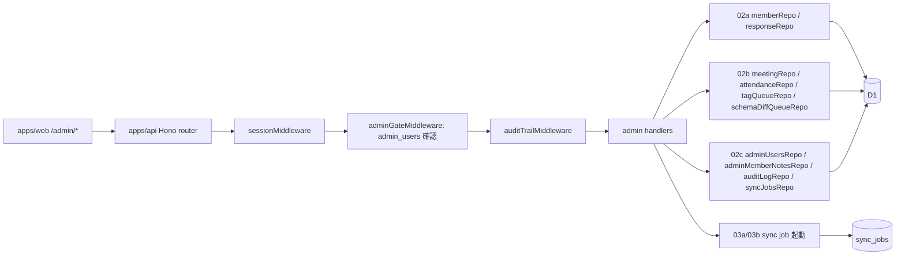

# Phase 2: 設計

## メタ情報

| 項目 | 値 |
| --- | --- |
| タスク名 | admin-backoffice-api-endpoints |
| Phase 番号 | 2 / 13 |
| Phase 名称 | 設計 |
| Wave | 4 |
| 実行種別 | parallel |
| 作成日 | 2026-04-26 |
| 前 Phase | 1 (要件定義) |
| 次 Phase | 3 (設計レビュー) |
| 状態 | pending |

## 目的

Phase 1 で確定した 18 endpoint を、Hono ルーター / admin gate / handler / repository 結線・zod schema・env / dependency matrix・Mermaid 構造図 で実装可能粒度まで設計する。本人本文編集 endpoint 不在（#11）、admin_member_notes leak ゼロ（#12）、tag queue 経由のみ（#13）、schema 集約（#14）、attendance 重複防止（#15）を構造で保証する。

## 実行タスク

- 18 endpoint の zod request/response schema を定義
- Hono router の sub-mount（/admin 配下）と admin gate middleware の install 順序を確定
- handler / service / repository module 配置（apps/api/src/routes/admin/*）
- audit_log helper の共通化方針
- env / dependency matrix
- Mermaid で admin gate 経路を可視化

## 参照資料

| 種別 | パス | 用途 |
| --- | --- | --- |
| 必須 | doc/00-getting-started-manual/specs/11-admin-management.md | endpoint 表 |
| 必須 | doc/00-getting-started-manual/specs/12-search-tags.md | tag queue |
| 必須 | doc/00-getting-started-manual/specs/07-edit-delete.md | 状態 / 削除 / 復元 |
| 必須 | doc/00-getting-started-manual/specs/04-types.md | view model |
| 参考 | doc/00-getting-started-manual/specs/02-auth.md | admin 判定 |
| 参考 | doc/00-getting-started-manual/specs/08-free-database.md | テーブル |

## 構成図 (Mermaid)



## Module 設計

| module | path | 責務 |
| --- | --- | --- |
| router root | apps/api/src/routes/admin/index.ts | `/admin` 配下を Hono にマウント、admin gate / audit middleware を install |
| dashboard | apps/api/src/routes/admin/dashboard.ts | GET /admin/dashboard |
| members | apps/api/src/routes/admin/members/index.ts | GET /admin/members |
| member detail | apps/api/src/routes/admin/members/get-detail.ts | GET /admin/members/:memberId |
| status | apps/api/src/routes/admin/members/patch-status.ts | PATCH /admin/members/:memberId/status |
| notes | apps/api/src/routes/admin/members/notes.ts | POST + PATCH notes |
| delete / restore | apps/api/src/routes/admin/members/delete-restore.ts | POST delete + restore |
| tag queue | apps/api/src/routes/admin/tags/queue.ts | GET queue + POST resolve |
| schema diff | apps/api/src/routes/admin/schema/diff.ts | GET diff + POST aliases |
| meetings | apps/api/src/routes/admin/meetings/index.ts | GET / POST meetings |
| attendance | apps/api/src/routes/admin/meetings/attendance.ts | POST + DELETE attendance |
| sync | apps/api/src/routes/admin/sync.ts | POST schema + responses |
| middleware | apps/api/src/middleware/admin-gate.ts | session の email を `admin_users` に問い合わせ、不一致 403 |
| middleware | apps/api/src/middleware/audit-trail.ts | リクエスト終了時に audit_log へ記録 |
| service | apps/api/src/services/sync-job-launcher.ts | sync_jobs に queued レコード追加、重複 trigger を 409 で抑止 |
| service | apps/api/src/services/admin-view-model-builder.ts | dashboard / member list / member detail を組成 |
| schema | apps/api/src/schemas/admin/*.ts | zod schema (endpoint 別) |

## Endpoint 仕様（抜粋）

### GET /admin/dashboard

- 認可: admin gate
- response 200:
  ```ts
  type AdminDashboardResponse = {
    totals: { totalMembers: number; publicMembers: number; untaggedMembers: number; unresolvedSchemaDiffs: number };
    recent: { newMembers: Member[]; pendingTagQueue: number; pendingSchemaDiffs: number };
    syncJobs: { lastSchemaSync?: { jobId, status, completedAt }; lastResponseSync?: { jobId, status, completedAt } };
  };
  ```
- 削除済み会員（is_deleted=true）は totals.totalMembers から除外（不変条件 #15 と整合）

### GET /admin/members

- 認可: admin gate
- query: `?state=public|hidden|deleted&q=&page=&pageSize=`
- response 200: `{ members: AdminMemberListItem[], page, pageSize, total }`
- AdminMemberListItem は admin_member_notes を含めない（不変条件 #12）

### GET /admin/members/:memberId

- 認可: admin gate
- response 200:
  ```ts
  type AdminMemberDetailResponse = {
    member: AdminMemberDetailView;       // public + member field 全部
    status: { publishState, isDeleted, hiddenReason, rulesConsent, publicConsent };
    notes: AdminMemberNote[];             // ここのみで notes を露出
    attendance: { sessionId, attendedAt }[];
    response: { responseId, submittedAt, editResponseUrl: string | null };
  };
  ```

### PATCH /admin/members/:memberId/status

- 認可: admin gate
- request:
  ```ts
  type PatchMemberStatusBody = {
    publishState?: 'public' | 'hidden';
    hiddenReason?: string;
    isDeleted?: never;  // 削除は POST /delete のみで扱う
  };
  ```
- response 200: `{ memberId, publishState, hiddenReason, updatedAt }`
- audit_log: `admin.member.status.update`

### POST /admin/members/:memberId/notes / PATCH .../notes/:noteId

- 認可: admin gate
- request: `{ body: string; visibility: 'admin_only' }`（visibility は admin_only 固定で zod 制約）
- response 201 / 200: `{ noteId, createdAt | updatedAt }`
- audit_log: `admin.member.note.create | update`

### POST /admin/members/:memberId/delete / restore

- 認可: admin gate
- request: `{ reason?: string }`
- response 200:
  ```ts
  // delete
  { memberId, isDeleted: true, deletedAt }
  // restore
  { memberId, isDeleted: false }
  ```
- 物理削除しない（spec 07）→ member_status.is_deleted を更新 + deleted_members に履歴
- audit_log: `admin.member.delete | restore`

### GET /admin/tags/queue / POST /admin/tags/queue/:queueId/resolve

- 認可: admin gate
- GET response: `{ items: AdminTagQueueItem[]; pendingTotal }`
- POST request: `{ tagCodes: string[]; resolverNote?: string }`
- POST response: `{ queueId, status: 'resolved', appliedTags: string[] }`
- 不変条件 #13 を保証: `PATCH /admin/members/:memberId/tags` を作らない
- audit_log: `admin.tag.queue.resolve`

### GET /admin/schema/diff / POST /admin/schema/aliases

- 認可: admin gate
- GET response: `{ unresolved: { questionId, suggestedStableKey?, status }[] }`
- POST request: `{ questionId: string; stableKey: string }`
- POST response: `{ stableKey, aliasResolved: true }`
- 不変条件 #14 を保証: schema 変更 endpoint はこの 2 本のみ
- audit_log: `admin.schema.alias.assign`

### GET /admin/meetings / POST /admin/meetings

- 認可: admin gate
- POST request: `{ scheduledAt: string; title: string; location?: string }`
- POST response 201: `{ sessionId, scheduledAt, title }`
- audit_log: `admin.meeting.create`

### POST /admin/meetings/:sessionId/attendance / DELETE

- 認可: admin gate
- POST request: `{ memberId: string }`
- POST response 201: `{ sessionId, memberId, attendedAt }`
- POST 409: 重複（`UNIQUE(session_id, member_id)` 違反、不変条件 #15）
- POST 422: 削除済み会員（is_deleted=true）への付与（不変条件 #15）
- DELETE response: `{ sessionId, memberId, removed: true }`
- audit_log: `admin.attendance.add | remove`

### POST /admin/sync/schema / POST /admin/sync/responses

- 認可: admin gate
- request: なし（or `{ force?: boolean }`）
- response 202: `{ jobId, status: 'queued', startedAt }`
- response 409: `{ code: 'SYNC_ALREADY_RUNNING', activeJobId }`
- 実行は 03a / 03b の job 関数を Workers cron か queued worker（09b）で完遂
- audit_log: `admin.sync.schema.trigger | admin.sync.responses.trigger`

## Dependency matrix

| 上流 | 提供物 | 本タスク利用箇所 |
| --- | --- | --- |
| 02a memberRepository / responseRepository | members / responses 取得 | dashboard / members / member detail |
| 02b meetingRepository / attendanceRepository | meetings / attendance CRUD | meetings / attendance |
| 02b tagQueueRepository | queue read / write | tags |
| 02b schemaDiffQueueRepository / schemaQuestionsRepository | diff read / alias write | schema |
| 02c adminUsersRepository | adminGate middleware | 全 endpoint |
| 02c adminMemberNotesRepository | notes CRUD | member detail / notes |
| 02c auditLogRepository | record(action, target) | 全 PATCH/POST/DELETE |
| 02c syncJobsRepository | append(jobId) / hasActive() | sync trigger |
| 03a schemaSyncJob | run(jobId) | POST /admin/sync/schema |
| 03b responseSyncJob | run(jobId) | POST /admin/sync/responses |

## env

| 区分 | 代表値 | 置き場所 | 担当 task | 本タスクの利用 |
| --- | --- | --- | --- | --- |
| Auth.js | AUTH_SECRET | Cloudflare Secrets | 05a | session 検証 |
| D1 binding | DB | wrangler binding | 01a | repository 経由 |
| Google sync | GOOGLE_SERVICE_ACCOUNT_EMAIL / GOOGLE_PRIVATE_KEY / GOOGLE_FORM_ID | Cloudflare Secrets | 03a/03b | sync trigger |

本タスクで新規 secret は導入しない。

## 統合テスト連携

| 連携先 Phase | 連携内容 |
| --- | --- |
| Phase 3 | alternative 比較 |
| Phase 4 | endpoint × middleware × repository を verify suite に展開 |
| Phase 5 | runbook 化 |
| Phase 7 | endpoint × AC matrix |

## 多角的チェック観点（不変条件マッピング）

- #1 schema 固定しすぎない: schema/aliases endpoint で stableKey 後付け可能
- #4 / #11 本文 D1 編集禁止: PATCH /admin/members/:memberId/profile を作らない
- #5 apps/web → D1 禁止: 本タスクは apps/api に閉じる
- #7 responseId vs memberId: AdminMemberDetailResponse で別フィールド
- #12 admin_member_notes 公開非露出: AdminMemberListResponse / GET /me/* / GET /public/* に notes 不在を zod で保証
- #13 tag は queue 経由: PATCH /admin/members/:memberId/tags 不在
- #14 schema 集約: `/admin/schema/diff` と `/admin/schema/aliases` のみ
- #15 attendance 重複禁止 / 削除済み除外: 409 と 422 を構造で保証

## サブタスク管理

| # | サブタスク | 担当 Phase | 状態 | 備考 |
| --- | --- | --- | --- | --- |
| 1 | zod schema 18 種定義 | 2 | pending | outputs/phase-02/endpoint-spec.md |
| 2 | module 配置確定 | 2 | pending | outputs/phase-02/handler-design.md |
| 3 | dependency matrix | 2 | pending | 上流 6 タスクとの整合 |
| 4 | Mermaid request flow | 2 | pending | outputs/phase-02/mermaid-flow.md |
| 5 | env / secret matrix | 2 | pending | 新規 secret なしを記録 |

## 成果物

| 種別 | パス | 説明 |
| --- | --- | --- |
| ドキュメント | outputs/phase-02/main.md | Phase 2 主成果物 |
| ドキュメント | outputs/phase-02/endpoint-spec.md | zod schema 詳細 |
| ドキュメント | outputs/phase-02/handler-design.md | module 配置と middleware 順序 |
| ドキュメント | outputs/phase-02/mermaid-flow.md | request flow |
| メタ | artifacts.json | Phase 2 を completed に更新 |

## 完了条件

- [ ] 18 endpoint の zod schema が確定
- [ ] module 配置が apps/api の path レベルで確定
- [ ] dependency matrix で上流 6 タスクの提供物が明示
- [ ] Mermaid と env が main.md に存在
- [ ] PATCH /admin/members/:memberId/profile / PATCH /admin/members/:memberId/tags 等の禁止 endpoint が一切設計に登場しないこと

## タスク100%実行確認【必須】

- 全実行タスク completed
- 全成果物配置済み
- 全完了条件チェック
- artifacts.json の Phase 2 を completed に更新

## 次 Phase

- 次: 3 (設計レビュー)
- 引き継ぎ事項: alternative 案 3 つの比較
- ブロック条件: zod schema or module 配置のいずれかが未確定なら次 Phase に進まない
