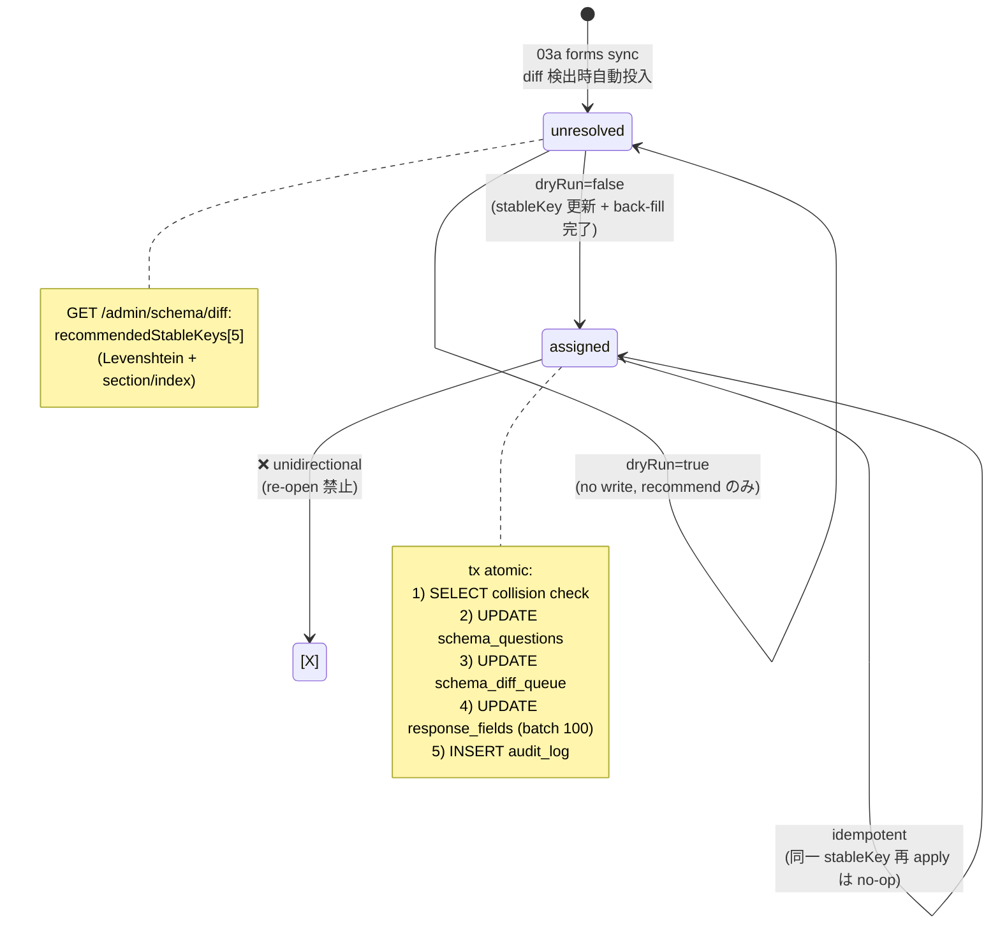

# Phase 2: 設計

## メタ情報

| 項目 | 値 |
| --- | --- |
| タスク名 | 07b-parallel-schema-diff-alias-assignment-workflow |
| Phase 番号 | 2 / 13 |
| Phase 名称 | 設計 |
| Wave | 7 (parallel) |
| 作成日 | 2026-04-26 |
| 前 Phase | 1 (要件定義) |
| 次 Phase | 3 (設計レビュー) |
| 状態 | pending |

## 目的

schema alias workflow の state machine、tx 境界、handler 構造、dryRun mode、back-fill batch、alias 候補提案、audit log 連携を設計する。

## 実行タスク

1. state machine 図 (Mermaid)
2. tx 境界（schema_questions 更新 + schema_diff_queue 更新 + response_fields back-fill + audit を atomic に）
3. handler 関数の signature 設計（dryRun mode 含む）
4. alias 候補提案ロジックの設計（Levenshtein + section/index）
5. back-fill batch 設計（100 行/batch ループ）
6. audit_log payload 構造

## 参照資料

| 種別 | パス | 用途 |
| --- | --- | --- |
| 必須 | outputs/phase-01/main.md | 状態遷移表 |
| 必須 | doc/00-getting-started-manual/specs/08-free-database.md | tx model |
| 必須 | doc/02-application-implementation/02b-parallel-meeting-tag-queue-and-schema-diff-repository/index.md | schema repo signature |
| 必須 | doc/02-application-implementation/02c-parallel-admin-notes-audit-sync-jobs-and-data-access-boundary/index.md | audit repo signature |

## 実行手順

### ステップ 1: state machine 図

下記 Mermaid 参照（unresolved → assigned の単方向、dryRun は状態維持）

### ステップ 2: tx 境界

- D1 batch（serializable batch を transaction 相当として利用）
- apply mode の atomic ステートメント:
  1. SELECT schema_diff_queue (status check) + schema_questions (current stableKey)
  2. SELECT count(*) FROM schema_questions WHERE stableKey = ? (collision pre-check)
  3. UPDATE schema_questions SET stableKey = ? WHERE id = ?
  4. UPDATE schema_diff_queue SET status = 'assigned' WHERE id = ?
  5. UPDATE response_fields SET stableKey = ? WHERE questionId = ? (batched 100 rows × N)
  6. INSERT audit_log
- back-fill が batch を跨ぐ場合は idempotent な UPDATE を OFFSET / LIMIT で繰返す（30s 内）

### ステップ 3: handler signature

```ts
// apps/api/src/workflows/schemaAliasAssign.ts
export async function schemaAliasAssign(
  env: Env,
  input: {
    questionId: string
    stableKey: string
    actorUserId: string
    dryRun: boolean
  }
): Promise<
  | { mode: 'dryRun'; questionId: string; currentStableKey: string; proposedStableKey: string; affectedResponseFields: number; conflictExists: boolean }
  | { mode: 'apply'; questionId: string; oldStableKey: string; newStableKey: string; affectedResponseFields: number; queueStatus: 'assigned' }
>
```

### ステップ 4: alias 候補提案

```ts
// apps/api/src/services/aliasRecommendation.ts
export function recommendAliases(
  diffQuestion: { sectionIndex: number; questionIndex: number; questionTitle: string },
  existingQuestions: Array<{ stableKey: string; sectionIndex: number; questionIndex: number; questionTitle: string }>
): string[] // 上位 5 件
```

- スコア計算: Levenshtein(title) × -1 + (sectionIndex 一致 ? 10 : 0) + (questionIndex 一致 ? 5 : 0)
- 上位 5 件を `recommendedStableKeys` として `GET /admin/schema/diff` の response に embed

### ステップ 5: back-fill batch 設計

- batch サイズ: 100 行（D1 batch limit との折り合い）
- ループ条件: `affectedRows >= 100` かつ CPU 残予算 > 5s
- 中断時: queue を `assigned` にせず維持し、次回再 apply で続行（idempotent UPDATE で安全）
- 削除済み response（is_deleted=true）は WHERE 句で除外

### ステップ 6: audit_log payload

```json
{
  "actor": "admin.userId",
  "action": "schema_diff.alias_assigned",
  "target": { "type": "schema_questions", "id": "question_xxx" },
  "payload": {
    "oldStableKey": "publicConsent_v0",
    "newStableKey": "publicConsent",
    "schemaVersionId": "ver_20260426",
    "affectedResponseFields": 432,
    "queueId": "diff_xxx"
  },
  "occurredAt": "2026-04-26T..."
}
```

## 統合テスト連携

| 連携先 Phase | 連携内容 |
| --- | --- |
| Phase 3 | alternative 評価 |
| Phase 4 | tx 境界 + dryRun を test 対象に |
| Phase 5 | 擬似コード作成 |
| Phase 8 | 共通化（audit log 構造） |

## 多角的チェック観点

| 不変条件 | 設計担保 | 理由 |
| --- | --- | --- |
| #1 | stableKey は schema_questions の row でのみ管理、コードに固定 questionId/stableKey なし | grep で string literal 検出 0 件 |
| #5 | workflow は apps/api/src/workflows 内、apps/web からは endpoint 経由のみ | data access boundary |
| #14 | stableKey 更新は本 workflow のみ、その他 path 禁止 | grep で `UPDATE schema_questions` を本 file 限定 |
| 認可境界 | endpoint 側 admin gate を信頼、workflow は actor を受けて log にのみ記録 | 二重チェックは endpoint で |
| 無料枠 | 1 apply ≒ 100 D1 ops（back-fill 含む） | 100k/日内 |
| audit | apply のみ audit_log に残す（dryRun は記録しない） | UI 試行で log を汚さない |

## サブタスク管理

| # | サブタスク | 担当 Phase | 状態 | 備考 |
| --- | --- | --- | --- | --- |
| 1 | state machine 図 | 2 | pending | Mermaid |
| 2 | tx 境界 | 2 | pending | D1 batch |
| 3 | handler signature | 2 | pending | TS type |
| 4 | alias 推奨 | 2 | pending | Levenshtein |
| 5 | back-fill batch | 2 | pending | 100 行/batch |
| 6 | audit payload | 2 | pending | JSON shape |

## 成果物

| 種別 | パス | 説明 |
| --- | --- | --- |
| ドキュメント | outputs/phase-02/main.md | サマリー |
| ドキュメント | outputs/phase-02/schema-alias-workflow-design.md | Mermaid + tx 境界 + handler + back-fill |
| メタ | artifacts.json | Phase 2 を completed |

## 完了条件

- [ ] state machine 図が valid Mermaid
- [ ] tx 境界に「全ステートメントの atomic 性 + back-fill batch 戦略」明記
- [ ] handler signature が TS で記述（dryRun union 型含む）
- [ ] alias 推奨アルゴリズム明記
- [ ] back-fill batch サイズと中断耐性記載
- [ ] audit payload structure 確定

## タスク100%実行確認

- 全成果物が outputs/phase-02 配下
- 不変条件 #1, #14 に設計上の担保
- artifacts.json で phase 2 を completed

## 次 Phase

- 次: 3 (設計レビュー)
- 引き継ぎ: state machine + handler signature + back-fill 戦略を alternative 評価へ
- ブロック条件: state machine 未確定なら次へ進めない

## 構成図 (Mermaid)



## 環境変数一覧

| 区分 | 代表値 | 置き場所 | 利用箇所 |
| --- | --- | --- | --- |
| D1 binding | DB | wrangler binding | workflow 内 |
| back-fill batch size | `SCHEMA_BACKFILL_BATCH_SIZE=100` | wrangler vars | back-fill ループ |
| CPU budget reserve | `SCHEMA_BACKFILL_CPU_RESERVE_MS=5000` | wrangler vars | 中断判定 |

## 設定値表

| 項目 | 方針 | 根拠 |
| --- | --- | --- |
| tx 実装 | D1 batch + idempotent UPDATE で再開可能 | Cloudflare D1 制約 |
| state model | unresolved / assigned（unidirectional） | unidirectional |
| dryRun mode | 同 endpoint + query flag | UI 切替容易 |
| collision check | DB UNIQUE 一次防御 + pre-check 二次防御 | UX + 安全 |
| back-fill | 100 行/batch、CPU 残 5s で中断 | Workers 30s |
| audit | apply のみ記録 | log 汚染回避 |

## 依存マトリクス

| 種別 | 対象 | 役割 |
| --- | --- | --- |
| 上流 | 04c endpoint | 呼び出し元 |
| 上流 | 06c UI | alias 確定 POST |
| 上流 | 03a sync | unresolved 投入 |
| 上流 | 02b repo | schema_questions / schema_diff_queue / response_fields |
| 上流 | 02c repo | audit_log |
| 下流 | 08a test | unit / contract |
| 下流 | 08b test | E2E |

## Module 設計

| module | path | 責務 |
| --- | --- | --- |
| schemaAliasAssign | apps/api/src/workflows/schemaAliasAssign.ts | apply / dryRun 両 mode |
| recommendAliases | apps/api/src/services/aliasRecommendation.ts | Levenshtein + section/index スコア |
| schemaDiffRoutes | apps/api/src/routes/admin/schemaDiff.ts | GET /diff + POST /aliases endpoint |
| schemaAliasValidation | apps/api/src/schemas/schemaAliasAssign.ts | zod schema |
| backfillResponseFields | apps/api/src/workflows/backfillResponseFields.ts | back-fill batch ループ（再開可能） |
