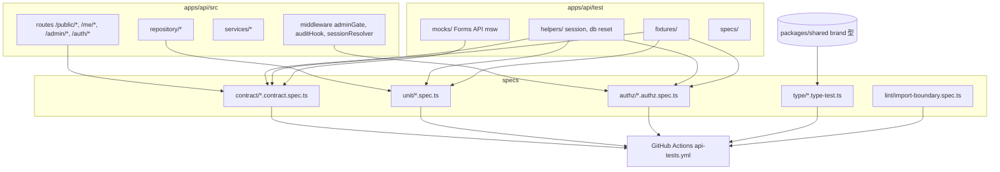

# Phase 2: 設計

## メタ情報

| 項目 | 値 |
| --- | --- |
| タスク名 | 08a-parallel-api-contract-repository-and-authorization-tests |
| Phase 番号 | 2 / 13 |
| Phase 名称 | 設計 |
| 作成日 | 2026-04-26 |
| 前 Phase | 1 (要件定義) |
| 次 Phase | 3 (設計レビュー) |
| 状態 | pending |

## 目的

test 種別ごとのディレクトリ構造、fixture 配置、msw vs local fixture の判定、env / dependency matrix を確定し、Phase 4 verify suite の元データを揃える。

## 実行タスク

- [ ] test architecture を Mermaid で記述
- [ ] test directory layout を確定 (`outputs/phase-02/test-directory-layout.md`)
- [ ] fixture seeder の構造設計
- [ ] env / dependency matrix
- [ ] msw vs local fixture の判定根拠

## 参照資料

| 種別 | パス | 用途 |
| --- | --- | --- |
| 必須 | doc/00-getting-started-manual/specs/04-types.md | brand 型 |
| 必須 | doc/00-getting-started-manual/specs/01-api-schema.md | 31 項目 schema |
| 必須 | doc/00-getting-started-manual/specs/13-mvp-auth.md | AuthGateState |
| 必須 | doc/02-application-implementation/_design/phase-2-design.md | 全体設計 |

## 構成図 (Mermaid)



## test directory layout

```
apps/api/
├── vitest.config.ts                 # vitest + setup file 指定
├── test/
│   ├── helpers/
│   │   ├── seed.ts                  # beforeEach で D1 INSERT
│   │   ├── auth.ts                  # createAdminCookie / createMemberCookie
│   │   ├── app.ts                   # Hono app with test bindings
│   │   └── reset.ts                 # afterEach で TRUNCATE
│   ├── fixtures/
│   │   ├── members.ts               # 5 members (1 deleted, 1 non-public)
│   │   ├── responses.ts             # response_sections + response_fields
│   │   ├── meetings.ts              # 2 sessions
│   │   ├── tags.ts                  # 6 categories + 12 tag definitions
│   │   ├── admin-users.ts           # 1 admin
│   │   ├── magic-tokens.ts          # 1 valid, 1 expired
│   │   └── audit-log.ts             # baseline
│   └── mocks/
│       ├── forms-api.handlers.ts    # msw handlers for forms.get/list
│       └── server.ts                # msw setupServer
└── src/
    ├── routes/
    │   ├── public/__tests__/*.contract.spec.ts
    │   ├── me/__tests__/*.contract.spec.ts
    │   ├── admin/__tests__/*.contract.spec.ts
    │   └── auth/__tests__/*.contract.spec.ts
    ├── repository/__tests__/*.spec.ts
    ├── middleware/__tests__/*.authz.spec.ts
    └── lint/__tests__/import-boundary.spec.ts
packages/shared/
└── src/__tests__/type-tests.ts      # responseId !== memberId
```

## endpoint × authz マトリクス

| endpoint | anonymous | member | admin |
| --- | --- | --- | --- |
| GET /public/* | 200 | 200 | 200 |
| POST /auth/magic-link | 200 / 422 | 200 | 200 |
| GET /me/* | 401 | 200 | 200 |
| POST /me/visibility-request | 401 | 200/202 | 200/202 |
| POST /me/delete-request | 401 | 200/202 | 200/202 |
| GET /admin/* | 401 | 403 | 200 |
| POST /admin/* | 401 | 403 | 201/200 |

## msw vs local fixture 判定

| 観点 | msw | local fixture |
| --- | --- | --- |
| Forms API mock | ◎ HTTP 層を mock、本番 client コードに手を入れない | △ client wrapper を直接置換 |
| 速度 | △ network 経由 | ◎ in-memory |
| 実装コスト | △ handler 増設 | ◎ ファイル追加 |
| 採用 | **採用**（Forms API のみ） | **採用**（D1 fixture のみ） |

→ Forms API は msw、D1 は local fixture（in-memory sqlite）に分担

## 環境変数一覧

| 区分 | キー | 配置 | 理由 |
| --- | --- | --- | --- |
| Test D1 | `TEST_D1_PATH=:memory:` | vitest.config.ts | in-memory sqlite |
| Test Auth | `TEST_AUTH_SECRET` | vitest setup | session cookie 生成 |
| msw | （envなし） | test/mocks/ | コード内で完結 |
| Secrets | （新規導入なし） | — | — |

## dependency matrix

| ファイル | 役割 | 依存元 | 依存先 |
| --- | --- | --- | --- |
| vitest.config.ts | runner 設定 | apps/api/package.json | test/helpers/* |
| test/helpers/app.ts | Hono test app | routes / middleware | hono test client |
| test/helpers/seed.ts | fixture 注入 | fixtures/*.ts | D1 binding |
| test/helpers/auth.ts | session cookie | adminUsers / magicTokens | jose / Auth.js |
| test/mocks/server.ts | msw setup | mocks/handlers | msw |
| **import-boundary.spec.ts** | apps/web → D1 直接禁止 lint | tsconfig + grep | apps/web src |

## module 設計

- **contract test**: `apps/api/src/routes/<layer>/__tests__/<endpoint>.contract.spec.ts`
- **repository test**: `apps/api/src/repository/__tests__/<table>.spec.ts`
- **authz test**: `apps/api/src/middleware/__tests__/<gate>.authz.spec.ts` または route と同居
- **type test**: `packages/shared/src/__tests__/type-tests.ts`（vitest config で type-check 有効化）
- **lint test**: `apps/api/src/lint/__tests__/import-boundary.spec.ts`（apps/web 配下を grep）

## 統合テスト連携

| 連携先 Phase | 連携内容 |
| --- | --- |
| Phase 3 | 設計 alternative 比較 |
| Phase 4 | verify suite signature |
| Phase 7 | AC × 設計トレース |

## 多角的チェック観点

- 不変条件 **#1** msw で `extraFields` レスポンスを含む Forms 応答を流し、contract test で `extraFields` 経路を verify
- 不変条件 **#2** zod schema で `responseEmail` を fields ではなく system field として固定（contract test で確認）
- 不変条件 **#5** authz matrix 9 種で 401 / 403 / 200 を断定
- 不変条件 **#6** import-boundary.spec.ts で apps/web から `import * from '@cloudflare/d1'` 等を grep して 0 件確認
- 不変条件 **#11** profile 編集 endpoint への request が 404 を返す contract test
- a11y: 本タスクは UI なし、08b へ
- 無料枠: in-memory sqlite で CI 0 円

## サブタスク管理

| # | サブタスク | 担当 Phase | 状態 | 備考 |
| --- | --- | --- | --- | --- |
| 1 | Mermaid 描画 | 2 | pending | test-architecture.mmd |
| 2 | directory layout 確定 | 2 | pending | test-directory-layout.md |
| 3 | endpoint × authz matrix | 2 | pending | 9 マトリクス |
| 4 | msw vs fixture 判定 | 2 | pending | Forms = msw, D1 = fixture |
| 5 | env / dependency matrix | 2 | pending | matrix table |

## 成果物

| 種別 | パス | 説明 |
| --- | --- | --- |
| ドキュメント | outputs/phase-02/main.md | Phase 2 主成果物 |
| 図 | outputs/phase-02/test-architecture.mmd | Mermaid |
| ドキュメント | outputs/phase-02/test-directory-layout.md | layout |
| メタ | artifacts.json | phase 2 status |

## 完了条件

- [ ] Mermaid + layout + matrix + env / dependency 記述
- [ ] msw / fixture 判定根拠記述

## タスク100%実行確認【必須】

- [ ] 全実行タスク completed
- [ ] 成果物配置済み
- [ ] 多角的チェック観点記述済み
- [ ] artifacts.json の phase 2 を completed

## 次 Phase

- 次: Phase 3 (設計レビュー)
- 引き継ぎ: alternative 検討項目（msw 採用範囲、in-memory sqlite vs miniflare D1）
- ブロック条件: layout 未確定なら Phase 3 不可
