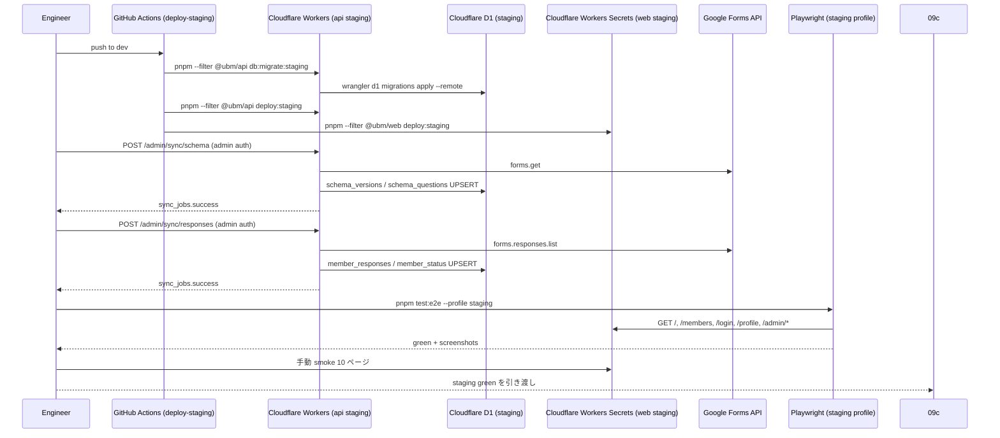

# Phase 2: 設計

## メタ情報

| 項目 | 値 |
| --- | --- |
| タスク名 | 09a-parallel-staging-deploy-smoke-and-forms-sync-validation |
| Phase 番号 | 2 / 13 |
| Phase 名称 | 設計 |
| Wave | 9 |
| Mode | parallel |
| 作成日 | 2026-04-26 |
| 前 Phase | 1 (要件定義) |
| 次 Phase | 3 (設計レビュー) |
| 状態 | pending |

## 目的

staging deploy 〜 Forms 同期検証 〜 Playwright 〜 smoke までの一連のフローを Mermaid + 手順表 + 環境変数 + 依存マトリクスで可視化し、Phase 5 の runbook と Phase 11 の手動 smoke を一意に再現可能な形に固める。

## 実行タスク

1. staging deploy フロー全体を Mermaid sequence で書く
2. wrangler 周りの env / config / secret 一覧を表で固定する
3. 上流 / 並列 / 下流の dependency matrix を更新する
4. staging で叩く API endpoint と確認ポイントを module 単位で設計する

## 参照資料

| 種別 | パス | 用途 |
| --- | --- | --- |
| 必須 | doc/00-getting-started-manual/specs/15-infrastructure-runbook.md | wrangler config / secrets / migration |
| 必須 | doc/00-getting-started-manual/specs/03-data-fetching.md | sync ジョブの分類と検証点 |
| 必須 | doc/02-application-implementation/04c-parallel-admin-backoffice-api-endpoints/index.md | `POST /admin/sync/*` の仕様 |
| 必須 | doc/02-application-implementation/03b-parallel-forms-response-sync-and-current-response-resolver/index.md | response sync 期待動作 |
| 参考 | doc/01-infrastructure-setup/04-serial-cicd-secrets-and-environment-sync/ | GitHub Actions deploy パイプライン |

## 実行手順

### ステップ 1: Mermaid 構造図の作成
- `outputs/phase-02/main.md` に staging deploy の sequence diagram を書く
- `outputs/phase-02/staging-deploy-flow.md` に詳細フロー（11 ステップ）を書く

### ステップ 2: env / wrangler config の表化
- staging 専用 env variables（`API_BASE_URL`, `SITE_URL`, `NEXT_PUBLIC_API_BASE_URL`）を列挙
- staging 専用 secret 7 種の wrangler 配置を列挙

### ステップ 3: dependency matrix の作成
- 上流 / 並列 / 下流の引き渡しを表に固定
- 09b（cron / runbook）と 09c（production）への引き渡し物を明記

### ステップ 4: module 設計
- staging deploy / 同期手動実行 / Playwright 再実行 / 手動 smoke の 4 module に分けて設計

## 統合テスト連携

| 連携先 Phase | 連携内容 |
| --- | --- |
| Phase 4 | verify suite に「staging deploy で apps/web から D1 直アクセスがないことを e2e で確認」を含める |
| Phase 5 | 本 Phase の Mermaid と手順表を runbook 化 |
| Phase 11 | 本 Phase の手動 smoke design を実行 |
| 並列 09b | dependency matrix で 09b の release runbook へ staging URL を渡すリンクを定義 |
| 下流 09c | 本 Phase の Mermaid を production 版に転用するため引き渡す |

## 多角的チェック観点（不変条件）

- 不変条件 #5: staging 環境で `apps/web` が `wrangler.toml` の D1 binding を持っていないことを config inspect で確認する設計
- 不変条件 #6: staging 環境に GAS 由来の cron や apps script が混入していないことを wrangler triggers で確認する設計
- 不変条件 #10: staging deploy 完了直後の Cloudflare Analytics ダッシュボード URL を runbook に記載する設計

## サブタスク管理

| # | サブタスク | 担当 Phase | 状態 | 備考 |
| --- | --- | --- | --- | --- |
| 1 | Mermaid sequence 作成 | 2 | pending | staging-deploy-flow.md |
| 2 | env / config / secret 表 | 2 | pending | wrangler 周辺整理 |
| 3 | dependency matrix 更新 | 2 | pending | 09b / 09c 引き渡し記載 |
| 4 | module 設計 | 2 | pending | 4 module |

## 成果物

| 種別 | パス | 説明 |
| --- | --- | --- |
| ドキュメント | outputs/phase-02/main.md | 設計サマリ + Mermaid + env table |
| ドキュメント | outputs/phase-02/staging-deploy-flow.md | 11 ステップ詳細フロー |
| メタ | artifacts.json | Phase 2 を completed に更新 |

## 完了条件

- [ ] Mermaid が 1 枚以上ある
- [ ] env / config table が完成
- [ ] dependency matrix が更新済み
- [ ] module 設計が 4 module で完了

## タスク100%実行確認【必須】

- 全実行タスクが completed
- `outputs/phase-02/` 配下に 2 ファイル配置
- Mermaid が markdown でレンダリング可能
- artifacts.json の phase 2 を completed に更新

## 次 Phase

- 次: 3 (設計レビュー)
- 引き継ぎ事項: Mermaid と env table、module 設計、dependency matrix
- ブロック条件: Mermaid 未作成、または env table が secret 7 種を含まない場合は次 Phase に進まない

## Mermaid 構造図

## 環境変数 / wrangler config 一覧

| 区分 | 値 | 配置 | 確認 wrangler コマンド |
| --- | --- | --- | --- |
| API base | `https://ubm-hyogo-api-staging.<account>.workers.dev` | wrangler vars (web staging) | `wrangler pages project list` |
| Site URL | `https://ubm-hyogo-web-staging.pages.dev` | GitHub Variables | GitHub UI |
| D1 binding | `DB → ubm_hyogo_staging` | `apps/api/wrangler.toml` | `wrangler d1 list` |
| GOOGLE_SERVICE_ACCOUNT_EMAIL | (secret) | Cloudflare Secrets (api) | `wrangler secret list --config apps/api/wrangler.toml` |
| GOOGLE_PRIVATE_KEY | (secret) | Cloudflare Secrets (api) | 同上 |
| GOOGLE_FORM_ID | (secret) | Cloudflare Secrets (api) | 同上 |
| RESEND_API_KEY | (secret) | Cloudflare Secrets (api) | 同上 |
| AUTH_SECRET | (secret) | Cloudflare Workers Secrets (web) | `wrangler pages secret list --project-name ubm-hyogo-web-staging` |
| AUTH_GOOGLE_ID | (secret) | Cloudflare Workers Secrets (web) | 同上 |
| AUTH_GOOGLE_SECRET | (secret) | Cloudflare Workers Secrets (web) | 同上 |

## Dependency matrix

| 種別 | 相手 | 引き渡し物（in / out） |
| --- | --- | --- |
| 上流 in | 08a | CI green、contract test artifact |
| 上流 in | 08b | Playwright spec、screenshot baseline |
| 上流 in | 04 (infra) | staging secrets 7 種、GitHub Actions deploy job |
| 並列 sync | 09b | staging URL、sync_jobs id 例、Cloudflare Analytics URL |
| 下流 out | 09c | staging green 証跡、Playwright screenshot、sync_jobs dump |

## Module 設計

| Module | 責務 | 主な command |
| --- | --- | --- |
| migration-check | staging D1 migration の `Applied` 確認 | `wrangler d1 migrations list ubm_hyogo_staging --config apps/api/wrangler.toml` |
| secret-check | staging secrets 7 種の存在確認 | `wrangler secret list --config apps/api/wrangler.toml`, `wrangler pages secret list --project-name ubm-hyogo-web-staging` |
| deploy-trigger | staging deploy 実行 | `pnpm --filter @ubm/api deploy:staging`, `pnpm --filter @ubm/web deploy:staging` |
| forms-sync-verify | sync 手動実行と sync_jobs 確認 | `curl -X POST $STAGING_API/admin/sync/schema`, `curl -X POST $STAGING_API/admin/sync/responses`, `wrangler d1 execute ubm_hyogo_staging --command "SELECT * FROM sync_jobs ORDER BY started_at DESC LIMIT 5;"` |
| playwright-rerun | staging プロファイルで Playwright 再実行 | `BASE_URL=https://ubm-hyogo-web-staging.pages.dev pnpm test:e2e` |
| smoke-manual | 10 ページ手動 smoke | runbook 参照 |
