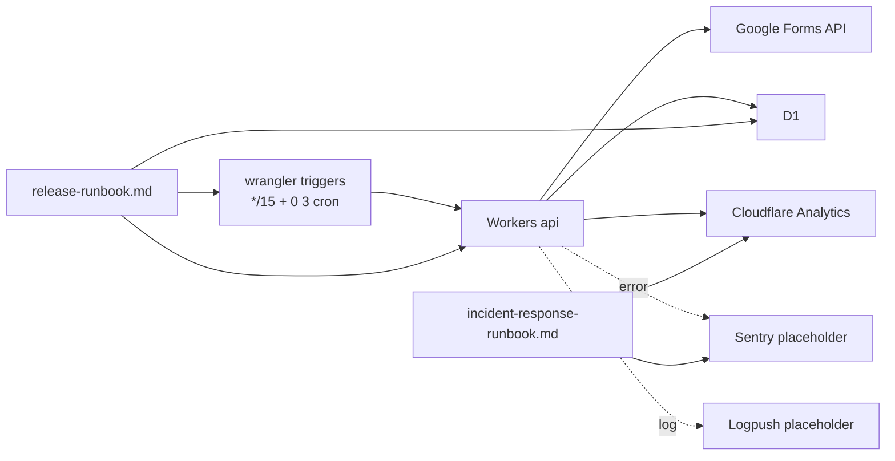

# Phase 2: 設計

## メタ情報

| 項目 | 値 |
| --- | --- |
| タスク名 | 09b-parallel-cron-triggers-monitoring-and-release-runbook |
| Phase 番号 | 2 / 13 |
| Phase 名称 | 設計 |
| Wave | 9 |
| Mode | parallel |
| 作成日 | 2026-04-26 |
| 前 Phase | 1 (要件定義) |
| 次 Phase | 3 (設計レビュー) |
| 状態 | pending |

## 目的

cron schedule の設計、監視 placeholder の配置、release runbook と incident response runbook の章立てを Mermaid + dependency matrix + module 設計 + env table で固定する。spec_created なので wrangler.toml の placeholder を提示するのみ。

## 実行タスク

1. cron schedule design（頻度 / 二重起動防止 / 失敗時 retry）
2. 監視 placeholder の Mermaid 全体図
3. release runbook 章立て（go-live / rollback / cron 制御 / dashboard URL）
4. incident response runbook 章立て（initial / escalation / postmortem）
5. dependency matrix（09a / 09c 引き渡し）

## 参照資料

| 種別 | パス | 用途 |
| --- | --- | --- |
| 必須 | doc/00-getting-started-manual/specs/15-infrastructure-runbook.md | cron 正本 |
| 必須 | doc/00-getting-started-manual/specs/03-data-fetching.md | sync_jobs 運用方針 |
| 必須 | doc/02-application-implementation/03b-parallel-forms-response-sync-and-current-response-resolver/index.md | response sync 仕様 |
| 必須 | doc/02-application-implementation/03a-parallel-forms-schema-sync-and-stablekey-alias-queue/index.md | schema sync 仕様 |
| 参考 | docs/05a-parallel-observability-and-cost-guardrails/ | observability placeholder |

## 実行手順

### ステップ 1: cron schedule design
- `outputs/phase-02/cron-schedule-design.md` に頻度試算と二重起動防止を書く

### ステップ 2: Mermaid 構造図
- 監視全体（cron → API → D1 → Analytics → Sentry placeholder）

### ステップ 3: release runbook 章立て
- go-live / rollback / cron 制御 / dashboard URL のセクションを定義

### ステップ 4: incident response runbook 章立て
- initial response（detect / declare） / escalation / postmortem template

### ステップ 5: dependency matrix
- 09a → 09b（staging URL / sync_jobs id）
- 09b → 09c（release runbook 本体）

## 統合テスト連携

| 連携先 Phase | 連携内容 |
| --- | --- |
| Phase 4 | verify suite で cron 二重起動防止と rollback 手順を検証 |
| Phase 5 | runbook 化 |
| Phase 11 | manual evidence で cron trigger を確認 |
| 並列 09a | dependency matrix で staging URL を receive |
| 下流 09c | release runbook を引き渡し |

## 多角的チェック観点（不変条件）

- 不変条件 #5: rollback 設計に web 側 D1 操作を含めない
- 不変条件 #6: cron 設計に GAS apps script trigger を含めない
- 不変条件 #10: cron 頻度試算
- 不変条件 #15: rollback で attendance データ整合性

## サブタスク管理

| # | サブタスク | 担当 Phase | 状態 | 備考 |
| --- | --- | --- | --- | --- |
| 1 | cron schedule design | 2 | pending | cron-schedule-design.md |
| 2 | 監視 Mermaid | 2 | pending | main.md |
| 3 | release runbook 章立て | 2 | pending | main.md |
| 4 | incident response 章立て | 2 | pending | main.md |
| 5 | dependency matrix | 2 | pending | main.md |

## 成果物

| 種別 | パス | 説明 |
| --- | --- | --- |
| ドキュメント | outputs/phase-02/main.md | 設計サマリ + Mermaid + 章立て |
| ドキュメント | outputs/phase-02/cron-schedule-design.md | cron 頻度試算 + 二重起動防止 |
| メタ | artifacts.json | Phase 2 を completed に更新 |

## 完了条件

- [ ] cron schedule design 完成
- [ ] 監視 Mermaid 1 枚
- [ ] release / incident runbook 章立て完成
- [ ] dependency matrix 完成

## タスク100%実行確認【必須】

- 全実行タスクが completed
- 2 ファイル配置済み
- artifacts.json の phase 2 を completed に更新

## 次 Phase

- 次: 3 (設計レビュー)
- 引き継ぎ事項: cron design / Mermaid / 章立て / dependency matrix
- ブロック条件: cron 頻度試算が無料枠超過なら次 Phase に進まない

## Mermaid 構造図

## env / placeholder 一覧

| 区分 | 値 | 配置 | 状態 |
| --- | --- | --- | --- |
| cron schedule | `*/15 * * * *`, `0 3 * * *` | `apps/api/wrangler.toml [triggers]` | spec で placeholder |
| Cloudflare Analytics URL (staging api) | `https://dash.cloudflare.com/<account>/workers/services/view/ubm-hyogo-api-staging/staging/analytics` | release runbook | placeholder |
| Cloudflare Analytics URL (production api) | `https://dash.cloudflare.com/<account>/workers/services/view/ubm-hyogo-api/production/analytics` | release runbook | placeholder |
| Cloudflare Analytics URL (D1 staging) | `https://dash.cloudflare.com/<account>/d1/databases/ubm_hyogo_staging/metrics` | release runbook | placeholder |
| Cloudflare Analytics URL (D1 production) | `https://dash.cloudflare.com/<account>/d1/databases/ubm_hyogo_production/metrics` | release runbook | placeholder |
| SENTRY_DSN | (secret) | Cloudflare Secrets | 09b では未登録、placeholder のみ |
| LOGPUSH_SINK | (config) | Cloudflare Logpush | 09b では未設定 |

## Dependency matrix

| 種別 | 相手 | 引き渡し物（in / out） |
| --- | --- | --- |
| 上流 in | 08a | sync API contract test 結果 |
| 上流 in | 08b | dashboard 表示 Playwright 結果 |
| 上流 in | 05a (infra) | observability placeholder URL |
| 並列 sync | 09a | staging URL / sync_jobs id / Cloudflare Analytics URL |
| 下流 out | 09c | release runbook / incident response runbook / rollback 手順 |

## Module 設計

| Module | 責務 |
| --- | --- |
| cron-schedule | wrangler.toml `[triggers]` の正本仕様 |
| monitoring-placeholder | Cloudflare Analytics URL / Sentry DSN placeholder |
| release-runbook | go-live / rollback / cron 制御 |
| incident-response | initial / escalation / postmortem |
| free-tier-budget | cron 頻度試算と Workers 100k 内 |
