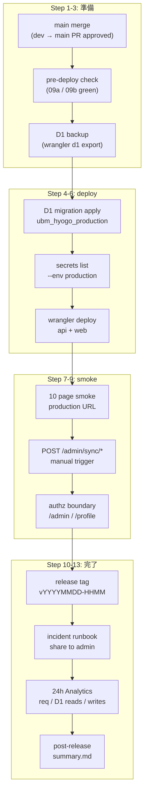

# Phase 2: 設計

## メタ情報

| 項目 | 値 |
| --- | --- |
| タスク名 | 09c-serial-production-deploy-and-post-release-verification |
| Phase 番号 | 2 / 13 |
| Phase 名称 | 設計 |
| Wave | 9 |
| Mode | serial（最終） |
| 作成日 | 2026-04-26 |
| 前 Phase | 1 (要件定義) |
| 次 Phase | 3 (設計レビュー) |
| 状態 | pending |

## 目的

production deploy フローを 13 ステップに分解し、各ステップの input / output / 確認 SQL / sanity check を Mermaid + module 設計 + dependency matrix + env table で固定する。spec_created なので実行コマンドは `outputs/phase-02/production-deploy-flow.md` に擬似 + placeholder で配置。

## 実行タスク

1. production deploy フロー 13 ステップ設計
2. Mermaid 全体図（main merge → migration → secrets check → deploy → smoke → tag → share → 24h verify）
3. dependency matrix（09a / 09b 引き渡し）
4. module 設計（5 モジュール）
5. env table（production 固有）

## 参照資料

| 種別 | パス | 用途 |
| --- | --- | --- |
| 必須 | doc/00-getting-started-manual/specs/15-infrastructure-runbook.md | wrangler / D1 / secrets |
| 必須 | doc/00-getting-started-manual/specs/14-implementation-roadmap.md | Phase 7 受け入れ |
| 必須 | doc/02-application-implementation/09a-parallel-staging-deploy-smoke-and-forms-sync-validation/phase-02.md | staging 設計（差分参照） |
| 必須 | doc/02-application-implementation/09b-parallel-cron-triggers-monitoring-and-release-runbook/phase-02.md | runbook 設計 |

## 実行手順

### ステップ 1: 13 ステップ deploy フロー設計
- `outputs/phase-02/production-deploy-flow.md` を作成

### ステップ 2: Mermaid 全体図

### ステップ 3: dependency matrix

### ステップ 4: module 設計

### ステップ 5: env table

## 統合テスト連携

| 連携先 Phase | 連携内容 |
| --- | --- |
| Phase 4 | verify suite で 13 ステップそれぞれを検証 |
| Phase 5 | runbook 化 |
| Phase 11 | manual evidence で 13 ステップ走破 |
| 上流 09a | dependency matrix で staging URL / smoke 結果を receive |
| 上流 09b | release runbook / incident runbook を receive |

## 多角的チェック観点（不変条件）

- 不変条件 #4: 設計に本人本文 D1 override の経路を含めない
- 不変条件 #5: production deploy フローに `apps/web` から D1 直接アクセスの経路がない
- 不変条件 #10: production cron 頻度試算で 100k 内
- 不変条件 #11: admin UI 設計で本文編集 form 不在を再確認
- 不変条件 #15: attendance 重複防止 SQL を post-release 検証 step に組み込む

## サブタスク管理

| # | サブタスク | 担当 Phase | 状態 | 備考 |
| --- | --- | --- | --- | --- |
| 1 | 13 ステップ設計 | 2 | pending | production-deploy-flow.md |
| 2 | Mermaid 全体図 | 2 | pending | main.md |
| 3 | dependency matrix | 2 | pending | main.md |
| 4 | module 設計 | 2 | pending | main.md |
| 5 | env table | 2 | pending | main.md |

## 成果物

| 種別 | パス | 説明 |
| --- | --- | --- |
| ドキュメント | outputs/phase-02/main.md | 設計サマリ + Mermaid + module + env table |
| ドキュメント | outputs/phase-02/production-deploy-flow.md | 13 ステップ詳細 |
| メタ | artifacts.json | Phase 2 を completed に更新 |

## 完了条件

- [ ] 13 ステップ完成
- [ ] Mermaid 1 枚
- [ ] dependency matrix 完成
- [ ] module 5 つ定義
- [ ] env table（production 固有）完成

## タスク100%実行確認【必須】

- 全実行タスクが completed
- 2 ファイル配置済み
- artifacts.json の phase 2 を completed に更新

## 次 Phase

- 次: 3 (設計レビュー)
- 引き継ぎ事項: 13 ステップ / Mermaid / dependency matrix / module / env table
- ブロック条件: 13 ステップに staging 操作が混在で次 Phase に進まない

## Mermaid 全体図

## 13 ステップ deploy フロー（概要）

| Step | 名称 | 主コマンド / 操作 | 確認 SQL / sanity |
| --- | --- | --- | --- |
| 1 | main merge | `gh pr merge --squash` (dev → main) | `git log --oneline -1` |
| 2 | pre-deploy check | 09a / 09b の AC matrix を再確認 | 全 AC `completed` |
| 3 | D1 backup | `wrangler d1 export ubm_hyogo_production --remote --output=backup-<ts>.sql --env production` | backup ファイル存在 |
| 4 | D1 migration list | `wrangler d1 migrations list ubm_hyogo_production --remote --env production` | 全 `Applied` |
| 5 | D1 migration apply | `wrangler d1 migrations apply ubm_hyogo_production --remote --env production` | 適用済 / 失敗時は rollback |
| 6 | secrets check | `wrangler secret list --env production` + `wrangler pages secret list` | 必須 7 種 |
| 7 | api deploy | `pnpm --filter @ubm/api deploy:production` | exit 0 |
| 8 | web deploy | `pnpm --filter @ubm/web deploy:production` | exit 0 |
| 9 | 10 page smoke | curl + 手動 click | 200 / 認可境界 |
| 10 | manual sync trigger | `POST /admin/sync/schema` + `POST /admin/sync/responses` | sync_jobs success |
| 11 | release tag | `git tag vYYYYMMDD-HHMM && git push --tags` | `git ls-remote --tags` |
| 12 | incident runbook 共有 | Slack / Email placeholder で送信 | share-evidence.md |
| 13 | 24h verify | Cloudflare Analytics 確認 + 不変条件 5 つの再確認 | post-release-summary.md |

## env / placeholder 一覧（production 固有）

| 区分 | 値 | 配置 | 状態 |
| --- | --- | --- | --- |
| api worker name | `ubm-hyogo-api` | `apps/api/wrangler.toml [env.production]` | 既存 |
| web pages name | `ubm-hyogo-web` | Cloudflare Workers | 既存 |
| D1 database | `ubm_hyogo_production` | `apps/api/wrangler.toml [[env.production.d1_databases]]` | 既存 |
| api URL | `https://ubm-hyogo-api.<account>.workers.dev` | DNS / Cloudflare | 既存 |
| web URL | `https://ubm-hyogo-web.pages.dev` | Cloudflare Workers | 既存 |
| GOOGLE_SERVICE_ACCOUNT_EMAIL | (secret) | Cloudflare Secrets (api production) | 確認のみ |
| GOOGLE_PRIVATE_KEY | (secret) | 同上 | 確認のみ |
| GOOGLE_FORM_ID | `119ec539YYGmkUEnSYlhI-zMXtvljVpvDFMm7nfhp7Xg` | 同上 | 確認のみ |
| RESEND_API_KEY | (secret) | 同上 | 確認のみ |
| AUTH_SECRET | (secret) | Cloudflare Workers Secrets (web production) | 確認のみ |
| AUTH_GOOGLE_ID | (secret) | 同上 | 確認のみ |
| AUTH_GOOGLE_SECRET | (secret) | 同上 | 確認のみ |
| release tag | `vYYYYMMDD-HHMM` | git tag | 09c で生成 |

## Dependency matrix

| 種別 | 相手 | 引き渡し物（in / out） |
| --- | --- | --- |
| 上流 in | 09a | staging URL / sync_jobs id / smoke 結果 / a11y 結果 / 無料枠 staging 試算 |
| 上流 in | 09b | release runbook / incident response runbook / rollback procedures (worker / pages / D1 / cron) / cron schedule (`*/15`, `0 3`) |
| 並列 sync | なし | - |
| 下流 out | なし（Wave 9 最終 serial、24 タスクの最後） | - |

## Module 設計

| Module | 責務 |
| --- | --- |
| pre-deploy-check | 09a / 09b の AC matrix を再確認、`main` ブランチが最新であることを確認 |
| production-d1 | migration list / apply / backup / rollback 後方互換 |
| production-deploy | api worker + web pages の `pnpm deploy:production`、deploy id 取得 |
| production-smoke | 10 ページ + 認可境界 + manual sync trigger + 不変条件 5 つの確認 |
| release-tag-and-share | `vYYYYMMDD-HHMM` tag 付与、incident runbook を関係者共有、24h Analytics 確認 |

## production deploy 固有設計（staging との差分）

| 項目 | staging (09a) | production (09c) |
| --- | --- | --- |
| ブランチ | `dev` | `main` |
| api worker | `ubm-hyogo-api-staging` | `ubm-hyogo-api` |
| web pages | `ubm-hyogo-web-staging` | `ubm-hyogo-web` |
| D1 | `ubm_hyogo_staging` | `ubm_hyogo_production` |
| wrangler env | (default) | `--env production` |
| approval | dev push のみ | **user 承認必須**（Phase 10 + 11 + 13） |
| backup | 任意 | **必須**（Step 3） |
| tag 付与 | なし | **必須**（`vYYYYMMDD-HHMM`） |
| 24h verify | 任意 | **必須**（Step 13） |
| incident runbook 共有 | なし | **必須**（Step 12） |
