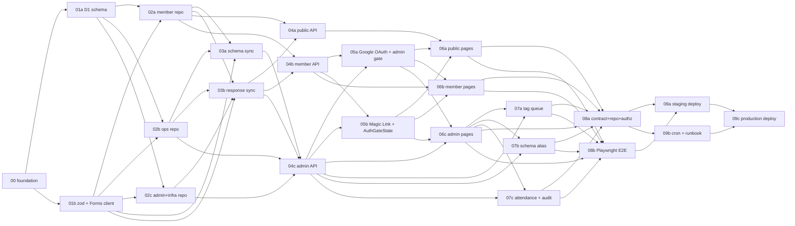

# Phase 2: 設計 — ディレクトリ構成と Wave マトリクス（24 タスク版）

## メタ情報

| 項目 | 値 |
| --- | --- |
| 設計対象 | doc/02-application-implementation/ 配下のディレクトリ構成と依存関係 |
| Phase | 2 / 3（設計書 phase） |
| 作成日 | 2026-04-26 |
| 改訂日 | 2026-04-26（17 → 24 タスクに分解、並列度を 11 → 22 に拡大） |
| 上流 | _design/phase-1-requirements.md |
| 下流 | _design/phase-3-review.md, 各タスクディレクトリ生成 |

## 命名規則

```
<番号>[a-z]?-<serial|parallel>-<実装内容のキーワード>/
```

| 要素 | 例 | 意味 |
| --- | --- | --- |
| 番号 | 00, 01, 04, 09 | Wave 番号（実行順） |
| サフィックス | a, b, c | 同 Wave 内の並列タスク識別子 |
| 種別 | serial / parallel | Wave 内・Wave 間の実行種別 |
| 実装内容 | `member-identity-status-and-response-repository` | 責務 + 主成果物が読み取れる kebab-case |

凡例:
- `serial`: その Wave に1タスクのみ（または Wave 末尾の最終タスク）。前 Wave 完了後に開始、次 Wave をブロック
- `parallel`: 同 Wave 内に他タスクと並列実行可能

**命名原則**: 「ディレクトリ名だけ見て、何を実装するか・どこを触るか」が分かること。具体性 > 簡潔性を優先する。

## 最終ディレクトリ構成（24 タスク）

```
doc/02-application-implementation/
├── README.md                                                              # Wave 一覧、実行順、不変条件サマリー
├── _design/                                                                # 設計書 Phase 1-3
│   ├── phase-1-requirements.md
│   ├── phase-2-design.md
│   └── phase-3-review.md
├── _templates/                                                             # 共通テンプレート
│   ├── artifacts-template.json
│   ├── phase-template-app.md
│   ├── phase-meaning-app.md
│   └── task-index-template.md
├── 00-serial-monorepo-shared-types-and-ui-primitives-foundation/          # Wave 0 (serial)
├── 01a-parallel-d1-database-schema-migrations-and-tag-seed/               # Wave 1
├── 01b-parallel-zod-view-models-and-google-forms-api-client/              # Wave 1
├── 02a-parallel-member-identity-status-and-response-repository/           # Wave 2
├── 02b-parallel-meeting-tag-queue-and-schema-diff-repository/             # Wave 2
├── 02c-parallel-admin-notes-audit-sync-jobs-and-data-access-boundary/     # Wave 2
├── 03a-parallel-forms-schema-sync-and-stablekey-alias-queue/              # Wave 3
├── 03b-parallel-forms-response-sync-and-current-response-resolver/        # Wave 3
├── 04a-parallel-public-directory-api-endpoints/                           # Wave 4
├── 04b-parallel-member-self-service-api-endpoints/                        # Wave 4
├── 04c-parallel-admin-backoffice-api-endpoints/                           # Wave 4
├── 05a-parallel-authjs-google-oauth-provider-and-admin-gate/              # Wave 5
├── 05b-parallel-magic-link-provider-and-auth-gate-state/                  # Wave 5
├── 06a-parallel-public-landing-directory-and-registration-pages/          # Wave 6
├── 06b-parallel-member-login-and-profile-pages/                           # Wave 6
├── 06c-parallel-admin-dashboard-members-tags-schema-meetings-pages/       # Wave 6
├── 07a-parallel-tag-assignment-queue-resolve-workflow/                    # Wave 7
├── 07b-parallel-schema-diff-alias-assignment-workflow/                    # Wave 7
├── 07c-parallel-meeting-attendance-and-admin-audit-log-workflow/          # Wave 7
├── 08a-parallel-api-contract-repository-and-authorization-tests/          # Wave 8
├── 08b-parallel-playwright-e2e-and-ui-acceptance-smoke/                   # Wave 8
├── 09a-parallel-staging-deploy-smoke-and-forms-sync-validation/           # Wave 9
├── 09b-parallel-cron-triggers-monitoring-and-release-runbook/             # Wave 9
└── 09c-serial-production-deploy-and-post-release-verification/            # Wave 9 (serial - last)
```

各タスクディレクトリ内:

```
<task-dir>/
├── index.md                  # メタ情報、scope、AC、Phase 一覧、依存
├── artifacts.json            # 機械可読サマリー（13 phase 状態）
├── phase-01.md               # 要件定義
├── phase-02.md               # 設計
├── phase-03.md               # 設計レビュー
├── phase-04.md               # テスト戦略
├── phase-05.md               # 実装ランブック
├── phase-06.md               # 異常系検証
├── phase-07.md               # AC マトリクス
├── phase-08.md               # DRY 化
├── phase-09.md               # 品質保証
├── phase-10.md               # 最終レビュー
├── phase-11.md               # 手動 smoke
├── phase-12.md               # ドキュメント更新
├── phase-13.md               # PR 作成（user 承認後）
└── outputs/                  # Phase 別成果物
```

## Wave マトリクス（24 タスク）

| Wave | ディレクトリ | 種別 | 担当責務 | 主参照 specs | 上流依存 | 下流ブロック |
| --- | --- | --- | --- | --- | --- | --- |
| 0 | 00-serial-monorepo-shared-types-and-ui-primitives-foundation | serial | apps/web/api 雛形、packages/shared 型、UI primitives | 00,04,16 | doc/01-infrastructure-setup/02 | 全 Wave 1+ |
| 1 | 01a-parallel-d1-database-schema-migrations-and-tag-seed | parallel | D1 schema 16 テーブル、migrations、seed | 08 | 00 | 02a/b/c, 03a/b |
| 1 | 01b-parallel-zod-view-models-and-google-forms-api-client | parallel | zod validation、Forms API クライアント | 01,04 | 00 | 02a/b/c, 03a/b, 04* |
| 2 | 02a-parallel-member-identity-status-and-response-repository | parallel | members + identities + status + responses 系 repo | 03,07,08 | 01a, 01b | 03b, 04a/b |
| 2 | 02b-parallel-meeting-tag-queue-and-schema-diff-repository | parallel | meetings + attendance + tag/schema queue 系 repo | 08,11,12 | 01a, 01b | 03a, 04c, 07a/b/c |
| 2 | 02c-parallel-admin-notes-audit-sync-jobs-and-data-access-boundary | parallel | admin_users + notes + audit + sync_jobs + magic_tokens repo、apps/web→D1禁止 lint、共通 fixture | 02,08,11 | 01a, 01b | 04c, 07c |
| 3 | 03a-parallel-forms-schema-sync-and-stablekey-alias-queue | parallel | forms.get schema sync、diff queue | 01,03 | 02a, 02b, 01b | 04c, 07b |
| 3 | 03b-parallel-forms-response-sync-and-current-response-resolver | parallel | forms.responses.list、stableKey、current_response_id、consent snapshot | 03,07 | 02a, 02b, 01b | 04*, 07a/c |
| 4 | 04a-parallel-public-directory-api-endpoints | parallel | `GET /public/*` 4 endpoints | 01,03,05 | 02a, 03b | 06a, 08a |
| 4 | 04b-parallel-member-self-service-api-endpoints | parallel | `/me/*` get + post (visibility/delete request) | 06,07,10 | 02a, 03b | 05a, 05b, 06b, 08a |
| 4 | 04c-parallel-admin-backoffice-api-endpoints | parallel | `/admin/*` 全 endpoints | 11,12 | 02b, 02c, 03a, 03b | 05a, 05b, 06c, 07a/b/c, 08a |
| 5 | 05a-parallel-authjs-google-oauth-provider-and-admin-gate | parallel | Google OAuth provider、admin gate middleware | 02,06,13 | 04b, 04c | 06a/b/c, 08a |
| 5 | 05b-parallel-magic-link-provider-and-auth-gate-state | parallel | Magic Link、magic_tokens 有効期限、AuthGateState 5 状態 | 02,10,13 | 04b, 04c | 06a/b/c, 08a |
| 6 | 06a-parallel-public-landing-directory-and-registration-pages | parallel | `/`, `/members`, `/members/[id]`, `/register`, form-preview | 05,09,12 | 04a, 05a, 05b | 08a, 08b |
| 6 | 06b-parallel-member-login-and-profile-pages | parallel | `/login`, `/profile` | 05,06,07,10 | 04b, 05a, 05b | 08a, 08b |
| 6 | 06c-parallel-admin-dashboard-members-tags-schema-meetings-pages | parallel | `/admin/*` 全画面 | 05,09,11,12 | 04c, 05a, 05b | 07a/b/c, 08a, 08b |
| 7 | 07a-parallel-tag-assignment-queue-resolve-workflow | parallel | tag_assignment_queue resolve workflow | 11,12 | 04c, 06c, 03b | 08a, 08b |
| 7 | 07b-parallel-schema-diff-alias-assignment-workflow | parallel | schema_diff_queue alias 割当 workflow | 11 | 04c, 06c, 03a | 08a, 08b |
| 7 | 07c-parallel-meeting-attendance-and-admin-audit-log-workflow | parallel | meeting attendance 重複防止 + 削除済み除外 + admin audit log | 11,12 | 04c, 06c, 02c, 03b | 08a, 08b |
| 8 | 08a-parallel-api-contract-repository-and-authorization-tests | parallel | API contract test、repository test、authorization test | 全 | 06a/b/c, 07a/b/c | 09a |
| 8 | 08b-parallel-playwright-e2e-and-ui-acceptance-smoke | parallel | Playwright で 09-ui-ux.md 検証マトリクス | 09 | 06a/b/c, 07a/b/c | 09a |
| 9 | 09a-parallel-staging-deploy-smoke-and-forms-sync-validation | parallel | staging deploy、Forms 同期確認、Playwright pass | 14,15 | 08a, 08b | 09c |
| 9 | 09b-parallel-cron-triggers-monitoring-and-release-runbook | parallel | wrangler cron schedule、監視、release runbook | 15 | 08a, 08b | 09c |
| 9 | 09c-serial-production-deploy-and-post-release-verification | serial | production deploy、本番 D1 migration / secrets 確認、post-release verification | 14,15 | 09a, 09b | (final) |

**並列度サマリー**: 22 parallel + 2 serial = 24 タスク。直列は Wave 0（foundation）と Wave 9c（production deploy）のみ。

## タスク詳細仕様

### Wave 0: 00-serial-monorepo-shared-types-and-ui-primitives-foundation
- **purpose**: pnpm workspace の app 層を成立させ、後続全タスクの土台を作る
- **scope in**: apps/web (Next.js App Router skeleton)、apps/api (Hono skeleton)、packages/shared (型 + view model + validation 雛形)、packages/integrations/google (Forms client 雛形)、UI primitives 15種、tones.ts (zoneTone / statusTone)
- **scope out**: ビジネスロジック実装、ページ実装、D1 テーブル
- **AC**: pnpm install + typecheck + lint + test pass、UI primitives が 16-component-library.md 準拠

### Wave 1a: 01a-parallel-d1-database-schema-migrations-and-tag-seed
- **purpose**: 08-free-database.md の 16 テーブルを D1 migration 化、初期 seed 投入
- **scope in**: members, member_identities, member_status, member_responses, response_sections, response_fields, member_field_visibility, member_tags, tag_definitions, tag_assignment_queue, schema_versions, schema_questions, schema_diff_queue, meeting_sessions, member_attendance, admin_users, admin_member_notes, deleted_members, magic_tokens, sync_jobs の create migration、tag_definitions 6カテゴリ初期 seed
- **scope out**: repository 層実装（02a/b/c に分離）
- **AC**: `wrangler d1 migrations apply` が local/remote pass、seed で 6 カテゴリ投入、無料枠見積もり

### Wave 1b: 01b-parallel-zod-view-models-and-google-forms-api-client
- **purpose**: packages/shared に zod schema + view model 型、packages/integrations/google に Forms API クライアント
- **scope in**: 型 4 層（schema / raw / identity / viewmodel）、ResponseEmail / ResponseId / MemberId / StableKey 型、PublicStatsView / PublicMemberListView / PublicMemberProfile / FormPreviewView / SessionUser / MemberProfile / AdminDashboardView / AdminMemberListView / AdminMemberDetailView / AuthGateState、forms.get と forms.responses.list の wrapper（サービスアカウント認証）
- **scope out**: 同期ロジック本体（03a/03b）
- **AC**: 04-types.md の型 4 層が網羅、Forms client が auth テスト pass、validation schema が 31 項目すべてカバー

### Wave 2a: 02a-parallel-member-identity-status-and-response-repository
- **purpose**: 会員ドメインの repository（members + identities + status + responses + sections + fields + visibility + tags + extraFields）
- **scope in**: `apps/api/repository/members.ts`, `identities.ts`, `status.ts`, `responses.ts`, `responseSections.ts`, `responseFields.ts`, `fieldVisibility.ts`, `memberTags.ts` の CRUD + view model 組み立て、`responseId` と `memberId` を混同しない型 test
- **scope out**: meeting / queue / schema / admin 系（02b/c）、apps/web 直接呼び出し
- **AC**: repository unit test pass、fixture から PublicMemberProfile / MemberProfile / AdminMemberDetailView 組み立て可、`responseId !== memberId` 型 test green

### Wave 2b: 02b-parallel-meeting-tag-queue-and-schema-diff-repository
- **purpose**: 開催 / queue 系の repository（meetings + attendance + tag_definitions + tag_assignment_queue + schema_versions + schema_questions + schema_diff_queue）
- **scope in**: `apps/api/repository/meetings.ts`, `attendance.ts`, `tagDefinitions.ts`, `tagQueue.ts`, `schemaVersions.ts`, `schemaQuestions.ts`, `schemaDiffQueue.ts` の CRUD、attendance 重複制約のテスト fixture
- **scope out**: queue resolve workflow（07a/b）、admin audit（02c/07c）
- **AC**: queue 系 CRUD test pass、schema diff の latest version 取得 test pass、attendance 重複が DB constraint で阻止される test

### Wave 2c: 02c-parallel-admin-notes-audit-sync-jobs-and-data-access-boundary
- **purpose**: 管理 / 監査 / 補助テーブルの repository、apps/web → D1 直接禁止 lint、共通 fixture seeder
- **scope in**: `apps/api/repository/adminUsers.ts`, `adminMemberNotes.ts`, `auditLog.ts`, `syncJobs.ts`, `magicTokens.ts`、apps/web → D1 直接 import 禁止 ESLint rule、prototype data.jsx 相当の最小 fixture seeder
- **scope out**: 認証統合（05a/b）、queue workflow（07a/b/c）
- **AC**: admin_member_notes が public/member view model に混ざらないことを test、apps/web から D1 import が lint で error、fixture から各 view model 組み立て可

### Wave 3a: 03a-parallel-forms-schema-sync-and-stablekey-alias-queue
- **purpose**: forms.get で 31 項目・6 セクションの schema を D1 へ同期し、stableKey 未割当 question を schema_diff_queue に積む
- **scope in**: forms.get 実行、schema_versions / schema_questions 保存、未割当 question を schema_diff_queue に登録、alias 解決ロジック、`POST /admin/sync/schema` の job 関数
- **scope out**: response sync（03b）、admin UI（06c）、alias 割当 workflow（07b）
- **AC**: 31 項目・6 セクションが schema_versions に保存、新規 question は schema_diff_queue に積まれる、alias 解決後に stableKey が更新

### Wave 3b: 03b-parallel-forms-response-sync-and-current-response-resolver
- **purpose**: forms.responses.list で response を D1 へ同期、stableKey で field 値を解決、current_response_id を最新へ更新、consent snapshot を member_status に反映
- **scope in**: forms.responses.list 実行、member_responses / response_sections / response_fields 保存、unknown field は extraFields + schema_diff_queue に残す、member_identities.current_response_id 切替、publicConsent / rulesConsent snapshot を member_status に反映、`POST /admin/sync/responses` の job 関数
- **scope out**: schema sync（03a）、admin UI、queue resolve（07a/c）
- **AC**: 同一メールの再回答で current_response が切り替わる、unknown field が extraFields に残る、consent snapshot が member_status に反映、`responseEmail` を system field として保存

### Wave 4a: 04a-parallel-public-directory-api-endpoints
- **purpose**: 公開ディレクトリ API 4 endpoints
- **scope in**: `GET /public/stats`、`GET /public/members` (publicConsent=consented + publishState=public + isDeleted=false フィルタ)、`GET /public/members/:memberId` (FieldVisibility=public のみ)、`GET /public/form-preview`、search query (q/zone/status/tag/sort/density) の解釈
- **scope out**: 認証必要な endpoints
- **AC**: response schema が view model と一致、不適格 member が一切 leak しない、認可違反 test pass

### Wave 4b: 04b-parallel-member-self-service-api-endpoints
- **purpose**: 会員セルフサービス API
- **scope in**: `GET /me`、`GET /me/profile` (editResponseUrl 含む)、`POST /me/visibility-request`、`POST /me/delete-request`、session user の memberId 以外を絶対返さない
- **scope out**: profile 本文編集 API（不変条件 #4）
- **AC**: session 必須、他人の memberId に絶対アクセスできない、editResponseUrl が response から正しく返る、403/404 境界 test pass

### Wave 4c: 04c-parallel-admin-backoffice-api-endpoints
- **purpose**: 管理バックオフィス API 全 endpoints
- **scope in**: `GET /admin/dashboard`、`GET /admin/members`、`GET /admin/members/:memberId`、`PATCH /admin/members/:memberId/status`、`POST /admin/members/:memberId/notes` + `PATCH .../notes/:noteId`、`POST /admin/members/:memberId/delete` + restore、`GET /admin/tags/queue` + `POST /admin/tags/queue/:queueId/resolve`、`GET /admin/schema/diff` + `POST /admin/schema/aliases`、`GET /admin/meetings` + `POST /admin/meetings`、`POST /admin/meetings/:sessionId/attendance` + `DELETE`、`POST /admin/sync/schema` + `POST /admin/sync/responses`
- **scope out**: profile 本文の直接編集（不変条件 #11）
- **AC**: admin_users に登録された user のみ許可、本人本文の直接編集 endpoint が存在しない、admin_member_notes は public/member view model に混ざらない、認可違反 test 全 pass

### Wave 5a: 05a-parallel-authjs-google-oauth-provider-and-admin-gate
- **purpose**: Google OAuth provider 設定、admin gate middleware
- **scope in**: Auth.js Google OAuth provider 設定、AUTH_SECRET / GOOGLE_CLIENT_ID / GOOGLE_CLIENT_SECRET、admin gate middleware（admin_users 確認）、session callback で memberId と admin flag を解決
- **scope out**: Magic Link、AuthGateState（05b）
- **AC**: Google OAuth 認証 fixture pass、admin gate が admin_users に登録された user のみ通す、AUTH_SECRET 等が secrets で管理されている

### Wave 5b: 05b-parallel-magic-link-provider-and-auth-gate-state
- **purpose**: Magic Link provider、AuthGateState 5 状態出し分け
- **scope in**: Magic Link provider + magic_tokens 有効期限、`POST /auth/magic-link`、AuthGateState (`input` / `sent` / `unregistered` / `rules_declined` / `deleted`)、MAIL_PROVIDER_KEY、`/no-access` に依存しない
- **scope out**: Google OAuth（05a）、画面実装（06b）
- **AC**: 未登録メールは unregistered、rulesConsent != consented は rules_declined、isDeleted は deleted、magic_tokens 有効期限切れ test pass、`/no-access` ルート不在

### Wave 6a: 06a-parallel-public-landing-directory-and-registration-pages
- **purpose**: 公開画面群（landing / 一覧 / 詳細 / 登録）
- **scope in**: `/` landing、`/members` 一覧 + 検索コントロール (q/zone/status/tag/sort/density)、`/members/[id]` 詳細、`/register` 登録導線（Google Form responderUrl へリンク）、form-preview 表示、09-ui-ux.md 準拠
- **scope out**: theme/nav/detailLayout/editMode のユーザー機能化、localStorage 正本化、`window.UBM` 参照
- **AC**: prototype 同等の公開導線が URL ベースで動く、density は query / client state、`window.UBM` 参照ゼロ、stableKey 参照（questionId 直書き禁止）

### Wave 6b: 06b-parallel-member-login-and-profile-pages
- **purpose**: 会員画面（ログイン / マイページ）
- **scope in**: `/login` (AuthGateState 5 状態出し分け、Magic Link 送信フォーム + Google OAuth ボタン)、`/profile` (自分の public + member field + 状態サマリ + editResponseUrl ボタン)
- **scope out**: profile 本文編集 UI（不変条件 #4）
- **AC**: AuthGateState 5 状態を全て出し分け、profile 本文は表示のみ、editResponseUrl ボタンで Google Form 編集画面へ遷移、未ログインで /profile アクセス → /login

### Wave 6c: 06c-parallel-admin-dashboard-members-tags-schema-meetings-pages
- **purpose**: 管理画面 全 5 画面
- **scope in**: `/admin` dashboard、`/admin/members` (drawer + status 操作 + 管理メモ + タグ割当画面導線)、`/admin/tags` (queue panel)、`/admin/schema` (diff + alias 割当)、`/admin/meetings` (session 一覧 + attendance 編集)
- **scope out**: 他人 profile 本文の直接編集 UI、`/admin/users` 管理者管理 UI、admin drawer でのタグ直接編集
- **AC**: 管理者は他人 profile 本文を直接編集できない、タグは queue → resolve 経由、schema 変更は /admin/schema に集約、attendance は重複登録不可 + 削除済み会員除外

### Wave 7a: 07a-parallel-tag-assignment-queue-resolve-workflow
- **purpose**: tag_assignment_queue の candidate → confirmed → member_tags 反映 workflow
- **scope in**: queue 状態遷移ロジック、admin が candidate を承認 → confirmed → member_tags へ反映、queue 状態の audit、reject 時の理由記録
- **scope out**: schema alias（07b）、attendance（07c）
- **AC**: queue resolve 後に member_tags が反映、reject 時に reason が記録、queue 状態遷移が unidirectional（candidate → confirmed | rejected）

### Wave 7b: 07b-parallel-schema-diff-alias-assignment-workflow
- **purpose**: schema_diff_queue の alias 割当 workflow（stableKey 更新）
- **scope in**: 新規 question の alias 候補提案、admin による alias 確定、schema_questions.stableKey 更新、過去 response への back-fill 戦略
- **scope out**: tag queue（07a）、attendance（07c）、forms.get 実行（03a）
- **AC**: alias 確定で stableKey が更新、back-fill が dry-run で確認可能、alias 重複が constraint で阻止

### Wave 7c: 07c-parallel-meeting-attendance-and-admin-audit-log-workflow
- **purpose**: meeting attendance 重複防止 + 削除済み会員除外 + admin 操作 audit log
- **scope in**: attendance 重複登録 DB constraint、削除済み会員を attendance 候補から除外、admin 操作 audit log（who / what / when / target memberId）、attendance 削除時の audit
- **scope out**: tag queue（07a）、schema alias（07b）
- **AC**: attendance 重複が DB constraint で阻止、削除済み会員が候補に出ない、admin 操作が全て audit log に残る

### Wave 8a: 08a-parallel-api-contract-repository-and-authorization-tests
- **purpose**: API contract test、repository test、authorization test を網羅
- **scope in**: 全 endpoint の response schema 検証（zod parse）、repository unit test (fixture ベース)、public/member/admin 認可境界 test、auth gate / admin member detail / admin meetings の contract test、不変条件 #1, #2, #5, #6, #11 の test
- **scope out**: E2E（08b）
- **AC**: contract test 100% green、repository test pass、認可違反 test が必ず 401/403、`responseId` と `memberId` の混同を type test で防止

### Wave 8b: 08b-parallel-playwright-e2e-and-ui-acceptance-smoke
- **purpose**: 09-ui-ux.md の検証マトリクスを Playwright で desktop/mobile 両方
- **scope in**: 公開導線、ログイン (5 AuthGateState)、マイページ (editResponseUrl 遷移)、管理画面 5 画面、検索 (q/zone/status/tag/sort/density)、density 切替、screenshot evidence を outputs/ に保存
- **scope out**: visual regression snapshot diff
- **AC**: 全シナリオが desktop + mobile で pass、screenshot evidence が outputs/phase-11/ に保存、09-ui-ux.md の検証マトリクス全 row が green

### Wave 9a: 09a-parallel-staging-deploy-smoke-and-forms-sync-validation
- **purpose**: staging deploy、Forms 同期動作確認、Playwright pass
- **scope in**: D1 migration 確認 (`wrangler d1 migrations list`)、secrets 確認 (`wrangler secret list`)、staging deploy (`pnpm deploy:staging`)、staging で Forms 同期動作、staging で Playwright pass
- **scope out**: production deploy（09c）、cron 設定（09b）
- **AC**: staging で公開一覧 + ログイン + マイページ + 管理が通る、staging で Forms 同期が成功、staging Playwright が green

### Wave 9b: 09b-parallel-cron-triggers-monitoring-and-release-runbook
- **purpose**: wrangler cron schedule、監視 / alert 連携、release runbook 作成
- **scope in**: wrangler triggers cron 設定（forms sync 定期実行）、Cloudflare Analytics / Sentry 連携 placeholder、release runbook (`outputs/phase-12/release-runbook.md`)
- **scope out**: production deploy（09c）、staging deploy（09a）
- **AC**: cron schedule が wrangler.toml に定義、release runbook に rollback 手順含む、監視 dashboard へのリンクが runbook に記載

### Wave 9c: 09c-serial-production-deploy-and-post-release-verification
- **purpose**: production deploy（最終）、本番 D1 migration 確認、本番 secrets 確認、post-release verification
- **scope in**: production の D1 migration 確認、production secrets 確認、production deploy (`pnpm deploy:production`)、本番 smoke、release tag 付け、incident response runbook の共有
- **scope out**: 開発作業全般
- **AC**: production で公開一覧 + ログイン + マイページ + 管理が通る、本番 D1 migration + secrets 確認済み、本番 smoke green、release tag 付与済み

## 構成図



## 環境変数一覧（カテゴリ別整理）

| 区分 | 代表値 | 置き場所 | 担当 task |
| --- | --- | --- | --- |
| Google service account | GOOGLE_SERVICE_ACCOUNT_JSON | Cloudflare Secrets | 03a, 03b |
| Google OAuth | GOOGLE_CLIENT_ID / SECRET | Cloudflare Secrets | 05a |
| Auth.js | AUTH_SECRET | Cloudflare Secrets | 05a |
| Mail (Magic Link) | MAIL_PROVIDER_KEY | Cloudflare Secrets | 05b |
| D1 binding | DB | wrangler binding | 01a, 02a/b/c |
| GOOGLE_SHEET_ID | (non-secret identifier) | wrangler vars | 01b, 03a/b |
| GOOGLE_FORM_ID | (non-secret identifier) | wrangler vars | 01b, 03a/b |

## _templates 設計

| ファイル | 内容 |
| --- | --- |
| artifacts-template.json | task_name / wave / execution_mode / depends_on / blocks / created_at / phases[] x 13 のスケルトン |
| phase-template-app.md | Phase 共通フォーマット（メタ + 目的 + 実行タスク + 参照資料 + 実行手順 + 統合テスト連携 + 多角的チェック観点 + サブタスク + 成果物 + 完了条件 + 100%実行確認 + 次 Phase） |
| phase-meaning-app.md | アプリ実装文脈での Phase 1-13 意味定義 |
| task-index-template.md | index.md の章構成 |

## 4 条件（再評価）

| 条件 | 判定 | 根拠 |
| --- | --- | --- |
| 価値性 | PASS | 24 タスクが specs/ 全機能を網羅、責務境界が機能単位で一意 |
| 実現性 | PASS | 既存テンプレ構造を流用、SubAgent 並列で 24 ディレクトリを生成可能 |
| 整合性 | PASS | Wave マトリクスで上流/下流/並列が閉じる、cross-wave 並列なし、循環依存なし |
| 運用性 | PASS | specs/ 改訂時は該当 task の Phase 12 で sync、命名で並列/直列が読み取れる、22/24 が並列で実行効率高い |

## 17 → 24 タスクへの分解差分

| 旧（17）| 新（24）| 分解理由 |
| --- | --- | --- |
| 旧repository統合案 | 02a (member) / 02b (ops) / 02c (admin+infra) | repository は domain 単位で互いに独立、並列化可能 |
| 旧auth統合案 | 05a (Google OAuth + gate) / 05b (Magic Link + AuthGateState) | provider 単位で独立、UI は AuthGateState を使うだけ |
| 07-serial-admin-ops-... | 07a (tag queue) / 07b (schema alias) / 07c (attendance + audit) | 各 workflow は別テーブル、独立 |
| 旧release統合案 | 09a (staging) / 09b (cron + runbook) / 09c (production serial) | staging と runbook 作成は並列、production は最終 serial |

## 次 Phase へ

- Phase 3 設計レビューで次を判定:
  - alternative: 24 タスクをもっと統合できないか / もっと分解できないか
  - 漏れチェック: specs/ の各機能が必ず1タスクにマッピング
  - GO/NO-GO: タスク仕様書生成への着手判定
