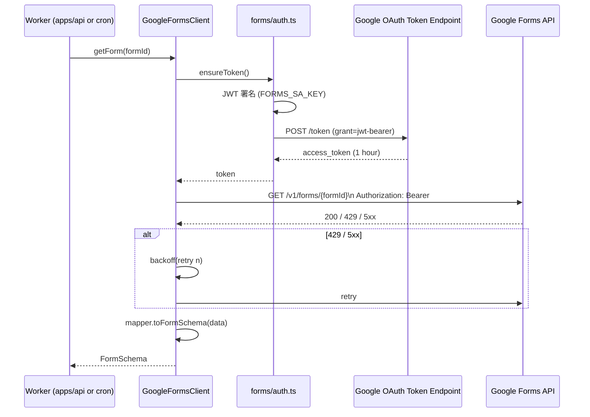

# Phase 2: 設計 — 成果物

> 仕様書: `phase-02.md` を再構成した最終版（実装結果を反映）。

## 1. メタ情報

| 項目 | 値 |
| --- | --- |
| タスク名 | zod-view-models-and-google-forms-api-client |
| Wave | 1 |
| Phase | 2 / 13 |
| 上流 | Phase 1（要件定義） |
| 下流 | Phase 3（設計レビュー） |
| 状態 | done |

## 2. 目的

package 構造 / module 分割 / Forms 認証 flow / zod schema レイアウト / 依存矢印を確定し、Phase 5 の実装ランブックの設計図を完成させる。

## 3. package 構造

```mermaid
flowchart LR
  subgraph pkg-shared[packages/shared]
    types[src/types/{schema,response,identity,viewmodel}]
    branded[src/branded/index.ts]
    zod[src/zod/{primitives,field,schema,response,identity,viewmodel}]
    utils[src/utils/consent.ts]
    sharedIdx[src/index.ts]
  end
  subgraph pkg-google[packages/integrations/google]
    fclient[src/forms/client.ts]
    fauth[src/forms/auth.ts]
    fbackoff[src/forms/backoff.ts]
    fmapper[src/forms/mapper.ts]
    googleIdx[src/index.ts]
  end
  fmapper --> types
  fmapper --> zod
  sharedIdx -.-> types
  sharedIdx -.-> branded
  sharedIdx -.-> zod
  sharedIdx -.-> utils
  googleIdx -.-> fclient
```

## 4. dependency matrix

| from \ to | shared | integrations/google | apps/api | apps/web |
| --- | :---: | :---: | :---: | :---: |
| shared | self | NO | NO | NO |
| integrations/google | OK | self | NO | NO |
| apps/api | OK | OK | self | NO |
| apps/web | OK | **NO**（不変条件 #5） | OK | self |

## 5. Forms 認証 flow



## 6. zod レイアウト

| schema 名 | 用途 | 適用境界 |
| --- | --- | --- |
| `FormSchemaZ` | Forms API → schema 層 | mapper |
| `FormResponseZ` | Forms API → response 層 | mapper |
| `MemberIdentityZ` | DB row → identity 層 | repository |
| `MemberStatusZ` | DB row → identity 層 | repository |
| `PublicStatsViewZ` 〜 10 種 | API endpoint response | Hono ハンドラ |
| `*RequestZ` | API request body | Hono ハンドラ |

## 7. ESLint 境界保護（概要）

| rule | 内容 |
| --- | --- |
| boundary script | `apps/web/**` から `@ubm-hyogo/integrations-google` import を禁止 |
| boundary script | `apps/web/**` から `apps/api/**` を import 禁止（不変条件 #5 補強） |
| `@typescript-eslint/no-explicit-any` | viewmodel に any 禁止 |

> 詳細は `eslint-boundary-rule.md` を参照。

## 8. 不変条件マッピング

- **#1**: schema 層は generic 構造、question 固有名を hardcode しない
- **#5**: dependency matrix で `apps/web → integrations/google` を 禁止
- **#7**: branded type 定義で `MemberId !== ResponseId` を型レベル保証

## 9. 完了確認

- [x] package 構造 Mermaid 完成
- [x] dependency matrix 完成
- [x] Forms 認証 sequence diagram 完成
- [x] zod レイアウト一覧表完成
