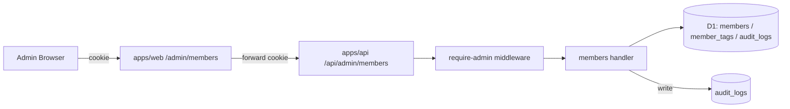

# Phase 2: 設計 — 06c-B-admin-members

## メタ情報

| 項目 | 値 |
| --- | --- |
| task name | 06c-B-admin-members |
| phase | 2 / 13 |
| wave | 06c-fu |
| mode | parallel |
| 作成日 | 2026-05-01 |
| taskType | implementation-spec / docs-only |
| visualEvidence | VISUAL_ON_EXECUTION |

## 目的

`/admin/members` 一覧 / 詳細の UI、API contract、D1 アクセス境界、middleware 連携を構造的に設計する。

## 実行タスク

1. `apps/web` の admin members SSR 構造（list / detail）を仕様化する。完了条件: route と data fetch 経路が決まる。
2. `apps/api` 側の admin members route と D1 query / audit 書込みを仕様化する。完了条件: 5 endpoint の I/O 契約が決まる。
3. dependency matrix（require-admin → route handler → D1 → audit）を整える。完了条件: 各層の責務が分離される。

## 参照資料

- docs/00-getting-started-manual/specs/11-admin-management.md
- docs/00-getting-started-manual/specs/07-edit-delete.md
- docs/00-getting-started-manual/specs/12-search-tags.md
- docs/00-getting-started-manual/claude-design-prototype/pages-admin.jsx
- apps/web/app/admin/members/page.tsx
- apps/web/app/admin/members/[id]/page.tsx
- apps/api/src/routes/admin/members/index.ts

## 実行手順

- 対象 directory: docs/30-workflows/02-application-implementation/06c-B-admin-members/
- 本仕様書作成ではアプリケーションコード、deploy、commit、push、PR 作成を行わない。
- 実装・実測時は Phase 5 / Phase 11 の runbook と evidence path に従う。

## 設計図（Mermaid）

## env / dependency matrix

| 層 | 入力 | 出力 | 依存 |
| --- | --- | --- | --- |
| apps/web list | cookie / search params | SSR HTML | apps/api GET list |
| apps/web detail | cookie / `[id]` | SSR HTML + action forms | apps/api GET detail |
| apps/api guard | cookie | session + admin role | AUTH_SECRET |
| apps/api handler | query / body | JSON | D1 binding |
| audit | actor / target / action | row | audit_logs table |

## API contract

- `GET /api/admin/members?q&zone&status&tag&sort&page` → `{ items: Member[], total, page, pageSize }`
- `GET /api/admin/members/:id` → `{ member, auditLogs[] }`
- `POST /api/admin/members/:id/soft-delete` → `{ id, deletedAt }`
- `POST /api/admin/members/:id/restore` → `{ id, restoredAt }`
- `POST /api/admin/members/:id/role` body: `{ role: "admin" | "member" }` → `{ id, role }`

## 統合テスト連携

- 上流: 06c admin pages 本体, 06b-followup-002 session resolver, 07-edit-delete API, require-admin middleware
- 下流: 08b admin members E2E, 09a admin staging smoke

## 多角的チェック観点

- #4 本文編集禁止（admin も同じ）
- #5 apps/web D1 direct access forbidden
- #11 admin も他人本文編集不可
- #13 admin 操作の audit log 必須
- 検索パラメータが 12-search-tags.md と一致する
- soft-delete / restore が 07-edit-delete.md と一致する

## サブタスク管理

- [ ] route 構造を決める
- [ ] API 契約を決める
- [ ] dependency matrix を決める
- [ ] outputs/phase-02/main.md を作成する

## 成果物

- outputs/phase-02/main.md

## 完了条件

- 5 endpoint の I/O が決定している
- apps/web は cookie forwarding のみで D1 直参照しない
- audit 書込み層が責務分離される

## タスク100%実行確認

- [ ] この Phase の必須セクションがすべて埋まっている
- [ ] 完了済み本体タスクの復活ではなく follow-up gate の仕様になっている
- [ ] 実装、deploy、commit、push、PR を実行していない

## 次 Phase への引き渡し

Phase 3 へ、設計図、API 契約、dependency matrix を渡す。
