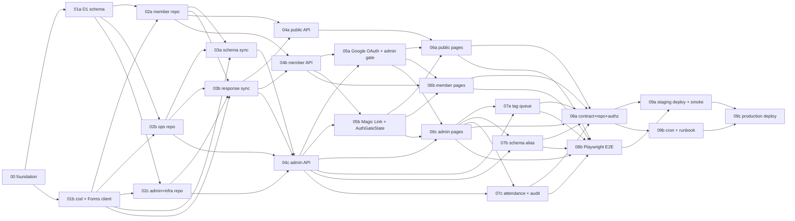

# 02 アプリケーション実装タスク

UBM 兵庫支部会メンバーサイトのアプリ層（Next.js / Hono / D1 / Forms 同期 / Auth.js / 管理機能 / テスト / リリース）を、**機能ごとに責務分離した 24 タスク**（22 並列 + 2 直列）に分解した仕様書群。

## 命名規則

```
<番号>[a-z]?-<serial|parallel>-<実装内容>/
```

- **番号**: Wave 番号（実行順 0〜9）
- **a/b/c サフィックス**: 同 Wave 内で並列実行する責務分割
- **serial / parallel**: Wave 内で単独か並列かを明示
- **実装内容**: ディレクトリ名だけで「どの機能を作るか」「どこを触るか」が読める kebab-case

## 並列度の方針

specs/ の章立てではなく **機能境界** で分解。共通基盤（Wave 0）と production deploy（Wave 9c）以外はすべて並列実行可能。同一 Wave の `a/b/c...` は互いに独立しているため SubAgent で同時実行できる。

| Wave | 並列数 | 直列数 | 主機能 |
| --- | --- | --- | --- |
| 0 | 0 | 1 | foundation |
| 1 | 2 | 0 | data + integration |
| 2 | 3 | 0 | repository（domain別） |
| 3 | 2 | 0 | Forms sync |
| 4 | 3 | 0 | API endpoints（layer別） |
| 5 | 2 | 0 | auth |
| 6 | 3 | 0 | UI pages（layer別） |
| 7 | 3 | 0 | admin ops（workflow別） |
| 8 | 2 | 0 | tests |
| 9 | 2 | 1 | release |
| **合計** | **22** | **2** | **24 tasks** |

## Wave 一覧（実行順）

### Wave 0: foundation（serial）

| ディレクトリ | 主責務 |
| --- | --- |
| [00-serial-monorepo-shared-types-and-ui-primitives-foundation](00-serial-monorepo-shared-types-and-ui-primitives-foundation/index.md) | apps/web + apps/api 雛形、packages/shared 型 4 層、UI primitives 15 種、tones.ts |

### Wave 1: data & integrations（2 parallel）

| ディレクトリ | 主責務 |
| --- | --- |
| [01a-parallel-d1-database-schema-migrations-and-tag-seed](01a-parallel-d1-database-schema-migrations-and-tag-seed/index.md) | D1 16 テーブル migration、tag_definitions 6 カテゴリ seed |
| [01b-parallel-zod-view-models-and-google-forms-api-client](01b-parallel-zod-view-models-and-google-forms-api-client/index.md) | zod schema、view model 型、Google Forms API クライアント |

### Wave 2: repository per domain（3 parallel）

| ディレクトリ | 主責務 |
| --- | --- |
| [02a-parallel-member-identity-status-and-response-repository](02a-parallel-member-identity-status-and-response-repository/index.md) | members / identities / status / responses / sections / fields / visibility / tags / extraFields の repository |
| [02b-parallel-meeting-tag-queue-and-schema-diff-repository](02b-parallel-meeting-tag-queue-and-schema-diff-repository/index.md) | meetings / attendance / tag_definitions / tag_assignment_queue / schema_versions / schema_questions / schema_diff_queue の repository |
| [02c-parallel-admin-notes-audit-sync-jobs-and-data-access-boundary](02c-parallel-admin-notes-audit-sync-jobs-and-data-access-boundary/index.md) | admin_users / admin_member_notes / audit log / sync_jobs / magic_tokens の repository、apps/web → D1 直接禁止 lint、共通 fixture |

### Wave 3: Forms sync（2 parallel）

| ディレクトリ | 主責務 |
| --- | --- |
| [03a-parallel-forms-schema-sync-and-stablekey-alias-queue](03a-parallel-forms-schema-sync-and-stablekey-alias-queue/index.md) | forms.get 同期、schema_diff_queue、stableKey alias 解決 |
| [03b-parallel-forms-response-sync-and-current-response-resolver](03b-parallel-forms-response-sync-and-current-response-resolver/index.md) | forms.responses.list 同期、current_response_id 切替、consent snapshot を member_status へ反映 |

### Wave 4: API endpoints per layer（3 parallel）

| ディレクトリ | 主責務 |
| --- | --- |
| [04a-parallel-public-directory-api-endpoints](04a-parallel-public-directory-api-endpoints/index.md) | `GET /public/*` 4 endpoints（stats / members / member detail / form-preview） |
| [04b-parallel-member-self-service-api-endpoints](04b-parallel-member-self-service-api-endpoints/index.md) | `GET/POST /me/*` セルフサービス API（session / profile / visibility-request / delete-request） |
| [04c-parallel-admin-backoffice-api-endpoints](04c-parallel-admin-backoffice-api-endpoints/index.md) | `/admin/*` バックオフィス API 全 endpoints（dashboard / members / tags / schema / meetings / sync） |

### Wave 5: auth（2 parallel）

| ディレクトリ | 主責務 |
| --- | --- |
| [05a-parallel-authjs-google-oauth-provider-and-admin-gate](05a-parallel-authjs-google-oauth-provider-and-admin-gate/index.md) | Auth.js Google OAuth provider、admin gate middleware（admin_users 確認） |
| [05b-parallel-magic-link-provider-and-auth-gate-state](05b-parallel-magic-link-provider-and-auth-gate-state/index.md) | Magic Link provider、`POST /auth/magic-link`、magic_tokens 有効期限、AuthGateState 5 状態 |

### Wave 6: UI pages per layer（3 parallel）

| ディレクトリ | 主責務 |
| --- | --- |
| [06a-parallel-public-landing-directory-and-registration-pages](06a-parallel-public-landing-directory-and-registration-pages/index.md) | `/`, `/members`, `/members/[id]`, `/register` 公開画面 |
| [06b-parallel-member-login-and-profile-pages](06b-parallel-member-login-and-profile-pages/index.md) | `/login`, `/profile` 会員画面 |
| [06c-parallel-admin-dashboard-members-tags-schema-meetings-pages](06c-parallel-admin-dashboard-members-tags-schema-meetings-pages/index.md) | `/admin/*` 管理画面 5 種（dashboard / members / tags / schema / meetings） |

### Wave 7: admin ops workflows（3 parallel）

| ディレクトリ | 主責務 |
| --- | --- |
| [07a-parallel-tag-assignment-queue-resolve-workflow](../completed-tasks/07a-parallel-tag-assignment-queue-resolve-workflow/index.md) | tag_assignment_queue の candidate → confirmed → member_tags 反映 workflow |
| [07b-parallel-schema-diff-alias-assignment-workflow](../completed-tasks/07b-parallel-schema-diff-alias-assignment-workflow/index.md) | schema_diff_queue の alias 割当 workflow（issue-191 により `schema_aliases` 書き込みへ上書き） |
| [07c-parallel-meeting-attendance-and-admin-audit-log-workflow](07c-parallel-meeting-attendance-and-admin-audit-log-workflow/index.md) | meeting attendance 重複防止 + 削除済み会員除外 + admin 操作 audit log |

### Wave 8: tests（2 parallel）

| ディレクトリ | 主責務 |
| --- | --- |
| [08a-parallel-api-contract-repository-and-authorization-tests](08a-parallel-api-contract-repository-and-authorization-tests/index.md) | 全 endpoint contract test、repository unit test、認可境界 test |
| [08b-parallel-playwright-e2e-and-ui-acceptance-smoke](../08b-parallel-playwright-e2e-and-ui-acceptance-smoke/index.md) | Playwright scaffold で 09-ui-ux.md 検証マトリクス（desktop + mobile）を VISUAL_DEFERRED として定義 |

### Wave 9: release（2 parallel + 1 serial）

| ディレクトリ | 種別 | 主責務 |
| --- | --- | --- |
| [09a-parallel-staging-deploy-smoke-and-forms-sync-validation](09a-parallel-staging-deploy-smoke-and-forms-sync-validation/index.md) | parallel | staging deploy（`pnpm deploy:staging`）、Forms 同期動作確認、Playwright pass |
| [09b-parallel-cron-triggers-monitoring-and-release-runbook](09b-parallel-cron-triggers-monitoring-and-release-runbook/index.md) | parallel | wrangler cron schedule、監視 / alert 連携、release runbook 作成 |
| [09c-serial-production-deploy-and-post-release-verification](../09c-serial-production-deploy-and-post-release-verification/index.md) | serial（最後） | production deploy、本番 D1 migration / secrets 確認、post-release verification |

## 各タスクの構造

```
<task-dir>/
├── index.md             # メタ情報・scope・AC・13 phase 概要・依存
├── artifacts.json       # 機械可読サマリー（13 phase 状態）
├── phase-01.md          # 要件定義
├── phase-02.md          # 設計
├── phase-03.md          # 設計レビュー
├── phase-04.md          # テスト戦略
├── phase-05.md          # 実装ランブック
├── phase-06.md          # 異常系検証
├── phase-07.md          # AC マトリクス
├── phase-08.md          # DRY 化
├── phase-09.md          # 品質保証
├── phase-10.md          # 最終レビュー
├── phase-11.md          # 手動 smoke
├── phase-12.md          # ドキュメント更新
├── phase-13.md          # PR 作成（user 承認後）
└── outputs/             # phase 別成果物
```

## 不変条件（要約）

詳細は `_design/phase-1-requirements.md`。

1. 実フォーム schema をコードに固定しすぎない
2. consent キーは `publicConsent` と `rulesConsent` に統一
3. `responseEmail` はフォーム項目ではなく system field
4. 本人プロフィール本文は D1 override で編集しない（Form 再回答が正式経路）
5. apps/web から D1 直接アクセス禁止（apps/api 経由のみ）
6. GAS prototype を本番仕様に昇格させない
7. `responseId` と `memberId` は混同しない
8. `localStorage` を route / session / data の正本にしない
9. `/no-access` 専用画面に依存しない（AuthGateState で出し分け）
10. Cloudflare 無料枠（D1: 5GB / 500k reads / 100k writes、Workers: 100k req）内で運用
11. 管理者は他人プロフィール本文を直接編集できない
12. admin_member_notes は public/member view model に混ざらない
13. tag は admin queue → resolve 経由で member_tags に反映（直接編集禁止）
14. schema 変更は `/admin/schema` に集約
15. meeting attendance は重複登録不可、削除済み会員は除外

## 実行順の依存



## 設計書

- `_design/phase-1-requirements.md` — タスク分解の要件定義（24 タスク版）
- `_design/phase-2-design.md` — 24 タスクの設計とディレクトリ構成
- `_design/phase-3-review.md` — 設計レビューと GO 判定

## 実装ガイド

- 仕様書は **コードを書かない**（spec_created）。実装は別タスクで feature branch を切って行う。
- 各 phase の進捗は `artifacts.json` の `status` フィールドで追跡する。
- Phase 13（PR 作成）には user 承認が必須。
- 上流 wave の AC が未達のタスクは Phase 10 で NO-GO 判定とする。
- 同一 Wave の a/b/c は **互いに独立** なため SubAgent で並列実行可能。
