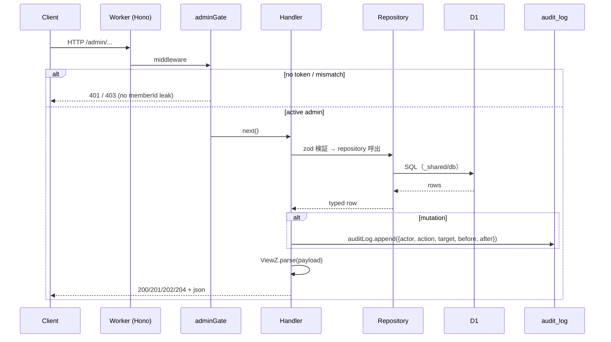

# Phase 2 — 設計

## 1. module 配置

```
apps/api/src/
├── index.ts                 # 全 admin route の mount 追加
├── middleware/
│   └── admin-gate.ts        # 既存（Bearer SYNC_ADMIN_TOKEN）
└── routes/admin/
    ├── sync.ts              # 既存
    ├── sync-schema.ts       # 既存（03a）
    ├── responses-sync.ts    # 既存（03b）
    ├── dashboard.ts         # 新規 — GET /admin/dashboard
    ├── members.ts           # 新規 — GET /admin/members, GET /admin/members/:memberId
    ├── member-status.ts     # 新規 — PATCH /admin/members/:memberId/status
    ├── member-notes.ts      # 新規 — POST/PATCH notes
    ├── member-delete.ts     # 新規 — POST delete/restore
    ├── tags-queue.ts        # 新規 — GET/POST tag queue
    ├── schema.ts            # 新規 — GET diff / POST aliases
    ├── meetings.ts          # 新規 — GET/POST meetings
    └── attendance.ts        # 新規 — POST/DELETE attendance
```

repository は新規追加なし。集計用に `apps/api/src/repository/dashboard.ts` を追加してダッシュボード用 raw SQL を集約してよい（責務上は read-only aggregator）。

## 2. router factory パターン

既存 `sync-schema.ts` を踏襲:

```ts
export const createDashboardRoute = () => {
  const app = new Hono<{ Bindings: AdminEnv }>();
  app.use("*", adminGate);
  app.get("/dashboard", async (c) => { ... });
  return app;
};
export const dashboardRoute = createDashboardRoute();
```

`adminGate` は mount 単位で install（router factory 先頭の `app.use("*", adminGate)`）。これにより handler 単位で漏れる事故を構造的に防ぐ（AC-1 / AC-4）。

## 3. Mermaid（request flow）



## 4. dependency matrix（route → repo → table）

| route | 主 repo | D1 table |
|---|---|---|
| dashboard | members + status + tagQueue + schemaVersions + responses | member_identities, member_status, tag_assignment_queue, schema_versions, member_responses |
| members(list) | members + status | member_identities, member_status |
| members(detail) | members + status + responses + responseSections + responseFields + memberTags + attendance + auditLog | 同 + member_responses, response_sections, response_fields, member_tags, member_attendance, audit_log |
| member-status | status + auditLog | member_status, audit_log |
| member-notes | adminNotes + auditLog | admin_member_notes, audit_log |
| member-delete | status(setDeleted/setPublishState) + auditLog | member_status, deleted_members, audit_log |
| tags-queue | tagQueue + memberTags + tagDefinitions + auditLog | tag_assignment_queue, member_tags, tag_definitions, audit_log |
| schema | schemaDiffQueue + schemaQuestions + auditLog | schema_diff_queue, schema_questions, audit_log |
| meetings | meetings + auditLog | meeting_sessions, audit_log |
| attendance | attendance + auditLog | member_attendance, audit_log |

## 5. env 追加

なし。adminGate は既存 `SYNC_ADMIN_TOKEN` を継続利用（05a で Auth.js + admin_users 照合に差し替え予定）。

## 6. 不変条件保証ポイント（コード構造）

| # | 守る場所 |
|---|---|
| #4 / #11 | `routes/admin/` に `member-profile.ts` を作らない。grep で profile 編集 endpoint 不在を確認 |
| #12 | adminNotes 本文を返すのは detail handler のみ。list / public builder は `import` しない |
| #13 | tag は `tags-queue.ts` の resolve handler のみが member_tags を書き込む（直編集 endpoint なし） |
| #14 | schema 変更は `schema.ts` 経路のみ（POST aliases）。`/admin/sync/schema` は同期 trigger 専用（schema 編集ではない） |
| #15 | attendance.addAttendance の戻り値 `{ok:false, reason}` を必ず HTTP status へマップ（duplicate→409 / deleted_member→422 / session_not_found→404） |

## handoff to Phase 3

- Phase 3 review で確認: (a) routes/admin/ の新規 9 ファイルが index.md の 16 endpoint を漏れなく実装するか、 (b) zod parser が AdminMemberDetailViewZ.audit を埋めるか、 (c) audit_log 呼出が全 mutation で行われるか。
