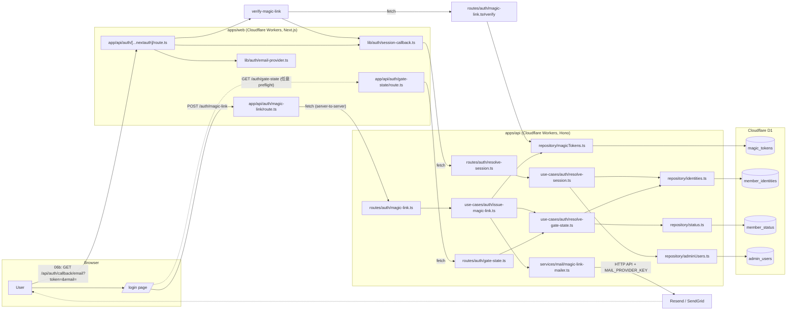
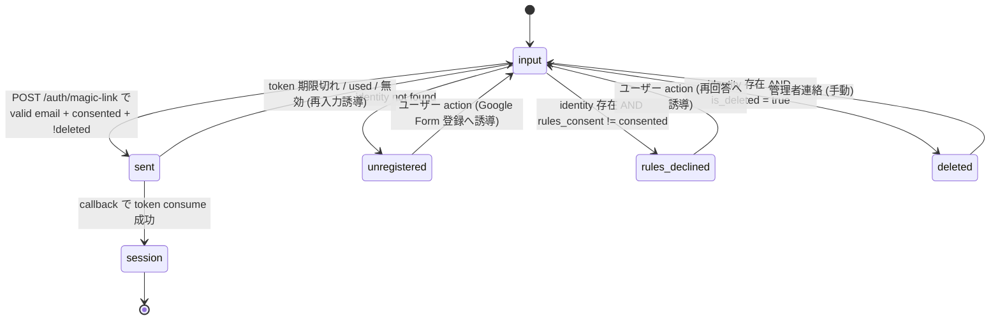
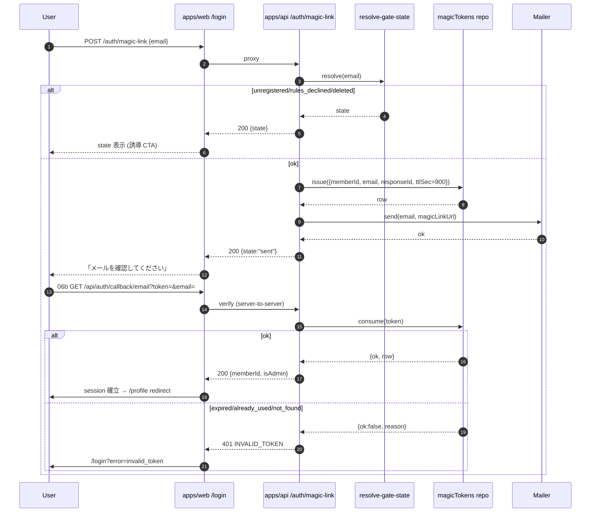

# Architecture — Magic Link Provider & AuthGateState

## 1. 全体構成図



## 2. AuthGateState 状態機械



判定優先順位（API 内ロジック）:

```text
resolve-gate-state(email):
  identity = findIdentityByResponseEmail(normalize(email))
  if !identity        -> "unregistered"
  status = findStatus(identity.memberId)
  if status.isDeleted -> "deleted"
  if status.rulesConsent != "consented" -> "rules_declined"
  -> "ok"   // 呼び元が token 発行成功で "sent"、未発行で "input"
```

## 3. token lifecycle



### token 仕様

| 項目 | 値 |
| --- | --- |
| 形式 | 32 byte 乱数を hex 64 文字（既存 `repository/magicTokens.ts` 互換） |
| TTL | 900 秒（15 分） |
| ストレージ | D1 `magic_tokens`（PK=token） |
| 検証 | `expires_at >= now AND used = 0` |
| 消費 | `UPDATE used = 1 WHERE token = ? AND used = 0 AND expires_at >= now` 楽観 lock |
| 再使用 | 不可（`used=1` 時 `consume` は `already_used` を返す） |

## 4. session 仕様

```ts
// packages/shared/src/types/auth.ts (新規 or 拡張)
export type SessionUser = {
  email: string;          // normalize 済み
  memberId: string;       // member_identities.member_id
  responseId: string;     // current_response_id
  isAdmin: boolean;       // admin_users 由来
  authGateState: "active" | "rules_declined" | "deleted"; // session 確立後の view
};
```

- session 戦略: JWT（Auth.js `session: { strategy: "jwt" }`）
- callback では `apps/api POST /auth/resolve-session { email }` を呼び SessionUser を受領
- 解決失敗（identity 不在、削除等）は session を発行しない（callback で `null` 返却 → AC-10）

## 5. 環境変数 / secrets / bindings

| 区分 | 変数名 | 配置 | 用途 |
| --- | --- | --- | --- |
| secret | `AUTH_SECRET` | Cloudflare Secrets | Auth.js JWT 署名（05a と共有） |
| secret | `MAIL_PROVIDER_KEY` | Cloudflare Secrets | mail provider HTTP API 認証 |
| var | `AUTH_URL` | wrangler vars | callback URL 構築 |
| var | `MAIL_FROM_ADDRESS` | wrangler vars | 送信元アドレス |
| var | `INTERNAL_API_BASE_URL` | wrangler vars | apps/web → apps/api の同 origin / private URL |
| binding | `DB` | wrangler binding | D1（apps/api のみ） |

> 実値は 1Password Environments を正本とし、`scripts/with-env.sh` 経由で動的注入する（CLAUDE.md 既定）。

## 6. レート制限 / 列挙攻撃対策

| 経路 | 制限 |
| --- | --- |
| `POST /auth/magic-link` | 同 email: 5 回 / 1h、同 IP: 30 回 / 1h |
| `GET /auth/gate-state` | 同 IP: 60 回 / 1h |
| HTTP status | 5 状態いずれも 200。判別を body の `state` に閉じる |

実装は KV ベースのカウンター or Cloudflare WAF rule（Phase 5 で確定）。

## 7. 不変条件マッピング

| # | 違反検出方法 |
| --- | --- |
| #5 | apps/web に D1 binding を渡さない wrangler.toml チェック、proxy のみ実装 |
| #7 | session callback で `responseId` と `memberId` を別フィールドに保つ（型検証） |
| #9 | fs check `! -e apps/web/app/no-access` + ESLint custom rule（Phase 5） |
| #10 | TTL 15 分 / sweep 不要 / D1 writes 試算（100 通/日 << 100k 無料枠） |

## 8. 既存コードとの整合

| 既存 | 本タスクでの扱い |
| --- | --- |
| `apps/api/src/repository/magicTokens.ts` | そのまま流用（issue/verify/consume の interface 変更なし） |
| `apps/api/src/middleware/admin-gate.ts` | 05a と共有、本タスクで session callback が `isAdmin` を返す前提を確定 |
| `apps/api/src/middleware/session-guard.ts` | session 確立済 request を読む既存実装、本タスクは触らない |
| `packages/shared/src/types/common.ts#AuthGateStateValue` | 5 状態 enum 既存、そのまま使用 |
| `apps/api/src/routes/me/index.ts` の `MeSessionResponseZ` | session 確立後の view、本タスクの session callback 出力と整合 |
