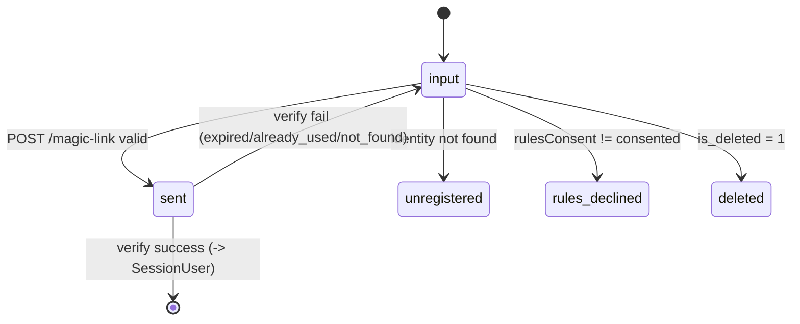

# 05b 実装ガイド — Magic Link Provider & AuthGateState

> **PR 本文として使用される文書。**
> Part 1 (中学生レベル) → Part 2 (技術者レベル) の二段構成。

---

## Part 1: 何を作ったか (中学生でも分かる説明)

### 困りごと

UBM 兵庫支部会のサイトには「会員だけが見られるページ」があります。でもパスワードを覚えるのは大変だし、退会した人や利用規約に同意していない人がうっかりログインできてしまうと困ります。

### 解決のたとえ話

このタスクは「会場の入口で渡すワンタイム入場券 (Magic Link)」と「入口チェックの結果を 5 種類に分けて貼り出す掲示板 (AuthGateState)」を作りました。

- **入場券** = メール本文に書かれた 1 回だけ使えるリンク。15 分で無効。
- **掲示板** = 「入力中 / 送信済み / そもそも会員じゃない / 規約に同意していない / 退会済み」の 5 状態を JSON で返す。

「専用の門前払いページ (`/no-access`)」は作りません。理由は、ユーザーが自分の状態を入口画面で全部見られた方が分かりやすいから (不変条件 #9)。

### できあがったもの (全部 API。画面は別タスクで作る)

| やりたいこと | 叩く URL |
|---|---|
| 状態を聞く | `GET /auth/gate-state?email=...` |
| 入場券を発行 | `POST /auth/magic-link` |
| 入場券で確認 | `POST /auth/magic-link/verify` |
| 会員情報の取得 | `POST /auth/resolve-session` |

---

## Part 2: 技術者向け詳細

### task root

```
docs/30-workflows/05b-parallel-magic-link-provider-and-auth-gate-state/
```

### upstream / downstream

| 関係 | task |
|---|---|
| upstream | 02c (magic_tokens repo), 03b (consent snapshot), 04b (`/me`), 04c (admin gate) |
| downstream | 06a/b/c (画面), 08a (contract test) |

### 接続図 (apps/web ↔ apps/api)

```
[Browser]
  │   POST /api/auth/magic-link        (form action)
  │   GET  /api/auth/gate-state        (client fetch)
  │   POST /api/auth/magic-link/verify (callback)
  ▼
[apps/web Worker]  ──同 origin proxy (fetch + cf-connecting-ip 伝搬)──▶
  │
  ▼
[apps/api Worker (Hono)]
  ├── middleware/rate-limit-magic-link  (email 5/h, IP 30/h, IP 60/h for GET)
  ├── use-cases/auth/
  │     ├── resolve-gate-state.ts   (D1: member_identities + member_status)
  │     ├── issue-magic-link.ts     (D1: magic_tokens.issue + mail send + rollback on fail)
  │     ├── verify-magic-link.ts    (D1: magic_tokens.consume + email check)
  │     └── resolve-session.ts      (D1: + admin_users.isActiveAdmin)
  └── services/mail/magic-link-mailer.ts (Resend HTTP API)

[Cloudflare D1] (apps/api からのみ参照可。invariant #5)
```

### AuthGateState 状態遷移



判定優先度: **unregistered → deleted → rules_declined → ok**

### magic_token lifecycle

```
issue() ──insert(token, member_id, email, response_id, created_at, expires_at, used=0)──▶ D1
   │
   ├── mail send fail ──▶ deleteByToken() (rollback)  [F-11]
   │
verify() ──UPDATE ... SET used=1 WHERE token=?1 AND used=0 AND expires_at>now (optimistic lock)──▶
   │
   ├── 0 行更新 + row 存在 + used=1   → already_used  [F-14]
   ├── 0 行更新 + row 存在 + expired  → expired       [F-13]
   ├── 0 行更新 + row 不在            → not_found     [F-12]
   └── 1 行更新 + email 一致          → ok → resolveSession
       └── email 不一致               → resolve_failed [F-15]
```

### TypeScript interface

```ts
// packages/shared/src/types/auth.ts
export type SessionUserAuthGateState = "active" | "rules_declined" | "deleted";

// resolveGateState 戻り値
type GateStateResult =
  | { state: "ok"; memberId: MemberId; responseId: ResponseId }
  | { state: "unregistered" }
  | { state: "rules_declined" }
  | { state: "deleted" };

// SessionUser (viewmodel/index.ts 既存 / branded)
type SessionUser = {
  email: string;
  memberId: MemberId;
  responseId: ResponseId;
  isAdmin: boolean;
  authGateState: "active";
};

// VerifyMagicLinkResult
type VerifyMagicLinkResult =
  | { ok: true; user: SessionUser }
  | { ok: false; reason: "not_found" | "expired" | "already_used" | "resolve_failed" };
```

### API contract サマリ

| Method | Path | Request | Response (200) |
|---|---|---|---|
| POST | `/auth/magic-link` | `{email}` | 200 `{state: "sent"\|"unregistered"\|"rules_declined"\|"deleted"}` / 502 `{code:"MAIL_FAILED"}` |
| GET | `/auth/gate-state?email=...` | (query) | `{state: "ok"\|"unregistered"\|"rules_declined"\|"deleted"}` |
| POST | `/auth/magic-link/verify` | `{token, email}` | `{ok:true,user}` \| `{ok:false,reason}` |
| POST | `/auth/resolve-session` | `{email}` | `{ok:true,user}` \| `{ok:false,reason}` |

429: `{error:"RATE_LIMITED"}` + `Retry-After`、400: `{error:"INVALID_INPUT"}`。詳細は `outputs/phase-02/api-contract.md` 参照。

### AC 対応表 (抜粋)

| AC | 内容 | 検証 |
|---|---|---|
| AC-1 | 5 状態網羅 | resolve-gate-state.test, auth-routes.test |
| AC-4 | TTL 15 分 + 64hex | issue-magic-link.test, schemas Zod |
| AC-5 | expired -> reason=expired | verify-magic-link.test T-02 |
| AC-6 | already_used | verify-magic-link.test T-03 |
| AC-7 | `/no-access` 不在 + D1 直参照不在 | `apps/api/scripts/no-access-fs-check.sh` |
| AC-9 | not_found / resolve_failed | T-04, T-05 |
| AC-10 | resolve-session 失敗で session 未発行 | RS-01〜05 |

完全表は `outputs/phase-07/ac-matrix.md`。

### 検証コマンド

```bash
mise exec -- pnpm typecheck
mise exec -- pnpm lint
mise exec -- pnpm test
bash apps/api/scripts/no-access-fs-check.sh
```

実績: typecheck PASS、lint PASS、test 75 files / 496 tests PASS、fs-check PASS。

### Phase 11 evidence

本タスクは `ui_routes: []` の NON_VISUAL/API 実装なのでスクリーンショットは対象外。Phase 11 は Hono direct fetch + Vitest + fs-check の evidence で代替した。

| evidence | 内容 |
|---|---|
| `outputs/phase-11/main.md` | NON_VISUAL 判定、smoke 方針、検証結果サマリ |
| `outputs/phase-11/curl-unregistered.txt` | 未登録 email の `{state:"unregistered"}` |
| `outputs/phase-11/curl-rules-declined.txt` | rules 未同意の `{state:"rules_declined"}` |
| `outputs/phase-11/curl-deleted.txt` | 削除済み member の `{state:"deleted"}` |
| `outputs/phase-11/curl-sent.txt` | 有効 email の `{state:"sent"}` |
| `outputs/phase-11/callback-success.txt` | magic link verify 成功 |
| `outputs/phase-11/rate-limit.txt` | email/IP rate limit |
| `outputs/phase-11/no-access-check.txt` | `/no-access` route 不在 + D1 直参照不在 |
| `outputs/phase-11/wrangler-dev.log` | UI route 不在のため dev server smoke 省略 |

### 設定可能なパラメータ / 定数

| 名称 | 既定 | 場所 |
|---|---|---|
| token TTL | 900 sec (15 min) | `routes/auth/index.ts` `ttlSec` |
| token 形式 | 64hex | `routes/auth/schemas.ts` `VerifyMagicLinkRequestZ` |
| email rate limit (POST) | 5 / 1h | `middleware/rate-limit-magic-link.ts` |
| IP rate limit (POST) | 30 / 1h | 同上 |
| IP rate limit (GET) | 60 / 1h | 同上 |
| MAIL_PROVIDER_KEY | env (Cloudflare Secret)。production 未設定時は 502 `MAIL_FAILED`、development/test 未設定時は no-op success | `apps/api/src/index.ts` Env |
| MAIL_FROM_ADDRESS | env | 同上 |
| AUTH_URL | env | 同上 (magic link URL の base) |
| INTERNAL_API_BASE_URL | env (apps/web) | proxy 3 本 |

### エラーハンドリング / エッジケース

- **mail 失敗時の rollback**: `issue-magic-link.ts` が `deleteByToken` で token 行を削除し、route は 502 `{code:"MAIL_FAILED"}` を返す (F-11)。
- **email mismatch**: verify で token は consume 済みでも、resolve_failed を返す (F-15)。token 再利用は不可。
- **不変条件 #9**: `/no-access` への redirect は一切無し。gate 判定は 200 + state JSON、verify/session 失敗は 401 + reason JSON、mail 失敗は 502 + code JSON で返す。
- **不変条件 #5**: apps/web は `app/api/auth/*` proxy のみで、D1 binding を一切参照しない (fs-check で機械検証)。
- **不変条件 #7**: SessionUser に memberId と responseId を別 field で保持。両者を混同しない。

### 後続タスクへの引き継ぎ

| 引き継ぎ事項 | 担当先 |
|---|---|
| Auth.js (next-auth) Credentials Provider 本体導入 + `/api/auth/callback/email` route | 06b (member-login) / `docs/30-workflows/unassigned-task/task-05b-authjs-callback-route-credentials-provider-001.md` |
| 画面実装 (5 状態に応じた UI 出し分け) | 06a/b/c |
| rate-limit を KV / Durable Object へ昇格 | 09b 系 cron + monitoring |
| mail provider 監視 dashboard | `docs/30-workflows/unassigned-task/task-05b-mail-provider-monitoring-alerting-001.md` |
| token 履歴 / 強制無効化 admin operations | `docs/30-workflows/unassigned-task/task-05b-magic-token-admin-operations-001.md` |
| Magic Link メール本文 i18n / a11y | `docs/30-workflows/unassigned-task/task-05b-magic-link-mail-i18n-a11y-001.md` |

詳細は `unassigned-task-detection.md`。

### ファイル一覧 (本タスクで生成/変更)

実装:
- `apps/api/src/use-cases/auth/{resolve-gate-state,issue-magic-link,verify-magic-link,resolve-session}.ts`
- `apps/api/src/services/mail/magic-link-mailer.ts`
- `apps/api/src/middleware/rate-limit-magic-link.ts`
- `apps/api/src/routes/auth/{index,schemas}.ts`
- `apps/api/src/repository/magicTokens.ts` (deleteByToken 追加)
- `apps/api/src/index.ts` (Env + /auth mount)
- `apps/api/scripts/no-access-fs-check.sh`
- `apps/web/app/api/auth/{magic-link,gate-state,magic-link/verify}/route.ts`
- `apps/web/app/lib/auth/config.ts` (placeholder)
- `packages/shared/src/types/auth.ts`
- `packages/shared/src/index.ts` (re-export)

tests:
- `apps/api/src/use-cases/auth/__tests__/{_seed,resolve-gate-state,issue-magic-link,verify-magic-link,resolve-session}.test.ts`
- `apps/api/src/routes/auth/__tests__/auth-routes.test.ts`
- `apps/api/src/middleware/__tests__/rate-limit-magic-link.test.ts`
