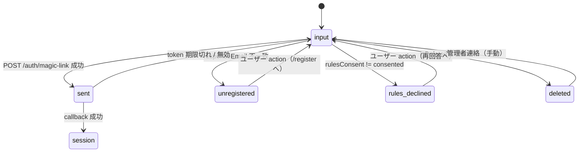
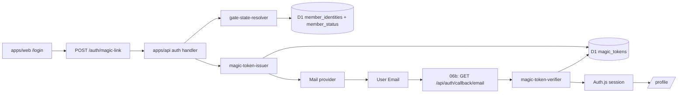

# Phase 2: 設計

## メタ情報

| 項目 | 値 |
| --- | --- |
| タスク名 | magic-link-provider-and-auth-gate-state |
| Phase 番号 | 2 / 13 |
| Phase 名称 | 設計 |
| 作成日 | 2026-04-26 |
| 前 Phase | 1 (要件定義) |
| 次 Phase | 3 (設計レビュー) |
| 状態 | pending |

## 目的

Phase 1 で固定した AC を Mermaid 状態機械・依存マトリクス・モジュール構成・API 契約・env / secrets 表として展開する。`apps/web` と `apps/api` の境界、Auth.js Credentials Provider 相当 bridge と D1 magic_tokens の関係、AuthGateState の判定経路を一意に決める。05b では EmailProvider は使わない。

## 実行タスク

1. AuthGateState 5 状態の状態機械を Mermaid で確定（completion: outputs/phase-02/architecture.md）
2. `POST /auth/magic-link` / `GET /auth/gate-state` / `POST /auth/magic-link/verify` / `POST /auth/resolve-session` の I/O contract（completion: outputs/phase-02/api-contract.md）
3. module 設計（apps/web auth route handler / apps/api auth handler / shared types）
4. env / secrets 一覧と配置先確定
5. dependency matrix（02c repository / 03b consent snapshot / 04b session）

## 参照資料

| 種別 | パス | 用途 |
| --- | --- | --- |
| 必須 | doc/00-getting-started-manual/specs/02-auth.md | provider 分離方針 |
| 必須 | doc/00-getting-started-manual/specs/06-member-auth.md | gate state 5 種 |
| 必須 | doc/00-getting-started-manual/specs/08-free-database.md | magic_tokens schema |
| 必須 | outputs/phase-01/main.md | Phase 1 AC |
| 参考 | doc/00-getting-started-manual/specs/04-types.md | SessionUser / AuthGateState 型 |

## 実行手順

### ステップ 1: 構成図確定


### ステップ 2: API 契約

**`POST /auth/magic-link`**
- request: `{ email: string }`（zod validate）
- response 200: `{ state: "sent" | "unregistered" | "rules_declined" | "deleted" }`
- 副作用: state == "sent" 時のみ token 発行 + メール送信 enqueue

**`GET /auth/gate-state?email=`**
- response 200: `{ state: AuthGateState }`
- 純粋判定のみ（token 発行しない）。POST と同じ判定ロジックを共有

**`POST /auth/magic-link/verify`**
- request: `{ token: string, email: string }`
- response 200: `{ok:true,user}`。失敗時は 401 `{ok:false,reason}`。
- 後続 06b の `/api/auth/callback/email` route / Auth.js Credentials Provider 相当 callback から server-to-server で呼ぶ。

### ステップ 3: module 構成

```
apps/web/
├── app/
│   ├── (auth)/
│   │   └── login/
│   │       └── page.tsx                  # 06b で実装
│   └── api/auth/
│       ├── magic-link/route.ts           # upstream auth API への proxy（同 origin）
│       ├── gate-state/route.ts           # upstream auth API への proxy（同 origin）
│       └── magic-link/verify/route.ts    # upstream auth API への proxy（同 origin）
└── lib/auth/
    └── config.ts                          # 後続 06b の Auth.js callback 設計 placeholder

apps/api/
├── src/
│   ├── routes/auth/
│   │   ├── magic-link.ts                  # POST handler
│   │   └── gate-state.ts                  # GET handler
│   ├── use-cases/auth/
│   │   ├── resolve-gate-state.ts          # 5 状態の判定
│   │   ├── issue-magic-link.ts            # token 発行 + mail send
│   │   ├── verify-magic-link.ts           # token 検証
│   │   └── resolve-session.ts             # SessionUser 解決
│   └── repository/
│       └── magicTokens.ts                 # 02c の repository を再 export

packages/shared/
└── types/auth/
    ├── AuthGateState.ts
    └── SessionUser.ts                     # { memberId, email, isAdmin }
```

### ステップ 4: 擬似コード骨子（コードは書かないが構造の骨子）

```ts
// gate-state-resolver.ts
export type AuthGateState =
  | "input" | "sent" | "unregistered" | "rules_declined" | "deleted"

export async function resolveGateState(
  email: string, db: D1Database
): Promise<Exclude<AuthGateState, "input" | "sent">> {
  const identity = await findIdentityByResponseEmail(db, email)
  if (!identity) return "unregistered"
  const status = await findStatus(db, identity.memberId)
  if (status.isDeleted) return "deleted"
  if (status.rulesConsent !== "consented") return "rules_declined"
  return "ok" as never  // 通常は呼び元で sent / input に reduce
}
```

### ステップ 5: env / secrets

| 区分 | 変数名 | 配置先 | 担当 |
| --- | --- | --- | --- |
| secret | `AUTH_SECRET` | Cloudflare Secrets | 共有（05a と同じ） |
| secret | `MAIL_PROVIDER_KEY` | Cloudflare Secrets | 本タスク |
| var | `AUTH_URL` | wrangler vars | 本タスク |
| var | `MAIL_FROM_ADDRESS` | wrangler vars | 本タスク |
| binding | `DB` (D1) | wrangler binding | 02c と共有 |

### ステップ 6: dependency matrix

| 上流 | 引き渡し物 | 形式 |
| --- | --- | --- |
| 02c | magic_tokens repository | `MagicTokenRepository` interface |
| 03b | consent snapshot reflected to member_status | D1 row（rules_consent / is_deleted） |
| 04b | `GET /me` の session 取得 | session callback の出力前提 |
| 04c | admin gate | session callback で `isAdmin` を返す |

## 統合テスト連携

| 連携先 Phase | 連携内容 |
| --- | --- |
| Phase 3 | architecture / api-contract / module 構成 を入力に alternative 検討 |
| Phase 4 | API 契約と状態機械を test 設計に展開 |
| Phase 7 | API 契約 → AC trace |
| Phase 12 | implementation-guide で apps/web ↔ apps/api 接続を再掲 |

## 多角的チェック観点

- 不変条件 #5 違反: `apps/web/api/auth/magic-link/route.ts` から D1 を直接触らないこと（必ず `apps/api` に proxy）
- 不変条件 #9 違反: `apps/web/app/no-access/` 配下を絶対作らない
- 不変条件 #10: token の D1 writes 試算（100 通/日 = 100 writes/日 << 100k/日 無料枠）
- 認可境界: gate-state は public エンドポイントだが email 列挙攻撃を防ぐためレートリミット必須
- a11y: メール本文の HTML / plain text 両方を持つ

## サブタスク管理

| # | サブタスク | 担当 Phase | 状態 | 備考 |
| --- | --- | --- | --- | --- |
| 1 | Mermaid 状態機械 | 2 | pending | architecture.md |
| 2 | API 契約 | 2 | pending | api-contract.md |
| 3 | module 構成 | 2 | pending | apps/web ↔ apps/api 境界 |
| 4 | env / secrets 表 | 2 | pending | placeholder のみ |
| 5 | dependency matrix | 2 | pending | 上流 4 / 並列 1 |

## 成果物

| 種別 | パス | 説明 |
| --- | --- | --- |
| 設計 | outputs/phase-02/main.md | Phase 2 サマリ |
| 設計 | outputs/phase-02/architecture.md | Mermaid + module + dependency matrix |
| 設計 | outputs/phase-02/api-contract.md | I/O contract（zod schema 草案） |
| メタ | artifacts.json | phase 2 status |

## 完了条件

- [ ] Mermaid 状態機械が 5 状態 + 遷移条件を網羅
- [ ] API 契約が AC-1〜AC-10 と一対一対応
- [ ] env / secrets が placeholder のみで実値なし
- [ ] dependency matrix が上流・並列の引き渡しを定義

## タスク100%実行確認【必須】

- 全 5 サブタスクが completed
- 3 種ドキュメントが outputs/phase-02/ に配置
- Mermaid syntax error なし
- 不変条件 #5, #9, #10 への対応が明記
- 次 Phase へ alternative 検討の論点を箇条書き

## 次 Phase

- 次: 3 (設計レビュー)
- 引き継ぎ事項: 「EmailProvider 不採用 + 自前 magic_tokens verify + 後続 Credentials bridge」方針を前提に代替案を比較する論点を提示
- ブロック条件: API 契約と Mermaid が未完成なら進まない

## 構成図 (Mermaid)



## 環境変数一覧

| 区分 | 代表値 | 置き場所 | 理由 |
| --- | --- | --- | --- |
| runtime secret | `AUTH_SECRET` | Cloudflare Secrets | Auth.js JWT 署名 |
| runtime secret | `MAIL_PROVIDER_KEY` | Cloudflare Secrets | mail 送信認証 |
| public variable | `AUTH_URL` | wrangler vars | callback URL 構築 |
| public variable | `MAIL_FROM_ADDRESS` | wrangler vars | 送信者 |
| binding | `DB` | wrangler binding | D1 アクセス（apps/api のみ） |

## 設定値表

| 項目 | 方針 | 根拠 |
| --- | --- | --- |
| token TTL | 15 分 | 02-auth.md の補助導線設計、無料枠との整合 |
| token 形式 | URL-safe base64 32 byte | crypto-strong、`AUTH_SECRET` で署名検証 |
| token 1 回限り | `used_at` 更新で再使用拒否 | replay 防止 |
| レートリミット | email ごと 5 回 / 1h | 列挙攻撃緩和 |
| session strategy | JWT | Cloudflare Workers のステートレス性に合致 |

## 依存マトリクス

| 種別 | 対象 | 引き渡し物 | 理由 |
| --- | --- | --- | --- |
| 上流 | 02c | `magic_tokens` repository | D1 直接アクセス禁止 |
| 上流 | 03b | rules_consent / is_deleted snapshot | gate state 判定 |
| 上流 | 04b | `/me/*` API | session 確立後の使用先 |
| 上流 | 04c | admin API | session の admin flag 利用先 |
| 並列 | 05a | Google OAuth provider | session callback で memberId 解決を共有 |
| 下流 | 06a/b/c | `/login` `/profile` `/admin/*` | gate state を使う |
