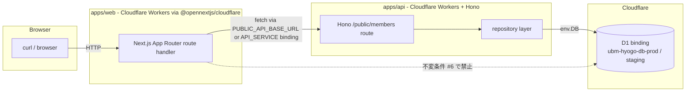

# Phase 2: 設計 — 06a-A-public-web-real-workers-d1-smoke-execution

## メタ情報

| 項目 | 値 |
| --- | --- |
| task name | 06a-A-public-web-real-workers-d1-smoke-execution |
| phase | 2 / 13 |
| wave | 6a-fu |
| mode | parallel |
| 作成日 | 2026-05-01 |
| taskType | implementation-spec / docs-only |
| visualEvidence | VISUAL_ON_EXECUTION |

## 目的

実行構造、evidence path、依存 matrix、rollback / skip 条件を設計する。Phase 1 の AC-1〜AC-9 を、起動コマンド列・curl matrix・wrangler 設定・環境変数・必要なコード変更点に落とし込み、Phase 4（test 戦略）/ Phase 5（runbook）/ Phase 11（実測）が一意に実行できる粒度の設計図を残す。

## 全体像

local smoke と staging smoke の 2 段で `apps/web → apps/api → D1` 経路を網羅する。wrangler は **直接実行せず**、必ず `bash scripts/cf.sh` 経由（CLAUDE.md ルール / esbuild mismatch 自動解決）で起動する。

## D1 binding 経路 mermaid



## 環境変数 / binding 設計

| 変数 / binding | local 値 | staging 値 | 配置場所 | 用途 |
| --- | --- | --- | --- | --- |
| `PUBLIC_API_BASE_URL` | `http://localhost:8787`（Web 起動時の env で渡す） | `https://ubm-hyogo-api-staging.daishimanju.workers.dev`（`apps/web/wrangler.toml` `[env.staging.vars]`） | apps/web | `apps/web` から `apps/api` への HTTP fetch base |
| `INTERNAL_API_BASE_URL` | 同上 | 同上 | apps/web | server-side fetch 用 |
| `API_SERVICE` | （local では未使用、HTTP fetch で代替） | service binding `ubm-hyogo-api-staging` | apps/web | staging で service binding 経由 |
| D1 `DB` | `ubm-hyogo-db-prod`（local persist `.wrangler/state`） | `ubm-hyogo-db-staging` | apps/api `[d1_databases]` | D1 への唯一の到達点 |
| `CLOUDFLARE_API_TOKEN` | `op://...`（`.env` 参照） | GitHub Secrets | shell 環境 | 1Password 経由のみ、ログ出力禁止 |
| `FORM_ID` | `119ec539YYGmkUEnSYlhI-zMXtvljVpvDFMm7nfhp7Xg` | 同左 | apps/api `[vars]` | 不変条件、本タスクで変更しない |

> 注: 既存 `apps/web/wrangler.toml` には `[env.staging.vars] PUBLIC_API_BASE_URL` が既に記載されている。本タスクで toml の追加変更は不要だが、Phase 11 の AC-6 evidence として toml の該当行を `outputs/phase-11/evidence/staging-vars.log` にキャプチャする。

## 必要なコード / 設定変更点

本タスクは smoke 実施が主目的だが、実測時に発見し得る差分を事前に整理する。

| 区分 | 想定変更 | 採否判断 |
| --- | --- | --- |
| `apps/web/wrangler.toml` | `[env.staging.vars]` の `PUBLIC_API_BASE_URL` 既存値を Phase 11 で再確認 | 値が staging API URL を指していれば変更不要 |
| `apps/web` 起動時 env | local 起動時に `PUBLIC_API_BASE_URL=http://localhost:8787` を export | 必須（コミット不要、shell で渡す） |
| `apps/api/wrangler.toml` | 既存 D1 binding `[[d1_databases]]` のみで足りる | 変更不要 |
| `apps/web` 配下の D1 直接 import | 0 件であるべき。発見時のみ削除 | 実測で 0 件確認できれば変更なし |
| `package.json` script 追加 | local smoke 用の wrapper script は **追加しない**（CLAUDE.md は `scripts/cf.sh` を正本とする） | 不採用 |
| `.wrangler/state` | local persist 用 dir。`.gitignore` 既存確認のみ | 既存設定を踏襲 |

## local smoke 手順設計

### 1. 事前準備

- `mise install` 済 / `mise exec -- pnpm install` 済
- `apps/api/wrangler.toml` の D1 binding が定義済
- D1 migration 状況を確認:

```bash
bash scripts/cf.sh d1 migrations list ubm-hyogo-db-prod --env production
# local persist 用に既存 migration が apply 済であることを確認（未 apply の場合 Phase 11 NO-GO）
```

> 注: `--local` モードでは `.wrangler/state` 配下に独立した local D1 が作られる。空の場合 `/members` が空配列 `200` を返し mock と区別できないため、seeded データの存在確認を AC-4 で必須とする。

### 2. API 起動（terminal A）

```bash
# wrangler 直接実行 NG。必ず scripts/cf.sh 経由
bash scripts/cf.sh dev --config apps/api/wrangler.toml --local --persist-to .wrangler/state
# 期待: Listening on http://127.0.0.1:8787
```

esbuild Host/Binary version mismatch は `scripts/cf.sh` の `ESBUILD_BINARY_PATH` 自動解決で吸収される。再発した場合は Phase 6 異常系へ。

### 3. Web 起動（terminal B）

```bash
PUBLIC_API_BASE_URL=http://localhost:8787 \
INTERNAL_API_BASE_URL=http://localhost:8787 \
bash scripts/cf.sh dev --config apps/web/wrangler.toml --local --port 8788
# 期待: Listening on http://127.0.0.1:8788
```

### 4. curl smoke（terminal C）

```bash
LOG=outputs/phase-11/evidence/local-curl.log
mkdir -p "$(dirname "$LOG")"
{
  curl -s -o /dev/null -w "/ %{http_code}\n"                           http://127.0.0.1:8788/
  curl -s -o /dev/null -w "/members %{http_code}\n"                    "http://127.0.0.1:8788/members?q=hello&zone=0_to_1&density=dense"
  curl -s -o /dev/null -w "/members/UNKNOWN %{http_code}\n"            http://127.0.0.1:8788/members/UNKNOWN
  curl -s -o /dev/null -w "/register %{http_code}\n"                   http://127.0.0.1:8788/register
} | tee -a "$LOG"
```

期待: `/ 200` / `/members 200` / `/members/UNKNOWN 404` / `/register 200`。

### 5. 実 D1 経路 evidence（AC-4 主証跡）

```bash
EV=outputs/phase-11/evidence/local-d1-evidence.log
SEED_ID=$(curl -s http://localhost:8787/public/members | jq -r '.items[0].id')
echo "seeded id = $SEED_ID" | tee -a "$EV"
curl -s -o /dev/null -w "/members/$SEED_ID %{http_code}\n" "http://127.0.0.1:8788/members/$SEED_ID" | tee -a "$EV"
# 期待: status 200
```

`SEED_ID` が空の場合、D1 が空であり mock と区別できないため Phase 11 NO-GO（migration / seed 状態を確認）。

### 6. 不変条件 #6 の二重担保（AC-7）

```bash
mise exec -- pnpm --filter @ubm-hyogo/web exec rg -n "D1Database|env\.DB" app src \
  --glob '!**/*.test.*' --glob '!**/__tests__/**' \
  | tee outputs/phase-11/evidence/invariant-6-rg.log || echo "OK: no direct D1 access" >> outputs/phase-11/evidence/invariant-6-rg.log
```

期待: マッチ 0 件（OK 出力）。

## staging smoke 手順設計

### 1. staging vars 確認（AC-6）

```bash
# apps/web/wrangler.toml の [env.staging.vars] を Read で確認
grep -n -A 3 "\[env.staging.vars\]" apps/web/wrangler.toml \
  | tee outputs/phase-11/evidence/staging-vars.log
# PUBLIC_API_BASE_URL が staging API URL（https://ubm-hyogo-api-staging.daishimanju.workers.dev）を指すこと
```

`localhost` を指していたら NO-GO。

### 2. staging URL 確認

`apps/web/wrangler.toml [env.staging]` の `name = "ubm-hyogo-web-staging"` から既存 staging Worker URL（`https://ubm-hyogo-web-staging.daishimanju.workers.dev`）を採用する。

### 3. curl smoke（AC-5）

```bash
WEB=https://ubm-hyogo-web-staging.daishimanju.workers.dev
LOG=outputs/phase-11/evidence/staging-curl.log
{
  curl -s -o /dev/null -w "/ %{http_code}\n"                           $WEB/
  curl -s -o /dev/null -w "/members %{http_code}\n"                    "$WEB/members?q=&zone=0_to_1&density=dense"
  curl -s -o /dev/null -w "/members/UNKNOWN %{http_code}\n"            $WEB/members/UNKNOWN
  curl -s -o /dev/null -w "/register %{http_code}\n"                   $WEB/register
} | tee -a "$LOG"
```

期待 status は local と同じ。

### 4. screenshot / HTML evidence（AC-8）

staging `/members` と `/` をブラウザで開きスクリーンショットを `outputs/phase-11/evidence/screenshot-members.png` / `screenshot-root.png` に保存。あるいは `curl -s $WEB/ > outputs/phase-11/evidence/staging-root.html` で HTML evidence を残す（visualEvidence=VISUAL のため screenshot 推奨、HTML はフォールバック）。

## curl matrix（route × env × expected）

| route | local expected | staging expected | evidence |
| --- | --- | --- | --- |
| `/` | 200 | 200 | local-curl.log / staging-curl.log |
| `/members` (with search params) | 200 | 200 | local-curl.log / staging-curl.log |
| `/members/{seeded-id}` | 200 | 200 | local-d1-evidence.log（local のみ主証跡） |
| `/members/UNKNOWN` | 404 | 404 | local-curl.log / staging-curl.log |
| `/register` | 200 | 200 | local-curl.log / staging-curl.log |

## esbuild version mismatch 解消設計

| 観点 | 採用方針 |
| --- | --- |
| 直接的修正 | `pnpm --filter @ubm-hyogo/api dev` および `wrangler dev` 直叩きを **使わない**。CLAUDE.md ルールに従い `bash scripts/cf.sh dev ...` 経由のみ |
| 根本原因 | グローバル esbuild とリポジトリ esbuild の不一致。`scripts/cf.sh` が `ESBUILD_BINARY_PATH` をローカル node_modules 配下に向ける |
| 文書化 | Phase 5 runbook に「直接 wrangler / pnpm dev は禁止」を明記。failure 時は Phase 6 異常系へ trace |

## rollback / skip 条件

| 条件 | 動作 |
| --- | --- |
| local D1 が空（SEED_ID 取得不可） | Phase 11 NO-GO。migration / seed 状態確認後再実行 |
| esbuild mismatch が `scripts/cf.sh` 経由でも再発 | Phase 6 異常系へ。`pnpm install --force` で復旧試行 |
| staging Worker が 5xx を返す | Phase 11 NO-GO。Cloudflare dashboard で deployment status 確認 |
| staging `PUBLIC_API_BASE_URL` が `localhost` を指す | Phase 11 NO-GO。`apps/web/wrangler.toml` 修正 → user 承認の上 staging deploy |
| staging deploy / migration apply 必要 | user 明示承認なしに実行しない |

## 不変条件 #6 適合性チェック（再掲）

`apps/web` 配下で `D1Database` / `env.DB` を直接 import していないことを `rg` で確認（手順は local smoke 手順 6 を参照）。期待: マッチ 0 件。

## 参照資料

- docs/30-workflows/completed-tasks/06a-followup-001-public-web-real-workers-d1-smoke/phase-02.md — 設計手順の元
- docs/30-workflows/completed-tasks/06a-parallel-public-landing-directory-and-registration-pages/
- docs/00-getting-started-manual/specs/05-pages.md
- docs/00-getting-started-manual/specs/09-ui-ux.md
- docs/00-getting-started-manual/specs/12-search-tags.md
- docs/00-getting-started-manual/specs/08-free-database.md
- CLAUDE.md（`scripts/cf.sh` 必須 / 不変条件 #6）
- apps/web/wrangler.toml / apps/api/wrangler.toml

## 実行手順

- 対象 directory: `docs/30-workflows/06a-A-public-web-real-workers-d1-smoke-execution/`
- 本仕様書作成ではアプリケーションコード、deploy、commit、push、PR 作成を行わない。
- 実装・実測時は Phase 5 / Phase 11 の runbook と evidence path に従う。

## 統合テスト連携

- 上流: 04a public API, 06a public web implementation, Cloudflare D1 binding（migration apply 済）
- 下流: 09a staging deploy smoke, 08b Playwright E2E

## 多角的チェック観点

- #5 public/member/admin boundary
- #6 apps/web から D1 直接アクセス禁止（経路 + rg 二重担保）
- #8 localStorage/GAS prototype を正本にしない
- #14 Cloudflare free-tier
- 未実装/未実測を PASS と扱わない
- placeholder と実測 evidence を分離する

## サブタスク管理

- [ ] D1 binding mermaid を確定する
- [ ] 環境変数 / binding 設計表を確定する
- [ ] local smoke 手順 1〜6 が単独実行可能な粒度であることを確認する
- [ ] staging smoke 手順 1〜4 が単独実行可能な粒度であることを確認する
- [ ] curl matrix が AC-3 / AC-5 と 1:1 対応していることを確認する
- [ ] rollback / skip 条件が approval gate と整合していることを確認する
- [ ] outputs/phase-02/main.md を作成する

## 成果物

- outputs/phase-02/main.md

## 実行タスク

この Phase の実行タスクは本文中のタスク表、検証手順、またはチェックリストに記載済み。

## 完了条件

- local / staging 起動コマンドと curl matrix が確定している
- AC-1〜AC-9 と evidence path / コマンドが 1:1 で対応している
- `scripts/cf.sh` 経由起動が唯一の経路として明記されている
- `PUBLIC_API_BASE_URL` の local / staging 値が確定している
- 不変条件 #6 の二重担保手順が明記されている

## タスク100%実行確認

- [ ] この Phase の必須セクションがすべて埋まっている
- [ ] 完了済み本体タスクの復活ではなく follow-up gate の仕様になっている
- [ ] 実装、deploy、commit、push、PR を実行していない
- [ ] curl matrix が route × env × expected で 8 セル以上明示されている

## 次 Phase への引き渡し

Phase 3 へ以下を渡す:
- 採用設計（local 必須 + staging 必須の 2 段案）の判定材料
- 代替案候補（all-staging / miniflare in-memory）との比較入力
- rollback / skip 条件と approval gate の整合性
- MINOR 持ち越し候補（D1 未 apply 時の挙動 / staging vars 確認手順）
