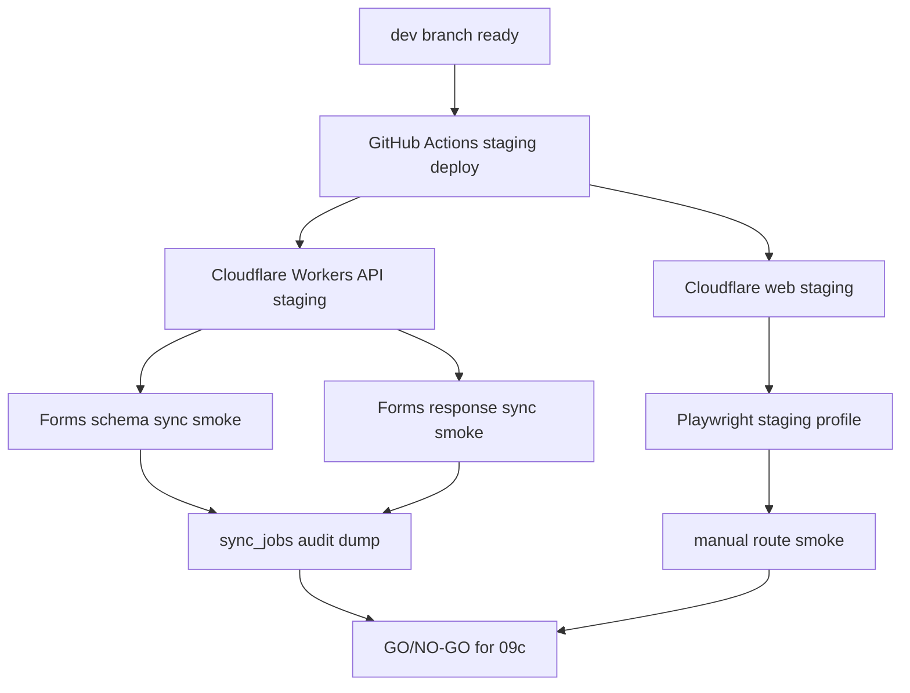

# Staging Deploy Flow

## Dependency Rules

| Source | Consumed as |
| --- | --- |
| 08b | scenario list and page object baseline, not proof of staging success |
| 05a/06b | auth/login/profile acceptance criteria |
| 06c/07c | admin route and attendance smoke criteria |
| 03a/03b/U-04 | sync endpoint and audit criteria |
