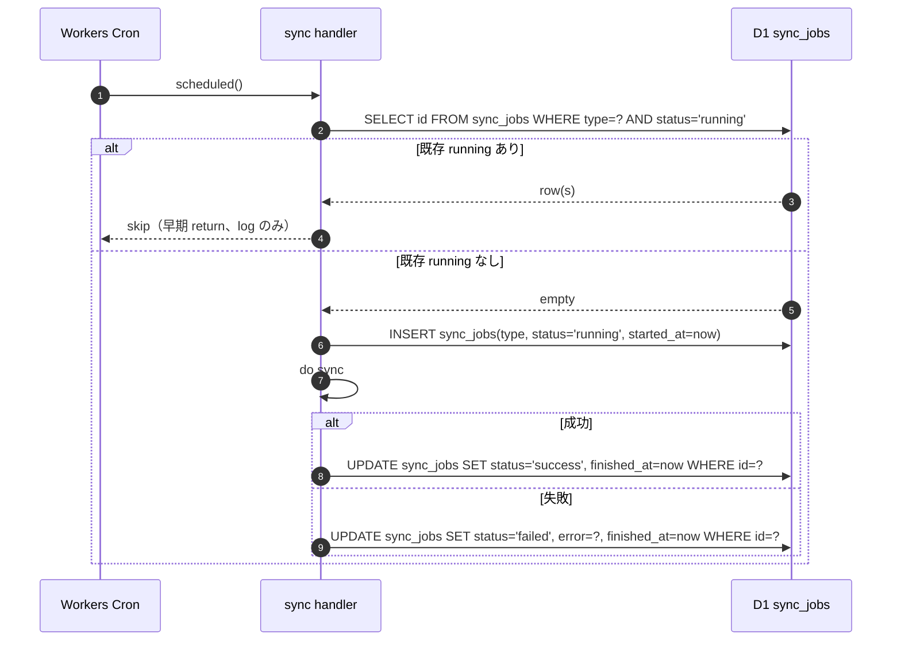

# cron schedule design

## 1. 採択された cron schedule（current facts）

`apps/api/wrangler.toml` の `[triggers]` および `[env.production.triggers]` に以下 3 件を staging / production 共通で記録する。docs-only タスクのため本 wave では wrangler.toml 自体は変更しない（仕様書として確定）。

| cron expression | 用途 | UTC | JST | req/day |
| --- | --- | --- | --- | --- |
| `0 * * * *` | legacy Sheets sync（残存。撤回は UT21-U05） | 毎時 0 分 | 毎時 0 分 | 24 |
| `*/15 * * * *` | response sync（Forms responses → D1） | 15 分毎 | 15 分毎 | 96 |
| `0 18 * * *` | schema sync（Forms 定義 → D1） | 18:00 | 03:00 翌日 | 1 |
| 合計 | - | - | - | **121 req/day** |

invariants #10（Cloudflare 無料枠 Workers 100k req/day）に対し 0.121% 以下で十分余裕がある。詳細は Phase 9 試算参照。

## 2. 頻度設計の根拠

### 2.1 `*/15 * * * *`（response sync）

- ユーザー体験上、Form 回答後 15 分以内に member dashboard に反映されれば実用的。
- Forms API の rate limit（プロジェクト全体で 1 秒 60 req 程度）に十分余裕。
- 1 sync job あたり Forms API 1〜2 req、D1 write 数十 row 程度を想定。

### 2.2 `0 18 * * *`（schema sync, 03:00 JST）

- schema 変更頻度は週 1 回未満を想定。日次 1 回で十分。
- 03:00 JST は Form 編集トラフィックが少ない時間帯（深夜）に schema sync ログを集約させる目的。

### 2.3 `0 * * * *`（legacy Sheets sync）

- 既存 wrangler.toml に残存している legacy 行の正本確認。
- 撤回作業は別 task `UT21-U05`（impl-path-boundary-realignment）に分離する（不変条件 #6 の文脈で legacy GAS 連携を切り離す前提）。
- 09b では「監視対象として残し、削除は別 task」とし、cron deployment runbook の `wrangler triggers` 確認手順では 3 件揃って表示されることを正常状態とする。

## 3. 二重起動防止設計（不変条件: spec/03-data-fetching.md 準拠）

### 3.1 設計概要

cron はスケジュールがズレ込んだ際に同種 job を二重起動する可能性がある。`apps/api` の sync handler は以下の `sync_jobs` running guard で防御する（実装は 03a/03b で完了）。



### 3.2 確認 SQL

```sql
-- 二重起動チェック（cron-deployment runbook Step 3）
SELECT id, type, status, started_at
FROM sync_jobs
WHERE status = 'running';
-- expected: 0 行（cron 起動瞬間以外は基本 0、長時間 running は stale）
```

### 3.3 stale running 復旧（手動 mitigation）

```sql
-- 30 分以上 running のままの行を failed 化（運用上の cleanup）
UPDATE sync_jobs
SET status = 'failed', error = 'timeout: stale running cleared by runbook'
WHERE status = 'running' AND started_at < datetime('now', '-30 minutes');
```

## 4. 失敗時 retry 設計

Workers Cron Triggers 自体には自動 retry がない（Cron は `scheduled()` を発火するのみ）。失敗時の挙動は以下のとおり。

| ケース | 動作 |
| --- | --- |
| Forms API 429 | sync_jobs.failed + error 記録。次 cron 周期（最短 15 分後）に自然 retry |
| D1 write timeout | 同上。partial commit にならないよう transaction 内で実装（03b 実装済み） |
| 部分失敗（一部 response の解釈失敗） | sync_jobs.failed ではなく success とし、`partial_failures` カラム（または error JSON）に問題レコード id を記録。直近成功 view model を返し、API response は `sync_unavailable` warning なし（spec/03-data-fetching.md 準拠） |

## 5. wrangler.toml 仕様（docs-only 記録、実体変更なし）

```toml
# apps/api/wrangler.toml の current facts（09b では変更しない）
name = "ubm-hyogo-api-staging"
main = "src/index.ts"
compatibility_date = "2026-04-26"

[[d1_databases]]
binding = "DB"
database_name = "ubm-hyogo-db-staging"
database_id = "<staging_database_id>"

[triggers]
crons = ["0 * * * *", "0 18 * * *", "*/15 * * * *"]

[env.production]
name = "ubm-hyogo-api"

[[env.production.d1_databases]]
binding = "DB"
database_name = "ubm-hyogo-db-prod"
database_id = "<production_database_id>"

[env.production.triggers]
crons = ["0 * * * *", "0 18 * * *", "*/15 * * * *"]
```

`[env.production.triggers]` の漏れがないこと、staging/production で同一 cron 表記であることを cron deployment runbook Step 1 sanity check で担保する。

## 6. 不変条件への対応

| 不変条件 | 対応 |
| --- | --- |
| #5 apps/web → D1 直接禁止 | cron は apps/api 内に閉じる。Web が D1 を叩く edge は本設計に存在しない |
| #6 GAS prototype 昇格しない | apps script trigger 不採用、Workers Cron Triggers のみ |
| #10 Cloudflare 無料枠 | 121 req/day（0.121%）、Phase 9 で詳細試算 |
| #15 attendance 重複防止 / 削除済み除外 | sync 完了後 attendance 整合性 SQL を rollback-procedures.md に記載（Phase 6） |

## 7. 採択比較（Phase 3 で正式評価）

| 案 | cron 表記 | Pros | Cons |
| --- | --- | --- | --- |
| A | `*/5 * * * *`（response 5 分） | 反映が速い | 5 分 × 24h × 30 = 8640 req/月、他 req と合算で 100k 接近時に余裕が減る |
| B | `0 18 * * *` のみ | 無料枠最大余裕 | 反映遅延が大きく UX 悪化 |
| **C（採択）** | `0 * * * *` + `0 18 * * *` + `*/15 * * * *` | wrangler.toml current facts と一致、UX とコストのバランス、legacy 切り離しは UT21-U05 に分離 | legacy 行の監視ノイズ |

採択: C 案。Phase 3 で PASS-MINOR-MAJOR を確定。
