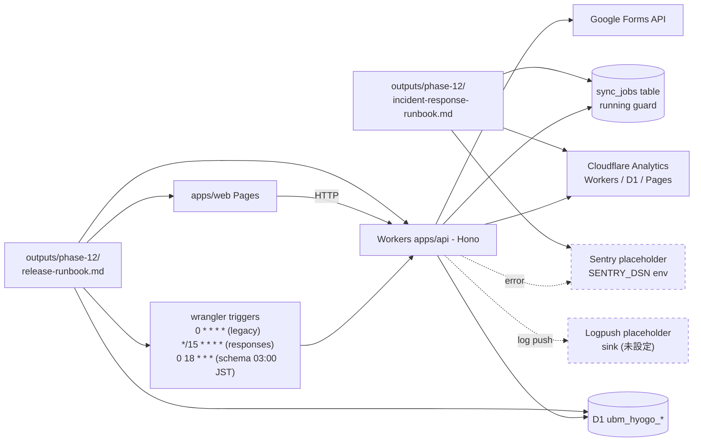

# Phase 2 出力: 設計サマリ

## 1. 設計目的

cron schedule 設計、監視 placeholder 配置、release/incident runbook 章立てを Mermaid + dependency matrix + module 設計 + env table で固定する。spec_created なので wrangler.toml の placeholder を提示するのみ（実体変更なし）。

## 2. Mermaid 全体図（cron → API → D1 → 監視）

不変条件 #5 を担保するため `Web -->|HTTP| API` のみで `Web --> D1` の edge は存在しない。
不変条件 #6 を担保するため `Cron` ノードは Workers Cron Triggers 限定で GAS apps script trigger は登場しない。

## 3. release runbook 章立て（Phase 12 で完成版）

1. 目的
2. 関連 dashboard URL（6 種、`<account>` placeholder 埋め込み）
3. go-live フロー
   3.1 dev → main マージ前提条件
   3.2 GitHub Actions `deploy-production` 実行確認
   3.3 D1 production migration 適用（後方互換）
   3.4 wrangler deploy production（apps/api / apps/web 両方）
   3.5 cron triggers 確認（`wrangler deployments list` + Dashboard Triggers）
   3.6 09c の post-release verification 起動
4. rollback 手順
   4.1 Worker rollback（`wrangler rollback <id>`）
   4.2 Pages rollback（Dashboard 操作）
   4.3 D1 migration rollback（後方互換 fix migration、直接 SQL 禁止）
   4.4 Cron rollback / 一時停止（`crons = []` 再 deploy）
5. cron 一時停止 / 再開
6. 手動 sync 実行（`POST /admin/sync/schema`、`POST /admin/sync/responses`）
7. リリース後検証 checklist（10 ページ smoke の URL 一覧）
8. 連絡先 placeholder（Slack channel / Email）
9. 改訂履歴

## 4. incident response runbook 章立て（Phase 12 で完成版）

1. 重大度定義
   - P0: production 全停止 / データ消失
   - P1: sync 完全停止 / authn 不可
   - P2: sync 遅延 / 部分機能停止
2. initial response（5 分 / 30 分 / 60 分のアクション）
3. escalation matrix（重大度 × 対応者 × 通知先 placeholder）
4. cron 一時停止コマンド（release-runbook へ redirect）
5. 影響範囲評価（dashboard + `sync_jobs` SELECT）
6. mitigation 標準パターン（rollback / cron 停止 / 手動 sync）
7. postmortem template
8. 改訂履歴

## 5. dependency matrix

| 種別 | 相手 | 引き渡し物（in/out） |
| --- | --- | --- |
| 上流 in | 08a | sync API contract test 結果（`POST /admin/sync/*` 認可 + running guard） |
| 上流 in | 08b | dashboard 表示 Playwright 結果（`sync_unavailable` 警告挙動） |
| 上流 in | 05a (infra) | observability placeholder URL 構造 |
| 並列 sync | 09a | staging URL / sync_jobs id / Cloudflare Analytics URL |
| 下流 out | 09c | release-runbook.md / incident-response-runbook.md / rollback-procedures.md |

## 6. Module 設計

| Module | 責務 | 出力先 |
| --- | --- | --- |
| cron-schedule | wrangler.toml `[triggers]` の正本仕様 | phase-02/cron-schedule-design.md, phase-05/cron-deployment-runbook.md |
| monitoring-placeholder | Cloudflare Analytics URL / Sentry DSN placeholder | phase-12/release-runbook.md |
| release-runbook | go-live / rollback / cron 制御 | phase-12/release-runbook.md |
| incident-response | initial / escalation / postmortem | phase-12/incident-response-runbook.md |
| free-tier-budget | cron 頻度試算 100k req/day 以内 | phase-09/main.md |

## 7. env / placeholder 一覧

| 区分 | 値 | 配置 | 状態 |
| --- | --- | --- | --- |
| cron schedule (staging/production 共通) | `0 * * * *`, `0 18 * * *`, `*/15 * * * *` | `apps/api/wrangler.toml [triggers]` および `[env.production.triggers]` | docs-only runbook に current facts として記録 |
| ANALYTICS_URL_API_STAGING | `https://dash.cloudflare.com/<account>/workers/services/view/ubm-hyogo-api-staging/staging/analytics` | release runbook | placeholder |
| ANALYTICS_URL_API_PRODUCTION | `https://dash.cloudflare.com/<account>/workers/services/view/ubm-hyogo-api/production/analytics` | release runbook | placeholder |
| ANALYTICS_URL_D1_STAGING | `https://dash.cloudflare.com/<account>/d1/databases/ubm-hyogo-db-staging/metrics` | release runbook | placeholder |
| ANALYTICS_URL_D1_PRODUCTION | `https://dash.cloudflare.com/<account>/d1/databases/ubm-hyogo-db-prod/metrics` | release runbook | placeholder |
| ANALYTICS_URL_PAGES_STAGING | `https://dash.cloudflare.com/<account>/pages/view/ubm-hyogo-web-staging` | release runbook | placeholder |
| ANALYTICS_URL_PAGES_PRODUCTION | `https://dash.cloudflare.com/<account>/pages/view/ubm-hyogo-web` | release runbook | placeholder |
| SENTRY_DSN | (secret) | Cloudflare Secrets (apps/api, apps/web) | 09b 未登録、placeholder のみ |
| LOGPUSH_SINK | (config) | Cloudflare Logpush | 09b 未設定 |

## 8. 完了条件チェック

- [x] cron schedule design 完成 → `cron-schedule-design.md` 参照
- [x] 監視 Mermaid 1 枚 → 上記 Section 2
- [x] release / incident runbook 章立て完成 → 上記 Section 3, 4
- [x] dependency matrix 完成 → 上記 Section 5

## 9. 次 Phase への引き継ぎ

- cron schedule 採択 C 案（current facts 3 件）と二重起動防止 SQL を Phase 3 alternative 評価に渡す
- Mermaid + 章立て + dependency matrix を Phase 5 runbook 化の base とする
