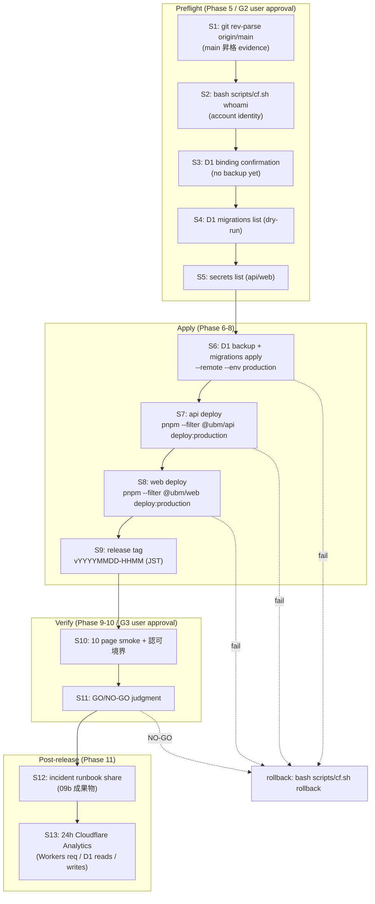

# Production Deploy Flow (13 ステップ)

## ステップ詳細

各ステップの主コマンド・evidence ファイル・担当 Phase・失敗時分岐は `outputs/phase-02/main.md` の "13 ステップ × evidence 設計表" を参照。

## 不変条件 production 再確認の流れ

- #4 / #11: S10 (Phase 9) で `/profile` / `/admin/members` の編集 form 不在を手動確認
- #5: S7/S8 deploy 後 + S13 で apps/web bundle に `D1Database` import が無いことを `rg` で再確認
- #10: S13 (Phase 11) で 24h Cloudflare Analytics 値を取得
- #15: S10 (Phase 9) で attendance 重複 0 件 / 削除済み除外 SQL を production D1 に対して SELECT
