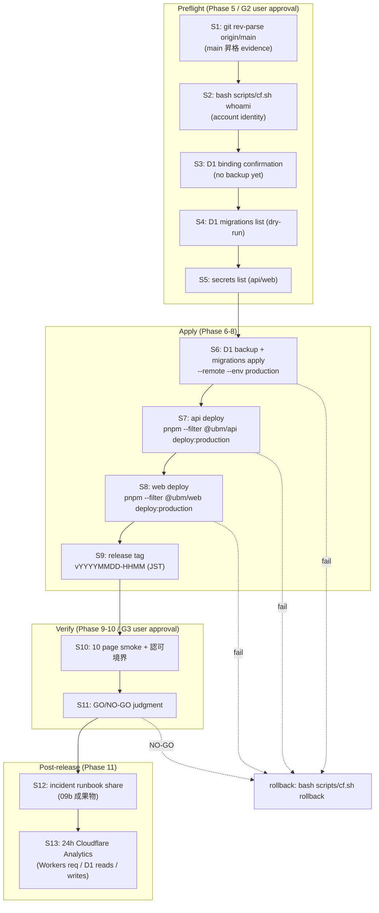

# Phase 2: 設計（実行フロー + evidence 設計）

## メタ情報

| 項目 | 値 |
| --- | --- |
| タスク名 | 09c-production-deploy-execution-001 |
| Phase 番号 | 2 / 13 |
| Phase 名称 | 設計（実行フロー + evidence 設計） |
| Wave | 9 |
| Mode | serial（execution-only） |
| 作成日 | 2026-05-02 |
| 前 Phase | 1 (要件定義 + user approval gate 設計) |
| 次 Phase | 3 (実装計画 — コマンド列 + rollback 分岐) |
| 状態 | spec_created |
| taskType | implementation |
| visualEvidence | VISUAL_ON_EXECUTION |
| user_approval | N/A（G1 承認下で進行 / 本 Phase は実 mutation なし） |

## 目的

Phase 1 で確定した scope / AC 13 件 / user 三段ゲートに従って、production deploy 13 ステップフローを Mermaid + ステップ表で固定し、各ステップの **evidence ファイル名 / 保存先 / 上書き禁止規律** を 1:1 で確定する。Cloudflare 操作の wrapper 強制 grep 検証ルールと、rollback / incident 分岐の payload 分離方針も本 Phase で確定する。

本 Phase は実 production には触れない。設計のみ。

## 実行タスク

1. production deploy 13 ステップフロー Mermaid（テキスト記述）
2. 13 ステップ × evidence ファイル設計表
3. rollback / incident 分岐設計（merge 前 / merge 後 payload 分離 / 上書き禁止）
4. Cloudflare wrapper 強制の grep 検証ルール（AC-13）
5. evidence ディレクトリ規約（`outputs/phase-XX/<artifact>.md`）
6. 24h verify 中の deploy 凍結ルール

## 参照資料

| 種別 | パス | 用途 |
| --- | --- | --- |
| 必須 | docs/30-workflows/09c-production-deploy-execution-001/phase-01.md | 直前 Phase 成果物 |
| 必須 | docs/30-workflows/09c-production-deploy-execution-001/index.md | AC 13 件 / Phase 一覧 |
| 必須 | docs/30-workflows/completed-tasks/09c-serial-production-deploy-and-post-release-verification/phase-02.md | 親 13 ステップ Mermaid（テンプレ） |
| 必須 | docs/30-workflows/completed-tasks/09c-serial-production-deploy-and-post-release-verification/outputs/phase-12/implementation-guide.md | 親 runbook 本体 |
| 必須 | docs/00-getting-started-manual/specs/15-infrastructure-runbook.md | production deploy / D1 / secrets 正本 |
| 必須 | scripts/cf.sh | Cloudflare CLI wrapper |

## 実行手順（ステップ別）

### ステップ 1: 13 ステップフローの Mermaid 化

- `outputs/phase-02/production-deploy-flow.md` に下記 Mermaid を配置（親 09c phase-02 の構造を踏襲しつつ execution-only 文言に書き換え）。



### ステップ 2: 13 ステップ × evidence 設計表

`outputs/phase-02/main.md` に以下表を記述。各ステップにつき入力 / 主コマンド（`bash scripts/cf.sh ...`）/ evidence ファイル / 担当 Phase / 失敗時分岐を 1:1 で固定。

| Step | 名称 | 主コマンド | evidence ファイル | 担当 Phase | 失敗時 |
| --- | --- | --- | --- | --- | --- |
| S1 | main 昇格 evidence | `git rev-parse origin/main` / `git log -1 origin/main` | `outputs/phase-05/main-merge-evidence.md` | 5 | 中止 |
| S2 | account identity | `bash scripts/cf.sh whoami` | `outputs/phase-05/cf-whoami.md` | 5 | 中止 |
| S3 | D1 binding confirmation | `rg -n "database_name|binding_name|database_id" apps/api/wrangler.toml` | `outputs/phase-05/d1-binding-confirmation.md` | 5 | 中止 |
| S4 | migration list (dry-run) | `bash scripts/cf.sh d1 migrations list ubm_hyogo_production --remote --env production --config apps/api/wrangler.toml` | `outputs/phase-05/d1-migrations-list-pre.md` | 5 | 中止 |
| S5 | secrets list | `bash scripts/cf.sh secret list --env production --config apps/api/wrangler.toml` + Pages secrets | `outputs/phase-05/secrets-list.md`（必須 7 種の有無のみ、値は記録禁止） | 5 | 中止 |
| S6 | D1 backup + migrations apply | `bash scripts/cf.sh d1 export ubm_hyogo_production ...` then `bash scripts/cf.sh d1 migrations apply ubm_hyogo_production --remote --env production --config apps/api/wrangler.toml` | `outputs/phase-06/d1-backup.sql.path.md`, `outputs/phase-06/d1-migration-evidence.md` | 6 | rollback |
| S7 | api deploy | `pnpm --filter @ubm/api deploy:production`（内部で `bash scripts/cf.sh deploy`） | `outputs/phase-07/api-deploy-evidence.md`（version id 必須） | 7 | rollback |
| S8 | web deploy | `pnpm --filter @ubm/web deploy:production` | `outputs/phase-07/web-deploy-evidence.md`（version id 必須） | 7 | rollback |
| S9 | release tag | `git tag vYYYYMMDD-HHMM && git push --tags` | `outputs/phase-08/release-tag-evidence.md` | 8 | tag 削除 + 再付与 |
| S10 | smoke + 認可境界 | curl + 手動 / 10 ページ + `/admin` `/profile` boundary | `outputs/phase-09/smoke-evidence.md`, `outputs/phase-09/screenshots/` | 9 | rollback or hotfix |
| S11 | GO/NO-GO | user 承認 G3 | `outputs/phase-10/go-no-go.md`, `outputs/phase-10/user-approval-log.md` | 10 | NO-GO → rollback |
| S12 | incident runbook 共有 | Slack / Email placeholder で送信 | `outputs/phase-11/share-evidence.md` | 11 | 再送 |
| S13 | 24h Analytics | Cloudflare dashboard 確認 | `outputs/phase-11/24h-metrics.md`, `outputs/phase-11/screenshots/` | 11 | incident path |

### ステップ 3: rollback / incident 分岐設計

`outputs/phase-02/main.md` に下記を記述。

- **payload 分離規律**: merge 前 evidence は `outputs/phase-05/`（preflight）に、merge 後 evidence は `outputs/phase-06..11/` に保存。両者は **絶対に同一ファイルへ上書き保存しない**。
- **rollback トリガー**: S6 / S7 / S8 / S10 / S11 のいずれかで AC 不達 → `outputs/phase-XX/rollback-evidence.md` を新規作成（既存 evidence は残す）。
- **rollback コマンド**（事前確定は Phase 3 で実施、本 Phase ではプレースホルダー）:
  - api: `bash scripts/cf.sh rollback <VERSION_ID> --config apps/api/wrangler.toml --env production`
  - web: `bash scripts/cf.sh rollback <VERSION_ID> --config apps/web/wrangler.toml --env production`
  - D1: Phase 6 の `backup-pre-migrate-<ts>.sql` からの restore（手順は親 09b incident runbook 参照）
- **incident 分岐**: 24h verify 中の Workers req 急増 / D1 quota 警告は親 09b の incident runbook の P0 / P1 経路に従う。本タスクでは `outputs/phase-11/incident-evidence.md` に観測時刻と一次対応のみ記録。

### ステップ 4: Cloudflare wrapper 強制の grep 検証ルール

`outputs/phase-02/main.md` に以下を記述（Phase 12 で AC-13 evidence として実行）:

```bash
# 本タスク outputs 配下と diff から `wrangler` 直実行が 0 件であることを確認
grep -RnE '^\s*wrangler\s' docs/30-workflows/09c-production-deploy-execution-001/outputs/ || echo OK
git diff main...HEAD -- 'docs/30-workflows/09c-production-deploy-execution-001/**' | grep -E '^\+\s*wrangler\s' || echo OK
```

両方 `OK` なら AC-13 PASS。1 件でもヒットすれば NO-GO。

### ステップ 5: evidence ディレクトリ規約

- `outputs/phase-XX/<artifact>.md` 形式
- スクリーンショットは `outputs/phase-XX/screenshots/<step>-<timestamp>.png`
- secret / token 値の記録は **禁止**（必須 7 種は「存在の有無」のみ記録）
- `backup-pre-migrate-<ts>.sql` などのバイナリ / 大容量ファイルは git 管理外（`.gitignore` 配下 or 別ストレージ）。evidence には「ファイル名 + size + sha256」のみ記録

### ステップ 6: 24h deploy 凍結ルール

- S13 開始から 24 時間は新規 deploy（S6〜S8）を凍結
- 例外は親 09b incident runbook の P0 hotfix のみ
- `outputs/phase-11/freeze-window.md` に開始 / 終了 timestamp を記録

## 統合テスト連携

| 連携先 Phase | 連携内容 |
| --- | --- |
| Phase 3 | 13 ステップ × コマンド列の事前確定（dry-run / apply 分離 / rollback コマンド） |
| Phase 5-11 | 各 evidence ファイルの実出力 |
| Phase 12 | wrapper 強制 grep の実行と AC-13 evidence 化 |
| 親 09c | runbook を execute するための実行設計をここで初確定 |

## 多角的チェック観点（不変条件）

- 不変条件 #4: 13 ステップに本人本文 D1 override 経路がない
- 不変条件 #5: 13 ステップに `apps/web` から D1 直接アクセス経路がない（S7/S8 deploy で `apps/api` 経由のみ）
- 不変条件 #10: S13 24h Analytics で無料枠 10% 以下を確認する evidence ファイルが定義されている
- 不変条件 #11: S10 smoke に admin UI の本文編集 form 不在確認を含める
- 不変条件 #15: S10 smoke に attendance 重複 0 件 / 削除済み除外 SQL 確認を含める

## サブタスク管理

| # | サブタスク | 担当 Phase | 状態 | 備考 |
| --- | --- | --- | --- | --- |
| 1 | 13 ステップ Mermaid | 2 | pending | production-deploy-flow.md |
| 2 | 13 ステップ × evidence 設計表 | 2 | pending | main.md |
| 3 | rollback / incident 分岐設計 | 2 | pending | payload 分離規律 |
| 4 | wrapper 強制 grep ルール | 2 | pending | AC-13 |
| 5 | evidence ディレクトリ規約 | 2 | pending | secret 記録禁止 |
| 6 | 24h deploy 凍結ルール | 2 | pending | freeze-window.md |

## 成果物

| 種別 | パス | 説明 |
| --- | --- | --- |
| ドキュメント | outputs/phase-02/main.md | 設計サマリ + evidence 設計表 + rollback 分岐 + grep ルール + 規約 |
| ドキュメント | outputs/phase-02/production-deploy-flow.md | 13 ステップ Mermaid + ステップ詳細 |
| メタ | artifacts.json | Phase 2 を completed に更新 |

## 完了条件

- [ ] 13 ステップ Mermaid が完成し、rollback 分岐線が描かれている
- [ ] 13 ステップ × evidence ファイル設計表が AC 13 件と整合している
- [ ] rollback / incident payload 分離規律（merge 前 / 後）が文書化
- [ ] Cloudflare wrapper 強制 grep コマンドが 2 種記述（outputs / git diff）
- [ ] evidence ディレクトリ規約に「secret 値記録禁止」「backup は git 管理外」が含まれる
- [ ] 24h deploy 凍結ルールに開始 / 終了 timestamp 記録方法が含まれる

## タスク100%実行確認【必須】

- 全実行タスク（ステップ 1〜6）が completed
- 2 ファイル（main.md / production-deploy-flow.md）配置
- artifacts.json の Phase 2 を completed に更新
- 13 ステップすべてに `bash scripts/cf.sh` か `pnpm --filter @ubm/...` か `git ...` のいずれかが割り当たり、`wrangler` 直実行が 0 件

## 次 Phase

- 次: 3 (実装計画 — コマンド列 + rollback 分岐)
- 引き継ぎ事項: 13 ステップ × evidence 設計表 / rollback コマンド placeholder / wrapper 強制 grep ルール
- ブロック条件: AC 13 件と evidence 設計表の 1:1 不整合 / `wrangler` 直実行混入 / rollback 分岐欠落
