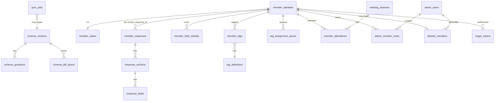

# Phase 2: 設計

## メタ情報

| 項目 | 値 |
| --- | --- |
| タスク名 | d1-database-schema-migrations-and-tag-seed |
| Wave | 1 |
| 実行種別 | parallel |
| Phase 番号 | 2 / 13 |
| 作成日 | 2026-04-26 |
| 上流 Phase | 1 (要件定義) |
| 下流 Phase | 3 (設計レビュー) |
| 状態 | pending |

## 目的

20 physical tables + 1 view + 7 INDEX + tag_definitions 6 カテゴリ seed の DDL を migration ファイル単位で確定する。Mermaid ER 図、env 一覧、dependency matrix、module 設計を成果物として固定する。

## 実行タスク

1. migration ファイルを 4 本に分割（init / member-domain / admin-domain / seed）
2. 全 20 physical tables + 1 viewの `CREATE TABLE` DDL placeholder を確定
3. 7 INDEX の `CREATE INDEX` DDL placeholder を確定
4. ER 図を Mermaid で生成（テーブル間関係、PK / logical FK 制約）
5. `apps/api/wrangler.toml` の `[[d1_databases]]` ブロック確定
6. tag_definitions seed (`0004_seed_tags.sql`) の INSERT placeholder 作成
7. outputs/phase-02/schema-er.md 生成

## 参照資料

| 種別 | パス | 用途 |
| --- | --- | --- |
| 必須 | doc/00-getting-started-manual/specs/08-free-database.md | DDL のオリジン |
| 必須 | doc/00-getting-started-manual/specs/04-types.md | 型 ↔ column |
| 必須 | doc/00-getting-started-manual/specs/12-search-tags.md | tag カテゴリ |
| 必須 | outputs/phase-01/main.md | テーブル group |

## 実行手順

### ステップ 1: migration ファイル分割
- `0001_init.sql`: form-driven 8 テーブル + 関連 INDEX
- `0002_admin_managed.sql`: admin-managed 8 テーブル + 関連 INDEX
- `0003_auth_support.sql`: 認証 / 補助 3 テーブル
- `0004_seed_tags.sql`: tag_definitions 41 行 INSERT

### ステップ 2: DDL placeholder 確定
### ステップ 3: ER 図生成
### ステップ 4: wrangler.toml 確定
### ステップ 5: outputs/phase-02 配置

## 統合テスト連携

| 連携先 Phase | 連携内容 |
| --- | --- |
| Phase 3 | alternative（migration を 1 本にまとめる案 vs 4 本分割案）の比較 |
| Phase 5 | DDL placeholder → migration ファイル実体 |
| Phase 7 | AC マトリクスのトレース |

## 多角的チェック観点（不変条件参照）

- **#1**: schema_questions に `stable_key TEXT NOT NULL` を追加し、`question_id TEXT NULL` で抽象維持
- **#2**: member_status の `public_consent` / `rules_consent` が specs/01 の正規化値（consented/declined/unknown）と一致
- **#3**: `member_responses.response_email TEXT NULL`（system field なので NULL 許容）、`member_identities.response_email TEXT NOT NULL UNIQUE`
- **#4**: `profile_overrides` テーブル不在を ER 図でも確認
- **#5**: wrangler.toml で apps/web 側に D1 binding を入れない
- **#7**: `member_responses.response_id TEXT PRIMARY KEY` と `member_identities.member_id TEXT PRIMARY KEY` で別 PK
- **#10**: STORAGE 試算（Phase 9 で詳細）
- **#15**: `member_attendance` の PRIMARY KEY (member_id, session_id)

## サブタスク管理

| # | サブタスク | 担当 Phase | 状態 | 備考 |
| --- | --- | --- | --- | --- |
| 1 | migration 分割 | 2 | pending | 4 本 |
| 2 | DDL placeholder | 2 | pending | 20 physical tables + 1 view |
| 3 | INDEX placeholder | 2 | pending | 7 種 |
| 4 | ER 図 | 2 | pending | Mermaid |
| 5 | wrangler.toml | 2 | pending | binding |
| 6 | seed INSERT | 2 | pending | 41 行 |
| 7 | outputs 作成 | 2 | pending | outputs/phase-02/ |

## 成果物

| 種別 | パス | 説明 |
| --- | --- | --- |
| ドキュメント | outputs/phase-02/main.md | 設計総合 |
| ドキュメント | outputs/phase-02/schema-er.md | ER 図 |
| メタ | artifacts.json | Phase 2 を completed |

## 完了条件

- [ ] 4 migration ファイルの DDL placeholder が確定
- [ ] 7 INDEX の DDL placeholder が確定
- [ ] ER 図に 20 physical tables + 1 view がすべて出現
- [ ] wrangler.toml の `[[d1_databases]]` 確定
- [ ] seed 6 カテゴリ × 41 行確定

## タスク 100% 実行確認【必須】

- [ ] 全 7 サブタスク completed
- [ ] outputs/phase-02/main.md と schema-er.md 配置済み
- [ ] artifacts.json 更新

## 次 Phase

- 次: Phase 3（設計レビュー）
- 引き継ぎ事項: 4 migration 分割の妥当性レビュー
- ブロック条件: ER 図未完成

## 構成図 (Mermaid ER)



## 環境変数一覧

| 区分 | 代表値 | 置き場所 | 担当 |
| --- | --- | --- | --- |
| D1 binding | `DB` (binding 名) | `apps/api/wrangler.toml` `[[d1_databases]]` | 01a |
| D1 database_name (staging) | `ubm-hyogo-db-staging` | `apps/api/wrangler.toml` | 01a |
| D1 database_id (staging) | `<UUID from Cloudflare>` | `apps/api/wrangler.toml` | 01a |
| D1 database_name (production) | `ubm-hyogo` | `apps/api/wrangler.production.toml` | 01a |
| D1 database_id (production) | `<UUID>` | 同上 | 01a |

## 依存マトリクス（migration 順序）

| migration | 依存 | 提供 |
| --- | --- | --- |
| `0001_init.sql` | なし | form-driven 8 テーブル + INDEX |
| `0002_admin_managed.sql` | 0001（logical FK 用 member_id 参照） | admin-managed 8 テーブル + INDEX |
| `0003_auth_support.sql` | 0001（member_id 参照） | admin_users / magic_tokens / sync_jobs |
| `0004_seed_tags.sql` | 0002（tag_definitions 存在） | 6 カテゴリ × 41 行 |

## モジュール設計（migration 詳細）

### 0001_init.sql

```sql
-- form-driven domain
CREATE TABLE IF NOT EXISTS schema_versions (
  revision_id TEXT PRIMARY KEY,
  form_id TEXT NOT NULL,
  schema_hash TEXT NOT NULL,
  state TEXT NOT NULL DEFAULT 'active',
  synced_at TEXT NOT NULL DEFAULT (datetime('now')),
  field_count INTEGER NOT NULL DEFAULT 0,
  unknown_field_count INTEGER NOT NULL DEFAULT 0,
  source_url TEXT NOT NULL
);

CREATE TABLE IF NOT EXISTS schema_questions (
  question_pk TEXT PRIMARY KEY,
  revision_id TEXT NOT NULL,
  stable_key TEXT NOT NULL,
  question_id TEXT,
  item_id TEXT,
  section_key TEXT NOT NULL,
  section_title TEXT NOT NULL,
  label TEXT NOT NULL,
  kind TEXT NOT NULL,
  position INTEGER NOT NULL,
  required INTEGER NOT NULL DEFAULT 0,
  visibility TEXT NOT NULL DEFAULT 'public',
  searchable INTEGER NOT NULL DEFAULT 1,
  source TEXT NOT NULL DEFAULT 'forms',
  status TEXT NOT NULL DEFAULT 'active',
  choice_labels_json TEXT NOT NULL DEFAULT '[]'
);

CREATE TABLE IF NOT EXISTS schema_diff_queue (
  diff_id TEXT PRIMARY KEY,
  revision_id TEXT NOT NULL,
  type TEXT NOT NULL,            -- added / changed / removed / unresolved
  question_id TEXT,
  stable_key TEXT,
  label TEXT NOT NULL,
  suggested_stable_key TEXT,
  status TEXT NOT NULL DEFAULT 'queued',
  resolved_by TEXT,
  resolved_at TEXT,
  created_at TEXT NOT NULL DEFAULT (datetime('now'))
);

CREATE TABLE IF NOT EXISTS member_responses (
  response_id TEXT PRIMARY KEY,
  form_id TEXT NOT NULL,
  revision_id TEXT NOT NULL,
  schema_hash TEXT NOT NULL,
  response_email TEXT,
  submitted_at TEXT NOT NULL,
  edit_response_url TEXT,
  answers_json TEXT NOT NULL,
  raw_answers_json TEXT NOT NULL DEFAULT '{}',
  extra_fields_json TEXT NOT NULL DEFAULT '{}',
  unmapped_question_ids_json TEXT NOT NULL DEFAULT '[]',
  search_text TEXT NOT NULL DEFAULT ''
);

CREATE TABLE IF NOT EXISTS response_sections (
  response_id TEXT NOT NULL,
  section_key TEXT NOT NULL,
  section_title TEXT NOT NULL,
  position INTEGER NOT NULL,
  PRIMARY KEY (response_id, section_key)
);

CREATE TABLE IF NOT EXISTS response_fields (
  response_id TEXT NOT NULL,
  stable_key TEXT NOT NULL,
  value_json TEXT,
  raw_value_json TEXT,
  PRIMARY KEY (response_id, stable_key)
);

CREATE TABLE IF NOT EXISTS member_field_visibility (
  member_id TEXT NOT NULL,
  stable_key TEXT NOT NULL,
  visibility TEXT NOT NULL,
  updated_at TEXT NOT NULL DEFAULT (datetime('now')),
  PRIMARY KEY (member_id, stable_key)
);

CREATE TABLE IF NOT EXISTS member_identities (
  member_id TEXT PRIMARY KEY,
  response_email TEXT NOT NULL UNIQUE,
  current_response_id TEXT NOT NULL,
  first_response_id TEXT NOT NULL,
  last_submitted_at TEXT NOT NULL,
  created_at TEXT NOT NULL DEFAULT (datetime('now')),
  updated_at TEXT NOT NULL DEFAULT (datetime('now'))
);

CREATE INDEX IF NOT EXISTS idx_member_responses_email_submitted
  ON member_responses(response_email, submitted_at);
CREATE INDEX IF NOT EXISTS idx_schema_diff_status
  ON schema_diff_queue(status, created_at);
```

### 0002_admin_managed.sql

```sql
CREATE TABLE IF NOT EXISTS member_status (
  member_id TEXT PRIMARY KEY,
  public_consent TEXT NOT NULL DEFAULT 'unknown',
  rules_consent TEXT NOT NULL DEFAULT 'unknown',
  publish_state TEXT NOT NULL DEFAULT 'member_only',
  is_deleted INTEGER NOT NULL DEFAULT 0,
  hidden_reason TEXT,
  last_notified_at TEXT,
  updated_by TEXT,
  updated_at TEXT NOT NULL DEFAULT (datetime('now'))
);

CREATE TABLE IF NOT EXISTS meeting_sessions (
  session_id TEXT PRIMARY KEY,
  title TEXT NOT NULL,
  held_on TEXT NOT NULL,
  note TEXT,
  created_at TEXT NOT NULL DEFAULT (datetime('now')),
  created_by TEXT NOT NULL
);

CREATE TABLE IF NOT EXISTS member_attendance (
  member_id TEXT NOT NULL,
  session_id TEXT NOT NULL,
  assigned_at TEXT NOT NULL DEFAULT (datetime('now')),
  assigned_by TEXT NOT NULL,
  PRIMARY KEY (member_id, session_id)   -- 不変条件 #15
);

CREATE TABLE IF NOT EXISTS tag_definitions (
  tag_id TEXT PRIMARY KEY,
  code TEXT NOT NULL UNIQUE,
  label TEXT NOT NULL,
  category TEXT NOT NULL,
  source_stable_keys_json TEXT NOT NULL DEFAULT '[]',
  active INTEGER NOT NULL DEFAULT 1
);

CREATE TABLE IF NOT EXISTS member_tags (
  member_id TEXT NOT NULL,
  tag_id TEXT NOT NULL,
  source TEXT NOT NULL,
  confidence REAL,
  assigned_at TEXT NOT NULL DEFAULT (datetime('now')),
  assigned_by TEXT,
  PRIMARY KEY (member_id, tag_id)
);

CREATE TABLE IF NOT EXISTS tag_assignment_queue (
  queue_id TEXT PRIMARY KEY,
  member_id TEXT NOT NULL,
  response_id TEXT NOT NULL,
  status TEXT NOT NULL DEFAULT 'queued',
  suggested_tags_json TEXT NOT NULL DEFAULT '[]',
  reason TEXT,
  created_at TEXT NOT NULL DEFAULT (datetime('now')),
  updated_at TEXT NOT NULL DEFAULT (datetime('now'))
);

CREATE TABLE IF NOT EXISTS admin_member_notes (
  note_id TEXT PRIMARY KEY,
  member_id TEXT NOT NULL,
  body TEXT NOT NULL,
  created_at TEXT NOT NULL DEFAULT (datetime('now')),
  created_by TEXT NOT NULL,
  updated_at TEXT NOT NULL DEFAULT (datetime('now')),
  updated_by TEXT NOT NULL
);

CREATE TABLE IF NOT EXISTS deleted_members (
  member_id TEXT PRIMARY KEY,
  deleted_by TEXT NOT NULL,
  deleted_at TEXT NOT NULL DEFAULT (datetime('now')),
  reason TEXT NOT NULL DEFAULT ''
);

CREATE INDEX IF NOT EXISTS idx_member_status_public
  ON member_status(public_consent, publish_state, is_deleted);
CREATE INDEX IF NOT EXISTS idx_member_attendance_session
  ON member_attendance(session_id);
CREATE INDEX IF NOT EXISTS idx_member_tags_member
  ON member_tags(member_id);
CREATE INDEX IF NOT EXISTS idx_tag_queue_status
  ON tag_assignment_queue(status, created_at);
CREATE INDEX IF NOT EXISTS idx_admin_notes_member
  ON admin_member_notes(member_id, updated_at);
```

### 0003_auth_support.sql

```sql
CREATE TABLE IF NOT EXISTS admin_users (
  admin_id TEXT PRIMARY KEY,
  email TEXT NOT NULL UNIQUE,
  display_name TEXT NOT NULL,
  active INTEGER NOT NULL DEFAULT 1,
  created_at TEXT NOT NULL DEFAULT (datetime('now'))
);

CREATE TABLE IF NOT EXISTS magic_tokens (
  token TEXT PRIMARY KEY,
  member_id TEXT NOT NULL,
  email TEXT NOT NULL,
  response_id TEXT NOT NULL,
  created_at TEXT NOT NULL DEFAULT (datetime('now')),
  expires_at TEXT NOT NULL,
  used INTEGER NOT NULL DEFAULT 0
);

CREATE TABLE IF NOT EXISTS sync_jobs (
  job_id TEXT PRIMARY KEY,
  job_type TEXT NOT NULL,         -- schema_sync / response_sync
  started_at TEXT NOT NULL,
  finished_at TEXT,
  status TEXT NOT NULL DEFAULT 'running',
  error_json TEXT,
  metrics_json TEXT NOT NULL DEFAULT '{}'
);

CREATE INDEX IF NOT EXISTS idx_magic_tokens_email
  ON magic_tokens(email, used);
```

### 0004_seed_tags.sql

```sql
INSERT OR IGNORE INTO tag_definitions (tag_id, code, label, category, active) VALUES
  ('tag_b_food', 'biz_food', '飲食',  'business', 1),
  ('tag_b_it',   'biz_it',   'IT',     'business', 1),
  -- ... 約 41 行
  ('tag_st_act', 'st_active','active', 'status',   1);
```

## wrangler.toml 例

```toml
# apps/api/wrangler.toml
name = "ubm-hyogo-api-staging"
main = "src/index.ts"
compatibility_date = "2026-04-26"

[[d1_databases]]
binding = "DB"
database_name = "ubm-hyogo-db-staging"
database_id = "REPLACE_BY_CF_DASHBOARD"
migrations_dir = "migrations"
```
