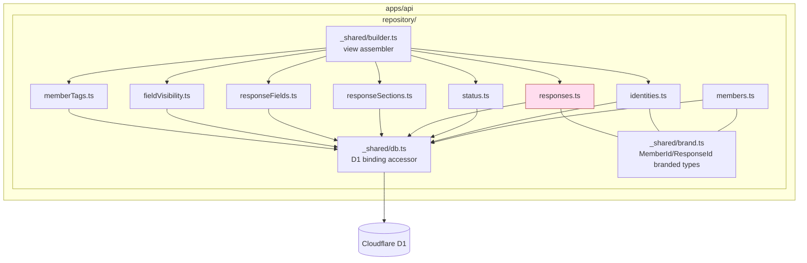

# Phase 2: 設計

## メタ情報

| 項目 | 値 |
| --- | --- |
| タスク名 | member-identity-status-and-response-repository |
| Phase 番号 | 2 / 13 |
| Phase 名称 | 設計 |
| Wave | 2 |
| 実行種別 | parallel |
| 作成日 | 2026-04-26 |
| 上流 | Phase 1 (要件定義) |
| 下流 | Phase 3 (設計レビュー) |
| 状態 | completed |

## 目的

Phase 1 で文章化した責務を、**module 構造 / 型 signature / call graph / dependency matrix** として確定する。03b / 04a / 04b / 08a が「これさえ守れば import できる」状態を作る。

## モジュール構造（Mermaid）



## 公開 interface（型 signature）

### `_shared/brand.ts`

```ts
declare const MemberIdBrand: unique symbol;
declare const ResponseIdBrand: unique symbol;
declare const StableKeyBrand: unique symbol;

export type MemberId = string & { readonly [MemberIdBrand]: true };
export type ResponseId = string & { readonly [ResponseIdBrand]: true };
export type StableKey = string & { readonly [StableKeyBrand]: true };

export const memberId = (s: string): MemberId => s as MemberId;
export const responseId = (s: string): ResponseId => s as ResponseId;
export const stableKey = (s: string): StableKey => s as StableKey;
```

### `_shared/db.ts`

```ts
export interface DbCtx {
  readonly db: D1Database;
}
export const ctx = (env: { DB: D1Database }): DbCtx => ({ db: env.DB });
```

### `members.ts` / `identities.ts` / `status.ts`

```ts
// members.ts
export const findMemberById = (c: DbCtx, id: MemberId) => Promise<MemberRow | null>;
export const listMembersByIds = (c: DbCtx, ids: MemberId[]) => Promise<MemberRow[]>;
export const upsertMember = (c: DbCtx, row: NewMemberRow) => Promise<MemberRow>; // 03b sync 専用

// identities.ts
export const findIdentityByEmail = (c: DbCtx, email: string) => Promise<MemberIdentityRow | null>;
export const findIdentityByMemberId = (c: DbCtx, id: MemberId) => Promise<MemberIdentityRow | null>;
export const updateCurrentResponse = (c: DbCtx, id: MemberId, current: ResponseId, lastSubmittedAt: string) => Promise<void>; // 03b 専用

// status.ts
export const getStatus = (c: DbCtx, id: MemberId) => Promise<MemberStatusRow | null>;
export const setConsentSnapshot = (c: DbCtx, id: MemberId, p: ConsentStatus, r: ConsentStatus) => Promise<void>; // 03b 専用
export const setPublishState = (c: DbCtx, id: MemberId, s: PublishState, by: string) => Promise<void>; // 04c admin 専用
export const setDeleted = (c: DbCtx, id: MemberId, by: string, reason: string) => Promise<void>; // 04c admin 専用
```

### `responses.ts` / `responseSections.ts` / `responseFields.ts` / `fieldVisibility.ts` / `memberTags.ts`

```ts
// responses.ts （write は upsert のみ）
export const findResponseById = (c: DbCtx, rid: ResponseId) => Promise<MemberResponseRow | null>;
export const findCurrentResponse = (c: DbCtx, mid: MemberId) => Promise<MemberResponseRow | null>;
export const listResponsesByEmail = (c: DbCtx, email: string, limit: number, offset: number) => Promise<MemberResponseRow[]>;
export const upsertResponse = (c: DbCtx, row: NewMemberResponseRow) => Promise<MemberResponseRow>; // 03b sync 専用
// admin / member / public いずれの context にも response 本文の partial update API は提供しない（不変条件 #4 / #11）

// responseSections.ts / responseFields.ts
export const listSectionsByResponseId = (c: DbCtx, rid: ResponseId) => Promise<ResponseSectionRow[]>;
export const listFieldsByResponseId = (c: DbCtx, rid: ResponseId) => Promise<ResponseFieldRow[]>;

// fieldVisibility.ts
export const listVisibilityByMemberId = (c: DbCtx, mid: MemberId) => Promise<MemberFieldVisibilityRow[]>;
export const setVisibility = (c: DbCtx, mid: MemberId, sk: StableKey, v: FieldVisibility) => Promise<void>; // 04b 本人 self-service 専用

// memberTags.ts （read-only）
export const listTagsByMemberId = (c: DbCtx, mid: MemberId) => Promise<MemberTagRow[]>;
export const listTagsByMemberIds = (c: DbCtx, mids: MemberId[]) => Promise<Map<MemberId, MemberTagRow[]>>;
// write API は提供しない。書込みは 07a queue resolve workflow 経由のみ
```

### `_shared/builder.ts`

```ts
export type ViewerContext = "public" | "member" | "admin";

export const buildPublicMemberProfile = (
  c: DbCtx, mid: MemberId
): Promise<PublicMemberProfile | null>;

export const buildMemberProfile = (
  c: DbCtx, sessionMemberId: MemberId
): Promise<MemberProfile | null>;

export const buildAdminMemberDetailView = (
  c: DbCtx, mid: MemberId, adminNotes: AdminMemberNote[] // 02c が provide
): Promise<AdminMemberDetailView | null>;

export const buildPublicMemberListItems = (
  c: DbCtx, query: MemberSearchQuery
): Promise<{ items: PublicMemberListItem[]; total: number }>;
```

builder は副作用なし、`adminNotes` は引数で受け取り 02c に依存しない。

## env / 依存マトリクス

| 区分 | キー | 値 / 配置 | 担当 task |
| --- | --- | --- | --- |
| binding | `DB` | D1 binding (wrangler.toml) | 01a |
| import 制約 | `apps/web` から `apps/api/src/repository/*` 禁止 | dependency-cruiser / ESLint | 02c |
| import 制約 | 02b（`meetings.ts` 等）から 02a への import 禁止 | dependency-cruiser | 02a / 02b |
| import 制約 | 02c（`adminMemberNotes.ts` 等）から 02a への import 禁止 | dependency-cruiser | 02a / 02c |

## dependency matrix

| from \\ to | members | identities | status | responses | sections | fields | visibility | tags | builder | brand |
| --- | --- | --- | --- | --- | --- | --- | --- | --- | --- | --- |
| members | — | | | | | | | | | ✓ |
| identities | | — | | | | | | | | ✓ |
| status | | | — | | | | | | | |
| responses | | | | — | | | | | | ✓ |
| sections | | | | | — | | | | | |
| fields | | | | | | — | | | | |
| visibility | | | | | | | — | | | ✓ |
| tags | | | | | | | | — | | ✓ |
| builder | ✓ | ✓ | ✓ | ✓ | ✓ | ✓ | ✓ | ✓ | — | ✓ |

builder は他の repository を read のみで呼び出す。逆方向 import 不可。

## D1 query 設計（N+1 防止）

| 場面 | 戦略 | 該当 index |
| --- | --- | --- |
| 一覧取得 | `LIMIT/OFFSET` + 公開条件で WHERE | `idx_member_status_public` |
| 一覧 → tag join | `IN (?)` バッチ取得（`listTagsByMemberIds`） | `idx_member_tags_member` |
| 一覧 → current response | `IN (?)` バッチ取得後 in-memory join | `idx_member_responses_email_submitted` |
| email → identity | `WHERE response_email = ? LIMIT 1` | UNIQUE 制約 |
| memberId → status | `WHERE member_id = ? LIMIT 1` | PK |

## 実行タスク

1. Mermaid 図を `outputs/phase-02/main.md` に貼る
2. 公開 interface 表を `outputs/phase-02/module-map.md` に貼る
3. dependency matrix を `outputs/phase-02/dependency-matrix.md` に貼る
4. D1 query 戦略表を main.md に追加
5. dependency-cruiser ルール文案を module-map.md に貼る

## 参照資料

| 種別 | パス | 用途 |
| --- | --- | --- |
| 必須 | Phase 1 outputs/phase-01/main.md | 責務一覧 |
| 必須 | doc/00-getting-started-manual/specs/04-types.md | branded type / view model 型 |
| 必須 | doc/00-getting-started-manual/specs/08-free-database.md | DDL / index |
| 参考 | docs/30-workflows/02-application-implementation/01b-parallel-zod-view-models-and-google-forms-api-client/ | 上流 zod schema |

## 統合テスト連携

| 連携先 Phase | 連携内容 |
| --- | --- |
| Phase 3 | alternative 案でこの module 構造の妥当性を検証 |
| Phase 4 | 公開 interface 表から verify suite を起こす |
| Phase 5 | module map を runbook の章立てにする |

## 多角的チェック観点

| 観点 | 不変条件 # | 確認内容 |
| --- | --- | --- |
| 本人本文 immutability | #4 | `responses.ts` には partial update / patch API が存在しない |
| D1 boundary | #5 | `_shared/db.ts` は `apps/api/src/repository/` 内のみ |
| 型混同防止 | #7 | brand.ts で `MemberId` / `ResponseId` を nominal 化 |
| admin 本文編集禁止 | #11 | admin 用 setter は `setPublishState` / `setDeleted` のみ。response 本文には触れない |
| view model 分離 | #12 | builder は `adminNotes` を引数で受け取り、内部で `admin_member_notes` table を読まない |
| 無料枠 | #10 | バッチ fetch / index 利用で N+1 を排除 |

## サブタスク管理

| # | サブタスク | 担当 Phase | 状態 | 備考 |
| --- | --- | --- | --- | --- |
| 1 | Mermaid 図作成 | 2 | completed | module 構造 |
| 2 | 公開 interface 表 | 2 | completed | 型 signature |
| 3 | dependency matrix | 2 | completed | 9x9 |
| 4 | D1 query 戦略 | 2 | completed | N+1 排除 |
| 5 | dependency-cruiser ルール案 | 2 | completed | 02b/02c 相互禁止 |

## 成果物

| 種別 | パス | 説明 |
| --- | --- | --- |
| ドキュメント | outputs/phase-02/main.md | Mermaid + D1 query 戦略 |
| ドキュメント | outputs/phase-02/module-map.md | 公開 interface 表 + dependency-cruiser ルール |
| ドキュメント | outputs/phase-02/dependency-matrix.md | 9x9 マトリクス |

## 完了条件

- [ ] Mermaid と公開 interface 表が完成
- [ ] dependency matrix が 9x9 で漏れなし
- [ ] D1 query 戦略が無料枠を満たす
- [ ] dependency-cruiser ルール案がレビュー可能形式

## タスク100%実行確認【必須】

- [ ] サブタスク 1〜5 が completed
- [ ] outputs/phase-02/{main,module-map,dependency-matrix}.md が配置済み
- [ ] 不変条件 #4 / #5 / #7 / #11 / #12 / #10 への対応が module 構造で表現
- [ ] artifacts.json の Phase 2 を completed に更新

## 次 Phase

- 次: Phase 3 (設計レビュー)
- 引き継ぎ事項: module 構造 / 公開 interface / dependency matrix
- ブロック条件: 公開 interface 表が未完成、または `responses.ts` に write API が含まれている場合は再設計
