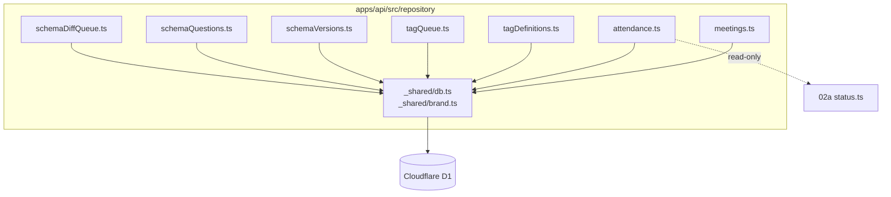
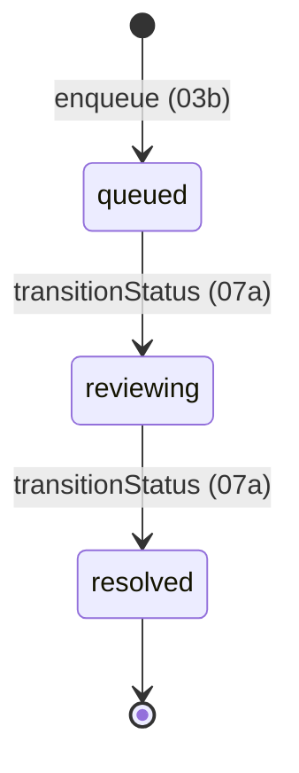
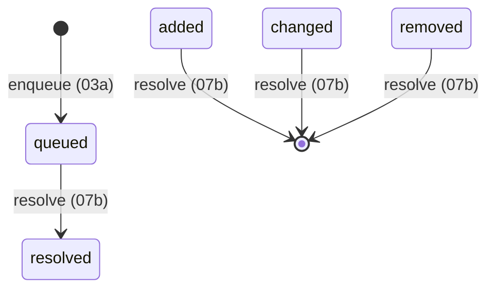

# Phase 2: 設計 — main

## モジュール構造

## tag_assignment_queue 状態遷移

逆方向遷移は `RangeError` を throw（unidirectional）。

## schema_diff_queue 状態遷移

## D1 query 戦略（無料枠）
| 場面 | クエリ | index |
| --- | --- | --- |
| listMeetings | `ORDER BY held_on DESC LIMIT ? OFFSET ?` | PK |
| listAttendanceBySession | `WHERE session_id = ?` | idx_member_attendance_session |
| listQueue(status) | `WHERE status = ? ORDER BY created_at` | idx_tag_assignment_queue_status |
| getLatestVersion | `WHERE form_id = ? AND state='active' ORDER BY synced_at DESC LIMIT 1` | (form_id,state,synced_at) |
| schemaDiff.list | `WHERE status='queued' ORDER BY created_at` | idx_schema_diff_status |
| listAttendableMembers | `JOIN member_status ms WHERE ms.is_deleted = 0 AND mid NOT IN (SELECT member_id FROM member_attendance WHERE session_id=?)` | idx_member_status_public |
