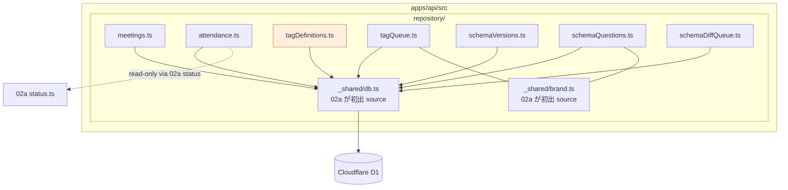
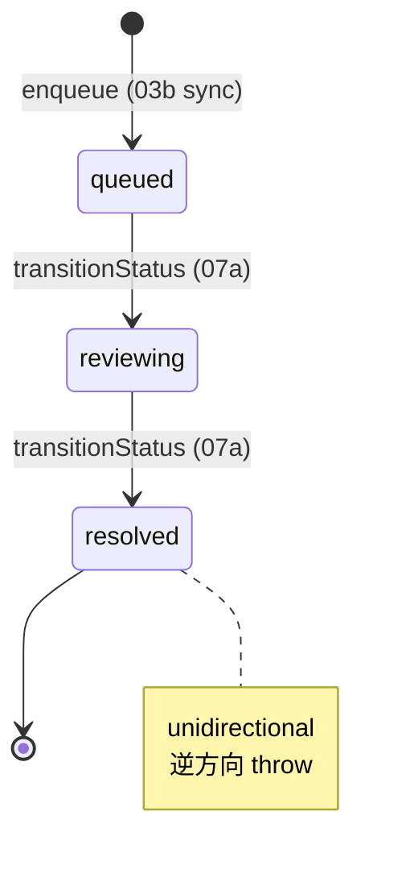
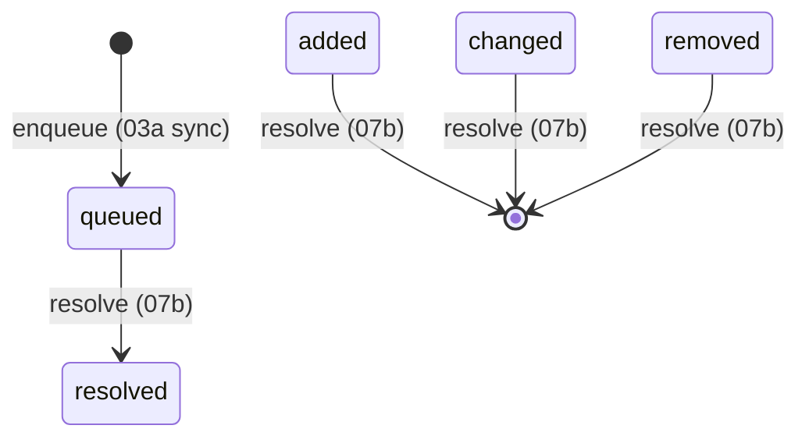

# Phase 2: 設計

## メタ情報

| 項目 | 値 |
| --- | --- |
| タスク名 | meeting-tag-queue-and-schema-diff-repository |
| Phase 番号 | 2 / 13 |
| Phase 名称 | 設計 |
| Wave | 2 |
| 実行種別 | parallel |
| 作成日 | 2026-04-26 |
| 上流 | Phase 1 |
| 下流 | Phase 3 |
| 状態 | completed |

## 目的

7 repository の **module 構造 / 型 signature / 状態遷移 / dependency matrix** を確定する。

## モジュール構造（Mermaid）



## 公開 interface

### `meetings.ts`

```ts
export interface MeetingSessionRow { sessionId: string; title: string; heldOn: string; note: string | null; createdAt: string; createdBy: string; }
export const findMeetingById = (c: DbCtx, id: string) => Promise<MeetingSessionRow | null>;
export const listMeetings = (c: DbCtx, limit: number, offset: number) => Promise<MeetingSessionRow[]>;
export const listRecentMeetings = (c: DbCtx, n: number) => Promise<MeetingSessionRow[]>; // public stats 用
export const insertMeeting = (c: DbCtx, row: NewMeetingSessionRow) => Promise<MeetingSessionRow>; // 04c admin only
```

### `attendance.ts`

```ts
export interface MemberAttendanceRow { memberId: MemberId; sessionId: string; assignedAt: string; assignedBy: string; }
export const listAttendanceByMember = (c: DbCtx, mid: MemberId) => Promise<MemberAttendanceRow[]>;
export const listAttendanceBySession = (c: DbCtx, sid: string) => Promise<MemberAttendanceRow[]>;
export const addAttendance = (c: DbCtx, mid: MemberId, sid: string, by: string) => Promise<{ ok: true } | { ok: false; reason: "duplicate" | "deleted_member" | "session_not_found" }>;
export const removeAttendance = (c: DbCtx, mid: MemberId, sid: string) => Promise<void>;
// 削除済み会員除外: 02a status を read-only で参照
export const listAttendableMembers = (c: DbCtx, sid: string) => Promise<Array<{ memberId: MemberId; fullName: string; occupation: string }>>;
```

### `tagDefinitions.ts`

```ts
export interface TagDefinitionRow { tagId: string; code: string; label: string; category: string; sourceStableKeysJson: string; active: boolean; }
export const listAllTagDefinitions = (c: DbCtx) => Promise<TagDefinitionRow[]>;
export const listByCategory = (c: DbCtx, category: string) => Promise<TagDefinitionRow[]>;
export const findByCode = (c: DbCtx, code: string) => Promise<TagDefinitionRow | null>;
// write API 不在: 不変条件 #13（tag 直接編集禁止）。seed は 01a で投入済み
```

### `tagQueue.ts`

```ts
export type TagQueueStatus = "queued" | "reviewing" | "resolved";

const ALLOWED_TRANSITIONS: Record<TagQueueStatus, TagQueueStatus[]> = {
  queued:    ["reviewing"],
  reviewing: ["resolved"],
  resolved:  [], // unidirectional
};

export interface TagAssignmentQueueRow { queueId: string; memberId: MemberId; responseId: ResponseId; status: TagQueueStatus; suggestedTagsJson: string; reason: string | null; createdAt: string; updatedAt: string; }

export const listQueue = (c: DbCtx, status?: TagQueueStatus) => Promise<TagAssignmentQueueRow[]>;
export const findQueueById = (c: DbCtx, qid: string) => Promise<TagAssignmentQueueRow | null>;
export const enqueue = (c: DbCtx, row: NewTagAssignmentQueueRow) => Promise<TagAssignmentQueueRow>; // 03b sync 経由
export const transitionStatus = (c: DbCtx, qid: string, next: TagQueueStatus) => Promise<TagAssignmentQueueRow>; // throw if not allowed
```

### `schemaVersions.ts`

```ts
export type SchemaState = "active" | "superseded" | "pending_review";
export interface FormManifestRow { formId: string; revisionId: string; schemaHash: string; state: SchemaState; syncedAt: string; sourceUrl: string; fieldCount: number; unknownFieldCount: number; }

export const getLatestVersion = (c: DbCtx, formId: string) => Promise<FormManifestRow | null>; // state='active'
export const listVersions = (c: DbCtx, formId: string) => Promise<FormManifestRow[]>;
export const upsertManifest = (c: DbCtx, row: NewFormManifestRow) => Promise<FormManifestRow>; // 03a sync 経由
export const supersede = (c: DbCtx, formId: string, oldRevisionId: string) => Promise<void>; // active → superseded
```

### `schemaQuestions.ts`

```ts
export interface FormFieldRow { stableKey: StableKey; questionId: string | null; itemId: string | null; sectionKey: string; sectionTitle: string; label: string; kind: FieldKind; position: number; required: boolean; visibility: FieldVisibility; searchable: boolean; status: FieldStatus; choiceLabelsJson: string; }

export const listFieldsByVersion = (c: DbCtx, formId: string, revisionId: string) => Promise<FormFieldRow[]>;
export const findFieldByStableKey = (c: DbCtx, sk: StableKey) => Promise<FormFieldRow | null>;
export const upsertField = (c: DbCtx, row: NewFormFieldRow) => Promise<FormFieldRow>; // 03a sync 経由
export const updateStableKey = (c: DbCtx, questionId: string, newStableKey: StableKey) => Promise<void>; // 07b alias workflow 経由
```

### `schemaDiffQueue.ts`

```ts
export type DiffType = "added" | "changed" | "removed";

export interface SchemaDiffQueueRow { diffId: string; type: DiffType; questionId: string | null; stableKey: StableKey | null; label: string; suggestedStableKey: string | null; createdAt: string; resolvedAt: string | null; }

export const list = (c: DbCtx, type?: DiffType) => Promise<SchemaDiffQueueRow[]>; // status='queued' を created_at ASC
export const findById = (c: DbCtx, did: string) => Promise<SchemaDiffQueueRow | null>;
export const enqueue = (c: DbCtx, row: NewSchemaDiffQueueRow) => Promise<SchemaDiffQueueRow>; // 03a sync 経由
export const resolve = (c: DbCtx, did: string, by: string) => Promise<void>; // 07b alias workflow 経由
```

## 状態遷移図

### tag_assignment_queue



### schema_diff_queue



## env / 依存マトリクス

| 区分 | キー | 配置 | 担当 |
| --- | --- | --- | --- |
| binding | DB | wrangler.toml | 01a |
| import | `_shared/*` | 02a が source | 02a |
| dep-cruiser | 02a → 02b 禁止 / 02b → 02c 禁止 | .dependency-cruiser.cjs | 02c |

## dependency matrix

| from \\ to | meetings | attendance | tagDef | tagQueue | schemaVer | schemaQ | schemaDiff | 02a status |
| --- | --- | --- | --- | --- | --- | --- | --- | --- |
| meetings | — | | | | | | | |
| attendance | | — | | | | | | ✓ (read-only) |
| tagDef | | | — | | | | | |
| tagQueue | | | | — | | | | |
| schemaVer | | | | | — | | | |
| schemaQ | | | | | | — | | |
| schemaDiff | | | | | | | — | |

各 repository は他 repository を import しない（builder は 02a 配下に閉じる）。`attendance.ts` のみ 02a `status.ts` を read-only で参照（削除済み除外用）。

## D1 query 設計（無料枠 + index）

| 場面 | 戦略 | index |
| --- | --- | --- |
| `listMeetings` | `ORDER BY held_on DESC LIMIT/OFFSET` | （PK で十分） |
| `listAttendanceBySession` | `WHERE session_id = ?` | `idx_member_attendance_session` |
| `listQueue(status)` | `WHERE status = ? ORDER BY created_at` | `idx_tag_assignment_queue_status` |
| `getLatestVersion` | `WHERE form_id = ? AND state = 'active' ORDER BY synced_at DESC LIMIT 1` | `(form_id,state,synced_at)` index 推奨 |
| `list(type?)` | `WHERE status = 'queued' ORDER BY created_at` (+ type filter) | `idx_schema_diff_status` |
| `listAttendableMembers` | `JOIN member_status ON ... WHERE is_deleted = 0 AND ... NOT IN (attendance)` | `idx_member_status_public` |

## 実行タスク

1. Mermaid 図 2 種を `outputs/phase-02/main.md` に貼る
2. 公開 interface を `outputs/phase-02/module-map.md` に
3. dependency matrix を `outputs/phase-02/dependency-matrix.md` に
4. D1 query 戦略を main.md に追加
5. dep-cruiser ルール案を module-map.md に

## 参照資料

| 種別 | パス | 用途 |
| --- | --- | --- |
| 必須 | Phase 1 | 責務一覧 |
| 必須 | docs/00-getting-started-manual/specs/04-types.md | view model 型 |
| 必須 | docs/00-getting-started-manual/specs/08-free-database.md | DDL / 整合 |
| 必須 | docs/00-getting-started-manual/specs/11-admin-management.md | UI と repository の責務 |

## 統合テスト連携

| 連携先 Phase | 連携内容 |
| --- | --- |
| Phase 3 | alternative 案 |
| Phase 4 | verify suite |
| Phase 5 | runbook 章立て |

## 多角的チェック観点

| 観点 | 不変条件 # | 確認内容 |
| --- | --- | --- |
| D1 boundary | #5 | repository は `apps/api/src/repository/` 配下 |
| tag 直接編集禁止 | #13 | `tagDefinitions.ts` に write API 不在、`tagQueue.transitionStatus` で resolve 経路強制 |
| schema 集約 | #14 | schemaDiffQueue / schemaVersions / schemaQuestions が単一 source |
| attendance 重複 / 削除済み | #15 | `member_attendance` PK + `listAttendableMembers` filter + `addAttendance` reason 返却 |
| 無料枠 | #10 | index 利用 + LIMIT |

## サブタスク管理

| # | サブタスク | 担当 Phase | 状態 | 備考 |
| --- | --- | --- | --- | --- |
| 1 | Mermaid 図 module 構造 | 2 | completed | |
| 2 | Mermaid 図 状態遷移 | 2 | completed | tag queue / schema queue |
| 3 | 公開 interface 表 | 2 | completed | 7 ファイル |
| 4 | dependency matrix | 2 | completed | 7x7 + 02a status |
| 5 | D1 query 戦略 | 2 | completed | 6 場面 |
| 6 | dep-cruiser ルール案 | 2 | completed | 02c へ |

## 成果物

| 種別 | パス | 説明 |
| --- | --- | --- |
| ドキュメント | outputs/phase-02/main.md | Mermaid + D1 query |
| ドキュメント | outputs/phase-02/module-map.md | interface + dep-cruiser |
| ドキュメント | outputs/phase-02/dependency-matrix.md | 7x7 |

## 完了条件

- [ ] Mermaid + interface + dep-matrix 完成
- [ ] 状態遷移図が tagQueue / schemaDiffQueue 両方
- [ ] D1 query 戦略が無料枠を満たす

## タスク100%実行確認【必須】

- [ ] サブタスク 1〜6 completed
- [ ] outputs/phase-02/* 配置済み
- [ ] artifacts.json の Phase 2 を completed

## 次 Phase

- 次: Phase 3
- 引き継ぎ事項: module 構造 + 状態遷移図 + interface
- ブロック条件: `tagDefinitions.ts` に write API が含まれていれば再設計
