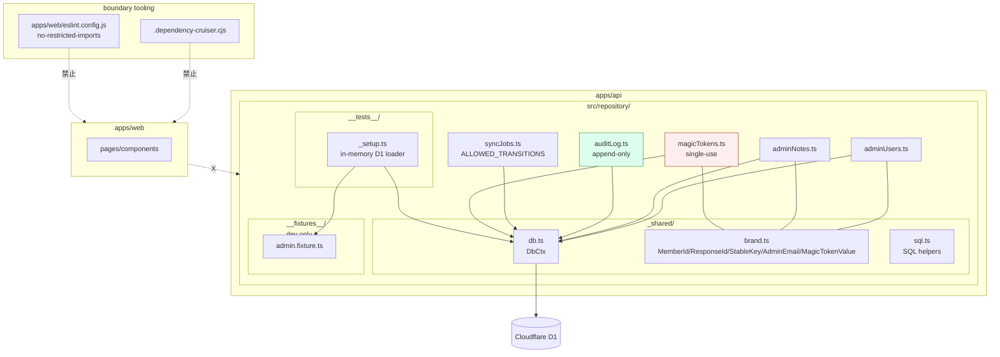

# Phase 2: 設計 — main

## 1. 目的

Phase 1 で文章化した責務を、**module 構造 / 型 signature / call graph / dependency matrix / boundary tooling 設定** として確定する。03a/b / 04c / 05a/b / 07c / 08a が「これさえ守れば import できる」状態を作る。

## 2. モジュール構造（Mermaid）



## 3. 公開 interface（型 signature）

詳細は `outputs/phase-02/module-map.md` を参照。

主要点:
- `_shared/brand.ts`: 5 種の branded type (`MemberId` / `ResponseId` / `StableKey` / `AdminEmail` / `MagicTokenValue`) と smart constructor
- `_shared/db.ts`: `DbCtx { db: D1Database }` と `ctx(env)` factory
- `adminUsers.ts`: `findByEmail` / `listAll` / `touchLastSeen`（write API は提供しない）
- `adminNotes.ts`: `listByMemberId` / `create` / `update` / `remove` （04c 専用、builder 経路 NG）
- `auditLog.ts`: `append` / `listRecent` / `listByActor` / `listByTarget`（**UPDATE / DELETE 不在**）
- `syncJobs.ts`: `start` / `succeed` / `fail` / `findLatest` / `listRecent`、`ALLOWED_TRANSITIONS` で逆遷移禁止、`IllegalStateTransition` Error class
- `magicTokens.ts`: `issue` / `verify` / `consume`、consume は楽観 lock + `usedAt` set で single-use 強制
- `__tests__/_setup.ts`: `setupD1() → { ctx, loadFixtures, reset }`

## 4. boundary tooling 設計

### 4.1 dependency-cruiser config（リポジトリ root）

```js
// .dependency-cruiser.cjs（02c が正本管理）
module.exports = {
  forbidden: [
    {
      name: "no-web-to-d1-repository",
      severity: "error",
      from: { path: "^apps/web/" },
      to: { path: "^apps/api/src/repository/" },
    },
    {
      name: "no-web-to-d1-binding",
      severity: "error",
      from: { path: "^apps/web/" },
      to: { path: "(^|/)D1Database(/|$)" },
    },
    {
      name: "repo-no-cross-domain-2a-to-2b",
      severity: "error",
      from: { path: "^apps/api/src/repository/(members|identities|status|responses|responseSections|responseFields|fieldVisibility|memberTags)\\.ts$" },
      to:   { path: "^apps/api/src/repository/(meetings|attendance|tagDefinitions|tagQueue|schemaVersions|schemaQuestions|schemaDiffQueue)\\.ts$" },
    },
    {
      name: "repo-no-cross-domain-2b-to-2c",
      severity: "error",
      from: { path: "^apps/api/src/repository/(meetings|attendance|tagDefinitions|tagQueue|schemaVersions|schemaQuestions|schemaDiffQueue)\\.ts$" },
      to:   { path: "^apps/api/src/repository/(adminUsers|adminNotes|auditLog|syncJobs|magicTokens)\\.ts$" },
    },
    {
      name: "repo-no-cross-domain-2c-to-2a",
      severity: "error",
      from: { path: "^apps/api/src/repository/(adminUsers|adminNotes|auditLog|syncJobs|magicTokens)\\.ts$" },
      to:   { path: "^apps/api/src/repository/(members|identities|status|responses|responseSections|responseFields|fieldVisibility|memberTags)\\.ts$" },
    },
  ],
  options: { tsConfig: { fileName: "tsconfig.json" } },
};
```

注意:
- `_shared/` および `__tests__/_setup.ts` は除外対象（共有資産）
- 02a → 02c、02b → 02a 等の逆方向ルールは「domain 間相互 import 禁止」として 02a Phase 2 / 02b Phase 2 と整合 (相互 import 0 は AC-11)

### 4.2 ESLint config（`apps/web/eslint.config.js`）

```js
export default [
  {
    rules: {
      "no-restricted-imports": ["error", {
        patterns: [
          {
            group: ["**/apps/api/src/repository/**", "@apps/api/src/repository/**"],
            message: "apps/web は repository を直接 import できません（不変条件 #5）。apps/api の API endpoint 経由で取得してください。",
          },
        ],
        paths: [
          {
            name: "@cloudflare/workers-types",
            importNames: ["D1Database"],
            message: "D1Database を apps/web で直接扱わないでください（不変条件 #5）。",
          },
        ],
      }],
    },
  },
];
```

役割分担:
- **dep-cruiser**: CI gate（push/PR 時に必ず通る）、再 export / barrel file 経由でも検出
- **ESLint**: ローカル即時 feedback（red squiggle in IDE）、開発体験

## 5. dependency matrix（要約）

詳細は `outputs/phase-02/dependency-matrix.md` を参照。

要約: `apps/web/*` 行は **すべて X**（repository / `_shared/` / `__tests__/` / `D1Database` 全列禁止）。02a/02b は `_shared/` のみ ✓、02c domain ファイルへの import は X。

## 6. env / 依存マトリクス

| 区分 | キー | 値 / 配置 | 担当 task |
| --- | --- | --- | --- |
| binding | `DB` | D1 binding (wrangler.toml) | 01a |
| boundary | `apps/web` → `apps/api/src/repository/*` 禁止 | `.dependency-cruiser.cjs` | 02c |
| boundary | `apps/web` → `D1Database` import 禁止 | `apps/web/eslint.config.js` no-restricted-imports | 02c |
| 共有 | `_shared/db.ts` / `brand.ts` / `sql.ts` の正本 | apps/api/src/repository/_shared/ | 02c（02a/02b は import） |
| 共有 | `__tests__/_setup.ts` | apps/api/src/repository/__tests__/ | 02c（02a/02b は import） |

## 7. 02a / 02b との `_shared/` 共有合意（再確認）

| path | 正本 | 02a / 02b の扱い |
| --- | --- | --- |
| `_shared/db.ts` | 02c | import 専用、編集 PR は 02c に向ける |
| `_shared/brand.ts` | 02c | 同上 |
| `_shared/sql.ts` | 02c | 同上（必要に応じ追加） |
| `__tests__/_setup.ts` | 02c | 同上、loadFixtures(paths) で各 domain fixture を読む |
| `__fixtures__/admin.fixture.ts` | 02c | 02a/02b は自分の fixture を別ファイルに置く |

**相互 import 一方向**: 02a/02b → `_shared/` のみ。`_shared/` → 02a/02b は禁止。

## 8. 不変条件遵守の構造的根拠

| # | 不変条件 | 構造的根拠 |
| --- | --- | --- |
| 5 | apps/web から D1 直接禁止 | dep-cruiser + ESLint の二重防御。`apps/web/*` 行は dependency matrix で全 X |
| 6 | GAS prototype 昇格防止 | `__fixtures__/` は dev scope、prod build から exclude（tsconfig + コメント） |
| 11 | admin が他人本文を直接編集できない | adminNotes / auditLog の SQL に `member_responses` table 名が一切現れない |
| 12 | adminNotes が view model に混ざらない | builder（02a の `_shared/builder.ts`）は adminNotes を import せず、引数で受け取る設計。dep-cruiser の cross-domain rule で構造的に保証 |

## 9. サブタスク完了確認

| # | サブタスク | 状態 |
| --- | --- | --- |
| 1 | Mermaid 図作成 | completed |
| 2 | 公開 interface 表（module-map.md） | completed |
| 3 | dependency matrix（dependency-matrix.md） | completed |
| 4 | boundary tooling 案（dep-cruiser + ESLint） | completed |
| 5 | _shared 共有合意 | completed |

## 10. 完了条件チェック

- [x] Mermaid と公開 interface 表が完成
- [x] dependency matrix に `apps/web → repository` が全 X
- [x] dep-cruiser + ESLint config 案がレビュー可能形式
- [x] 02a/02b との `_shared/` 正本合意が記述済み

## 11. 次 Phase 引き継ぎ事項

- module 構造 / 公開 interface（5 repo + brand + db + setup） / dependency matrix / boundary tooling 案
- Phase 3 では採用案 A（二重防御）を 5 案以上の alternative と比較し PASS 判定する
