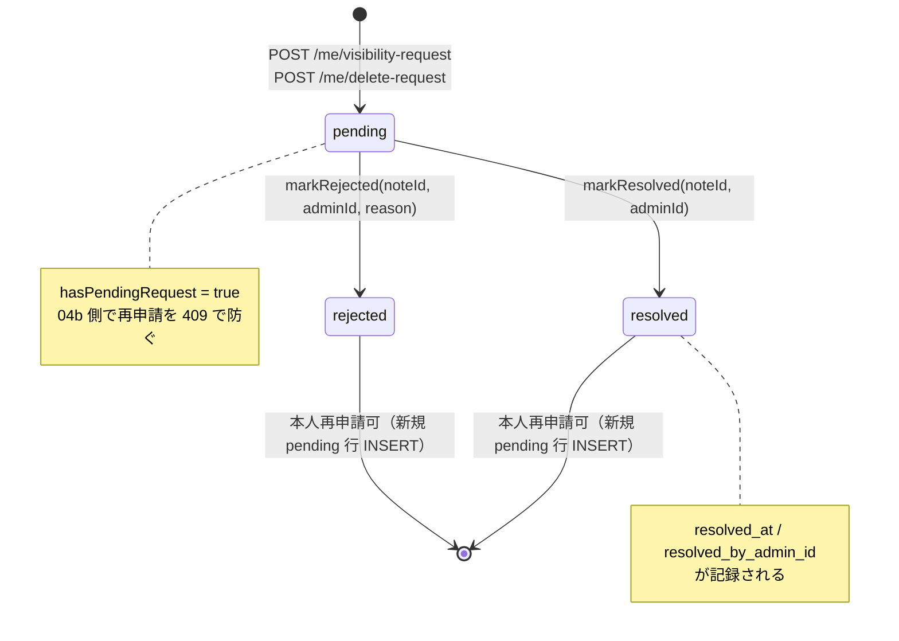

# State Machine — admin_member_notes.request_status

## Mermaid 状態遷移図



## 列定義

| 列 | 型 | NULL | 値域 |
| --- | --- | --- | --- |
| `request_status` | TEXT | YES | `pending` / `resolved` / `rejected` / NULL (general) |
| `resolved_at` | INTEGER | YES | unix epoch ms |
| `resolved_by_admin_id` | TEXT | YES | admin userId |

## DDL（migration 0007）

```sql
ALTER TABLE admin_member_notes ADD COLUMN request_status TEXT;
ALTER TABLE admin_member_notes ADD COLUMN resolved_at INTEGER;
ALTER TABLE admin_member_notes ADD COLUMN resolved_by_admin_id TEXT;

UPDATE admin_member_notes
   SET request_status = 'pending'
 WHERE note_type IN ('visibility_request', 'delete_request')
   AND request_status IS NULL;

CREATE INDEX IF NOT EXISTS idx_admin_notes_pending_requests
  ON admin_member_notes (member_id, note_type)
  WHERE request_status = 'pending';
```

## Repository helper interface

```ts
export type RequestStatus = "pending" | "resolved" | "rejected";

export const hasPendingRequest = (
  c: DbCtx,
  memberId: MemberId,
  noteType: Exclude<AdminMemberNoteType, "general">,
): Promise<boolean>;

export const markResolved = (
  c: DbCtx,
  noteId: string,
  adminId: string,
): Promise<string | null>;

export const markRejected = (
  c: DbCtx,
  noteId: string,
  adminId: string,
  reason: string,
): Promise<string | null>;
```

`markResolved` / `markRejected` は `WHERE request_status='pending'` を必須条件として SQL に含めることで
`resolved → *` / `rejected → *` / `general → *` を構造的に禁止する。
