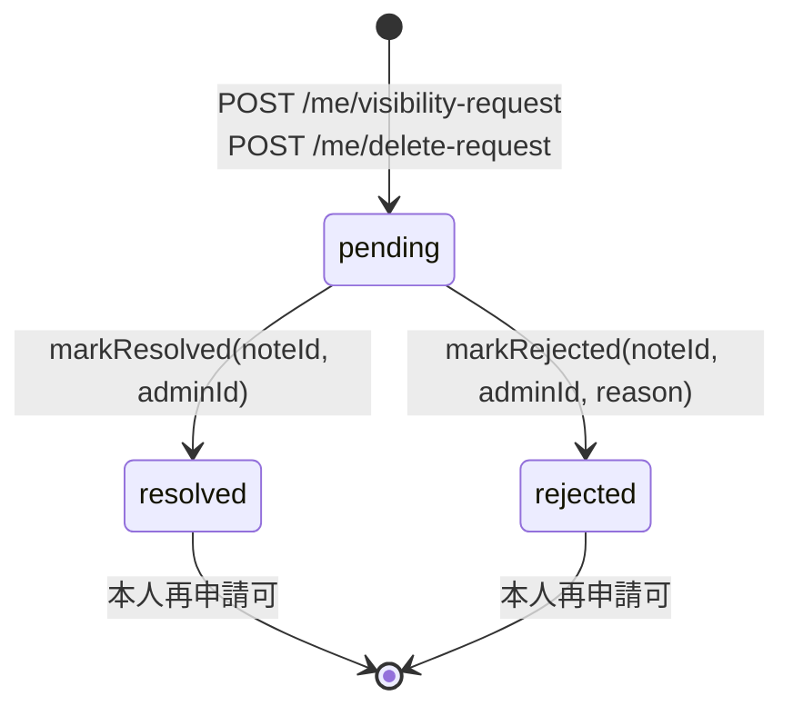

# 04b-followup-001: admin_member_notes に request_status / resolved metadata を追加

## 概要

`admin_member_notes` の `visibility_request` / `delete_request` 行に処理状態
（`pending` / `resolved` / `rejected`）と処理結果メタデータ（`resolved_at` /
`resolved_by_admin_id`）の 3 列を追加し、本人再申請ガード（04b）と admin resolve
workflow（07a / 07c）が同じ正本を参照できる構造に揃えた。

`hasPendingRequest` を「同 type の最新行が存在 = pending」から `request_status='pending'`
ベースの判定へ移行し、admin 処理後の本人再申請経路を論理的に開く。

## 変更ファイル

| ファイル | 変更 |
| --- | --- |
| `apps/api/migrations/0007_admin_member_notes_request_status.sql` | 新規。3 列追加 + 既存 request 行の pending backfill + partial index `idx_admin_notes_pending_requests` |
| `apps/api/src/repository/adminNotes.ts` | `RequestStatus` 型追加 / Row interface 拡張 / `create` で request 行に pending を初期化 / `hasPendingRequest` を pending 限定化 / `markResolved` / `markRejected` 追加 |
| `apps/api/src/repository/__tests__/adminNotes.test.ts` | state transition / 再申請 / pending ガード / general 行 no-op の単体テスト追加 |
| `apps/api/src/routes/me/index.test.ts` | resolved 後の再申請が 202 で成功するケースを追加 |
| `docs/00-getting-started-manual/specs/07-edit-delete.md` | 「申請 queue の状態遷移」節を追加（Mermaid + 列定義 + 不変条件参照） |

## State Machine



`pending → resolved` / `pending → rejected` のみ許容。`resolved → *` / `rejected → *`
は `WHERE request_status='pending'` ガードで構造的に禁止する。

`markRejected` の reason 追記は単発 UPDATE で `body = body || ?3` の SQL 連結を採用
（`findById` → 連結 → UPDATE の 2 phase は採らない）。理由はトランザクション 1 回で
完結し、`WHERE request_status='pending'` ガードと合わせて atomic に状態遷移を確定
できるため。

## 不変条件

- #4: `member_responses` / `response_fields` には触れない（`admin_member_notes` 単独 ALTER）
- #5: D1 アクセスは `apps/api` 配下のみ
- #11: 管理者は member 本文を直接編集しない（`markResolved` / `markRejected` は
  `admin_member_notes` のみ更新）

## ローカル検証

```
mise exec -- pnpm --filter @ubm-hyogo/api typecheck   # exit 0
mise exec -- pnpm --filter @ubm-hyogo/api lint        # exit 0
mise exec -- pnpm --filter @ubm-hyogo/api test -- --run
# Test Files 68 passed, Tests 407 passed
```

## デプロイ手順（PR マージ後）

```bash
bash scripts/cf.sh d1 migrations apply ubm-hyogo-db-staging --env staging
# 検証 SQL（outputs/phase-05/migration-runbook.md）で
# backfill 完了 / partial index 利用を確認
bash scripts/cf.sh d1 migrations apply ubm-hyogo-db-prod --env production
```

## 視覚的検証

NON_VISUAL タスク（UI 変更なし）。スクリーンショット不要。

## 関連 Issue

#217
