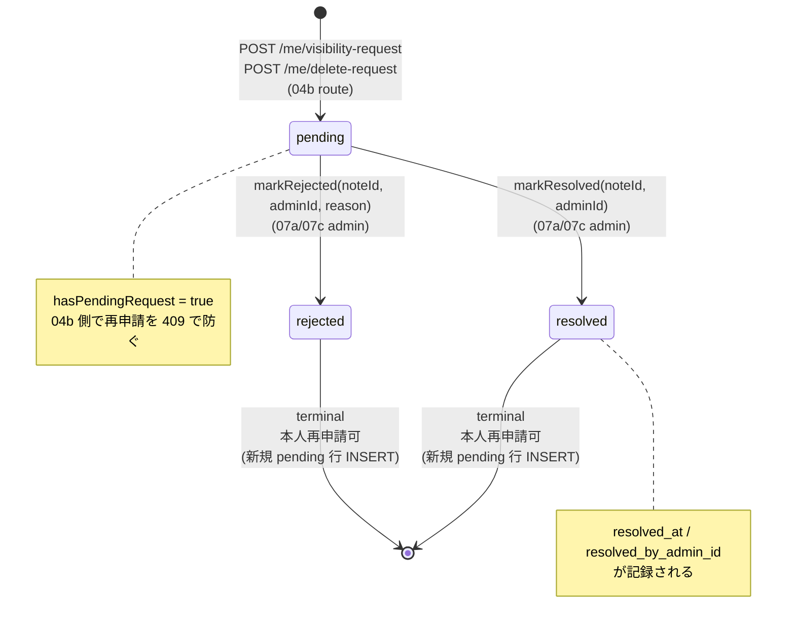

# Phase 2: 設計

## メタ情報

| 項目 | 値 |
| --- | --- |
| タスク名 | 04b-followup-001-admin-queue-request-status-metadata |
| Phase 番号 | 2 / 13 |
| Phase 名称 | 設計 |
| Wave | 4 (followup, serial) |
| 作成日 | 2026-04-30 |
| 前 Phase | 1 (要件定義) |
| 次 Phase | 3 (設計レビュー) |
| 状態 | completed |

## 目的

Phase 1 で確定した値域・状態遷移・AC を、DDL（migration 0007）/ partial index / backfill SQL / repository helper interface / module 設計に落とす。Mermaid 状態遷移図と列定義を確定し、Phase 3 の alternative 評価対象（採用案）として固定する。

## 実行タスク

1. Mermaid で状態遷移図を作成（pending → resolved / rejected / 禁止遷移を網羅）
2. `0007_admin_member_notes_request_status.sql` の DDL 草案（列追加 + backfill + partial index）
3. partial index `idx_admin_notes_pending_requests` の WHERE 句設計
4. backfill SQL の対象行 SELECT で件数想定と取りこぼし防止
5. repository helper interface の TypeScript 型定義（`markResolved` / `markRejected` / `hasPendingRequest` 改修）
6. module 設計（adminNotes.ts 内の責務分離、`RequestStatus` 型 export）
7. dependency matrix（migration → repository → routes/me → 07a/07c の依存方向）
8. 不変条件 #4 / #5 / #11 への接触面の最終確認

## 参照資料

| 種別 | パス | 用途 |
| --- | --- | --- |
| 必須 | phase-01.md | 値域・状態遷移表・AC |
| 必須 | apps/api/migrations/0006_admin_member_notes_type.sql | 直前 migration との接続 |
| 必須 | apps/api/src/repository/adminNotes.ts | 既存 helper 構造 |
| 必須 | apps/api/src/repository/_shared/db.ts | DbCtx interface |
| 必須 | apps/api/src/repository/_shared/brand.ts | `MemberId` / `AdminEmail` brand |
| 必須 | docs/00-getting-started-manual/specs/07-edit-delete.md | spec 追記対象 |
| 参考 | docs/30-workflows/02-application-implementation/_templates/phase-template-app.md | Phase 2 必須セクション（Mermaid / env / module 設計） |

## Mermaid 状態遷移図



## 列定義（DDL 草案）

```sql
-- apps/api/migrations/0007_admin_member_notes_request_status.sql
-- 04b-followup-001: visibility_request / delete_request 行に処理状態メタを追加。
-- 不変条件 #4: response_fields には触れない（admin_member_notes 単独変更）
-- 不変条件 #5: D1 操作は apps/api 配下のみ
-- 不変条件 #11: member 本文（member_responses）には触れない

ALTER TABLE admin_member_notes
  ADD COLUMN request_status TEXT;

ALTER TABLE admin_member_notes
  ADD COLUMN resolved_at INTEGER;

ALTER TABLE admin_member_notes
  ADD COLUMN resolved_by_admin_id TEXT;

-- backfill: 既存の request 行を pending 化（general 行は NULL のまま）
UPDATE admin_member_notes
   SET request_status = 'pending'
 WHERE note_type IN ('visibility_request', 'delete_request')
   AND request_status IS NULL;

-- partial index: pending 行のみを対象に高速検索（hasPendingRequest のホットパス）
CREATE INDEX IF NOT EXISTS idx_admin_notes_pending_requests
  ON admin_member_notes (member_id, note_type)
  WHERE request_status = 'pending';
```

| 列名 | 型 | NULL | 用途 | 値域 |
| --- | --- | --- | --- | --- |
| `request_status` | TEXT | YES | 処理状態。general 行は NULL | `pending` / `resolved` / `rejected` / NULL |
| `resolved_at` | INTEGER | YES | resolve/reject 時の unix epoch ms | `Date.now()` 値、または NULL |
| `resolved_by_admin_id` | TEXT | YES | 処理した admin の `userId` | 文字列、または NULL |

> **CHECK 制約を付けない理由**: D1 (SQLite) の `ALTER TABLE` で CHECK 制約を後付けする操作はテーブル再作成が必要で、運用コストが高い。値域は zod / repository helper 入口で守る（Phase 3 の Alternative A で評価）。

## partial index 設計

| 項目 | 値 |
| --- | --- |
| 名前 | `idx_admin_notes_pending_requests` |
| 対象列 | `(member_id, note_type)` |
| WHERE 句 | `request_status = 'pending'` |
| 用途 | `hasPendingRequest(memberId, noteType)` の存在判定を pending 行のみ index hit で実行 |
| 既存 index との関係 | 既存 `idx_admin_notes_member_type (member_id, note_type, created_at)` は listing 用途で残し、pending 限定は別 partial index で住み分け |
| 検証 | `EXPLAIN QUERY PLAN SELECT 1 FROM admin_member_notes WHERE member_id=? AND note_type=? AND request_status='pending' LIMIT 1` で `USING INDEX idx_admin_notes_pending_requests` を確認 |

## backfill 戦略

| 行カテゴリ | 条件 | backfill 後 |
| --- | --- | --- |
| 一般メモ | `note_type='general'` | `request_status` / `resolved_at` / `resolved_by_admin_id` 全て NULL |
| pending 申請（既存） | `note_type IN ('visibility_request','delete_request')` かつ `request_status IS NULL` | `request_status='pending'`、resolved 列は NULL |
| 既に resolved/rejected の行 | （MVP 時点で 0 件想定） | UPDATE 対象外（`AND request_status IS NULL` 条件で防御） |

検証 SQL（migration 適用後に実行）:

```sql
-- 想定 0 件
SELECT COUNT(*) FROM admin_member_notes
 WHERE note_type IN ('visibility_request','delete_request')
   AND request_status IS NULL;

-- general 行は NULL のまま
SELECT COUNT(*) FROM admin_member_notes
 WHERE note_type = 'general' AND request_status IS NOT NULL;
```

## repository helper interface

```ts
// apps/api/src/repository/adminNotes.ts （差分）

export type RequestStatus = "pending" | "resolved" | "rejected";

export interface AdminMemberNoteRow {
  noteId: string;
  memberId: MemberId;
  body: string;
  noteType: AdminMemberNoteType;
  requestStatus: RequestStatus | null;       // 追加
  resolvedAt: number | null;                  // 追加（unix epoch ms）
  resolvedByAdminId: string | null;           // 追加
  createdBy: AdminEmail;
  updatedBy: AdminEmail;
  createdAt: string;
  updatedAt: string;
}

/**
 * pending 行のみを対象に存在判定する。
 * AC-3: resolved / rejected 行は false 扱い、再申請可能。
 */
export const hasPendingRequest = async (
  c: DbCtx,
  memberId: MemberId,
  noteType: Exclude<AdminMemberNoteType, "general">,
): Promise<boolean>;

/**
 * pending 行を resolved に遷移させる。
 * 戻り値: 更新成功時は noteId、対象が pending でない（既に resolved/rejected/general）場合は null。
 * 不変条件 #11: member_responses には書き込まない。
 */
export const markResolved = async (
  c: DbCtx,
  noteId: string,
  adminId: string,
): Promise<string | null>;

/**
 * pending 行を rejected に遷移させる。
 * reason は body 末尾に追記する（既存 body は保持）。reason 空文字は呼出側責務（07a/07c の zod で拒否）。
 */
export const markRejected = async (
  c: DbCtx,
  noteId: string,
  adminId: string,
  reason: string,
): Promise<string | null>;
```

implementation 擬似コード:

```ts
export const markResolved = async (c, noteId, adminId) => {
  const now = Date.now();
  const result = await c.db
    .prepare(
      `UPDATE admin_member_notes
          SET request_status = 'resolved',
              resolved_at = ?1,
              resolved_by_admin_id = ?2,
              updated_at = ?3
        WHERE note_id = ?4
          AND request_status = 'pending'`,
    )
    .bind(now, adminId, new Date(now).toISOString(), noteId)
    .run();
  return result.meta.changes > 0 ? noteId : null;
};
```

> `WHERE request_status='pending'` を条件に含むことで「resolved → resolved」「rejected → resolved」「general → resolved」を構造的に防ぐ（AC-6）。

## module 設計

| ファイル | 役割 | 変更種別 |
| --- | --- | --- |
| `apps/api/migrations/0007_admin_member_notes_request_status.sql` | DDL + backfill + partial index | 新規 |
| `apps/api/src/repository/adminNotes.ts` | `RequestStatus` 型追加 / Row interface 拡張 / `hasPendingRequest` 改修 / `markResolved` / `markRejected` 追加 | 改修 |
| `apps/api/src/routes/me/services.ts` | `memberSelfRequestQueue` の pending ガードは hasPendingRequest 経由のため呼出変更不要、ただし AC 検証として再申請可能ケースを path で確認 | 確認 |
| `apps/api/src/repository/__tests__/adminNotes.test.ts` | state transition 単体テスト | 新規/追記 |
| `apps/api/src/routes/me/index.test.ts` | resolved 後の再申請 202 ケース | 追記 |
| `docs/00-getting-started-manual/specs/07-edit-delete.md` | queue 状態遷移節 + Mermaid + 値定義 | 追記 |

## env / dependency matrix

| 環境変数 | 用途 | 本タスクで導入 |
| --- | --- | --- |
| なし（既存 D1 binding `DB` のみ） | - | No |

| 依存先 | 種別 | 方向 |
| --- | --- | --- |
| migration 0006 (note_type 列) | 上流 | 必須前提 |
| `adminNotes.ts` 既存 helper | 上流 | 改修 |
| `routes/me/services.ts` | 下流 | hasPendingRequest 経由で透過的に挙動変化 |
| 07a / 07c admin resolve workflow | 下流 | `markResolved` / `markRejected` を import して呼出 |

## 統合テスト連携

| 連携先 Phase | 連携内容 |
| --- | --- |
| Phase 3 | Alternative 案 3 つ（CHECK 制約 / 別テーブル分離 / 列追加+repository guard）の評価対象 |
| Phase 4 | helper interface ごとの unit / repository / contract test 戦略 |
| Phase 5 | DDL ファイル作成、backfill 適用、partial index 検証の runbook 化 |
| 下流タスク 07a/07c | helper interface を契約として import |

## 多角的チェック観点

| 不変条件 | チェック | 担保 |
| --- | --- | --- |
| #4 | DDL 変更は `admin_member_notes` のみ。`member_responses` / `response_fields` 不変 | migration 0007 が ALTER TABLE 対象を限定 |
| #5 | D1 操作は apps/api 配下 | apps/web から呼ばない（migration / repository ともに apps/api） |
| #11 | `markResolved` / `markRejected` は `admin_member_notes` のみ UPDATE | SQL 文の対象 table が固定 |
| 認可 | 認可ガードは呼出側（07a/07c の admin context）責務 | 本タスクは helper 提供のみで route 認可は触らない |
| 無料枠 | partial index 範囲は pending 行（小規模） | storage 影響無視可 |
| audit | 既存 audit_log は触らない | 07a/07c が責務 |

## サブタスク管理

| # | サブタスク | 担当 Phase | 状態 |
| --- | --- | --- | --- |
| 1 | Mermaid 状態遷移図 | 2 | pending |
| 2 | DDL 草案 | 2 | pending |
| 3 | partial index 設計 | 2 | pending |
| 4 | backfill 戦略 | 2 | pending |
| 5 | repository interface 確定 | 2 | pending |
| 6 | module 設計 | 2 | pending |
| 7 | dependency matrix | 2 | pending |
| 8 | 不変条件接触面確認 | 2 | pending |

## 成果物

| 種別 | パス | 説明 |
| --- | --- | --- |
| ドキュメント | outputs/phase-02/main.md | 設計サマリ |
| ドキュメント | outputs/phase-02/state-machine.md | Mermaid + 列定義 + DDL 草案 |
| メタ | artifacts.json | Phase 2 を completed |

## 完了条件

- [ ] Mermaid 状態遷移図が pending/resolved/rejected/terminal を網羅
- [ ] DDL 草案が SQLite 実行可能形式（CHECK 制約に依存しない）
- [ ] partial index `idx_admin_notes_pending_requests` の WHERE 句が確定
- [ ] backfill SQL が `note_type IN (...)` でガードし、general 行を変更しない
- [ ] repository helper 3 種（hasPendingRequest 改修 / markResolved / markRejected）の interface が確定
- [ ] 不変条件 #4 / #5 / #11 への接触面が「ゼロ」と確認

## タスク100%実行確認

- [ ] 実行タスク 8 件すべて completed
- [ ] artifacts.json で phase 2 を completed
- [ ] outputs/phase-02/state-machine.md が Phase 3 のレビュー入力として参照可能

## 次 Phase への引き渡し

- 次: 3 (設計レビュー)
- 引き継ぎ: 採用案（列追加 + repository guard）と alternative 候補（CHECK 制約 / 別テーブル分離）の評価
- ブロック条件: DDL がテーブル再作成を必要とする / partial index が pending 以外を対象にする / interface が呼出側で破綻する場合は Phase 2 へ差し戻し
