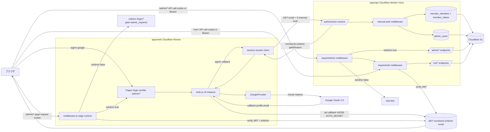
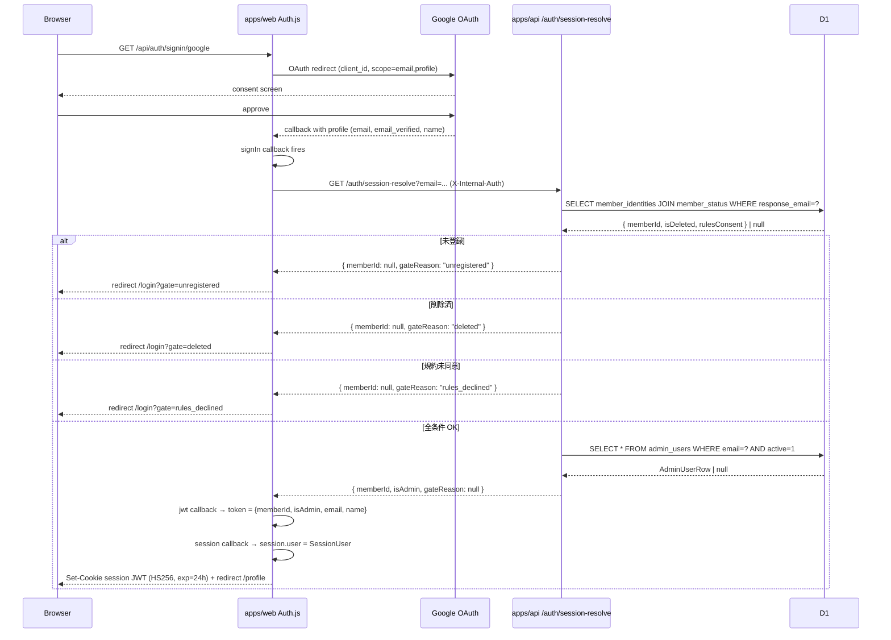
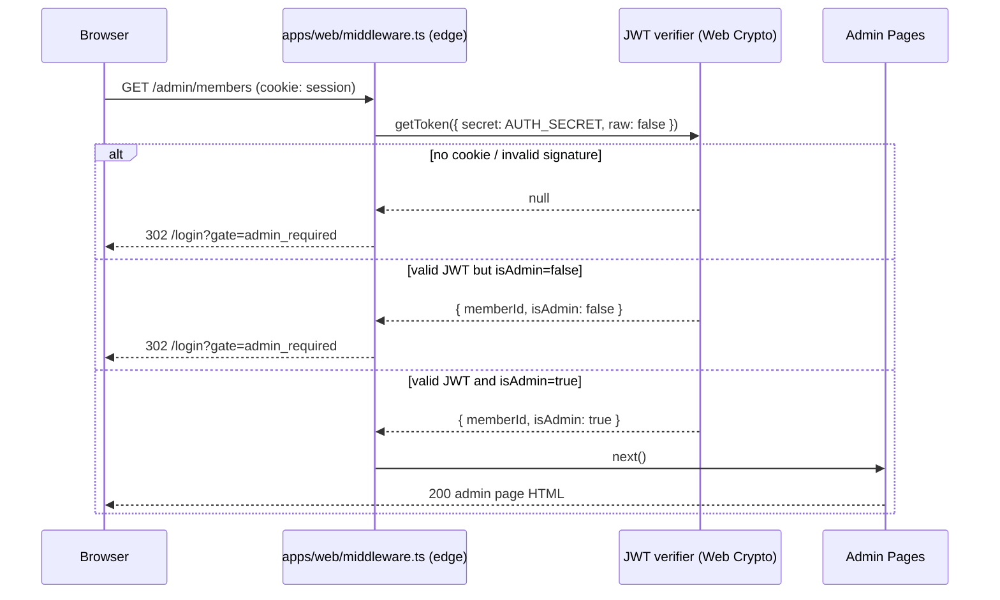

# architecture.md — provider / callback / admin gate の構造図

## 全体フロー（Mermaid）



## レイヤー分離

| レイヤー | 配置 | 責務 |
| --- | --- | --- |
| UI / OAuth client | apps/web | Auth.js GoogleProvider, callback, JWT 発行, edge middleware |
| Internal Auth boundary | apps/web ↔ apps/api | Worker-to-Worker 認証（INTERNAL_AUTH_SECRET） |
| Identity resolution | apps/api | member_identities lookup, admin_users lookup |
| Data access | apps/api → D1 binding | 不変条件 #5（apps/web から D1 直接禁止） |

## sign-in シーケンス



## /admin/* page access シーケンス（middleware）



## /admin/* API access シーケンス（requireAdmin）

```mermaid
sequenceDiagram
  participant B as Browser / Server Action
  participant H as Hono /admin/*
  participant RA as requireAdmin middleware
  participant E as endpoint handler

  B->>H: POST /admin/members/:id/publish (cookie or Authorization: Bearer)
  H->>RA: middleware chain
  RA->>RA: extract JWT (cookie or Bearer)
  alt no token
    RA-->>B: 401 unauthorized
  else verify fail
    RA-->>B: 401 unauthorized (signature mismatch)
  else valid but isAdmin=false
    RA-->>B: 403 forbidden
  else valid and isAdmin=true
    RA->>E: c.set("user", { memberId, isAdmin }); next()
    E-->>B: 200 OK
  end
```

## 不変条件カバレッジ

| 不変条件 | 図中の対応箇所 |
| --- | --- |
| #5 (apps/web→D1 直接禁止) | apps/web は session-resolve 経由のみ、D1 への矢印は apps/api からのみ |
| #7 (responseId と memberId 分離) | JWT には memberId のみ、responseId 矢印無し |
| #9 (`/no-access` 不依存) | gateReason に応じた `/login?gate=...` redirect のみ |
| #10 (無料枠) | sessions テーブル無し、JWT のみ |
| #11 (admin gate 二段) | UI middleware と API requireAdmin の両方を経由 |
