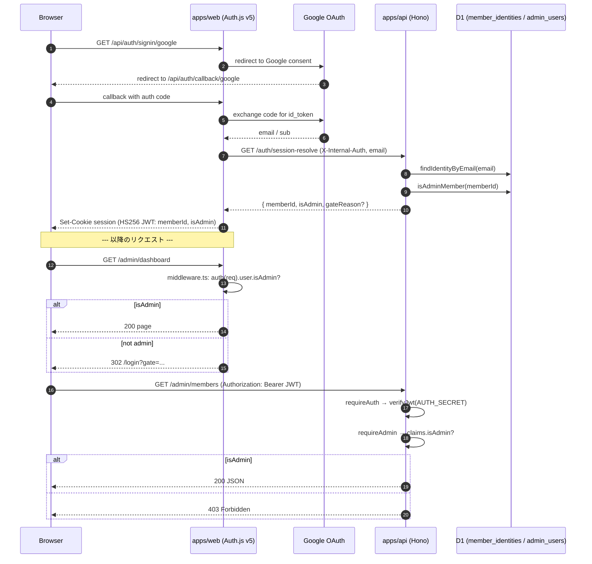

# Implementation Guide — 05a Auth.js Google OAuth Provider + Admin Gate

> 本ガイドは PR 本文の元になる文書。05b（Magic Link / Auth Gate State）と並列で進む本タスクの全体像、apps/web ↔ apps/api 接続契約、実装ファイルの責務、残課題を一覧化する。

---

## Part 1 — 中学生レベル（困りごとと解決後の状態）

### 困りごと

UBM 兵庫支部会のサイトには「会員」と「管理者」と「会員じゃない人」がやってきます。誰でも自由に入れてしまうと、会員名簿や管理者画面が見られてしまい困ります。一方で、「Google アカウントでログインするだけで本人確認できる」しくみがあれば、パスワードを覚えなくてよくなって楽です。

### 解決後の状態

- サイトの入口に「Google でログイン」ボタンが 1 つだけある
- ボタンを押すと、Google が「あなたは本物ですか？」と確認してくれる
- サイトに戻ってきたとき、サイト側が「この人は会員かな？管理者かな？」と Google のメールアドレスをもとに調べる
- 会員じゃない人 / ルールに同意していない人 / 退会済みの人は、入口で「ごめんなさい」と言われて中に入れない
- 管理者ページは「会員リストに『管理者』と書いてある人」だけ入れる
- 管理者チェックは **2 段階の関所**でやる: まず画面の入口（middleware）、次に API の入口（requireAdmin）。どちらか 1 つ突破されても、もう片方で止まる

### 専門用語のミニ説明

- **OAuth**: 「Google が代わりに本人確認してくれるしくみ」。サイトはパスワードを預からない
- **JWT (JSON Web Token)**: 「本物の会員ですよ」という署名入りの紙切れ。これを cookie に入れて持ち歩く
- **middleware**: 画面に入る前に通る関所。Cloudflare Workers の edge で動く
- **session**: ログイン状態を覚えておく仕組み。本タスクでは JWT を使うので D1 にテーブルは作らない（無料枠戦略）

---

## Part 2 — 技術者レベル

### タスクメタ情報

| 項目 | 詳細 |
| --- | --- |
| task root | `docs/30-workflows/05a-parallel-authjs-google-oauth-provider-and-admin-gate` |
| key outputs | `outputs/phase-02/architecture.md`, `outputs/phase-02/api-contract.md`, `outputs/phase-02/admin-gate-flow.md`, `outputs/phase-05/runbook.md`, `outputs/phase-07/ac-matrix.md`, `outputs/phase-10/main.md` |
| upstream tasks | 02a (`findIdentityByEmail`), 02c (`isAdminMember`), 04b (`/me`), 04c (`/admin/*`) |
| downstream tasks | 06a/b/c (画面), 08a (contract test), 09a (staging smoke) |
| validation focus | OAuth callback → session-resolve → JWT 構造 + 二段防御 + bypass 阻止 + `/no-access` 不在 |
| shared with 05b | `GET /auth/session-resolve`, `SessionUser` 型, `gateReason` 値（`unregistered` / `deleted` / `rules_declined`） |
| known constraints | B-01 (admin 剥奪は次回ログインで反映), B-03 (Google OAuth verification は MVP 後申請) |

### apps/web ↔ apps/api 接続図 (Mermaid)



### 二段防御の責務分離

| 層 | 場所 | 責務 | 失敗時 |
| --- | --- | --- | --- |
| 1 段目 | `apps/web/middleware.ts` (edge) | 画面 `/admin/*` の入口で `auth(req).user.isAdmin` を確認 | 302 redirect to `/login?gate=admin_required` |
| 2 段目 | `apps/api/src/middleware/require-admin.ts` | API `/admin/*` で JWT を再検証し `isAdmin` を確認 | 403 Forbidden |

不変条件 #11（admin gate 二段防御）を満たす。1 段目を bypass されても、2 段目が API レスポンスを止める。

### 共有 contract（05a / 05b 共通）

```ts
// packages/shared/src/auth.ts
export type GateReason = 'unregistered' | 'deleted' | 'rules_declined';

export interface SessionUser {
  memberId: string;       // 不変条件 #7: responseId とは独立
  isAdmin: boolean;
  email: string;          // system field（フォーム項目ではない）
}

export interface SessionResolveResponse {
  memberId: string | null;
  isAdmin: boolean;
  gateReason: GateReason | null;
}
```

```http
GET /auth/session-resolve?email=<urlencoded>
X-Internal-Auth: ${INTERNAL_AUTH_SECRET}

200 OK
{ "memberId": "mbr_...", "isAdmin": false, "gateReason": null }

200 OK (denied)
{ "memberId": null, "isAdmin": false, "gateReason": "unregistered" | "deleted" | "rules_declined" }
```

### 実装ファイル一覧と責務

| ファイル | 責務 |
| --- | --- |
| `apps/web/src/lib/auth.ts` | Auth.js v5 設定。Google provider, signIn callback で `/auth/session-resolve` を呼び、共有 HS256 encode/decode で JWT に `memberId` / `isAdmin` を埋める |
| `apps/web/middleware.ts` | edge middleware。`/admin/*` の 1 段目防御。`auth(req).user.isAdmin` で gate |
| `apps/api/src/routes/auth/session-resolve.ts` | 内部 endpoint。`INTERNAL_AUTH_SECRET` で apps/web 以外を弾き、02a / 02c を呼んで identity 解決 |
| `apps/api/src/middleware/internal-auth.ts` | `X-Internal-Auth` 検証 |
| `apps/api/src/middleware/require-admin.ts` | 2 段目防御。`Authorization: Bearer <JWT>` を verify し `isAdmin` を確認 |
| `packages/shared/src/auth.ts` | `AuthSessionUser` / `GateReason` / `signSessionJwt` / `verifySessionJwt` / Auth.js encode/decode adapter。05b と共有 |
| `apps/api/src/routes/auth/session-resolve.test.ts` | session-resolve の unit / integration test |
| `apps/api/src/middleware/require-admin.test.ts` | requireAdmin の unit test |
| `packages/shared/src/auth.test.ts` | 共有型 / verifyJwt の unit test |

### 設定可能パラメータ / secrets

| 種別 | 名前 | 用途 | 管理場所 |
| --- | --- | --- | --- |
| secret | `AUTH_SECRET` | Auth.js JWT 署名鍵 | Cloudflare Secrets / 1Password |
| secret | `GOOGLE_CLIENT_ID` | OAuth client id | 同上 |
| secret | `GOOGLE_CLIENT_SECRET` | OAuth client secret | 同上 |
| secret | `INTERNAL_AUTH_SECRET` | apps/web → apps/api 内部認証 | 同上 |
| const | session 期限 | 24h | `apps/web/src/lib/auth.ts` |

### 検証コマンド

```bash
mise exec -- pnpm typecheck
mise exec -- pnpm lint
pnpm exec vitest run packages/shared/src/auth.test.ts apps/api/src/middleware/require-admin.test.ts apps/api/src/routes/auth/session-resolve.test.ts --root=. --config=vitest.config.ts
pnpm exec vitest run apps/api/src/routes/admin/dashboard.test.ts apps/api/src/routes/admin/members.test.ts apps/api/src/routes/admin/member-status.test.ts apps/api/src/routes/admin/member-notes.test.ts apps/api/src/routes/admin/member-delete.test.ts apps/api/src/routes/admin/tags-queue.test.ts apps/api/src/routes/admin/schema.test.ts apps/api/src/routes/admin/meetings.test.ts apps/api/src/routes/admin/attendance.test.ts --root=. --config=vitest.config.ts
```

### エッジケース / エラーハンドリング

| ケース | 挙動 |
| --- | --- |
| Google OAuth callback で email 取得失敗 | signIn callback が false を返し、`/login?error=oauth_failure` |
| `/auth/session-resolve` が 5xx | signIn callback が false。session 発行されない |
| JWT 改ざん（F-09） | requireAuth で verifyJwt が throw → 401 |
| `?bypass=true` クエリ（F-15） | middleware は query を見ない設計。常に session 検証 |
| 偽造 cookie（F-16） | Auth.js `jwt.decode` が共有 `verifySessionJwt` で reject |
| admin 剥奪後に JWT 残存（B-01） | 既知制約。次回ログインで反映（MVP 範囲） |
| Google verification 未取得（B-03） | testing user にのみ OAuth 許可。MVP 後に申請 |

### 不変条件への準拠

| # | 条件 | 本タスクでの対応 |
| --- | --- | --- |
| #2 | consent キー統一 | session-resolve は `rulesConsent` を参照（02a 経由） |
| #3 | `responseEmail` は system field | session 内 email は OAuth から取得（フォーム項目ではない） |
| #5 | apps/web → D1 直アクセス禁止 | session-resolve は必ず apps/api 経由 |
| #6 | GAS prototype 不採用 | Auth.js v5 + Hono 構成、GAS は参照しない |
| #7 | memberId と responseId の分離 | session に responseId を含めない |
| #9 | `/no-access` 不在 | gate 失敗は `/login?gate=...` に集約。`/no-access` は作らない（Phase 11 で PASS 確認済） |
| #10 | 無料枠戦略 | session JWT 採用、D1 `sessions` テーブル不採用 |
| #11 | admin gate 二段防御 | middleware + requireAdmin |

---

## Phase 11 証跡への言及

Phase 11 (手動 smoke) は **PARTIAL** で完了している。詳細は `outputs/phase-11/main.md`。

- **PASS 済**: 共有 JWT 互換 / requireAdmin / session-resolve / admin route gate の自動化テスト、`/no-access` 不在確認（不変条件 #9）
- **BLOCKED**: M-01〜M-11 の OAuth flow 実環境 smoke、F-09 / F-15 / F-16 の bypass 試行、B-01 の race condition 検証、screenshot 9 枚、curl 結果、session JSON
- **理由**: 当ワークツリーから実 Google OAuth credentials と Cloudflare Workers preview / staging 環境への deploy が未完了
- **引継ぎ**: `outputs/phase-11/smoke-checklist.md` に再現手順を完全形で記述済。**09a (staging)** で実環境再実行し、placeholder を上書きする

本タスクの PR は **「自動化テスト + コード上の不変条件チェック」で品質保証**し、実環境 screenshot / OAuth smoke evidence は staging deploy 後（09a）に補完する設計とする。

---

## 残課題（R-1〜R-4）

| ID | 内容 | 影響 | 引継ぎ先 |
| --- | --- | --- | --- |
| R-1 | Phase 11 M-01〜M-11 / F-09,15,16 / B-01 が staging 接続前 BLOCKED | 実環境証跡が placeholder | 09a |
| R-2 | screenshot / curl / session JSON が placeholder | UI/UX 視覚的証跡が無い | 09a |
| R-3 | Google OAuth verification 申請未実施（B-03） | testing user 以外がログインできない | 別タスク（運用） |
| R-4 | admin 剥奪の即時反映が無い（B-01） | 剥奪後も最大 24h は admin 操作可能 | 別タスク（オプション） |

---

## 関連ドキュメント

- `outputs/phase-02/architecture.md` — 全体接続図
- `outputs/phase-02/admin-gate-flow.md` — 二段防御フロー詳細
- `outputs/phase-07/ac-matrix.md` — AC trace
- `outputs/phase-10/main.md` — GO 判定 + B-01〜B-03 既知制約
- `outputs/phase-11/main.md` — smoke 結果（PARTIAL / BLOCKED）
- `outputs/phase-11/smoke-checklist.md` — staging 用再現手順
- `doc/00-getting-started-manual/specs/02-auth.md` — 認証設計
- `doc/00-getting-started-manual/specs/13-mvp-auth.md` — MVP 認証方針
