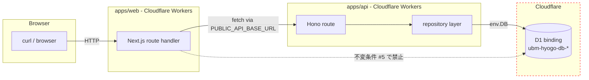

# Phase 2: 設計

## 全体像

local smoke と staging smoke の 2 段で `apps/web → apps/api → D1` 経路を網羅する。wrangler は **直接実行せず**、必ず `bash scripts/cf.sh` 経由（CLAUDE.md ルール / esbuild mismatch 自動解決）で起動する。

## D1 binding 経路 mermaid



## local smoke 手順設計

### 1. 事前準備

- `mise install` 済 / `mise exec -- pnpm install` 済
- `apps/api/wrangler.toml` に dev 環境の D1 binding が定義済
- 既存 D1 migration が apply 済（未 apply の場合 `bash scripts/cf.sh d1 migrations apply ubm-hyogo-db-dev` を先行実行）

### 2. API 起動（terminal A）

```bash
# wrangler 直接実行 NG。必ず scripts/cf.sh 経由
bash scripts/cf.sh dev --config apps/api/wrangler.toml --local --persist-to .wrangler/state
# 期待: Listening on http://127.0.0.1:8787
```

esbuild Host/Binary version mismatch は `scripts/cf.sh` の `ESBUILD_BINARY_PATH` 自動解決で吸収される。再発した場合は Phase 6 異常系へ。

### 3. Web 起動（terminal B）

```bash
PUBLIC_API_BASE_URL=http://localhost:8787 mise exec -- pnpm --filter @ubm-hyogo/web dev
# 期待: ready on http://localhost:3000
```

### 4. curl smoke（terminal C）

```bash
curl -s -o /dev/null -w "/ %{http_code}\n"             http://localhost:3000/
curl -s -o /dev/null -w "/members %{http_code}\n"      "http://localhost:3000/members?q=hello&zone=0_to_1&density=dense"
curl -s -o /dev/null -w "/members/UNKNOWN %{http_code}\n" http://localhost:3000/members/UNKNOWN
curl -s -o /dev/null -w "/register %{http_code}\n"     http://localhost:3000/register
```

期待: 4 route family / 5 smoke cases として `/` `200` / `/members` `200` / `/members/{seeded-id}` `200` / `/members/UNKNOWN` `404` / `/register` `200`。出力を `outputs/phase-11/evidence/local-curl.log` へ保存。

### 5. 実 D1 経路 evidence

seeded ID は API 側 `GET /public/members` から取得し、その ID を web `/members/{seeded-id}` に渡して `200` を観測する。`/members/UNKNOWN` の 404 は異常系確認であり、AC-3 の主証跡にはしない。

## staging smoke 手順設計

### 1. staging vars 確認

```bash
bash scripts/cf.sh deploy --config apps/web/wrangler.toml --env staging --dry-run
# Cloudflare deployed vars（PUBLIC_API_BASE_URL が staging API の URL を指すか確認）
```

`PUBLIC_API_BASE_URL` が `https://<api-host>.workers.dev` 系を指していること（localhost ではない）を Cloudflare deployed vars で確認する。現状 `apps/web/wrangler.toml` には未定義のため、toml は補助確認に留め、deployed vars 未設定なら Phase 11 は NO-GO。

### 2. staging URL 確認

`apps/web/wrangler.toml` の `[env.staging]` route / workers.dev URL を取得。

### 3. curl smoke

```bash
WEB=https://<staging-web-url>
curl -s -o /dev/null -w "/ %{http_code}\n"             $WEB/
curl -s -o /dev/null -w "/members %{http_code}\n"      "$WEB/members"
curl -s -o /dev/null -w "/members/UNKNOWN %{http_code}\n" $WEB/members/UNKNOWN
curl -s -o /dev/null -w "/register %{http_code}\n"     $WEB/register
```

期待 status は local と同じ。出力を `outputs/phase-11/evidence/staging-curl.log` へ保存。

### 4. screenshot

staging `/members` をブラウザで開きスクリーンショットを `outputs/phase-11/evidence/staging-screenshot.png` に保存（補助 evidence）。

## esbuild version mismatch 解消設計

| 観点 | 採用方針 |
| --- | --- |
| 直接的修正 | `pnpm --filter @ubm-hyogo/api dev` を **使わない**。CLAUDE.md ルールに従い `scripts/cf.sh dev ...` 経由のみ |
| 根本原因 | グローバル esbuild とリポジトリ esbuild の不一致。`scripts/cf.sh` が `ESBUILD_BINARY_PATH` をローカル node_modules 配下に向ける |
| 文書化 | Phase 5 runbook に「直接 wrangler / pnpm dev は禁止」を明記 |

## 環境変数

| 変数 | local 値 | staging 値 | 用途 |
| --- | --- | --- | --- |
| `PUBLIC_API_BASE_URL` | `http://localhost:8787` | `https://<api>.workers.dev` | `apps/web` から `apps/api` への参照 |
| `CLOUDFLARE_API_TOKEN` | `op://...`（`.env` 参照） | GitHub Secrets / wrangler login | 1Password 経由のみ、ログ出力禁止 |

## 不変条件 #5 適合性チェック

`apps/web` 配下で `D1Database` / `env.DB` を直接 import していないことを以下で確認:

```bash
mise exec -- pnpm --filter @ubm-hyogo/web exec rg -n "D1Database|env\.DB" app src --glob '!**/*.test.*' --glob '!**/__tests__/**' || echo "OK: no direct D1 access"
```

期待: マッチ 0 件（OK 出力）。

## メタ情報

- workflow: `06a-followup-001-public-web-real-workers-d1-smoke`
- phase: 2
- status: `spec_created / pending`
- taskType: `implementation`
- visualEvidence: `NON_VISUAL`

## 目的

Phase 2 の責務を、real Workers + D1 smoke 仕様の AC と不変条件に接続して明確化する。

## 実行タスク

- local / staging smoke の接続設計を確認する
- D1 binding flow と PUBLIC_API_BASE_URL 経路を成果物へ反映する

## 参照資料

- `docs/30-workflows/completed-tasks/task-06a-followup-001-real-workers-d1-smoke.md`
- `CLAUDE.md`
- `docs/00-getting-started-manual/specs/08-free-database.md`
- `docs/00-getting-started-manual/specs/15-infrastructure-runbook.md`

## 成果物

- `outputs/phase-02/main.md`

## 完了条件

- [ ] Phase 2 の成果物が存在する
- [ ] AC / evidence / dependency trace に矛盾がない

## 統合テスト連携

- Phase 11 の local / staging curl smoke と AC trace に接続する。
- UI regression ではなく NON_VISUAL の HTTP / D1 binding evidence を正本にする。
