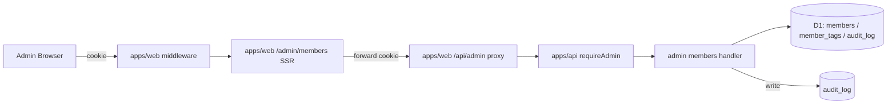

# Phase 02 Main — 設計

## Classification

| Field | Value |
| --- | --- |
| task | `06c-B-admin-members` |
| phase | `02 / 13` |
| taskType | `implementation-spec / docs-only` |
| docs_only | `true` |
| visualEvidence | `VISUAL_ON_EXECUTION` |

## アーキテクチャ概要

## ルーティング / SSR 構造

| Path | レイヤ | 責務 |
| --- | --- | --- |
| `apps/web/app/(admin)/admin/members/page.tsx` | SSR | 検索 query を受け、apps/api list を fetch、table + pagination を描画 |
| `apps/web/src/components/admin/MemberDrawer.tsx`（拡張） | Client drawer | apps/api detail を fetch、基本情報・audit log・action controls を描画 |
| `apps/web/middleware.ts` | edge middleware | Auth.js cookie で `isAdmin` 判定、未認証は login redirect |
| `apps/api/src/routes/admin/members.ts` | Hono route | list / detail handler（既存 + 拡張） |
| `apps/api/src/routes/admin/member-delete.ts` | Hono route | `POST /:memberId/delete` |
| `apps/api/src/routes/admin/member-status.ts` | Hono route | `POST /:memberId/restore` |
| `apps/api/src/middleware/require-admin.ts` | Hono middleware | session 解決 + admin role check |

## API 契約

- `GET /api/admin/members?filter&q&zone&tag&sort&density&page` → `{ total, members, page?, pageSize? }`
  - `filter=published|hidden|deleted`（現行実装正本）
  - `q`: trim + whitespace normalize + max 200 文字
  - `zone`: 単一値、許可リスト
  - `tag`: repeated（AND 条件）
  - `sort`: 許可キーのみ
  - `density=comfy|dense|list`
- `GET /api/admin/members/:memberId` → `{ member, auditLogs[] }`
- `POST /api/admin/members/:memberId/delete` → `{ id, isDeleted: true, deletedAt }`
- `POST /api/admin/members/:memberId/restore` → `{ id, restoredAt }`
- role 変更 endpoint / UI は scope 外（本タスクで作らない）

## env / dependency matrix

| 層 | 入力 | 出力 | 依存 |
| --- | --- | --- | --- |
| apps/web list | cookie / search params | SSR HTML | apps/api GET list |
| apps/web drawer detail | cookie / selected member id | client drawer + action controls | apps/api GET detail |
| apps/web middleware | Auth.js cookie | admin HTML access decision | JWT `isAdmin` / session |
| apps/api guard | forwarded cookie / session token | session + admin role | AUTH_SECRET |
| apps/api handler | query / body | JSON | D1 binding |
| audit | actor / target / action | row | audit_log table |

## 不変条件適合

- #4: admin も他人本文を編集しない
- #5: apps/web は cookie forwarding のみ。D1 binding 直参照しない
- #11: admin による他人本文編集 endpoint を作らない
- #13: delete / restore handler 内で audit_log を必ず書く

## 完了条件チェック

- [x] 4 endpoint の I/O 確定
- [x] apps/web は cookie forwarding のみ（D1 直参照なし）
- [x] audit 書込み層が責務分離

## 次 Phase への引き渡し

Phase 3 へ、設計図・API 契約・dependency matrix を渡す。
